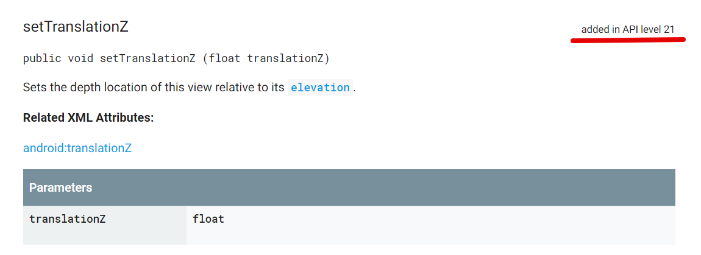
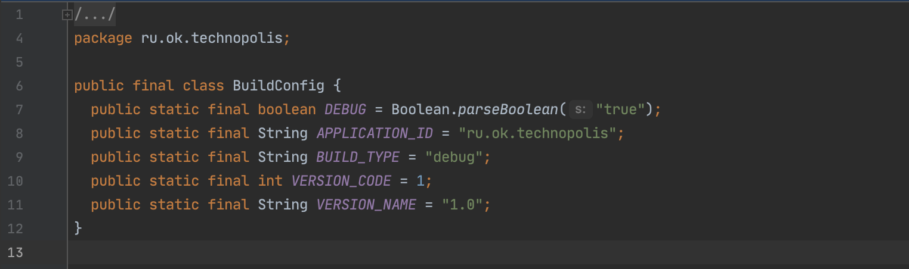
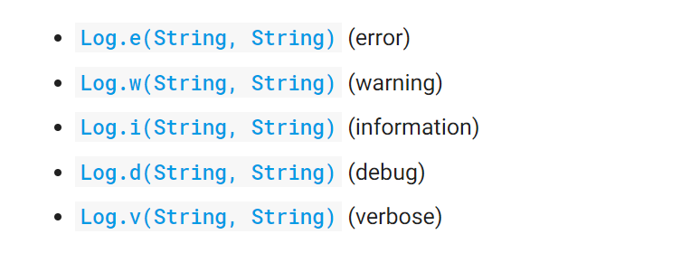
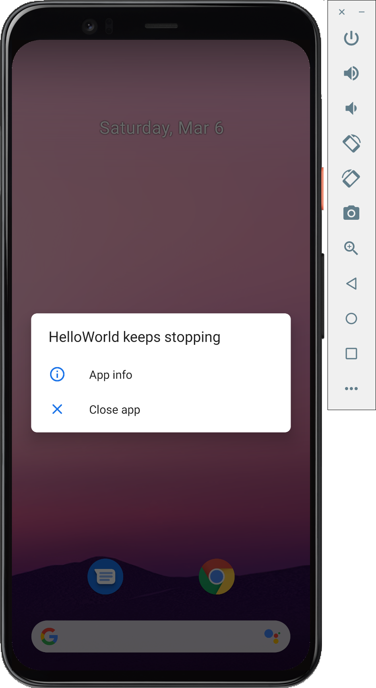

В этом уроке мы на примере простейшего Android приложения, созданного в [предыдущем уроке](../011-hello-world), подробно изучим устройство проекта, его сборку, попробуем базовые инструменты разработки и отладки, которые пригодятся в дальнейшем.

## Устройство проекта

В [прошлом уроке](../011-hello-world/) мы уже сделали краткий обзор структуры проекта, но тогда мы больше внимания уделили файлам с исходным кодом. Сейчас мы подробнее рассмотрим файлы, о которых в прошлый раз упомянули лишь вскользь.

### Build скрипты

Стандартная система сборки Android приложений основана на Gradle (https://gradle.org/) -- опенсорнсом инструменте для сборки общего назначения -- и плагине для Gradle, который знает, как собирать Android проекты. Вам не нужно устанавливать эти инструменты, потому что система сборки устроена так, что всё необходимое скачивается и устанавливается во время сборки  (удобно, но требует подключения к Интернету во время сборки). Однако, если по каким-то причинам, вы не хотите использовать предустановленный дистрибутив Gradle, вы можете указать путь к нему в настройках Android Studio (*Use gradle from* в разделе *Build, Execution, Deployment / Gradle* настроек).


Стандартная конфигурация системы сборки включает использование Gradle Wrapper. Для этого в проекте есть специальные файлы:

```
<project_dir>/
	gradlew
    gradlew.bat
    gradle/wrapper/
    	gradle-wrapper.jar
        gradle-wrapper.properties
```

**gradlew** и **gradlew.bat** -- это скрипты для запуска Gradle Wrapper для Linux подобных систем и для Windows. Gradle Wrapper является Java приложением и находится в файле **gradle-wrapper.jar**. Очевидно, что для запуска сборки необходима установленная Java -- она входит в комплект установки Android Studio.

Файл **gradle-wrapper.properties** содержит самые общие параметры запуска Gradle, и, наверно, единственный параметр, который вам может понадобиться менять -- это версия Gradle в параметре `distributionUrl`. Если вы долго работаете над одним проектом, то за время работы может появиться более новая версия Gradle, и тогда, чтобы перейти на неё, вам придется подредактировать `gradle-wrapper.properties`.

После старта Gradle Wrapper при необходимости скачивает необходимую версию Gradle и запускает его, чтобы тот занялся уже непосредственно сборкой проекта. За сборку проекта отвечают следующие файлы:

```
<project_dir>/
	build.gradle
    settings.gradle
    gradle.properties
    local.properties
    app/
    	build.gradle
```

Начнем с **local.properties** -- в этом файле определены свойства, значения которых имеют смысл только на вашей машине, на которой вы запускаете сборку. Это, прежде всего, `sdk.dir` -- путь к установленному Android SDK. Файл `local.properties` должен быть свой у каждого разработчика, который работает над проектом, и его не надо коммитить в общий репозиторий. Если в вашем проекте нет других настроек, зависящих от машины, на которой запускается сборка, то проще определить переменную окружения `ANDROID_HOME` -- тогда файл `local.properties` вообще не будет нужен.

Файл **gradle.properties** содержит настройки, которые используется при сборке проекта. В новом проект там обычно определено свойство `org.gradle.jvmargs`, в котором прописан параметр `-Xmx` для запуска JVM. Сборка Android приложений требует много памяти, особенно если проект большой (а большим проект может стать очень быстро), поэтому, когда заметите, что сборка стала сильно тормозить, проверьте -- не упирается ли она в память, и не надо ли увеличить `-Xmx`. Впрочем, оптимизация и ускорение сборки Android проектов это отдельная сложная тема, и одним параметром `-Xmx` вопрос не ограничивается.

Файл **settings.gradle** обычно определяет структуру проекта. В новом проекте приложения типа Hello World, содержимое этого файла выглядит так:
```groovy
include ':app'
```

Здесь указан единственный модуль, из которого состоит проект. Если модулей больше -- они перечисляются через запятую: `include ':app', ':module1', 'module2'`.

Файл **build.gradle** в корне проекта уже содержит какое-то "мясо" -- здесь описывается сборка всего проекта на уровне, общем для всех модулей. Файл начинается со следующего блока:

```groovy
buildscript {
    repositories {
        google()
        jcenter()
    }

    dependencies {
        classpath 'com.android.tools.build:gradle:4.1.2'
    }
}
```

Главное здесь -- объявление зависимости на Android Gradle плагин: `com.android.tools.build:gradle:4.1.2`, который непосредственно отвечает за сборку Android приложения. Вам может понадобиться подредактировать здесь его версию, если во время работы над проектом вышла новая версия плагина с каким-то новыми фичами или оптимизациями, и вы хотите её использовать. Репозитории google и jcenter, прописанные в этом блоке нужны для поиска там указанной версии плагина. Обратите внимание -- эти репозитории относятся только к блоку `buildscript`, то есть к системе сборки, но они не относятся к зависимостям вашего приложения, которые вы используете в коде.

Репозитории для поиска зависимостей приложения определены в следующем блоке:

```groovy
allprojects {
    repositories {
        google()
        jcenter()
    }
}
```

Слово `allproject` говорит о том, что этот блок применяется ко всем модулям проекта, и вам не надо прописывать эти репозитории в каждом отдельном модуле.

Файл **app/build.gradle**, который лежит в папке модуля приложения app, описывает сборку этого модуля, а так как этот модуль содержит само приложение, в этом билд скрипте содержится всё самое интересное. Первая его строчка

```groovy
apply plugin: 'com.android.application'
```

определяет, что перед нами модуль, содержащий Android приложение, и для его сборки будет использовать Android Gradle плагин. Другой возможный вариант -- это `com.android.library` для библиотечных модулей. Обычно Android проект содержит один модуль приложения и любое количество библиотечных модулей.

Затем идет блок `android`, в котором определены основные параметры приложения:

```groovy
android {
    compileSdkVersion 30
    buildToolsVersion "30.0.3"

    defaultConfig {
        applicationId "ru.ok.technopolis"
        minSdkVersion 21
        targetSdkVersion 30
        versionCode 1
        versionName "1.0"

        testInstrumentationRunner "androidx.test.runner.AndroidJUnitRunner"
    }

    buildTypes {
        release {
            minifyEnabled false
            proguardFiles getDefaultProguardFile('proguard-android-optimize.txt'), 'proguard-rules.pro'
        }
    }
}
```

**applicationId** -- это ID, по которому приложения идентифицируются в операционной системе Android и в магазинах приложений вроде Google Play. Этот ID мы указывали при создании проекта в Android Studio.

**versionName** -- это версия приложения, как её будут видеть пользователи, например, на странице приложения в Google Play или в системных настройках Android устройства в информации о приложении. Значение `versionName` может быть любым, но обычно это числа, разделенные точками: `1.0`, `1.1`, `2.0`, `2.0.1` -- это традиционная *семантическая* система нумерации версий. Иногда в **versionName** кодируют дату релиза приложения: `19.1.22` (22 января 2019 года). Могут присутствовать буквы, например: `5.1-alpha`, `19.2.13-debug` и пр. Вообще, `versionName` используется исключительно как текст для отображения пользователям.

**versionCode** -- это тоже версия приложения, но, в отличие от `versionName`, имеет значение типа `int` и используется для алгоритмической обработки и в бизнеc-логике приложения. Допустимые значения: положительные целые числа, обязательно возрастающие с каждой версией приложения. Если вы публикуете приложение в магазине приложений, то в каждом следующем обновлении должно быть большее значение `versionCode`.

Далее идут три похожих свойства: **compileSdkVersion**, **minSdkVersion** и **targetSdkVersion** -- это всё про версии Android.

### Разные версии Android...

**compileSdkVersion** определяет версию Android, которая будет использоваться для того, чтобы скомпилировать код приложения. Для каждой версии Android в Android SDK есть свой файл *android.jar*, содержащий все классы и методы, имеющиеся в этой версии Android. Когда Java код приложения компилируется при помощи javac, в classpath добавляется этот android.jar и таким образом коду приложения становятся доступны все API из этой версии Android. При просмотре Android API Reference обратите внимание -- для каждого класса или метода есть указание, в какой версии Android этот класс или метод появился. Например, метод `View.setTranslationZ(float)` появился в API Level 21:



Если метод появился в API Level 21, это значит, что для того, чтобы использовать его в коде приложения, нужно установить значение compileSdkVersion 21 или выше.

**minSdkVersion** определяет минимальную версию Android, на которой приложение может быть установлено и запущено. Этот параметр вы указывали при создании приложения в Android Studio. С точки зрения простоты разработки, чем выше minSdkVersion, тем лучше -- тогда разработчикам не придется заботиться о том, чтобы приложение правильно работало на старых версиях Android (обычно приложения лучше работают на более новых версиях Android -- там меньше багов, меньше технических ограничений, чаще более мощные процессоры с большим объемом памяти и т.п.). Однако, увеличивая minSdkVersion, вы ограничиваете количество устройств, на которых будет работать приложение и уменьшаете его потенциальную аудиторию -- а это плохо для бизнеса, в котором используется приложение. Поэтому приходится искать баланс между стоимостью поддeржки старых версий Android и потенциальной выгодой для бизнеса от расширения аудитории.

**targetSdkVersion** -- это версия Android, для которой "предназначено" ваше приложение. Это значит, в общих чертах, что в процессе разработки вы продумывали работу приложения на этой версии Android, тестировали на ней, и гарантируете, что на targetSdkVersion версии Android ваше приложение работает хорошо, без багов -- так, как задумывалось. Это нужно для того, чтобы в будущих версиях Android (которые еще не вышли, и про которые мы ничего не можем знать во время разработки приложения) наше приложение продолжало работать так, как мы задумывали, несмотря на то, что технологии могли измениться, поведение операционной системы могло измениться и, вообще говоря, по меркам будущих версий Android, наше сегодняшнее приложение может считаться написанным неправильно. Когда Android запускает приложение со старым targetSdkVesion, он может принять дополнительные меры для того, чтобы приложение работало правильно -- запустить его в особом *compatibility* режиме. Указывая targetSdkVersion, мы фиксируем набор правил и поведение операционной системы, которые действительны для этой версии Android, и таким образом мы можем больше не заботиться о поддержке более новых версий Android. Впрочем, Google может не дать нам расслабиться -- иногда в магазине приложений Google Play появляются ограничения на использование старых версий в **targetSdkVersion**. Например, c 1 авгутста 2018 года в Google Play нельзя публиковать новые приложения с targetSdkVersion меньше 26 (а с 1 ноября 2018 -- и обновления старых приложений). Это заставило всех разработчиков оптимизировать их приложения под Android 8.0 (самое сложное -- пришлось переписать работу фоновых сервисов).

### Build Types

В дефолтном сгенерированном build скрипте есть раздел **buildTypes**:

```groovy
buildTypes {
    release {
        minifyEnabled false
        proguardFiles getDefaultProguardFile('proguard-android-optimize.txt'), 'proguard-rules.pro'
    }
}
```

В Android проекте есть два стандартных типа сборки: release и debug.

По умолчанию в Android Studio используется тип сборки **debug**. Эта сборка предназначена для того, чтобы отлаживать её -- в ней может делаться меньше оптимизаций, добавляться больше отладочной информации, могут включаться специальные режимы работы, удобные для тестирования, логирование и пр. Debug сборки *не предназначены для пользователей*, и их нельзя публиковать и распространять через магазины приложений. Внутри `buildTypes` дефолтного build скрипта блок *debug* отсутствует -- просто потому, что для *debug* сборки используются все значения по умолчанию.

**release** сборка, наоборот, предназначена для пользователей. Она максимально оптимизирована, из неё удаляется всё лишнее, её нельзя отлаживать при помощи дебаггера. Кроме того, release сборка подписывается сертификатом разработчика для удостоверения её происхождения и обеспечения целостности (чтобы злоумышленники не могли распространять свои зловреды под видом популярных приложений). Настройки *minifyEnabled* и *proguardFiles* относятся к процессу минификации: при сборке релизной версии приложения, её код проходит стадию минификации -- лишний неиспользуемый код удаляется, Java имена сокращаются. Это позволяет уменьшить размер кода и немного ускорить его загрузку, но сильно усложняет отладку.

## Сборка проекта

После того как вы собрали приложение в Android Studio, в проекте появляется папка `app/build` (если бы было несколько модулей, то в каждом модуле появилась бы папка `build`). В ней содержатся результаты сборки и промежуточные файлы.

### APK файл

Собранный **APK файл** приложения находится в `app/build/outputs/apk/debug/app-debug.apk` (для дебажной сборки) -- именно этот файл устанавливается на устройство, когда вы запускаете приложение из Android Studio. Его можно даже открыть и посмотреть его содержимое:


Внутри APK файла можно найти:

- **AndroidManifest.xml** -- манифест приложения, по которому операционная система узнает о структуре приложения.
- **classes.dex** и **classes2.dex** -- исходный код, скомпилированный в специальны Dalvik byte code и упакованный в DEX (Dalvik EXecutable) файл
- **kotlin** -- так называемые "built-in" котлин классы
- **resources.arsc** -- значения всех ресурсов приложения, упакованные в один файл
- **res** -- папка с более сложными ресурсами, которые хранятся в отдельных файлах (картинки, файлы верстки)
- **META-INF** -- папка со служебной информацией, в первую очередь -- с подписями всех файлов.

Все XML файлы, которые можно увидеть внутри APK файла при помощи Android Studio, на самом деле хранятся в оптимизированном бинарном формате, который занимает меньше места и быстрее парсится в рантайме.

*Примечание: если вы собираете и запускаете приложение в Android Studio, но не находите APK файл в папке `app/build/outputs/apk/debug/` -- отключите **Instant Run** в настройках Android Studio.*

Внутри `app/build` особый интерес представляет папка **generated** -- здесь находятся исходники, которые были автоматически сгенерированы во время сборки приложения. Мы эти исходники не писали, но мы можем их использовать в своем коде, и часто это даже необходимо.

### BuildConfig файл

В классе **BuildConfig** определены константы с информацией о сборке приложения, взятые из `build.gradle` во время сборки.

Так выглядит `BuildConfig` для дебажной сборки в `app/build/generated/source/buildConfig/debug/ru/ok/technopolis/`:



Константа `DEBUG` полезна для того, чтобы в коде выполнять разные действия в релизной или дебажной сборке: например, в случае непредвиденной ситуации в дебаге можно бросить исключение, чтобы обнаружить эту ситуацию как можно раньше на этапе разработки, а в релизной версии бросать исключение нельзя (чтобы не расстраивать пользователя) -- лучше тихо отправить логи в сервис сбора аналитики:

```kotlin
if (что-то неправильное случилось) {
	if (BuildConfig.DEBUG) {
        throw RuntimeException("Передайте Пете из команды Васи, что его API не работает, как он обещал");
    } else {
        Log.e("API", "Unexpected data format returned from API user.getFriends")
    }
}
```

В `BuildConfog` можно добавлять свои собственные константы. Для этого нужно добавить определение константы в `build.gradle`, и они будут добавлены статическими полями в класс `BuildGradle` во время сборки:

```groovy
android {

	defaultConfig {
    	buildConfigField "boolean", "FEATURE_X_ENABLED", "true"
    }

    buildTypes {
    	release {
        	buildConfigField "int", "MAX_VCALL_PARTICIPANTS", "100"
            buildConfigField "String", "PORTAL_ADDRESS", '"https://www.portal.info"'
        }

        debug {
        	buildConfigField "int", "MAX_VCALL_PARTICIPANTS", "3"
            buildConfigField "String", "PORTAL_ADDRESS", '"http://127.0.0.1:4000"'
        }
    }
}
```

Это самый простой и эффективный способ конфигурировать разные версии приложения внешними параметрами.

## Логирование

В Android есть единый системный лог, в который попадают сообщения от всех компонентов системы и от всех приложений. Инструмент для просмотра логов называется **Logcat** -- он встроен в Android Studio, и для него есть одноименное окно, в котором можно просматривать логи:


Logcat работает в режиме реального времени -- вы можете видеть логи, которые печатаются прямо сейчас или были напечатаны недавно (благодаря небольшому кольцевому буферу, который есть в операционной системе Android), но вы не можете поднять логи за вчера  -- они никуда не записываются. Поэтому логи в Android -- это в первую очередь инструмент отладки, который используется в процессе разработки приложения, а не журнал, по которому можно восстановить историю событий за прошедшее время.

Приложения могут писать в логи при помощи стандартного класса `android.util.Log`, в котором есть набор методов для печати сообщений в лог с разным приоритетом. Вот базовый список методов в порядке убывания приоритета:



Первый параметр -- всегда тэг. Обычно это строковая константа, по которой потом можно найти интересующие нас сообщения в логах. Использование `Log` в коде может выглядеть так:

```kotlin
    private val log = true
    private val tag = "Hello"
    
    override fun onCreate(savedInstanceState: Bundle?) {
        super.onCreate(savedInstanceState)
        setContentView(R.layout.activity_hello_world)
        if (log) Log.d(tag, "HelloWorldActivity.onCreate")
    }
```

При выполнении этого кода в момент старта activity `HelloWorldActivity` в лог будет напечатано такое сообщение:

```
2021-03-06 00:59:25.246 28880-28880/ru.ok.technopolis D/Hello: HelloWorldActivity.onCreate
```

Оно содержит точное время, ID юзера (`28880`), процесса (`28880`) и приложения (`ru.ok.technopolis`), из которого пришел лог, метка приоритета `D`, тэг `Hello` и собственно сообщение. В окне Logcat в Android Studio можно осуществлять поиск по логам, фильтровать по произвольной подстроке и по приоритету и таким образом видеть только те логи, которые вас интересуют в данный момент.

Добавлять логи в код приложения, в разные критические или просто неочевидные места, и особенно там, где происходит какая-то ошибка -- хорошая привычка, которую желательно выработать. Большую часть времени добавленные логи не пригождаются, но иногда с вашим приложением происходит что-то странное, и только логи могут помочь разобраться.

Обратите внимание на то, как метод логирования вызывается под условием:

```kotlin
if (log) Log.d(...)
```

Использование константы `log` необходимо по двум причинам:

- Можно включить или выключить все логи сразу, изменив одну константу.
- В выключенном состоянии выражение `if (log)` эквивалентно `if (false)`, и Java компилятор полностью вырежет весь код, следующий за условием. В релизной версии, в которой обычно логи выключены, это то, что нам нужно -- избавиться от лишнего неиспользуемого кода. Для того чтобы это работало, константа `log` должна быть определена именно константой.

Удобнее всего определять константу `log` при помощи `BuildConfig`. Для этого надо написать следующее в `build.gradle` приложения:

```groovy
buildTypes {

    release {
    	// ...
    	buildConfigField "boolean", "log", "false"
    }

    debug {
    	// ...
    	buildConfigField "boolean", "log", "true"
    }

}
```

и в коде использовать `BuildConfig.log` -- это будет одна константа на все приложение:

```kotlin
if (BuildConfig.log) Log...
```

## Падение приложения

Когда при выполнении кода приложения выбрасывается исключение, которое никто не ловит, приложение падает -- выполнение кода прекращается, виртуальная машина останавливается и процесс приложения завершается. Это называется **крэш** (crash). Пользователь при этом видит системное сообщение о том, что приложение упало:



а в лог при этом печатается сообщение о падении со стек трейсом, по которому можно понять, что и где в коде приложения пошло не так.

Для примера попробуем изменить код `HelloWorldActivity` так, чтобы он упал: при вызове `setContentView` из метода `onCreate` замените идентификатор файла верстки `R.layout.activity_hello_world` на идентификатор строки `R.string.hello_world`:

```kotlin
    override fun onCreate(savedInstanceState: Bundle?) {
        super.onCreate(savedInstanceState)
        setContentView(R.string.hello_world)
    }
```

Это неправильное использование метода `setContentView` -- строка совершенно не подходит для того, чтобы из нее загрузили верстку -- поэтому приложение упадет при старте. В логе мы увидим следующее:

```log
2021-03-06 01:05:44.789 19227-19227/ru.ok.technopolis E/AndroidRuntime: FATAL EXCEPTION: main
    Process: ru.ok.technopolis, PID: 19227
    java.lang.RuntimeException: Unable to start activity ComponentInfo{ru.ok.technopolis/ru.ok.technopolis.HelloWorldActivity}: android.content.res.Resources$NotFoundException: File Hello, World! from xml type layout resource ID #0x7f0e0028
        at android.app.ActivityThread.performLaunchActivity(ActivityThread.java:3449)
        at android.app.ActivityThread.handleLaunchActivity(ActivityThread.java:3601)
        at android.app.servertransaction.LaunchActivityItem.execute(LaunchActivityItem.java:85)
        at android.app.servertransaction.TransactionExecutor.executeCallbacks(TransactionExecutor.java:135)
        at android.app.servertransaction.TransactionExecutor.execute(TransactionExecutor.java:95)
        at android.app.ActivityThread$H.handleMessage(ActivityThread.java:2066)
        at android.os.Handler.dispatchMessage(Handler.java:106)
        at android.os.Looper.loop(Looper.java:223)
        at android.app.ActivityThread.main(ActivityThread.java:7656)
        at java.lang.reflect.Method.invoke(Native Method)
        at com.android.internal.os.RuntimeInit$MethodAndArgsCaller.run(RuntimeInit.java:592)
        at com.android.internal.os.ZygoteInit.main(ZygoteInit.java:947)
     Caused by: android.content.res.Resources$NotFoundException: File Hello, World! from xml type layout resource ID #0x7f0e0028
        at android.content.res.ResourcesImpl.loadXmlResourceParser(ResourcesImpl.java:1264)
        at android.content.res.Resources.loadXmlResourceParser(Resources.java:2426)
        at android.content.res.Resources.loadXmlResourceParser(Resources.java:2402)
        at android.content.res.Resources.getLayout(Resources.java:1252)
        at android.view.LayoutInflater.inflate(LayoutInflater.java:530)
        at android.view.LayoutInflater.inflate(LayoutInflater.java:479)
        at androidx.appcompat.app.AppCompatDelegateImpl.setContentView(AppCompatDelegateImpl.java:696)
        at androidx.appcompat.app.AppCompatActivity.setContentView(AppCompatActivity.java:170)
        at ru.ok.technopolis.HelloWorldActivity.onCreate(HelloWorldActivity.kt:11)
        at android.app.Activity.performCreate(Activity.java:8000)
        at android.app.Activity.performCreate(Activity.java:7984)
        at android.app.Instrumentation.callActivityOnCreate(Instrumentation.java:1309)
        at android.app.ActivityThread.performLaunchActivity(ActivityThread.java:3422)
        at android.app.ActivityThread.handleLaunchActivity(ActivityThread.java:3601) 
        at android.app.servertransaction.LaunchActivityItem.execute(LaunchActivityItem.java:85) 
        at android.app.servertransaction.TransactionExecutor.executeCallbacks(TransactionExecutor.java:135) 
        at android.app.servertransaction.TransactionExecutor.execute(TransactionExecutor.java:95) 
        at android.app.ActivityThread$H.handleMessage(ActivityThread.java:2066) 
        at android.os.Handler.dispatchMessage(Handler.java:106) 
        at android.os.Looper.loop(Looper.java:223) 
        at android.app.ActivityThread.main(ActivityThread.java:7656) 
        at java.lang.reflect.Method.invoke(Native Method) 
        at com.android.internal.os.RuntimeInit$MethodAndArgsCaller.run(RuntimeInit.java:592) 
        at com.android.internal.os.ZygoteInit.main(ZygoteInit.java:947) 
     Caused by: java.io.FileNotFoundException: Hello, World!
        at android.content.res.AssetManager.nativeOpenXmlAsset(Native Method)
        at android.content.res.AssetManager.openXmlBlockAsset(AssetManager.java:1092)
        at android.content.res.ResourcesImpl.loadXmlResourceParser(ResourcesImpl.java:1248)
        at android.content.res.Resources.loadXmlResourceParser(Resources.java:2426) 
        at android.content.res.Resources.loadXmlResourceParser(Resources.java:2402) 
        at android.content.res.Resources.getLayout(Resources.java:1252) 
        at android.view.LayoutInflater.inflate(LayoutInflater.java:530) 
        at android.view.LayoutInflater.inflate(LayoutInflater.java:479) 
        at androidx.appcompat.app.AppCompatDelegateImpl.setContentView(AppCompatDelegateImpl.java:696) 
        at androidx.appcompat.app.AppCompatActivity.setContentView(AppCompatActivity.java:170) 
        at ru.ok.technopolis.HelloWorldActivity.onCreate(HelloWorldActivity.kt:11) 
        at android.app.Activity.performCreate(Activity.java:8000) 
        at android.app.Activity.performCreate(Activity.java:7984) 
        at android.app.Instrumentation.callActivityOnCreate(Instrumentation.java:1309) 
        at android.app.ActivityThread.performLaunchActivity(ActivityThread.java:3422) 
        at android.app.ActivityThread.handleLaunchActivity(ActivityThread.java:3601) 
        at android.app.servertransaction.LaunchActivityItem.execute(LaunchActivityItem.java:85) 
        at android.app.servertransaction.TransactionExecutor.executeCallbacks(TransactionExecutor.java:135) 
        at android.app.servertransaction.TransactionExecutor.execute(TransactionExecutor.java:95) 
        at android.app.ActivityThread$H.handleMessage(ActivityThread.java:2066) 
        at android.os.Handler.dispatchMessage(Handler.java:106) 
        at android.os.Looper.loop(Looper.java:223) 
        at android.app.ActivityThread.main(ActivityThread.java:7656) 
        at java.lang.reflect.Method.invoke(Native Method) 
        at com.android.internal.os.RuntimeInit$MethodAndArgsCaller.run(RuntimeInit.java:592) 
        at com.android.internal.os.ZygoteInit.main(ZygoteInit.java:947) 
```

Первое, что мы видим -- это строка со словами **FATAL EXCEPTION** и идентификатором упавшего приложения. Так (почти) всегда начинается сообщение о падении приложения, и если вам надо быстро найти в логе крэш, то проще всего искать его по этим словам.

Затем идет сообщение о непойманном исключении со стэк трейсом -- то, что позволит нам найти причину падения. Обычно в стек трейсе можно найти ссылки на код приложения, который привел к ошибке, и в первую очередь нам надо их найти по имени Java пакета, который мы используем в нашем приложении (`ru.ok.technopolis`). Часто стек трейс состоит из нескольких частей, каждая из которых начинается со слов `Caused by` -- это говорит о том, что исключение несколько раз ловилось в различных местах в коде, но не было обработано, а было обернуто в новый тип исключения и проброшено дальше. Вы быстро научитесь ориентироваться в стек трейсах, но если поиск нужной строчки вызывает затруднения, то можно действовать так:

- найдите последнюю часть стек трейса, начинающуюся со слов `Сaused by`
- начинайте просматривать трейс сверху вниз
- ищите первую строчку, принадлежащую вашему коду.

Найденная строчка, возможно, и является причиной падения. В данном случае мы находим строчку

```log
at ru.ok.technopolis.HelloWorldActivity.onCreate(HelloWorldActivity.kt:11)
```

Это то самое место, в котором мы сделали неправильный вызов `setContentView`.