В этом уроке мы создадим простейшее Android приложение, состоящее из одного экрана, на котором отображается текст приветствия. Несмотря на простоту, в процессе создания этого приложения мы познакомимся с несколькими важными базовыми концепциями, без которых в Android разработке просто никуда! Поэтому, будьте внимательны :)

## Создание проекта

Запустите Android Studio и выберите "Start a new Android Studio project" на приветственном экране.

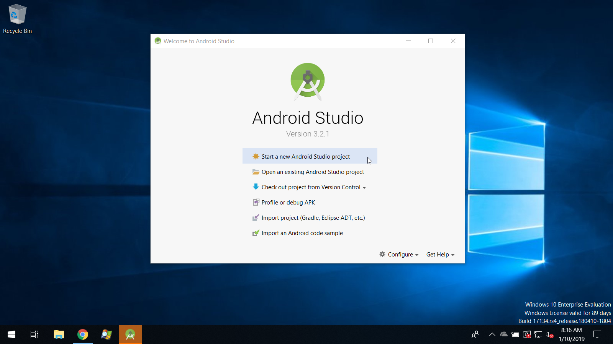

Следующий экран называется "Create Android Project", и здесь вам надо заполнить несколько полей.

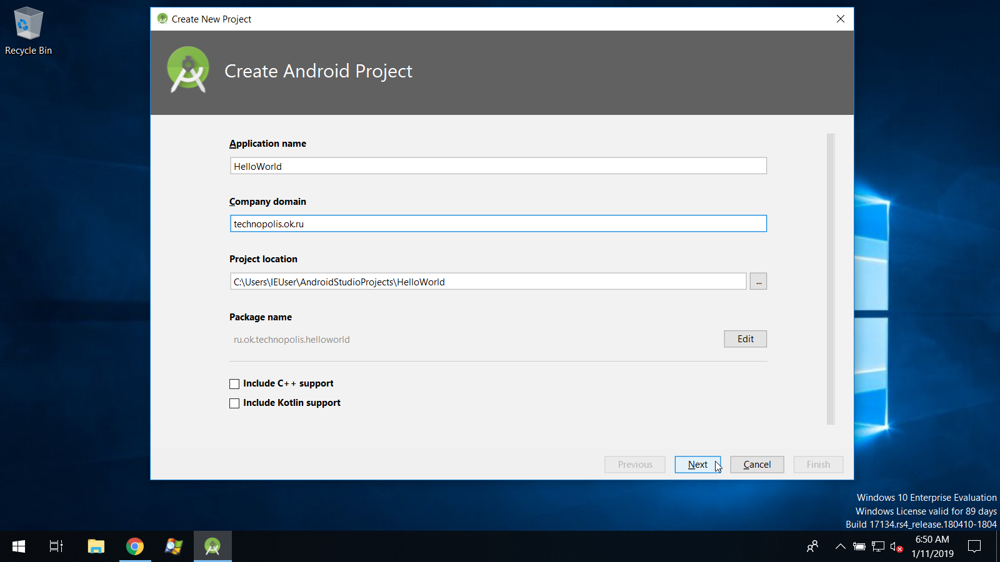

Прежде всего, это **Application name** -- название приложения как видит его пользователь -- это может быть произвольная строка. Android Studio может использовть Application name  для названия директории, в которой будет создан проект, а также как часть Package name. Поэтому, если вы используете в Applcation name какие-нибудь экзотические символы (например, кириллицу), то обязательно проверьте правильность Project location и Package name.

Следующее поле -- это **Company domain**. На самом деле, в Android разработке нет такого понятия как Company domain. Оно присуствует только на этом экране, и нужно оно для того, чтобы из него сгенерировать Package name. Подразумевается, что сюда надо ввести что-то похожее на доменное имя. Например, можно написать `<username>.github.com` или `<first name>.<last name>.ru`.

**Project location** -- путь к директории создаваемого проекта. Укажите любое удобное вам место, главное -- это должна быть новая директория, в которой будет лежать сам проект, а не его родительская папка. (Например, C:\projects не годится, а C:\projects\HelloWorldDemoApp -- годится).

**Package name** -- уникальный идентификатор приложения с точки зрения операционной системы Android, который используется в технических целях везде, где надо идентифицировать приложение. Например, на одном устройстве не могут быть установлены два приложения с одинаковым package name. Также package name используется как основной идентификатор в магазинах приложений. Поэтому package name надо выбирать правильно -- оно должно быть уникальное, понятное, адекватное. Обычно package name похоже на доменное имя наоборот с добавлением названия приложения, например `com.github.<username>.helloworld.` Package ID или Application ID являются синонимами Package name на Android. А вот понятие Java пакета технически никак не связано с Package name, хотя часто в Android приложении используются имена Java пакетов, совпадающие с Package name.

Мы не будем писать код на C\++ или Kotlin, поэтому галочки с пунктов "Include C++ support" и "Include Kotlin support" лучше убрать.

На экране Target Android Devices убедитесь, что выбран пункт Phone and Tablets, и не выбраны никакие другие пункты (Wear OS, TV и пр) -- это значит, что приложение предназначено для смартфонов и планшетов. Если вы выберите дополнительные платформы, то для них будут сгенерированы отдельные модули и будут добавлены дополнительные зависимости -- это нам не нужно.

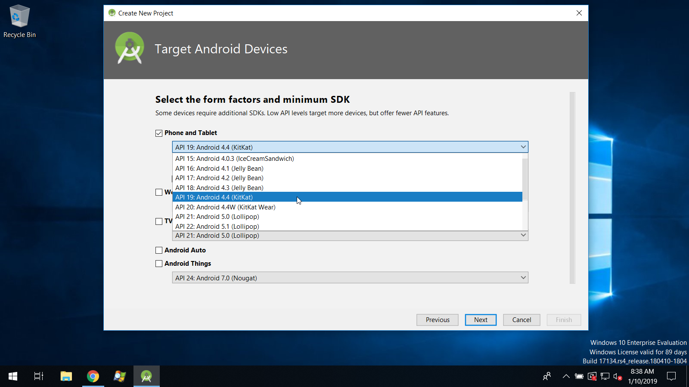

Важный момент на этом экране -- выбор минимальной поддерживаемой версии Android для вашего приложения. Для приложения Hello World можно оставить дефолтное значение (на момент написания статьи это *API 21: Android 5.0*), однако для реальных приложений к выбору минимальной поддерживаемой версии Android надо подходить более ответственно.

Чем выше минимальная поддерживаемая версия, тем проще разрабатывать приложения -- вы сможете легко использовать новые фичи, появившиеся только в поздних версиях Android, и вам не надо будет думать о поддержке старых устройств, но, с другой стороны, ваше приложение не сможет работать на более старых устройствах, и, таким образом, потенциальная аудитория приложения будет меньше. Если же вы хотите, чтобы ваше приложение работало у максимального количества пользователей, то вам надо выбирать более древнюю минимальную версию Android, но в таком случае в процессе разработки вы можете столкнуться с проблемами совместимости со старыми устройствами. Выбор минимальной поддерживаемой версии Android -- это всегда компромисc между сложностью разработки и потенциальным размером аудитории. Если нажать на Help me choose, то вы увидите список версий Android с числами охвата аудитории для каждой из версий (если эта версия будет выбрана в качестве минимально поддерживаемой).

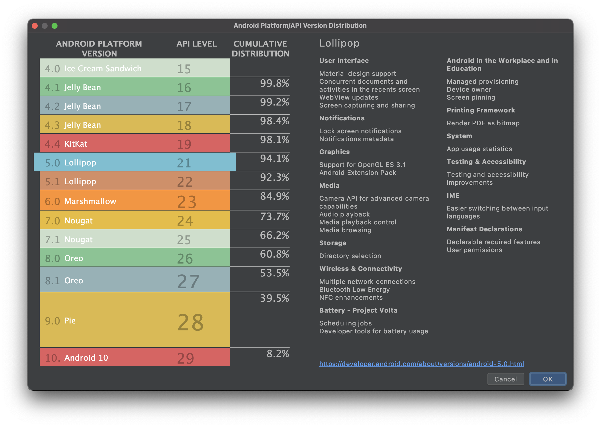

На момент написания этой статьи для большинства приложений разумным выбором будет *API 19: Android 4.4* или *API 21: Android 5.0*.

На следующем экране Add an Activity to Mobile вам предлагается сразу при создании проекта добавить в приложение первый дефолтный экран (Activity -- это программный компонент, приблизительно соответствующий отдельному экрану приложения). В нашем Hello World приложении вам следует выбрать Add No Activity, то есть не добавлять Activity в приложение. Мы сдеалаем это позже вручную -- это очень просто, а предлагаемые варианты это всего лишь шаблоны для Activity с различными стандартными элементами пользовательского интерфейса.

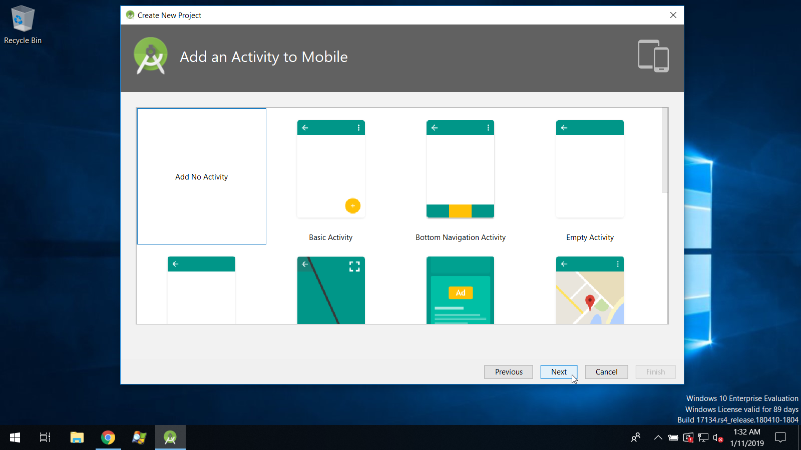

На этом начальная конфигурация проекта завершена -- жмем Finish, и Android Studio создаст наш проект. Если вы недавно установили Android Studio и впервые создаете проект, то, возможно, вам придется немного подождать, пока скачаются дополнительные инструменты и зависимости. Дождитесь сообщения "Build: completed successfully" в нижней панели во вкладке Build -- это значит, что инициализация проекта завершена, он даже уже собрался, и можно начинать работать.

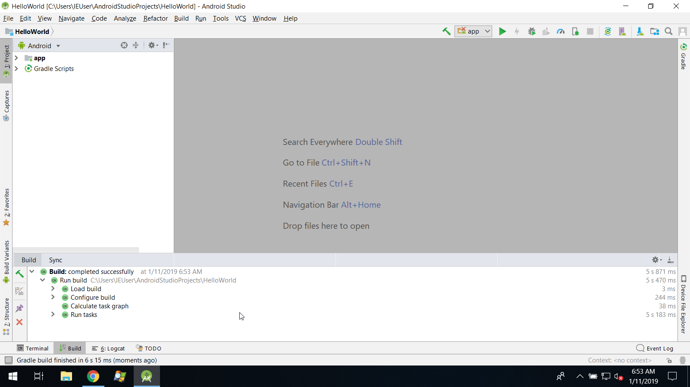

Возможные проблемы на данном этапе -- отсутствие соединения с Интернетом, невозможность скачать необходимые зависимости. Если в нижней панели во вкладке Build или Sync появились какие-то сообщения об ошибках, то устраните их причину и обновите проект нажатием на кнопку "Sync Project with Gradle Files" в верхней панели инструментов.

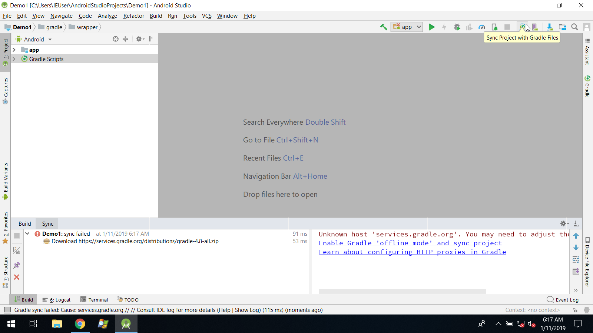

## Структура проекта

Сразу после создания нового пустого проекта мы можем посмотреть на его содержимое в панели проекта, которая обычно отображается слева. Если по какой-то причине этой панели нет, нажмите Alt-1 (на Windows) -- это keyboard shortcut для открыти панели проекта. Сейчас там есть два пункта: app и Gradle Scripts -- раскройте их.

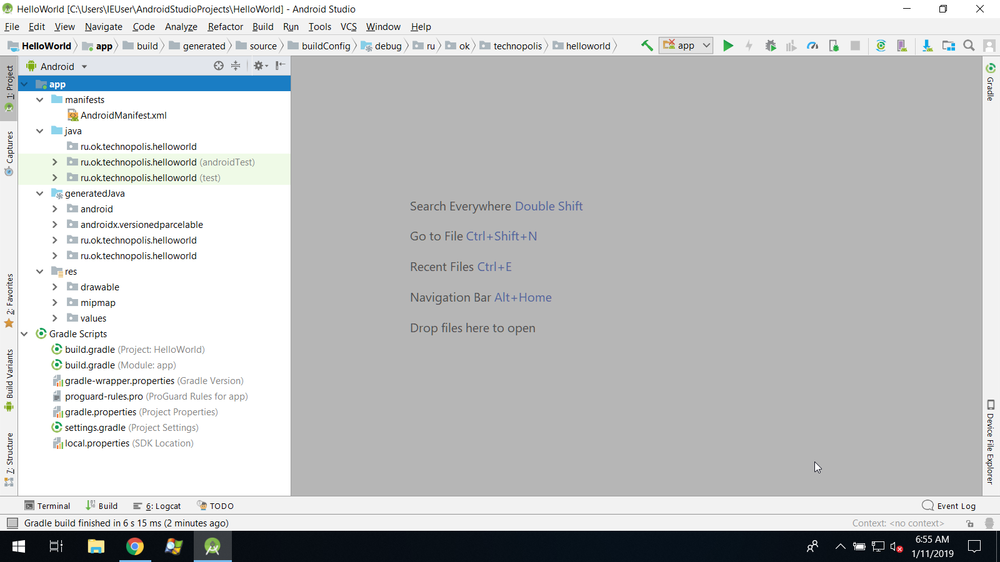

`Gradle Scripts` содержит файлы, относящиеся к системе сборки проекта (Gradle -- это опенсорсная система автоматической сборки, при помощи которой собираются Android приложения).

`app` -- это модуль приложения. Любой Android проект состоит из модулей, в простейшем случае -- из одного модуля, внутри которого находится весь исходный код и ресурсы приложения. Внутри app можно увидеть следующие разделы:

- manifests
- java
- generatedJava
- res

Внутри **manifests** находится файл `AndroidManifest.xml` -- это файл, в котором указаны основные параметры приложения и его структура с точки зрения операционной системы Android.

Раздел **java** содержит исходный код приложения (на языке Java или Kotlin), который делится на три части: основной код (сейчас там пусто), код юнит тестов (test) и код инструментальных тестов (androidTest). AndroidStudio всегда генерирует заглушки для тестов и инструментальных тестов при создании нового проекта или нового модуля. Нас они сейчас не интересуют, поэтому их можно удалить. Выберите Java пакеты test и androidTest и удалите их.

Раздел **generatedJava** содержит Java файлы, которые генерируются во время сборки приложения. Они не являются частью исходного кода проекта, однако они используются в коде приложения. Эти Java файлы никогда не надо редактировать, потому что, во-первых, это не нужно, а во-вторых, если вы их отредактируете, то при очередной сборке проекта все изменения пропадут.

Наконец, папка **res** содержит ресурсы приложения -- всякие полезные штуки, не являющиеся исполняемым кодом: изображения, тексты, верстка и т.п. Обратите внимание, что Android ресурсы в папке res не являются обычными Java ресурсами (которые загружаются при помощи `java.lang.ClassLoader.getResource()`) -- это совершенно особенная тема в Android, которая обладает большими возможностями (но об этом позже).

Я не просто так называл некоторые элементы внутри app "разделами", а не "папками" -- дело в том, что они не являются папками в файловой системе. Панель проекта имеет несколько режимов отображения. По умолчанию используется режим Android -- в нем файлы сгруппированы таким вот способом, и этот способ не соответсвует их размещению в файловой системе. Если вы хотите видеть, как файлы проекта расположены на самом деле, переключите панель проекта в режим Project (выпадающий список в верхней части панели проекта), в котором отображается реальная файловая структура проекта.

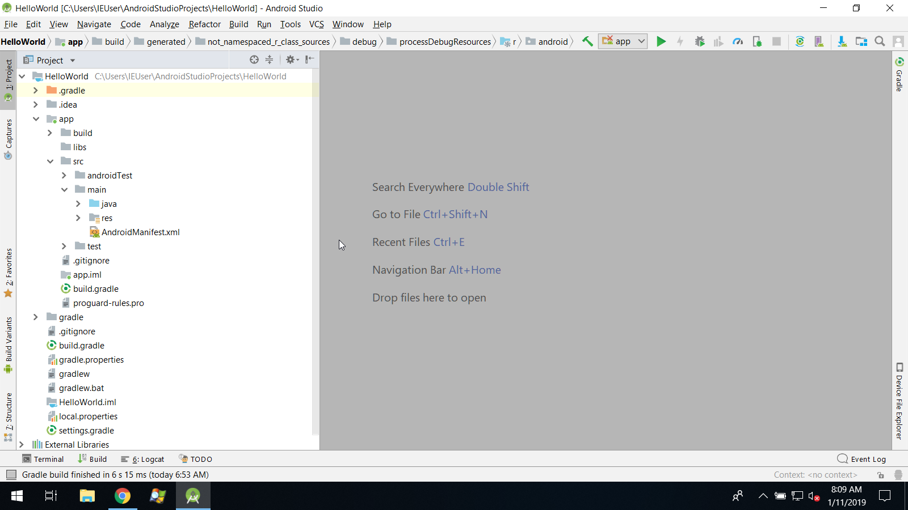

## Создание экрана Hello World

Теперь мы добавим в приложение один экран, на котором будет отображаться приветствие. Основным компонентом, соответствующим экрану в UI приложения, является `Activity`. (По-русски часто говорят *активность*, однако в русскоязычной официальной документации почему-то пишут *операция* -- это неудачный перевод. Не говорите *операция* -- вас не поймут). В коде активность -- это класс, наследующий от базового класса `android.app.Activity.`

Создайте класс `HelloWorldActivity` в дефолтном пакете проекта (при создании нового проекта автоматически генерируется дефолтный пакет с названием, совпадающим с Package name приложения в папке app/src/main/java/). Базовый класс `android.app.Activity` можно указать в диалоге создания класса, либо самому написать руками в коде.

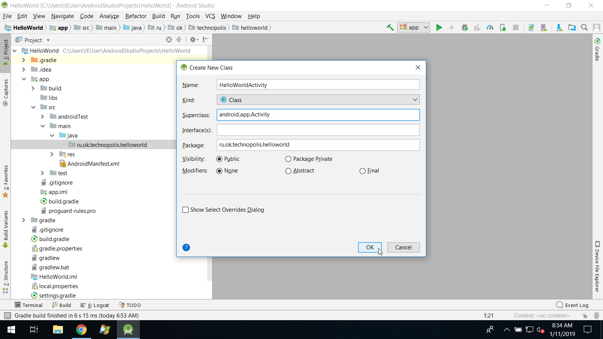

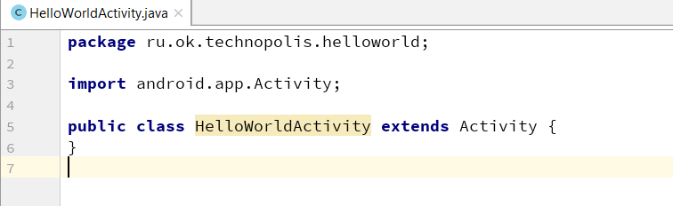

Прежде чем мы напишем какой-то полезный код внутри `HelloWorldActivity`, добавим запись о ней в манифест приложения. Обратите внимание: название класса `HelloWorldActivity` подсвечено желтым в коде -- это Android Studio подсказывает нам, что активность `HelloWorldActivity` не прописана в манифесте. Таковы правила -- все активности приложения должны быть прописаны в манифесте для того, чтобы операционная система знала, из каких экранов состоит наше прилжение, и как их запускать.

**Манифест приложения** находится в файле `app/src/main/AndroidManifest.xml` -- откройте этот файл и добавьте в него такой код внутри application элемента:

```
    <activity android:name=".HelloWorldActivity">
        <intent-filter>
            <action android:name="android.intent.action.MAIN"/>
            <category android:name="android.intent.category.LAUNCHER"/>
        </intent-filter>
    </activity>
```

Элемент activity в Android манифесте декларирует активность внутри приложения в качестве точки входа в UI приложения из операционной системы. В этих нескольких строчках есть несколько интересных моментов:

- Имя класса активности указывается в атрибуте `name`. В общем случае надо указывать полное Java имя класса активности, но здесь мы видим сокращенный вариант -- точка с простым именем класса. Это соглашение, действующее в файле манифеста, которое означает, что указанное имя класса добавляется к дефолтному имени пакета, указанному в корневом элементе манифеста (и таким образом получается полное Java имя класса): `<manifest package="ru.ok.technopolis.helloworld">`

- Элемент `intent-filter` внутри activity обычно указывает на то, что данная активность может быть запущена каким-то определенным способом.

- В данном случае `action` и `category` внутри `intent-filter` указывают на то, что данная активность, во-первых, является основной (Main) точкой входа в приложение (и именно эта активность будет запущена, когда мы в Android Studio нажмем кнопку Run), а во-вторых, её иконка должна отображаться на домашнем экране (Launcher) устройства. В любом обычном приложении, которое запускается привычным нам способом -- по клику на иконку в домашнем экране, есть активность с такими настройками в манифесте.

Теперь попробуем запустить наше Hello World приложение -- для этого можно нажать кнопку Run (треугольник типа Play в верхней панели инструментов) или выбрать Run 'app' в меню.

### Создание эмулятора

Если вы раньше не запускали приложения в Android Studio, то, скорее всего, вы увидите диалог с сообщением *"No USB devices or running emulators detected"*. Это значит, что нет устройств, на которых можно было бы запустить приложение, и нам следует создать эмулятор -- для этого нажмите на кнопку "Create New Virtual Device" в этом диалоге:

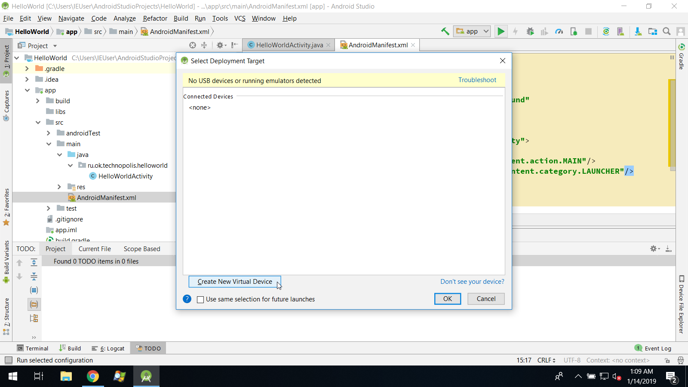

В появившемся диалоге "Select Hardware" выберите Nexus 5 (На самом деле, можете выбрать любой девайс, который вам нравится. Nexus 5 был отличным смартфоном в свое время, и до сих пор память о нём жива в сердцах разработчиков, а дизайнеры любят использовать параметры экрана Nexus 5 в своих скетчах, поэтому иногда удобно запускать приложения на Nexus 5, чтобы сверять с дизайном.)

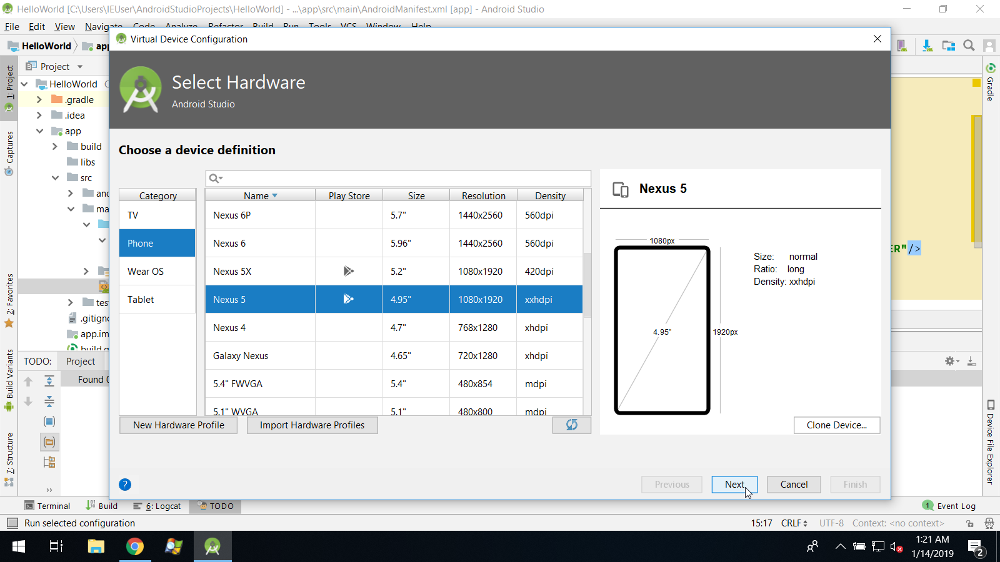

затем в диалоге "System Image" выберите *Pie, API Level 28* (здесь, возможно, вам потребуется предварительно скачать соответствующий системный образ),

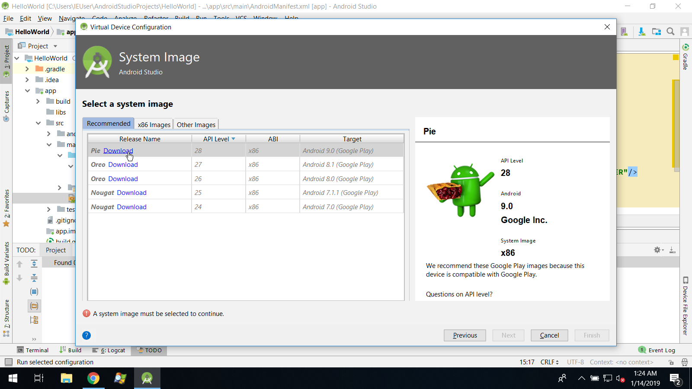

и, наконец, в последнем диалоге "Android Virtual Device" оставьте всё как есть и нажмите Finish

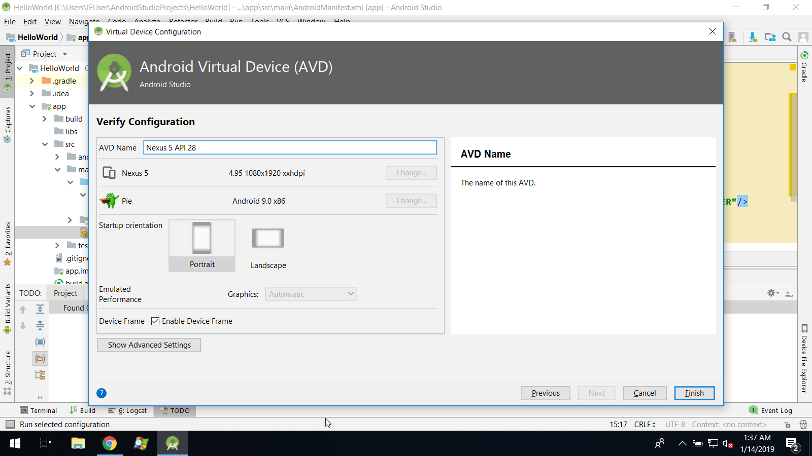

Будет создан эмулятор устройства Nexus 5 с операционной системой Android версии 9.0, который появится в списке устройств, на которых можно запустить приложение, под именем "Nexus 5 API 28". Таким же образом вы можете создавать сколько угодно разных эмуляторов с разными типами устройств и версиями Android, которые можно использовать одновременно (только имейте в виду, что каждый эмулятор занимет несколько гигабайт дискового пространства).

Когда эмулятор создан, мы можем запустить на нём наше приложение Hello World. Вскоре после запуска вы увидите белый экран в эмуляторе -- это и есть активность Hello World. Вполне ожидаемый результат для пустого класса без единой строчки кода? На самом деле можно задаться вопросом, почему экран белый? Он мог бы быть черным или вообще прозрачным (тогда бы мы не смогли отличить пустое приложение от домашнего экрана смартфона). Где-то ведь должен быть код, который рисует этот белый цвет на весь экран? Но мы этот код не писали... Ответ на этот вопрос -- *дефолтная тема активности*, в которой задан белый цвет фона окна. Пока так, без объяснений :)

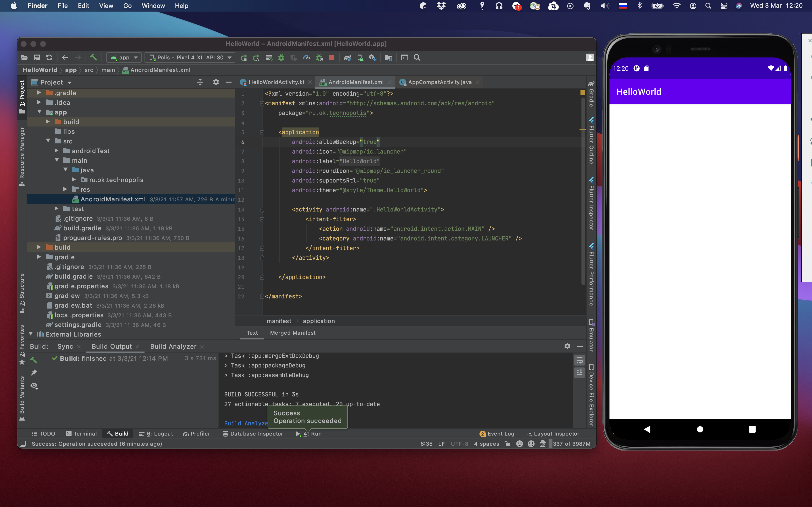

### Создание UI для экрана Hello World

Теперь, когда простейший скелет приложения готов, можно добавить код, который будет вместо пустого белого экрана отображать текст приветствия. Для этого переопределим один важный метод в классе `HelloWorldActivity`. Добавьте такой код в пустое тело класса `HelloWorldActivity` (либо воспользуйтесь диалогом переопределения методов, который вызывается Ctrl-O):

```
    @Override
    protected void onCreate(Bundle savedInstanceState) {
        super.onCreate(savedInstanceState);
    }
```


Метод `onCreate` является основной точкой входа в `Activity` -- он вызывается системой каждый раз, когда создается новая активность. В этом методе можно создать и инициализировать все необходимые компоненты UI, которые будут отображаться в окне активности. Для определения UI в Android используются файлы верстки (layout файлы или лэйауты), которые являются частью ресурсов приложения. Это XML файлы, в которых описывается, как будет устроена и как будет выглядеть какая-то часть UI приложения. Приложение в рантайме при помощи специальных методов загружает лэйауты из ресурсов и использует их для создания UI.

Значит, для отображения текста приветствия на экране HelloWorldActivity нам нужно в ресурсах приложения создать файл верстки, в котором будет описано, как это приветствие выглядит. Ресурсы приложения лежат в папке `src/main/res` в модуле `app` (если в проекте несколько модулей, то каждый модуль имеет свои ресурсы), внутри которой находятся директории с ресурсами разного типа. Файлы верстки лежат в директории `layout`. Если такой директории нет в вашем проекте, то её нужно создать -- для этого выберите пункт *New / Android Resource Directory* в контектном меню папки res.


Затем в диалоге создания директории ресурсов выберите Resoucre Type *layout* и нажмите OK.

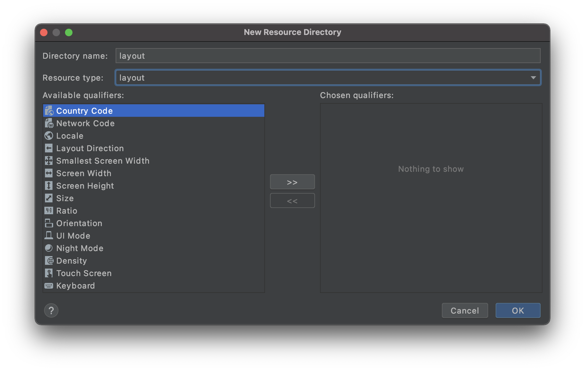

Эти действия абсолютны эквивалентны просто созданию папки `layout` внутри `res` в файловой системе -- вы можете сделать это в командной строке при помощи команды mkdir, и эффект будет точно такой же. Диалог в Android Studio удобен тем, что он показывает, какие имена директорий имеют значение, и какие у них могут быть модификаторы.

Теперь в папке layout создадим файл верстки экрана Hello World -- выберите *New / Layout resource file* в контекстном меню папки layout,

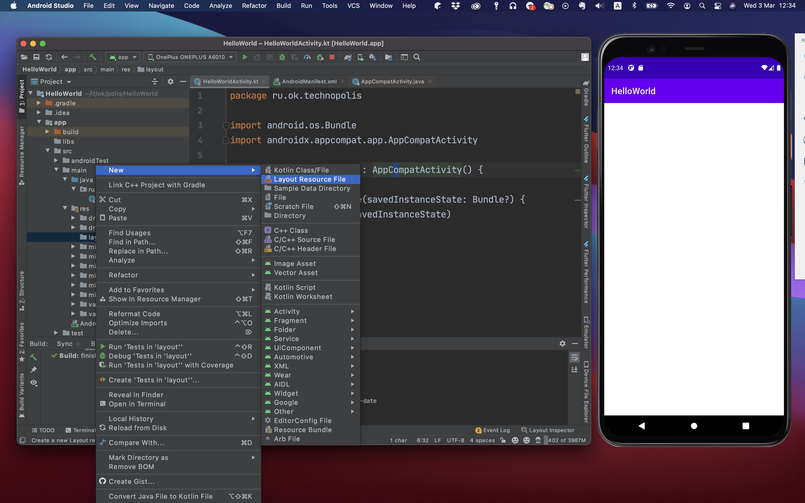

введите имя `activity_hello_world` (есть распространенное соглашение именно так именовать файлы верстки для Activity -- сначала слово activity, потом имя класса), а в поле Root element введите `FrameLayout` (он лучше подходит для нашего простого примера, чем дефолтный `LinearLayout`).

Android Studio создаст файл activity_hello_world.xml и откроет его в редакторе. Редактор лэйаутов в Android Studio имеет два режима: Design для "визуального" редактирования и Text для нормальной работы. Рекомендую сразу забыть про Design и переключиться в Text -- профессиональные разработчики пользуются только им, а для визульной оценки того, что получается, есть панель Preview.

В исходном коде верстки вы увидите автоматически сгенерированный корневой элемент `FrameLayout`. `FrameLayout` -- это имя класса `android.widget.FrameLayout` из Android SDK, который наследует от `android.view.ViewGroup`, который в свою очередь наследует от `android.view.View`. Убедиться в этом можно, если навести курсор на имя элемента `FrameLayout` и нажать Ctrl-B (это переход к исходному коду в Android Studio) -- вы увидите исходный код класса `FrameLayout`.

`View` является самым базовым фундаментальным элементом, из которого строится UI в Android. Каждый экземпляр `View` соответствует какой-то прямоугольной области в пользовательском интерфейсе, в котором что-то отображается и происходит взаимодействие с пользователем. Все View на экране организованы в иерархическую структуру типа дерево. `ViewGroup` -- это особый тип View, который может находиться в узле дерева, то есть содержать в себе другие View. Файлы верстки определяют иерархическую структуру дерева View при помощи иерархической структуры XML элементов. Каждый XML элемент соответсвует какому-то View, полное Java имя класса которого используется в качестве имени XML элемента. Для стандартных классов View из Android SDK можено использовать простое имя класса (как наш `FrameLayout`).

Итак, автоматически сгенерированный файл верстки `activity_hello_world.xml` содержит описание дерева `View`, которое состоит из одного единственного корневого узла `FrameLayout`. `FrameLayout` -- это простейший контейнер (рамка), внутри которой могут отображаться другие `View`. Мы добавим в него `TextView` -- специальный тип `View` для отображения текста.

Отредактируйте `activity_hello_world.xml` так, чтобы весь его код выглядел следующим образом:

```
<?xml version="1.0" encoding="utf-8"?>
<FrameLayout xmlns:android="http://schemas.android.com/apk/res/android"
             android:layout_width="match_parent"
             android:layout_height="match_parent">

    <TextView android:layout_width="wrap_content" 
              android:layout_height="wrap_content"
              android:layout_gravity="center"
              android:text="Hello, World!"/>

</FrameLayout>
```

Атрибут `text` у `TextView`, наверное, не требует объяснений, а остальные атрибуты заслуживают особого внимания. Здесь мы видим атрибуты `layout_width`, `layout_height` и `layout_gravity`. Вообще, все атрибуты, имя которых начинается на `layout_`, определяют размеры и расположение `View`. `layout_width` и `layout_height` определяют ширину и высоту.

Ключевое слово `match_parent` для ширины или высоты говорит о том, что размер View должен совпадать с его родителем. `FrameLayout` является корневым элементом лэйаута, и его родитель определяется тем, как мы используем этот лэйаут. Поскольку мы собираемся использовать наш лэйаут для экрана Hello World, родителем `FrameLayout` можно условно счиать весь экран. То есть, `FrameLayout` примет размеры целого экрана.

Ключевое слово `wrap_content` для ширины или высоты говорит о том, что View должен принять минимально необходимый размер для того, чтобы в нем можно было отобразить его содержимое. В нашем лэйауте `TextView` примет размеры прямоугольной области, содержащей текст "Hello, World!".

Атрибут `layout_gravity` определяет, как View располагается внутри своего родителя. В данном случае `TextView` будет располагаться по центру своего родителя `FrameLayout`, то есть по центру экрана.

Из всех атрибутов, которые могут быть у XML элементов в файле верстки, самые важные -- это `layout_width` и `layout_height`. Они являются обязательными. Если эти атрибуты не указать, то приложение упадет при попытке загрузить файл верстки.

Вернемся к коду `HelloWorldActivity` и его методу `onCreate`, в котором мы должны создать UI экрана Hello World. Сейчас в этом методе есть только вызов super.onCreate(), который необходим для того, чтобы активность была создана правильно. Добавьте одну строчку кода после super.onCreate:

```
	setContentView(R.layout.activity_hello_world);
```


Эта строчка кода означает буквально следующее: загрузить из файла верстки `activity_hello_world` иерархию View и использовать её в качестве контента, отображемого в UI нашей активности. Метод `setContentView` является методом класса `Activity`, и один из его вариантов принимает в качестве аргумента ID ресурса, соответсвующего файлу верстки, который надо использовать. ID ресурсов имеют тип int, и они автоматически генерируются для всех ресурсов приложения во время сборки. `R.layout.activity_hello_world` -- это автоматически сгенерированная константа, соответствующая ресурсу `activity_hello_world` в папке `layout`, которую можно использовать в коде приложения.

Запустите приложение снова -- в этот раз вы увидите сообщение Hello World в центре экрана

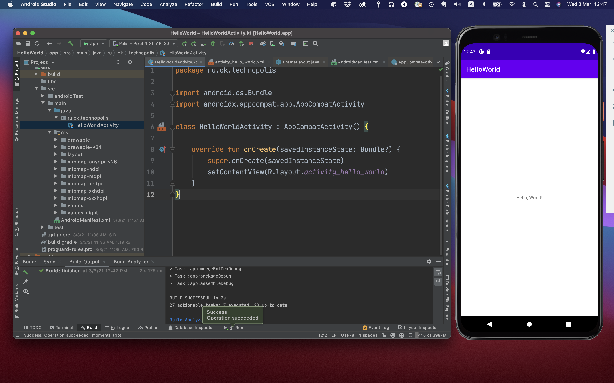

### Строковые ресурсы и локализация

Для того, чтобы всё было сделано правильно, осталось сделать одно небольшое исправление. Открйте файл верстки `activity_hello_world` и посмотрите на атрибут `text` у `TextView`: он подсвечен желтым цветом -- это Android Studio намекает, что что-то с ним не так. Если навести на него курсор, то можно увидеть сообщение о том, что не так: студия говорит, что строка "Hello World!" захардкожена, и так делать не надо. Действительно, строки в Android (как и практически везде) не принято хардкодить, а принято хранить в ресурсах. Для этого есть специальный тип ресурсов -- `string`.

Откройте файл `res/values/strings.xml` -- сейчас там должна быть всего одна строчка `app_name`, которая была автоматически сгенерирована при создании проекта. Добавьте еще одну строчку для нашего сообщения:

```
	<string name="hello_world">Hello, World!</string>
```


Теперь вместо захардкоженной строки в файле верстки `activity_hello_world` можно использовать ссылку на ресурс `hello_world`: 

```
	<TextView android:layout_width="wrap_content"
              android:layout_height="wrap_content"
              android:layout_gravity="center"
              android:text="@string/hello_world"/>
```

Синтаксис `@string/hello_world` является XML аналогом Java констант, используемых для ID ресурсов в коде. В Java коде ID этой строки выглядел бы так:

```
	R.string.hello_world
```

Кроме того, что теперь текст не захардкожен в коде, и его использование и изменение теперь лучше организовано, есть еще одна хорошая причина хранить строки в ресурсах приложения. Эта причина -- **локализация**. Android предоставляет механизм локализации, основанный на системе ресурсов, который позволяет показывать разные варианты текста на разных языках в зависимости от того, какой язык выбран в качестве основного в настройках устройства, на котором запущено приложение.

В качестве демонстрации системы локализации добавим в наше приложение перевод Hello World на русский язык. Для этого создадим **альтернативный ресурс** `hello_world`, который будет использоваться в русской локали.

#### Альтернативные ресурсы

Понятие альтернативных ресурсов -- это общее понятие на Android, которое применяется к любым типам ресурсов (не только к строчкам) и означает, что для некоторого ресурса существуют его альтернативные версии, которые используются при каких-то особых условиях вместо дефолтной версии. Альтернативные версии ресурсов имеют такой же ID, как и основной дефолтный ресурс, и код, который ссылается на этот ID может не думать о том, какая версия ресурса будет использована на самом деле -- Android выбирает нужную версию сам автоматически.

Альтернативные ресурсы хранятся в отдельных директориях внутри папки res, которые отличаются от обычных директорий с ресурсами тем, что к их имени добавляется квалификаторы (qualifier), которые соответствуют условию, при котором ресурсы в этой директории будут использоваться. Для создания директории для альтернативных строк можно воспользоваться диалогом создания Android Resource Directory -- в этот раз следует выбрать Resource type *values* (потому что оригинальные строковые ресурсы лежат в директории values), и добавить квалификатор *Locale*, выбрав при этом язык *Russian* и регион *Any Region*.

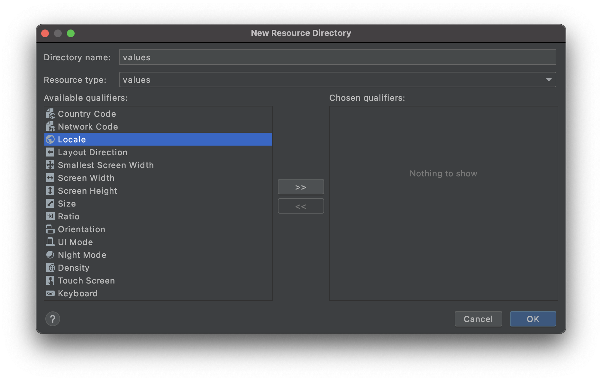

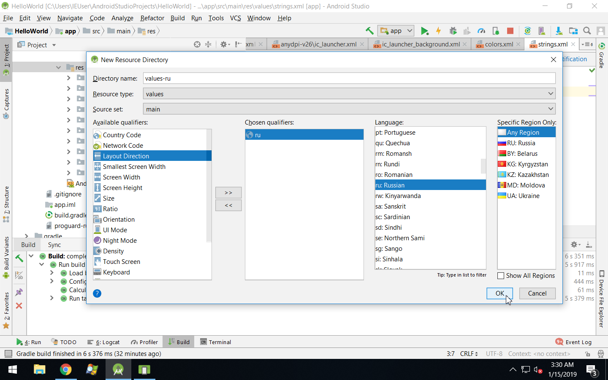

Android Studio создаст директорию `values-ru` внутри папки `res`. Если вы точно знаете, как должна называться директория с альтернативными ресурсами, вы можете просто создаеть её руками в файловой системе -- это будет иметь такой же эффект. Диалог же удобен тем, что вы можете увидеть все возможные варианты -- например, список языков и регионов, которые можно использовать.

Создайте внутри директории `values-ru` файл `strings.xml` со следующим содержимым:

```
<resources>
    <string name="hello_world">Здравствуй, Мир!</string>
</resources>
```

Здесь определен альернативный ресурс `hello_world` -- это то же самое имя, которое мы уже использовали для основного ресурса. Значение же ресурса отличается -- это перевод на русский язык дефолтного значения. Это всё, что нужно сделать для работы системы локализации -- мы просто добавили перевод одной строки, и не изменили ничего в коде приложения, где эта строка используется.

Чтобы проверить, как это работает, перезапустите приложение на эмуляторе. По умолчанию в эмуляторе уствновлен английский язык в качестве основного. Чтобы сменить язык, зайдите в системные настройки в раздел *System / Languages & Input / Language* и там добавьте русский язык и перетащите его на первое место в списке, чтобы он стал основным языком интерфейса. После этого переключитесь обратно в приложение Hello World -- вы увидите сообщение "Здравствуй, Мир!" на русском языке. При этом название приложения Hello World, которое можно увидеть, например, под иконкой приложения на домашнем экране смартфона, осталось неизменным -- потому что строковый ресурс `app_name` не имеет альтернативного ресурса в русской локали.

## Итоги

Hello World -- это простейшее приложение, которое вообще можно сделать на Android (не считая пустого экрана), но в процессе его создания мы много узнали о базовых технологиях Android разработки, которые используются во всех проектах. Вот краткий список того, с чем мы только что познакомились:

- Создание проекта Android приложения в Android Studio
- Выбор минимальной поддерживаемой версии Android
- Структура проекта: манифест, исходный код, ресурсы, скрипты для сборки
- Создание класса типа `Activity` -- основной компонент UI приложения
- Добавление записи об Activity в манифест приложения
- Определение главной активности приложения при помощи action Main и сategory Launcher
- Создание эмулятора Android смартфона и запуск приложения на эмуляторе
- Метод `Activity.onCreate`, инициализация UI
- Общее представление об устройстве UI:`View`, `ViewGroup`, иерархия (дерево) View
- Ресурсы приложения
- ID ресурсов
- Файлы верстки, загрузка иерархии View из файлов верстки
- Создание директорий для отдельных типов ресурсов
- Создание простейшей верстки с `FrameLayout` и `TextView`
- Атрибуты верстки: `layout_width`, `layout_height`, `layout_gravity`
- Ключевые значения для размеров верстки: `match_parent`, `wrap_content`
- Строковые ресурсы
- Альтернативные ресурсы и локализация
