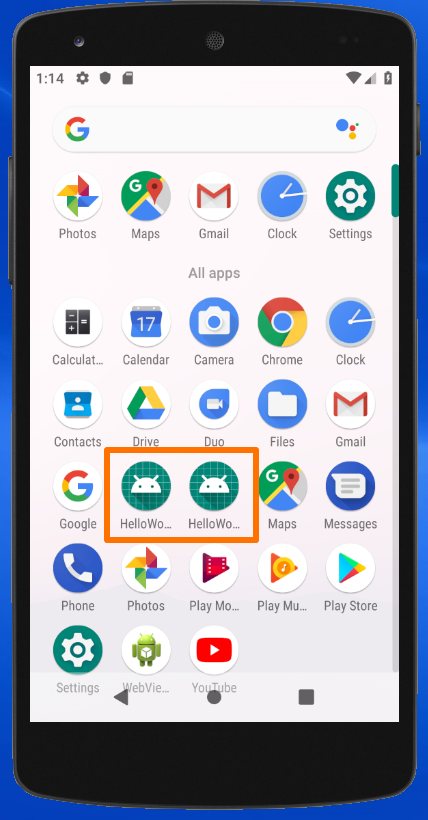
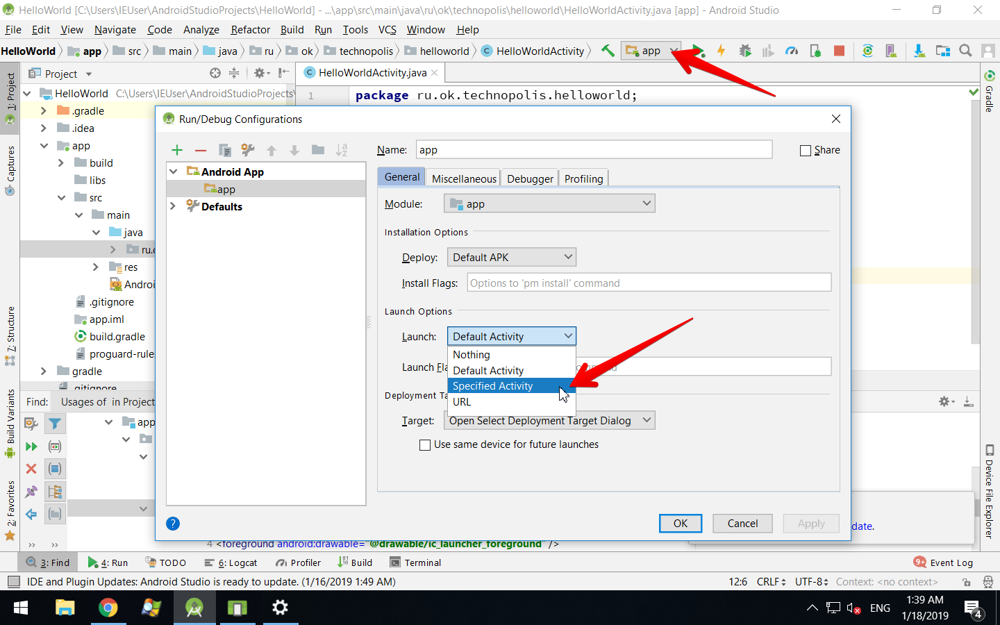
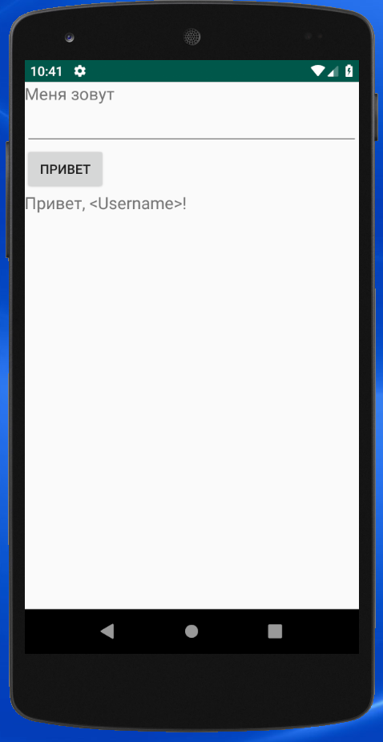
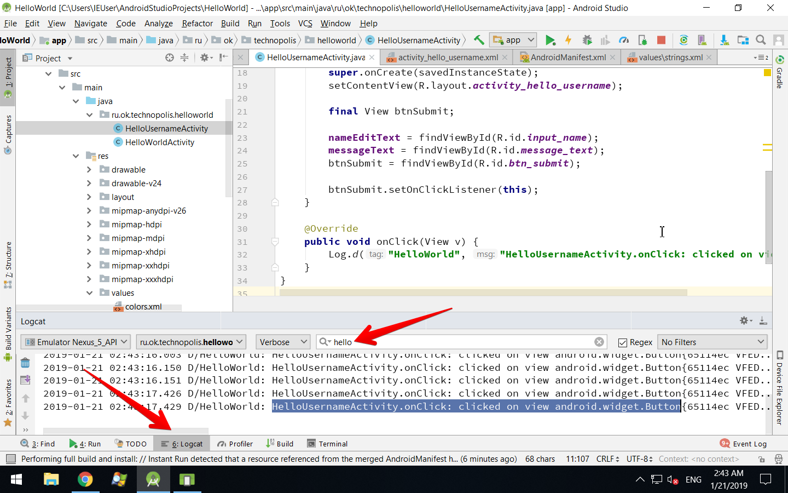
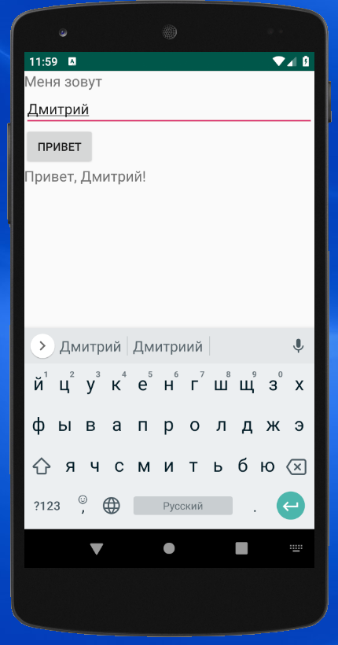
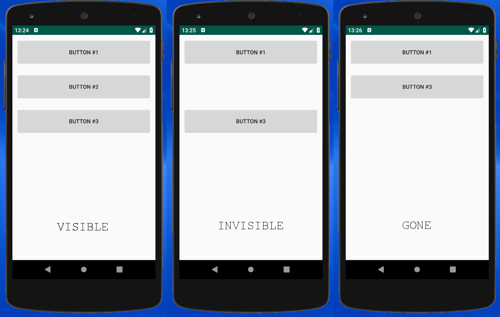

В этом уроке мы продолжим работать с приложение Hello World: немного усложним верстку и добавим к нему интерактивности. Более внимательно рассмотрим структуру проекта и найдем в нем кое-что лишнее и ненужное, научимся запускать приложение на реальном устройстве вместо эмулятора, а также научимся обходиться без Android Studio для некоторых задач разработки. Бонус -- после завершения этого урока вы станете настоящим Android разработчиком (я обещаю).

## Задача

Мы хотим сделать приложение, в котором вместо приветствимя *"Hello, World!"* на экране будет отображаться персонализированное приветствие с именем пользователя вида *"Hello, &lt;username>!"*. Для этого мы добавим на экран
поле ввода, куда пользователь будет вводить своё имя и кнопку для подтверждения ввода, по нажатию на которую
и будет выводиться текст сообщения с именем пользователя.

## Добавление второй активности

Создайте новый класс активности в том же Java пакете и назовите его `HelloUsernameActivity`. Пусть этот класс также наследует от `android.app.Activity`. UI этой активности будет отличаться от `HelloWorldActivity`, но для начала, чтобы просто убедиться, что вторая активность работает, скопируйте файл верстки `activity_hello_world` в `activity_hello_username` и загрузите этот файл верстки в методе `onCreate` класса `HelloUsernameActivity`:

```
public class HelloUsernameActivity extends Activity {

    @Override
    protected void onCreate(Bundle savedInstanceState) {
        super.onCreate(savedInstanceState);
        setContentView(R.layout.activity_hello_username);
    }
}
```

Для того, чтобы экраны визуально отличались, замените строковый ресурс `hello_world` на новый ресурс `hello_username` в файле верстки `activity_hello_username`:
```
<TextView
    android:layout_width="wrap_content"
    android:layout_height="wrap_content"
    android:layout_gravity="center"
    android:text="@string/hello_username"/>
```

Добавьте новый строковый ресурс `hello_username` в файл `app/src/main/res/values/strings.xml` с каким-нибудь уникальным значением. Сейчас файл `strings.xml` должен выглядеть приблизительно так:

```
<resources>
    <string name="app_name">HelloWorld</string>
    <string name="hello_world">Hello, World!</string>
    <string name="hello_username">Hello, &lt;Username&gt;!</string>
</resources>
```

Как мы уже знаем, все активности приложения обязательно должны быть прописаны в манифесте. Откройте файл `app/src/main/AndroidManifest.xml` и добавьте внутрь `application` еще один элемент `activity` для нашей новой активности `HelloUsernameActivity`:
```
    <activity android:name=".HelloUsernameActivity">
        <intent-filter>
            <action android:name="android.intent.action.MAIN"/>
            <category android:name="android.intent.category.LAUNCHER"/>
        </intent-filter>
    </activity>

```

Здесь мы прописали для нашей второй активности action=MAIN и category=LAUNCHER -- так же, как для первой активности `HelloWorldActivity`. Как мы помним, такие параметры активности означают, что это основная точка входа в приложение, и для неё будет создана иконка на домашнем экране смартфона. Стоп! Как могут быть две основные точки входа в приложение?...  Оказывается, могут. Основная не значите единственная. Что именно это значит, мы обсудим чуть позже в этом уроке, а пока запустим приложение на эмуляторе.

После старта приложения мы, как и раньше, увидим экран ссобщением "Hello, World", а вот если закрыть этот экран и посмотреть на список приложений в домашнем экране эмулятора, то мы увидим, что теперь в списке есть два одинаковых ярлыка с одинаковым названием "HelloWorld" -- это и есть две наших активности, которые обе приписаны в манифесте, как MAIN.



Ярлыки имеют одинаковые иконки и названия, потому что в манифесте у активноестей не указаны никакие специальные иконки и названия, и поэтому используются значения `icon` (`roundIcon`) и `label` элемента `application` манифеста:
```
<application
        android:allowBackup="true"
        android:icon="@mipmap/ic_launcher"
        android:label="@string/app_name"
        android:roundIcon="@mipmap/ic_launcher_round"
        android:supportsRtl="true"
        android:theme="@style/AppTheme">
```

Чтобы различать ярлыки активностей, создайте для них в файле `app/src/main/res/values/strings.xml` строковые ресурсы с уникальными именами:

```
    <string name="activity_hello_world">Hello World</string>
    <string name="activity_hello_user">Hello User</string>
```

и используйте их в качестве значения атрибута `label` в манифесте:
```
    <activity android:name=".HelloWorldActivity"
              android:label="@string/activity_hello_world">
		...

    <activity android:name=".HelloUsernameActivity"
              android:label="@string/activity_hello_user">
		...
```

Теперь в списке приложений на домашнем экране яплыки будут иметь разные названия, и мы сможем различать наши две активности:


Осталась последняя проблема -- в нашем Hello World приложении сейчас есть два экрана, и мы можем запускать любой из них, выбирая нужную иконку в домашнем экране смартфона, но при запуске из Android Studio будет всегда запускаться экран Hello World. Мы же хотим сейчас сфокусироваться на разработке экрана Hello User, и было бы удобно, чтобы при запуске из Android Studio запускался именно он. Для это добавьте категорию `DEFAULT` в `intent-filter` активности `HelloUsernameActivity` в манифесте:

```
    <activity android:name=".HelloUsernameActivity"
              android:label="@string/activity_hello_user">
        <intent-filter>
            <action android:name="android.intent.action.MAIN"/>
            <category android:name="android.intent.category.DEFAULT" />
            <category android:name="android.intent.category.LAUNCHER"/>
        </intent-filter>
    </activity>
```

Категория DEFAULT говорит о том, что если для выполнения какого-то действия внутри одного приложения есть несколько вариантов (в данном случае -- две разные активности MAIN), то система выберет то действие, которое имеет категорию DEFAULT. Android Studio, которая выполняет запуск нашего приложения на эмуляторе по нажатию на кнопку Run, тоже понимает манифест приложения и запускает активность с категорией DEFAULT.

Есть другой способ сказать Android Studio, какую активность запускать по нажатию на Run: в настройках конфигурации запуска (Чтобы открыть настройки конфигураций запуска, выберите *Edit Configurations* в drop-down списке слева от кнопки Run в верхней панели инструментов) есть раздел *Launch Options* -- там можно выбрать вариант *Specified Activity* и затем выбрать какую-то конкретную активность для запуска.



Разница между этими вариантами заключается в том, что категория DEFAULT у одного из двух равнозначных варинатов -- это свойство самого приложения, известное операционной системе и другим приложениям. А настройки Android Stuidio -- это... всего лишь её настройки.

## Верстка экрана Hello User

Сейчас мы сделаем верстку экрана Hello User с интерактивными элементами, которая выглядит вот так:



Сначала идет статический текст "Меня зовут", приглашающий пользователя ввести своё имя, потом поле ввода имени, кнопка подтверждения "Привет" и текст приветствия, который должен содержать введённое пользователем имя вместо *&lt;Username&gt;*.

Откройте файл верстки `activity_hello_username` и отредактируйте его, чтобы он выглдядел так:

```
<?xml version="1.0" encoding="utf-8"?>
<LinearLayout
    xmlns:android="http://schemas.android.com/apk/res/android"
    android:layout_width="match_parent"
    android:layout_height="match_parent"
    android:orientation="vertical">

    <TextView
        android:layout_width="wrap_content"
        android:layout_height="wrap_content"
        android:text="@string/my_name_is"
        android:textSize="18sp"/>

    <EditText
        android:layout_width="match_parent"
        android:layout_height="wrap_content"/>

    <Button
        android:layout_width="wrap_content"
        android:layout_height="wrap_content"
        android:text="@string/hi"/>

    <TextView
        android:layout_width="wrap_content"
        android:layout_height="wrap_content"
        android:text="@string/hello_username"
        android:textSize="18sp"/>

</LinearLayout>
```

В этой верстке есть несколько новых моментов:

- В качестве корневого элемента теперь используется `LinearLayout`, а не `FrameLayout`. FrameLayout слишком простой -- он хорош для того, чтобы просто отобразить что-то внутри себя, но не может упорядочить View. LinearLayout позволяет отображать View один за другим по вертикали или по горизонтали. В данном случае -- по вертикали, о чем говорит атрибут `orientation="vertical"`.
- У элементов `TextView` используется атрибут `textSize` для изменения размера текста (чтобы текст на скриншоте выше было лучше видно). Значение этого атрибута `18sp` использует единицу измерения `sp` (scaled pixels). Эта единица измерения используется обычно для текста, и её особенность заключается в том, что она учитывает системные настройки размера экранных текстов.
- Для поля ввода используется `EditText` -- это стандартный системный класс `android.widget.EditText`.
- Для кнопки используется `Button` -- это `android.widget.Button`
- `Button` являются подклассом `TextView` (так же, как и `EditText`), поэтому у него есть атрибут `text`, который здесь используется для надписи на кнопке.

В верстке использованы новые строковые ресурсы `my_name_is` и `hi` -- добавьте их в файл со строковыми ресурсами `app/src/main/res/values/strings.xml` и не забудьте про переводы на русский язык в `app/src/main/res/values-ru/strings.xml`.

## Поиск View по ID

Мы собираемся добавить код, который будет обрабатывать клик на `Button` и использовать ввод из `EditText`. Но прежде, чем мы сможем писать какую-то логику работы с View в коде, нам нужно получить доступ к этим View из кода, потому что на данный момент нужные нам View определены только в файле вёрстки. Для связи кода с вёрсткой нам помогут View ID.

У класса `View` есть свойство `id` типа `int`, которое доступно разработчикам через сеттер `View.setId(int id)` и геттер `int View.getId()`. По умолчанию View имеет нулевой ID: `getId() == 0`, но в файле вёрски можно указать какое-то значение атрибута `id`, и View получит отличный от нуля идентификатор. Делается это при помощи следующего синтаксиса:
```
<View
    android:id="@+id/unique_id_name"
	android:layout_width="wrap_content"
    android:layout_height="wrap_content"/>
```

Здесь используется специальный синтаксис ссылки на ID ресурса со знаком плюс: `@+id/unique_id_name`. Знак плюс означает, что мы не ссылаемся на какой-то ресурс, который определен в другом месте (как мы делали со строками), а определяем его прямо здесь по месту использования. Если бы мы использовали синтаксис без плюса, до произошла бы ошибка сборки из-за того, что мы ссылаемся на ресурс, который нигде не определен. Однако, если ID какого-то View уже был однажды определен в верстке, то в других местах можно использовать синтаксис ссылки на этот ID без плюса -- в случаях, когда мы явно хотим сказать: "Где-то должен  быть такой ID, и мы хотим использовать именно его". Пример:
```
<View
    android:id="@+id/unique_id_name"
	android:layout_width="wrap_content"
    android:layout_height="wrap_content"/>

<View
	android:layout_width="wrap_content"
    android:layout_height="wrap_content"
    app:layout_constraintLeftToRightOf="@id/unique_id_name"/>
```

Для каждого ID, определенного таким образом в файле верстки, будет сгенерирована константа `R.id.unique_id_name`, котороую можно использовать в коде для работы с View. Самый частый кейс использования таких констант -- поиск View по ID в загруженной из файла верстки иерархии View. Для этого у класса `Activity` есть метод:
```
@Nullable
public <T extends View> T findViewById(@IdRes int id);
```
Он принимает в качестве аргумента ID (Аннотация `@IdRes` говорит, что это должно быть не произвольное значение, а какая-то константа из `R.id`), и возвращает инстанс `View` с таким ID из ранее загруженной иерархии View. Если `View` с таким ID не найден, то метод вернет `null`. Очевидно, использовать этот метод надо после вызова `setContentView`, когда иерархия View уже загружена.

*На заметку №1: метод `findViewById` реализован обходом в глубину (DFS). Возомжна ситуация, в которой разные View в иерархии имеют одинаковые ID -- в таком случае будет найдено первое View в порядке обхода DFS.*

*На заметку №2: использование констант ресурсов из `R.id` в качестве View ID не является строго обязательным. Технически возможно использовать произвольные значения, устанавливая их из кода сеттером `View.setId`. Однако, делать это не рекомендуется, потому что в андроидном UI движке View ID используются повсеместно, и неправильное их использование может что-нибудь сломать. Опасаться следует в первую очередь непредвиденных коллизий ID там, где их быть не должно.*

Теперь добавьте ID в верстку. ID нужны только у тех View, с которыми мы будем работать в коде:
```
<EditText
    android:id="@+id/input_name"
    android:layout_width="match_parent"
    android:layout_height="wrap_content"/>

<Button
    android:id="@+id/btn_submit"
    android:layout_width="wrap_content"
    android:layout_height="wrap_content"
    android:text="@string/hi"/>

<TextView
    android:id="@+id/message_text"
    android:layout_width="wrap_content"
    android:layout_height="wrap_content"
    android:text="@string/hello_username"
    android:textSize="18sp"/>
```

Добавьте поля для нужных нам View в классе `HelloUsernameAcitvity`:

```
private EditText nameEditText;
private TextView messageText;
```

Поле `nameEditText` будет использоваться для доступа к `EditText`, в который пользователь вводит имя, а `messageText` -- для `TextView`, в котором мы будем отображать сообщение после нажатия на кнопку. Нам не нужно поле для кнопки, потому что, хоть мы и будем писать код для работы с кнопкой, нам будет достаточно локальной переменной для хранения ссылки на кнопку.

Теперь, когда всем View назначены ID в файле верстки, а в классе активности определены поля для хранения ссылок на View, нам осталось получить инстансы View и сохранить их в поля. Для этого мы используем метод `Activity.findViewById`, который можно вызывать из метода `onCreate` после вызова `setContentView`. Метод `onCreate` в классе `HelloUsernameActivity` теперь выглядит так:
```
    @Override
    protected void onCreate(Bundle savedInstanceState) {
        super.onCreate(savedInstanceState);
        setContentView(R.layout.activity_hello_username);
        
        final View btnSubmit;
        
        nameEditText = findViewById(R.id.input_name);
        messageText = findViewById(R.id.message_text);
        btnSubmit = findViewById(R.id.btn_submit);
    }
```

## Обработка кликов

Для обработки кликов в Android UI фреймворке есть специальный интерфейс `View.OnClickListener`:
```
    /**
     * Interface definition for a callback to be invoked when a view is clicked.
     */
    public interface OnClickListener {
        /**
         * Called when a view has been clicked.
         *
         * @param v The view that was clicked.
         */
        void onClick(View v);
    }
```

и метод `View.setOnClickListener`, при помощи которого можно установить колбэк на View, клики которого вы хотите перехватить:
```
public void setOnClickListener(@Nullable OnClickListener l)
```

Добавьте в декларацию класса `HelloUsernameActivity` интерфейс `View.OnClickListener`:
```
public class HelloUsernameActivity extends Activity
        implements View.OnClickListener {
```
и пустую реализацию метода `onClick` из интерфейса `View.OnClickListener`:
```
    @Override
    public void onClick(View v) {
        
    }
```

В методе `onCreate` добавьте вызов `setOnClickListener` на инстансе кнопки (которую мы сохранили в локальную переменную `View btnSubmit`), передав ему в качестве параметра ссылку на `this` инстанс `HelloUsernameActivity`:

```
	btnSubmit.setOnClickListener(this);
```

Чтобы проверить, что перехват клика на кнопку работает, можно добавить в метод `onClick` печать в лог:
```
    @Override
    public void onClick(View v) {
        Log.d("HelloWorld", "HelloUsernameActivity.onClick: clicked on view " + v);
    }
```

Теперь запустите приложение и покликайте на кнопку "Привет" в эмуляторе. Если всё сделано правильно, то в логе на каждый клик будет печататься сообщение такого вида:
```
2019-01-21 02:43:17.429 D/HelloWorld: HelloUsernameActivity.onClick: clicked on view android.widget.Button{65114ec VFED..C.. ......ID 0,209-264,353 #7f070021 app:id/btn_submit}
```

Для просмотра лога нужно переключиться на вкладку `Logcat` в нижней части экрана. Для удобства просмотра логи можно отфильтровать, например по слову *hello* -- так мы будем видеть только интересующие нас сообщения.


Как можно увидеть из лога, на каждый клик вызывается колбек `onClick`, который мы определили в `HelloUsernameActivity`, и в качестве параметра ему передаётся инстанс `View`, по которому был совершен клик (в данном случае это инстанс `android.widget.Button` с ID `btn_submit`). Один и тот же инстанс `View.OnClickListener` можно использовать для перехвата кликов по разным `View`, поэтому хорошей практикой будет проверять в методе `onClick`, что это за инстанс `View` пришел в качестве параметра, и в зависимости от вариантов, выполнять те или иные действия. В нашем примере мы перехватываем клики только у одной кнопки, но мы всё равно напишем код чисто:
```
    @Override
    public void onClick(View v) {
        Log.d("HelloWorld", "HelloUsernameActivity.onClick: clicked on view " + v);
        if (v.getId() == R.id.btn_submit) {
            onSubmitBtnClicked();
        }
    }

    private void onSubmitBtnClicked() {

    }
```

Добавленный нами метод `onSubmitBtnClicked()` будет вызываться только тогда, когда произошел клик на кнопку подтверждения, и в нем мы напишем логику обработки ввода: нам нужно взять текст из `EditText` (инстанс которого мы сохранили в поле `nameEditText`), сгенерировать из него сообщение и вывести его в `TextView` (поле `messageText`).

Для того, чтобы сформировать сообщение, мы будем использовать технологию форматирования строк при помощи ресурсов. То есть, вместо того, чтоб написать в коде что-то вроде `String message = "Hello, " + userName`, мы определим строковый ресурс, содержащий сообщение с аргументами (замените старое значение ресурса `hello_username` на новое):
```
	<string name="hello_username">Hello, %1$s!</string>
```
и его вариант для русской локали:
```
    <string name="hello_username">Привет, %1$s!</string>
```
а в коде получим отформатированное сообщение при помощи вызова метода `getString(@StringRes int formatResId, Object ... args)`, передав ему строку с именем пользователя, которая будет подставлена вместо `%1$s`. Этот метод определен в классе `Context`, а наша активность `HelloUsernameActivity` сама является экземпляром активности, поэтому мы можем вызывать этот метод в коде `onSubmitBtnClicked()`, который теперь должен выглядеть так:
```
    private void onSubmitBtnClicked() {
        String name = nameEditText.getText().toString();
        String message = getString(R.string.hello_username, name);
        messageText.setText(message);
    }
```

Использование форматирования при помощи ресурсов более предпочтительно, чем форматирования при помощи простой конктенации в коде, потому что при таком способе используется система локализации, и вы можете использовать разные форматы на разных языках -- ведь, даже если вы переведете отдельные фрагменты фразы на все языки, порядок следования этих фрагментов может отличаться в разных языках, и вычисление правильной фразы в коде может оказаться слишком сложным (если вообще возможным).

Теперь в нашем приложении Hello Username функционал почти готов. Его можно запустить, ввести в поле ввода имя, нажать на кнопку, и результат будет выглядеть так:



Есть одна небольшая проблема: при старте приложения, когда кнопка еще не нажата, мы видим текст сообщения с служебными символами форматирования: `Привет, %1$s!` -- потому что код метода `onSubmitBtnClicked` еще не отработал, да и нет еще никакого введенного пользователем имени. По-хорошему, сообщение вообще не должно отображаться, пока пользователь не кликнул на кнопку. Мы так и сделаем, во время инициализации UI в методе `onCreate` мы скроем `TextView` c сообщением, а в методе `onSubmitBtnClicked`, мы снова покажем `TextView` с сообщением. Для этого мы используем свойство `visibility`, которое есть у `View`.

## View Visibility

У `View` есть свойство `visibility`, которое имеет тип `int` и доступное через геттер `getVisibility()` и сеттер `setVisibility(int visibility)`. Возможные значения `visibility`:
- `View.VISIBLE` -- это дефолтное значение, `View` отображается нормально.
- `View.INVISIBLE` -- `View` становится невидимым, но при этом занимает место в вёрстке.
- `View.GONE` -- `View` невидимо, и не занимает место в вёрстке.

Устанавливая значение `visibility` из кода, можно управлять его видимостью в UI.


Чтобы решить проблему несвоевременного отображения сообщения, добавьте следующий код в метод `HelloUsernameActivity.onCreate` (после присваивания значения полю `messageText`):
```
    messageText.setVisibility(View.INVISIBLE);
```
и следующий код -- в метод `onSubmitButtonClicked`:
```
	messageText.setVisibility(View.VISIBLE);
```

Теперь при старте приложения `TextView` с неправильным текстом на экране не отображается, а после клика на кнопку появляется правильно отформатированный текст.

## Запуск Activity из кода

Мы сделали приложение, состоящее из двух Activity, каждая из которых прописана в манифесте как точка входа с домашнего экрана. Это, на самом деле, редко используемая практика. Обычно одно приложение размещает на домашнем экране один ярлык, соответствующий главной точке входа в приложение -- основнуу её активность, а уже внутри приложения пользователь переходим между разными экранами.

Сейчас мы сделаем так же: создадим активность `MainActivity` с двумя кнопками, по клику на которые будет происходить переход в `HelloWorldActivity` либо в `HelloUsernameActivity`. И только одна `MainAcitvity` будет запускаться из домашнего экрана устройства.

Для запуска Activity из кода мы будем использовать Intent (интент) -- это абстрактное описание чего-то, что вы хотите запустить. Интенты широко используются в Android и являются основным способом запуска других приложений, активностей, сервисов -- практически всего, что можно запустить. 

Интенты создаются при помощи класса `android.content.Intent` в документации к которому ([https://developer.android.com/reference/android/content/Intent](https://developer.android.com/reference/android/content/Intent)) можно прочитать про разные способы запуска других активностей при помощи интентов. Общий принцип работы интентов такой: вы в общих чертах описываете, что вы хотите запустить, а операционная система находит подходящее под описание приложение и активность в нём. Наприм, вы можете захотеть запустить какое-нибудь приложение, которое умеет отображать географические координаты (которые задаются при помощи URI со схемой `geo:`) -- система по такому интенту предолжит вам разнообразные картографические приложения и навигаторы. 

Мы же будем использовать самый простой вариант, когда вместо абстрактного описания того, что мы хотим запустить, мы явно укажем приложение и Acitivity в нём, а система его для нас запустит. Для этого используется такой конструктор `Intent`:
```
Intent(Context packageContext, Class<Activity> activityClass);
```
Первый параметр указывает на контекст приложения, которое мы хотим запустить (если мы выполняем код внутри Activity, то можем использовать `this`, потому что `Activity` является контекстом нашего собственного приложения). Второй параметр указывает на активность внутри нашего приложения, которую мы хотим запустить.

Имея объект интента, запуск активности выполняется при помощи метода `Context.startActivity(Intent intent)`:
```
Intent intent = new Intent(this, HelloWorldActivity.class);
startActivity(intent);
```
Нужно иметь в виду, что может оказаться, что система не сможет найти подходящее приложение и активность для вашего интента, и в таком случае будет выброшено исключение `ActivityNotFoundException`, которое надо поймать и что-то предринять:
```
try {
	startActivity(intent);
} catch (ActivityNotFoundException e) {
	// TODO: notify user or navigate to Google Play to install the missing app?
}
```

## Добавляем MainActivity

Создайте класс активности `MainActivity` в пакете `ru.ok.technopolis.helloworld` и добавьте её в манифест с интент-фильтром MAIN+LAUNCHER (такой же, как мы использовали для `HelloWorldActivity`), а у активностей `HelloWorldActivity` и `HelloUsernameActivity` уберите интент-фильтры (они больше не нужны, потому что эти активности теперь будут запускаться из кода, а не из домашнего экрана):
```
<activity android:name=".MainActivity"
                  android:label="@string/app_name">
    <intent-filter>
        <action android:name="android.intent.action.MAIN"/>
        <category android:name="android.intent.category.LAUNCHER"/>
    </intent-filter>
</activity>

<activity android:name=".HelloWorldActivity"
          android:label="@string/activity_hello_world"/>

<activity android:name=".HelloUsernameActivity"
          android:label="@string/activity_hello_user"/>
```

Создайте файл верстки `activity_main.xml` с двумя кнопками:
```
<LinearLayout xmlns:android="http://schemas.android.com/apk/res/android"
    android:layout_width="match_parent"
    android:layout_height="match_parent"
    android:orientation="vertical">

    <Button
        android:id="@+id/btn_hello_world"
        android:layout_width="wrap_content"
        android:layout_height="wrap_content"
        android:text="@string/activity_hello_world"/>

    <Button
        android:id="@+id/btn_hello_user"
        android:layout_width="wrap_content"
        android:layout_height="wrap_content"
        android:text="@string/activity_hello_user"/>

</LinearLayout>
```
В качестве текста для кнопок здесь используются ранее созданные ресурсы `@string/activity_hello_world` и `@string/activity_hello_user`, а для ID кнопок мы создали новые ресурсы типа id: `@+id/btn_hello_world` и `@+id/btn_hello_user` -- их мы будем использовать в коде для обработки кликов.

В классе `MainActivity` напишите код, который загружает верстку и устанавливает обработчики кликов на кнопки:
```
@Override
protected void onCreate(@Nullable Bundle savedInstanceState) {
    super.onCreate(savedInstanceState);
    setContentView(R.layout.activity_main);
    findViewById(R.id.btn_hello_world).setOnClickListener(this);
    findViewById(R.id.btn_hello_user).setOnClickListener(this);
}
```
и добавьте тело метода обработчика клика (обрабочтичком клика является сам класс `MainActivity`, поэтому он должен объявить интерфейс обработчика кликов `implements View.OnClickListener`):
```
@Override
public void onClick(View v) {

}
```

В этом методе мы должны определить, какая кнопка нажата, и запустить соответсввующую активность при помощи явного интента. Вот код, который это делает:
```
if (v.getId() == R.id.btn_hello_user) {
    startActivity(new Intent(this, HelloUsernameActivity.class));
} else if (v.getId() == R.id.btn_hello_world) {
    startActivity(new Intent(this, HelloWorldActivity.class));
}
```

Если всё сделано правильно, то теперь при запуске приложения мы увидим экран `MainActivity` с двумя кнопками, и сможем переходить в другие экраны, кликая на кнопки, и возвращаться назад в `MainAсtivity` нажатием на Back.


## Заключение

Вот список тем, которые были освещены в этом уроке:
- Добавление второй активности в приложение
- Категория DEFAULT для intent-filter в манифесте
- Конфигурации для запуска в Android Studio
- Ярлыки активностей
- Верстка: `EditText` для пользовательского ввода
- Верстка: `Button` для кнопки
- Верстка: `LinearLayout`
- View ID, метода `findViewById` для поиска View
- Обработка кликов, интерфейс `View.OnClickListener`
- Форматирование тектса при помощи строковых ресурсов
- View Visibility
- Запуск Activity из кода при помощи Intent


