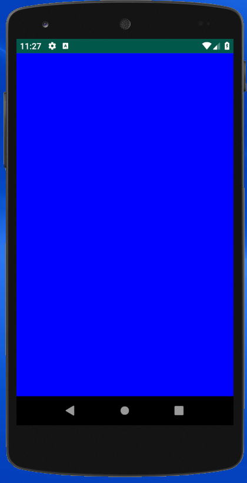

В этом уроке мы немного поработаем с основами графики, и сделаем просто огненное приложение, которое будет выглядеть приблизительно так:


Это приложение воспроизводит эффект огня из игры Doom на Playstation, идея реализации подробно описана в [статье Фабьена Санглара](http://fabiensanglard.net/doom_fire_psx/) (автора книги Game Engine Black Book: Doom). На Хабре есть [перевод этой статьи на русский язык](https://habr.com/ru/post/435122/).

## Рисование на экране

Прежде чем мы начнем писать огненный код, разберемся, как работать с графикой на Android.

Как мы уже знаем, всё, что отображается на экране Android устройства -- это View. В распоряжении разработчика есть набор  View из Android SDK для отображения стандартных компонентов интефейса: текста, кнопок, картинок... Если нужно нарисовать что-то нестандартное, то нужно это делать так же при помощи View, но этот View придется написать самим. За отрисовку на экране содержимого View отвечает метод `View.onDraw(Canvas canvas)`, который надо переопределить и добавить в него код, который нарисует то, что надо. Общий алгоритм действий для рисования чего-то при помощи View, следующий:

- Создать свой класс, наследующий от View
- Переопределить в нем метод `View.onDraw(Canvas canvas)`
- Написать код, который рисует то, что надо
- Добавить созданный кастомный View в верстку, как любой другой View.

*Примечание: такие нестандартные View, написанные руками разработчиков, которые рисуют что-то необычное, и, вообще, ведут себя не так, как стандартные View из Android SDK, часто называются Custom View или кстомные View. Умение делать кастомные View часто упоминается в вакансиях и резюме Android разработчиков*

## Canvas и Paint

Чтобы рисовать, нам понадобятся классы `android.graphics.Canvas` и `android.graphics.Paint`.

Первый (Canvas) содержит методы вида `drawSomething` для рисования графических объектов и отвечает за отрисовку финального изображения. В метод `onDraw(Canvas canvas)` объект `Canvas` приходит в качестве аргумента -- этот объект связан с отображением `View` на экране, и все вызовы на нём будут перобразованы в низкоуровневые команды графического процессора (Open GL), которые будут выполнены при формирования кадра в графической памяти перед отрисовкой на экране. Подробно о том, как устроена графическая подсистема Android, можно прочитать в статье [Graphics architecture](https://source.android.com/devices/graphics/architecture), но пока можно считать, что, вызывая методы `Canvas.drawSomething` мы просто рисуем внутри нашего View на экране.

Класс `Paint` отвечает за то, *как* мы рисуем -- каким цветом, стилем, какой толщины линиями и т.п. Мы сами создаем объект `Paint` в коде и используем его при необходимости.

## Примеры рисования на Canvas

Для того, чтобы попрактиковаться с рисованием на Canvas, создайте новый проект Android приложения, а в нём класс `DemoDrawingView`, который наследует от `View`:
```
public class DemoDrawingView extends View {

    public DemoDrawingView(Context context, @Nullable AttributeSet attrs) {
        super(context, attrs);
    }
}
```

Конструктор с сигнатурой `<init>(Context, AttributeSet)` обязательно нужен для того, чтобы этот класс можно было использовать в верстке.

Добавьте в проект одну основную активность, и используйте в ней следующую верстку (обратите внимание на имя пакета у DemoDrawingView):
```
<?xml version="1.0" encoding="utf-8"?>
<FrameLayout 
    xmlns:android="http://schemas.android.com/apk/res/android"
    android:layout_width="match_parent" 
    android:layout_height="match_parent">
    
    <ваше-имя-Java-пакета.DemoDrawingView
        android:layout_width="match_parent"
        android:layout_height="match_parent"
        android:background="#000"/>

</FrameLayout>
```

Здесь мы используем атрибут `background` для задания цвета фона нашего View. Мы хотим, чтобы он был черным (на черном как-то удобнее рисовать), поэтому его значение равно `#000` -- это сокращение от шестнадцатиричного `ff000000` (черный цвет в ARGB цветовой модели).

В классе `DemoDrawingView` переопределите метод `onDraw(Canvas)`:
```
    @Override
    protected void onDraw(Canvas canvas) {
        int width = getWidth();
        int height = getHeight();

        // Will draw in rect (0,0) - (width, height)
        // Put your custom drawing code here
    }
```

Сейчас в методе `onDraw` нет никакого кода, который что-то рисует, поэтому, если запустить сейчас приложение, то мы увидим просто черный экран -- это пустой `DemoDrawingView` на черном фоне, занимающий весь экран.

Рисование происходит в пространстве координат View и ограничено прямоугольной областью, которую занимает View. Левый верхний угол имеет координаты `(0.0)`, а правый нижний -- `(width, height)`, где `width` и `height` это ширина и высота View, которые можно получить при помощи методов `getWidth()` и `getHeight()`.

Для вызова некоторых методов отрисовки нам понадобится объект `Paint` для того, чтобы указывать цвет. Мы создадим один инстанс `Paint` и сохраним в поле класса `DemoDrawingView`, чтобы переиспользовать его в дальнейшем:

```
	private final Paint paint = new Paint();
```

Ниже будут приведены примеры кода, который надо встравить в метод `onDraw()` после комментария *Put your custom drawing code here*.

### Заливка цветом

```
	canvas.drawColor(Color.BLUE);
```



### Прямоугольники

```
    paint.setColor(Color.GREEN);
    
	final int size = 300;
    for (int x = 0; x < width; x += size) {
        for (int y = 0; y < height; y += size) {
            paint.setColor(0x00ffffff & (1257823419 * x + 2118746214 * y) | 0xff000000);
            canvas.drawRect(x, y, x + size, y + size, paint);
        }
    }
```


### Круги

```
    int centerX = width / 2;
    int centerY = height / 2;
    int padding = 50;
    int minSide = Math.min(width, height);
    int contentSize = minSide - 2 * padding;
    int overlap = 300;
    int radius = (contentSize + overlap) / 4;
    int dist = 2 * radius - overlap;

    float x1 = centerX - dist / 2;
    float x2 = centerX + dist / 2;
    float x3 = centerX;

    float d = dist / 2 / (float) Math.sqrt(3f);
    float y1 = centerY + d;
    float y2 = y1;
    float y3 = centerY - 2 * d;

    paint.setColor(Color.YELLOW & 0x7fffffff);
    canvas.drawCircle(x1, y1, radius, paint);
    paint.setColor(Color.MAGENTA & 0x7fffffff);
    canvas.drawCircle(x2, y2, radius, paint);
    paint.setColor(Color.BLUE & 0x7fffffff);
    canvas.drawCircle(x3, y3, radius, paint);
```


### Произвольные фигуры

```
    int centerX = width / 2;
    int centerY = height / 2;
    int padding = 50;
    int minSide = Math.min(width, height);
    int contentSize = minSide - 2 * padding;

    float segmentSize = contentSize / 3;

    Path path = new Path();
    path.moveTo(segmentSize, 0);
    path.lineTo(2 * segmentSize, 0);
    path.lineTo(2 * segmentSize, segmentSize);
    path.lineTo(3 * segmentSize, segmentSize);
    path.lineTo(3 * segmentSize, 3 * segmentSize);
    path.lineTo(2 * segmentSize, 3 * segmentSize);
    path.lineTo(2 * segmentSize, 2 * segmentSize);
    path.lineTo(segmentSize, 2 * segmentSize);
    path.lineTo(segmentSize, 3 * segmentSize);
    path.lineTo(0, 3 * segmentSize);
    path.lineTo(0, segmentSize);
    path.lineTo(segmentSize, segmentSize);
    path.lineTo(segmentSize, 0);

    path.offset(centerX - 1.5f * segmentSize, centerY - 1.5f * segmentSize);

    paint.setColor(Color.WHITE);
    paint.setStyle(Paint.Style.STROKE);
    paint.setStrokeCap(Paint.Cap.ROUND);
    paint.setStrokeJoin(Paint.Join.ROUND);
    paint.setStrokeWidth(20);

    canvas.drawPath(path, paint);

```


Это далеко не исчерпывающий список того, что можно сделать при помощи `Canvas`, а непосредственно рисование -- не единственный аспект имплементации кастомных View. Подробнее эта тема будет освещена в следующих лекциях, а пока рекомендую по мере необходимости смотреть в [документацию по Canvas](https://developer.android.com/reference/android/graphics/Canvas) и искать методы, которые делают то, что нужно.


## Рекомендации по написанию кода onDraw

Посмотрим внимательно на два последних примера (круги и фигура из фильма Брандашмыг): там непосредственно за отрисовку отвечают несколько строчек кода, в которых вызываются методы `Canvas.drawSomething`, а весь остальной код только вычисляет координаты для рисования и готовит объект `Paint`. Такая архитектура кода годится в случае, если мы рисуем один раз. А что если код рисования нужно выполнить несколько раз? Много раз в секунду? В таком случае код, вычисляющий координаты будет выполняться снова и снова, но результат будет один и тот же (потому что наша сцена статичная, а её размеры не меняются).

Так в самом деле может происходить на Android -- View могу перерисовываться до 60 раз в секунду (это частота обновления кадров в графической системе Android), и выполнять лишний код во время отрисовки не рекомендуется. Код из примеров выше можно изменить таким образом, что вспомогательный вычисления будут выполняться минимально необходимое число раз. Для этого нужно делать так:

1. Код, вычисляющий координаты, результат работы которого зависит только от размера View следует выполнять не в методе `onDraw`, а в методе `View.onSizeChanged` ([документация по onSizeChanged](https://developer.android.com/reference/android/view/View#onSizeChanged(int,%20int,%20int,%20int)), который вызывается каждый раз, когда размер View меняется. Он обязательно будет вызван как минимум один раз перед тем, как будет вызван `onDraw`.

2. Код, который вычисляет что-то постоянное, не зависящее ни от чего, можно выполнить в конструкторе. Например, инициализацию объекта `Paint` нужными параметрами.

С таким подходом код последнего примера будет выглядеть так:
```
    private final Paint paint = new Paint();
    private final Path path = new Path();

    public DemoDrawingView(Context context, @Nullable AttributeSet attrs) {
        super(context, attrs);
        paint.setColor(Color.WHITE);
        paint.setStyle(Paint.Style.STROKE);
        paint.setStrokeCap(Paint.Cap.ROUND);
        paint.setStrokeJoin(Paint.Join.ROUND);
        paint.setStrokeWidth(20);
    }

    @Override
    protected void onSizeChanged(int w, int h, int oldw, int oldh) {
        int centerX = w / 2;
        int centerY = h / 2;
        int padding = 50;
        int minSide = Math.min(w, h);
        int contentSize = minSide - 2 * padding;

        float segmentSize = contentSize / 3f;

        path.reset();

        path.moveTo(segmentSize, 0);
        path.lineTo(2 * segmentSize, 0);
        path.lineTo(2 * segmentSize, segmentSize);
        path.lineTo(3 * segmentSize, segmentSize);
        path.lineTo(3 * segmentSize, 3 * segmentSize);
        path.lineTo(2 * segmentSize, 3 * segmentSize);
        path.lineTo(2 * segmentSize, 2 * segmentSize);
        path.lineTo(segmentSize, 2 * segmentSize);
        path.lineTo(segmentSize, 3 * segmentSize);
        path.lineTo(0, 3 * segmentSize);
        path.lineTo(0, segmentSize);
        path.lineTo(segmentSize, segmentSize);
        path.lineTo(segmentSize, 0);

        path.offset(centerX - 1.5f * segmentSize, centerY - 1.5f * segmentSize);
    }

    @Override
    protected void onDraw(Canvas canvas) {
        canvas.drawPath(path, paint);
    }
```

Этот код делает ровно то же самое с тем же видимым результатом, но написан он так, чтобы максимально быстро работать в условиях, когда Android отрисовывает экран нашего приложения 60 раз в секунду.

В официальной документации есть специальная статья, в которой собраны общие рекомендации по написанию кода, который работает быстро на Android [https://developer.android.com/training/articles/perf-tips](https://developer.android.com/training/articles/perf-tips).

## Делаем огонь

Огненное приложение будет устроено приблизительно так же, как демка, при помощи которой мы экспериментировали с рисованием на Canvas. Поэтому повторите основные шаги:
- Создайте новый проект: можете назвать его FireDemoApp с packageId `ru.ok.technopolis.firedemoapp`
- Добавьте класс `MainActivity` и пропишите его в манифесте
- Создайте класс View, в котором мы будем рисовать огонь: `FireView`
- Создайте верстку для `MainActivity`, в которой весь экран будет занимать `FireView`.

Заготовка класса FireView должна выглядеть так:
```
public class FireView extends View {

    public FireView(Context context, @Nullable AttributeSet attrs) {
        super(context, attrs);
    }

    @Override
    protected void onSizeChanged(int w, int h, int oldw, int oldh) {

    }

    @Override
    protected void onDraw(Canvas canvas) {

    }
}
```

Теперь напишем огненный код, руководствуясь [оригинальной статьёй](http://fabiensanglard.net/doom_fire_psx/), которую надо сейчас прочитать, если вы этого еще не сделали.

Прежде всего нам понадобится палитра цветов для отрисовки пикселей огня с разной температурой. Определим её как массив с шестнадцатиричными значениями цветов в цветовой схеме ARGB:
```
    private static final int[] firePalette = {
            0xff070707,
            0xff1F0707,
            0xff2F0F07,
            0xff470F07,
            0xff571707,
            0xff671F07,
            0xff771F07,
            0xff8F2707,
            0xff9F2F07,
            0xffAF3F07,
            0xffBF4707,
            0xffC74707,
            0xffDF4F07,
            0xffDF5707,
            0xffDF5707,
            0xffD75F07,
            0xffD75F07,
            0xffD7670F,
            0xffCF6F0F,
            0xffCF770F,
            0xffCF7F0F,
            0xffCF8717,
            0xffC78717,
            0xffC78F17,
            0xffC7971F,
            0xffBF9F1F,
            0xffBF9F1F,
            0xffBFA727,
            0xffBFA727,
            0xffBFAF2F,
            0xffB7AF2F,
            0xffB7B72F,
            0xffB7B737,
            0xffCFCF6F,
            0xffDFDF9F,
            0xffEFEFC7,
            0xffFFFFFF
    };
```
В этой палитре цвета меняются от почти черного `0xff070707` по индексу 0 до белого `0xffFFFFFF` по индексу `firePalette.length - 1`.

Для представления пикселей огня нам нужен двумерный массив, в котором мы будем хранить значение температуры пикселей от `0` до `firePalette.length - 1`, и размер этого массива должен совпадать с размером View, а значит, инициализировать его следует в методе `onSizeChanged`. Последняя строчка этого массива, которая соответствует нижней грани View, должна быть заполнена пикселями максимальной температуры, которые будут служить источниками огня.
```
	private int[][] firePixels;
	private int fireWidth;
	private int fireHeight;

    @Override
    protected void onSizeChanged(int w, int h, int oldw, int oldh) {
        fireWidth = w;
        fireHeight = h;
        firePixels = new int[fireWidth][fireHeight];

        for (int x = 0; x < fireWidth; x ++) {
            firePixels[x][fireHeight - 1] = firePalette.length - 1;
        }
    }

```

В методе `onDraw` надо отрисовать пиксели огня, для этого напишем метод `drawFire`, который будет брать значения температуры всех пикселей из массива `firePixels` и отрисовывать их на `Canvas` при помощи палитры `firePixels`. Для этого нам понадобится еще объект `Paint`:
```
	private final Paint paint = new Paint();

	@Override
    protected void onDraw(Canvas canvas) {
        drawFire(canvas);
    }

    private void drawFire(Canvas canvas) {
        for (int x = 0; x < fireWidth; x++) {
            for (int y = 0; y < fireHeight; y++) {
                int temperature = firePixels[x][y];
                if (temperature < 0) {
                    temperature = 0;
                }
                if (temperature >= firePalette.length) {
                    temperature = firePalette.length - 1;
                }
                @ColorInt int color = firePalette[temperature];
                paint.setColor(color);

                canvas.drawPoint(x, y, paint);
            }
        }
    }
```

Здесь мы обходим весь массив пикселей, и для каждого пикселя берем его температуру и, на всякий случай проверив выход за границы массива, используем температуру в качестве индекса в палитре. После чего используем метод `Canvas.drawPoint` для отрисовки одного пикселя нужного цвета.

Попробуйте запустить этот код. При запуске на эмуляторе мы видим белый экран вместо ожидаемого черного экрана с белой полосой огненных пикселей внизу. Почему? В каком месте кода мы допустили ошибку?

На самом деле, в логике кода нет ошибки. Проблема в том, что мы используем неподходящие для нашей задачи методы. Мы рисуем пиксели в цикле при помощи метода `Canvas.drawPoint`. Количество пикселей зависит от экрана устройстов, но можно приблизительно считать его равным одному миллиону. А вот метод `Canvas.drawPoint`, как и вызов любого другого метода `Canvas.drawSomething` при рисовании на экране, устроен так, что в момент вызова ничего фактические не рисуется, а формируется Open GL команда на отрисовку. Потом, после того, как `onDraw` отработал, все команды для отрисовки одного кадра собираются вместе и отправляются в графический процессор, где они фактически выполняются. Отрисовать за раз миллион пикселей дял современного Android устройства не проблема, а вот выполнить миллион команд на отрисовку одного пикслеля -- это непосильная задача.

Белый экран, который мы видим при старте приложения с таким кодом -- это просто белый фон окна, а реальная отрисовка `FireView` еще не произошла. Пока мы смотрим на это белое окно, графический процессор пытается переварить миллион Open GL команд, и это может длиться довольно долго (На моём смартфоне с Adreno 630 GPU `FireView` отрисовывается за 20 секунд).

Количество отдельных Open GL команд, которые GPU может выполнить за один кадр, не очень велико, и при написании кода в `onDraw` надо стараться оптимизировать их количество. Поэтому сейчас мы изменим код так, что он вместо миллиона раз по одному пикселю будет отрисовывать миллион пикселей за раз. С точки зрения логики, результат тот же, но работать будет гораздо быстрее.

## Отрисовка в Bitmap

Никто, на самом деле, не рисует пиксели при помощи `Canvas.drawPoint` -- мы сделали это исключительно в демонстрационных целях. Обычный способ отрисовки большого количества пикселей -- это работа с битмапом, то есть с растровым изображением, массивом пикселей, который хранится в памяти. Мы разобьем отрисовку на два этапа:
1. Сначала установим значения всех пикселей в битмапе
2. Потом нарисуем этот битмап при помощи метода `Canvas.drawBitmap`

Таким образом, GPU должен будет выполнить всего одну операцию отрисовки битмапа, а он умеет делать это очень хорошо и быстро.

Битмапы в Android представлены классом `android.graphics.Bitmap`. Мы создадим один инстанс `Bitmap` и будем его переиспользовать при отрисовке. Добавьте поле в класс `FireView`:
```
private Bitmap bitmap;
```

А в метод `onSizeChanged` добавьте код, который создаст битмап нужного размера при изменении размеров View:
```
bitmap = Bitmap.createBitmap(fireWidth, fireHeight, Bitmap.Config.RGB_565);
```

В методе `drawFire` замените две строчки, которые рисовали пиксели в Canvas (и из-за которых были все тормоза):
```
paint.setColor(color);
canvas.drawPoint(x, y, paint);
```
на одну строчку, которая установит цвет пикселя в битмапе:
```
bitmap.setPixel(x, y, color);
```
А в конце метода после цикла по всем пикселям добавьте одну строчку для отрисовки битмапа в Canvas:
```
canvas.drawBitmap(bitmap, 0, 0, paint);
```
Если теперь запустить приложение, то вместо белого экрана вы увидите черный экран с белой полосой внизу, которая соответствует последней строчке в массиве пикселей -- эти пиксели имеют максимальную температуру и поэтому, в соответствии с нашей палитрой, отрисовываются белым цветом.


## Распространение огня

Теперь, когда основа "движка" для отрисовки огня готова, осталось только написать код, который воспроизводит распространение огня вверх, как это описано в оригинальной статье. Для этого создадим новый метод `spreadFire`, который будем вызывать из `onDraw` перед отрисовкой:
```
@Override
protected void onDraw(Canvas canvas) {
    spreadFire();
    drawFire(canvas);
}

private void spreadFire() {
	// TODO: здесь будет алгоритм распространения огня
}
```

В алгоритме распространения огня используются случайные числа, поэтому нам понадобится инстанс `java.util.Random`, который мы сохраним в поле класса `FireView`:
```
private final Random random = new Random();
```

Алгоритм распространения симулирует распространение частиц огня от источника вверх, при этом в движение частиц добавляется элемент случайности, а их температура постоянно уменьшается. Алгоритм в процессе формирования очередного кадра работает следующим образом:
- Обход всех пикселей огня производится построчно сверху вниз (чтобы менять значения температуры пикселей в порядке, обратном причинному)
- Для каждого пикселя огня находится его пиксель-прообраз из предыдущего кадра, который находится ниже. При этом добавляеются небольшие случайные отклонения по вертикали и горизонтали.
- Температура пикселя вычисляется как температура его прообраза минус небольшая случайная величина.

Вот код этого алгоримя (который надо написать внутри метода `spreadFire`):
```
    for (int y = 0; y < fireHeight - 1; y++) {
        for (int x = 0; x < fireWidth; x++) {
            int rand_x = random.nextInt(3);
            int rand_y = random.nextInt(6);
            int dst_x = Math.min(fireWidth - 1, Math.max(0, x + rand_x - 1));
            int dst_y = Math.min(fireHeight - 1, y + rand_y);
            int deltaFire = -(rand_x & 1);
            firePixels[x][y] = Math.max(0, firePixels[dst_x][dst_y] + deltaFire);
        }
    }
```

## Обновление кадров

Мы написали код, который для каждого кадра выполняет алгоритм распространения огня и отрисовывает обновленное состояние на экране. Если мы его сейчас запустим, то увидим только один первый кадр огня: небольшой эффект над нижней полосой источника огня. Android отрисовывает наш `FireView` и считает, что всё ок -- работа выполнена. Нам нужно сделать так, чтобы Android перерисовывал `FireView` снова и снова в бесконечном цикле -- тогда мы увидим последовательность смены кадров с горящим огнем. Сделать это очень просто -- надо добавить одну строчку в метод `onDraw`:
```
@Override
protected void onDraw(Canvas canvas) {
    spreadFire();
    drawFire(canvas);
    invalidate();
}
```

Это вызов метода `View.invalidate()` -- этот метод говорит системе, что состояние View изменилось таким образом, что его надо перерисовать. И система вскоре перерисует `View` -- снова вызовет его метод `onDraw` (это происходит асинхронным образом). 

Мы вызываем `invalidate` прямо из самого метода `onDraw`, поэтому система будет бесконечно снова и снова вызывать `onDraw` и перерисовывать `FireView`.

Запустив приложение, мы увидим горящий огонь, который выглядит именно так, как мы задумывали, за исключением одного небольшого нюанса -- он горит очень медленно:


На изображении выше добавлен счетчик FPS -- он показывает приблизительно полкадра в секунду (или 1 кадр за 2 секунды). Причем, скорость работы приложения не сильно зависит от мощности CPU или GPU: на разных устройствах FPS будет отличаться, но не в разы. Это следствие эмпирического правила в мире Android устройств: *скорость работы железа приблизительно пропорциональна рамеру экрана* -- то есть на более мощном устройстве, где наш код мог бы работать быстрее, размер экрана будет пропорционально больше, и нам надо будет за один кадр вычислить и перерисовать больше пикселей -- как следствие, визуально скорость работы не будет сильно отличаться.

## Оптимизации

### Убираем лишние вызовы из цикла

Для того, чтобы ускорить наш огонь, сделаем оптимизацию в методе `drawFire` -- там мы в цикле обходим все пиксели и вызываем `Bitmap.setPixel`. Вместо этого мы будем сохранять пиксели в массив, а потом одним разом передадим его в `Bitmap.setPixels`, который вместо одного пикселя принимает в качестве параметров массив пикселей. Таким образом мы сэкономим на том, что при выполнении кода виртуальная машина не будет миллион раз выполнять инструкцию `invoke-virtual` для вызова метода `Bitmap.setPixel` в цикле, а вместо этого будет выполнять инструкцию `aput` для записи значения в массив, что гораздо быстрее. 

Для этой оптимизации нам придется завести еще одно поле в классе `FireView` для массива пикселей (вообще, довольно часто оказывается, что за лучшее быстродействие приходится расплачиваться памятью):
```
private int[] bitmapPixels;
```

В методе `drawFire` замените вызов `setPixel` на запись в массив, а после завершения цикла добавьте вызов `setPixels` для того, чтобы записать массив пикселей в битмап. А перед началом цикла добавьте код, который аллоцирует массив при необходимости:
```
private void drawFire(Canvas canvas) {
    final int pixelCount = fireWidth * fireHeight;
    if (bitmapPixels == null || bitmapPixels.length < pixelCount ) {
        bitmapPixels = new int[pixelCount];
    }

    for (int x = 0; x < fireWidth; x++) {
        for (int y = 0; y < fireHeight; y++) {
            int temperature = firePixels[x][y];
            if (temperature < 0) {
                temperature = 0;
            }
            if (temperature >= firePalette.length) {
                temperature = firePalette.length - 1;
            }
            @ColorInt int color = firePalette[temperature];
            bitmapPixels[fireWidth * y + x] = color;
        }
    }
    bitmap.setPixels(bitmapPixels, 0, fireWidth, 0, 0, fireWidth, fireHeight);
    canvas.drawBitmap(bitmap, 0, 0, paint);
}
```

Запустив приложение, видим ускорение приблизительно в 3 раза (FPS ~1.7 вместо 0.5 на Samsung J3 2016):


### Одномерный массив вместо двумерного

Заметили в предыдущей оптимизации, что `Bitmap.setPixels` принимает в качестве аргумента одномерный массив, а не двумерный, хотя по сути битмап является двумерным? Наверное, это неспроста, подумали вы -- и вы правы! Обращение к элементам многомерных массивов, как правило, связано с дополнительным накладными расходами, поэтому по возомжности следует их избегать. А у нас как раз есть двумерный массив `firePixels`, в котором мы храним температуры частиц огня. Давайте сделаем его одномерным. 

Для этого замените его декларацию на одномерный вариант:
```
private int[] firePixels;
```

и код аллоцирования также на одномерный вариант:
```
firePixels = new int[fireWidth * fireHeight];
```

а во всех местах, где происходит обращение к элементам массива по координатам `foo, bar`, замените `firePixels[foo][bar]` на `firePixels[foo + bar * fireWidth]`. Таким образом, пиксели внутри одномерного массива `firePixels` будут храниться построчно: сначала идут все пиксели первой строчки, потом все пиксели второй строчки и т.д. -- это традиционный способ адресации пикселей в одномерных массивах.

Вот так теперь должен выглядеть метод `spreadFire`:
```
for (int y = 0; y < fireHeight - 1; y++) {
    for (int x = 0; x < fireWidth; x++) {
        int rand_x = random.nextInt(3);
        int rand_y = random.nextInt(6);
        int dst_x = Math.min(fireWidth - 1, Math.max(0, x + rand_x - 1));
        int dst_y = Math.min(fireHeight - 1, y + rand_y);
        int deltaFire = -(rand_x & 1);
        firePixels[x + y * fireWidth] = Math.max(0, firePixels[dst_x + dst_y * fireWidth] + deltaFire);
    }
}
```

Запустив приложение, видим ускорение еще почти в 2 раза (FPS ~3 вместо предыдущих 1.7):


### Меньше пикселей -- быстрее

Такие тонкие оптимизации, как использование более быстрых методов или замена многомерных массивов на одномерные, иногда работают, иногда -- не работают (то есть дают несущественный прирост производительности). Но есть один простой метод, который работает в большинстве случаев, когда речь идет об отрисовке -- чем меньше вы рисуете, тем быстрее это работает.

В нашем случае ощутимого ускорения можно достичь, уменьшив количество пикселей огня, которые мы обсчитываем и отрисовываем на каждом кадре. Сейчас количество пикселей огня совпадает с количеством пикселей экрана. Например, на средненьком экране 720x1280 -- это 921600 штук. Если мы уменьшим ширину огня до 150 пикселей, то при сохранении соотношения сторон, весь массив пикселей будет иметь размер 150x266, или около 40000 пикселей  -- более чем в 20 раз меньше.

В методе `onSizeChanged`, где мы инициализируем массив огня и присваиваем переменным `fireWidth` и `fireHeight` значения, равные ширине и высоте View, напишем такой код:
```
float aspectRatio = (float) w / h;
fireWidth = 150;
fireHeight = (int) (fireWidth / aspectRatio);
```

Теперь огонь горит быстрее, но его размер уменьшился раз в 5 (вполен ожидаемо для экрана шириной 720 пикселей и ширины огня 150 пикселей):


Для того, чтобы огонь принял прежние размеры на весь экран, мы в методе `drawFire` вызовыем метод `Canvas.scale` для того, чтобы размер отрисованного битмапа увеличился ровно на столько, на сколько надо для заполнения всей ширины View. Этот вызов надо добавить перед `drawBitmap`:
```
float scale = (float) getWidth() / fireWidth;
canvas.scale(scale, scale);
canvas.drawBitmap(bitmap, 0, 0, paint);
```

Результат:


Заметьте -- растягивние битмапа на весь экран при помощи `Canvas.scale` не повлияло на скорость работы приложения (FPS ~30). Так происходит, потому что `Canvas.scale` реализован на уровне Open GL как растягивание текстуры, а GPU очень хорошо умеет растягивать текстуры. С точки зрения скорости отрисовки имеет значение количество оригинальных пикселей текстуры (битмапа).
