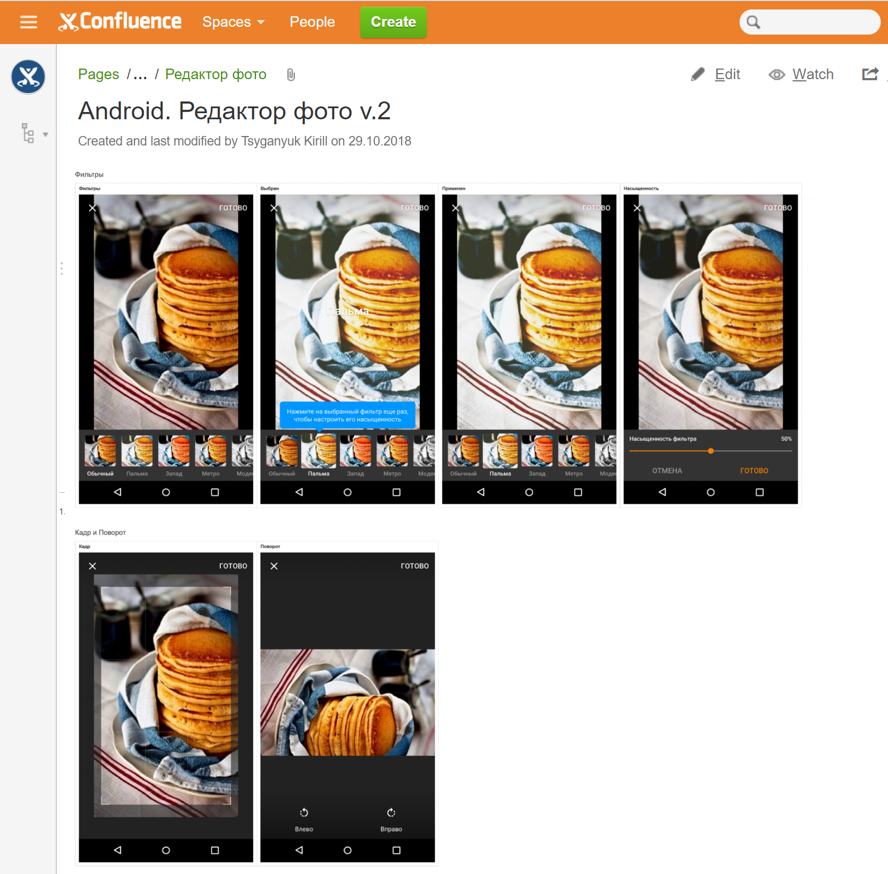
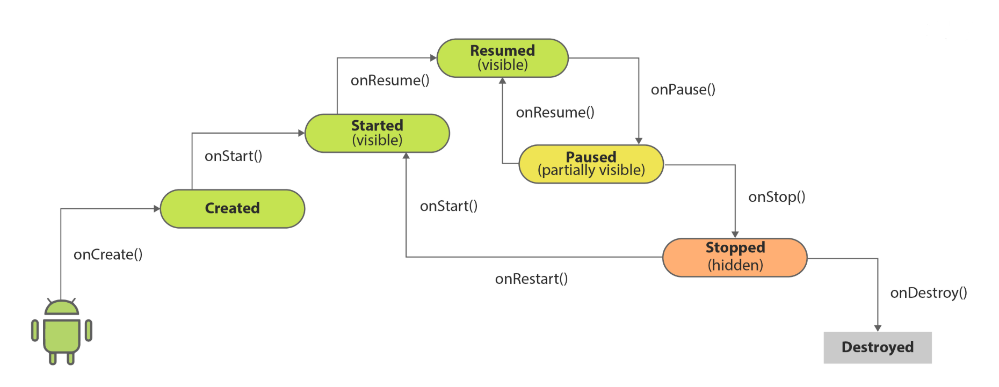
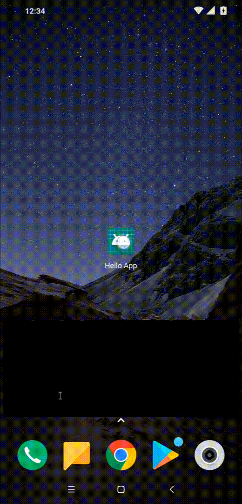
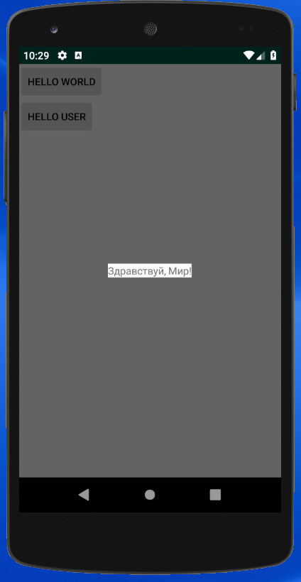

В предыдущих уроках мы посзнакомились с устройством простого Android приложения, состоящего из одной-двух Activity, а сейчас на примере такого приложения посмотрим на то, как Android приложения запускаются, работают и завершают работу -- как устроен их жизненный цикл, и, в частности, как устроен жизненный цикл одной отдельно взятой Activity, и что нам, разработчиком, нужно в связи с этим предпринимать.

## Что такое Activity?

Activity является, пожалуй, важнейшим компонентом -- кирпичиком, из которых, *с точки зрения операционной системы*, состоит Android приложение. В самом делел, Activity -- это, в первом приближении, экран пользовательского интерфейса, а без какого-то интерфейса почти немыслимо представить себе полезное приложение.

Это действительно так, но важно понимать, что то, что вы как разработчик считаете одним экраном приложения, и то, что считает экраном операционная система -- это не одно и то же. А еще есть пользователи вашего приложения, и их представление об экранах тоже может отличаться. Каждый понимает под экраном что-то своё, что ему удобно считать экраном в рамках его задач, и нет какого-то чёткого определения, что такое экран.

Дизайнеры мобильных приложений обычно рисуют все возможные состояния приложения, которые внешне отличаются друг от друга, и называют это разными экранами. Пример: одна из версий дизайна фоторедактора в приложении Одноклассники включает 32 изображения различных экранов. С точки зрения дизайнера, они разные: экран ввода текста, экран выбора цвета, экран кропа, экран поворота и т.д. А с точки зрения разработчика это один экран фоторедактора, который работает в разных режимах. В коде приложения это реализовано как одна Activity.



Бывают обратные ситуации -- когда с точки зрения любого человека, не знакомого с устройством приложения, кажется, что он видит один экран приложения, в котором происходят какие-то изменения, а на самом деле внутри это реализовано как два раных экрана, две Activity, между которыми происходит незаметный переход. Хотя, при желании, то же самое поведение можно было бы реализовать внутри одной Activity, и в некоторых аспектах это было бы даже проще.


Итак, резюмируя: **Activity не всегда однозначно соответствует отдельному экрану приложения.** Бывает, что внутри одной Activity реализовано несколько экранов, и наоборот -- один экран реализован несколькими Activity. Все зависит от взгляда на то, что такое экран.

### Activity misuse disclaimer 

На заре Android разработки, когда перед разработчками была одна лишь документация по Android, в которой акцентировалась определяющая роль Activity как основного компонента, и еще не было сложившегося понимания о том, как должна быть устроена правильная архитектура Android приложения, многие Android разработчики использовали Activity как основу своего кода -- внутри класса типа `Activity` был код, отвечающий за всё: за интерфейс, за загрузку данных, за логику работы приложения... 

Сейчас это не считается хорошей практикой, и в реальных проектах в классах типа `Activity` содержится только специфический код, отвечающий за общие свойства UI, за интеграцию приложения с операционной системой и взаимодействие с другими Activity и другими приложениями, но не за конкретный функционал приложения.

Однако, в рамках нашего курса по Android разработке, мы часто будем писать код примеров внутри класса `Activity` -- исключительно в целях максимальной простоты примеров там, где архитектура этого примера не имеет значения. Вообще, архитектура приложения, и роль Activity с точки зрения архитектуры -- это отдельная тема, которая будет рассмотрена отдельно.

### Activity как контракт

Возможно, вы уже заметили, что при описании роли Activity я неоднократно использовал слова "с точки зрения операционной системы" -- за этими словаи и скрывается главная суть Activity. Это контракт между операционной системой и приложением (такой, как, например, в Java заключен в методе main). Прописывая в манифесте приложения ваши Activity, вы определяете точки входа из операционной системы в пользовательский интерфейс вашего приложения. А интент-фильтры у Activity в манифесте определяют, при каких условиях и с какими параметрами данная Activity может быть запущена.

Например, action MAIN и category LAUNCHER -- это контракт, говорящий о том, что данная активность может быть просто запущена из домашнего экрана, когда пользователь кликнет на иконку приложения:
```
<activity android:name=".HelloWorldActivity"
                  android:label="@string/activity_hello_world"
                  android:taskAffinity="ru.ok.technopolis.helloworld.HelloWorld">
    <intent-filter>
        <action android:name="android.intent.action.MAIN"/>
        <category android:name="android.intent.category.LAUNCHER"/>
    </intent-filter>
</activity>
```

а интент фильтр ниже говорит о том, что данная активность может быть использована для просмотра веб-страниц в домене `ok.ru`, и операционная система может запустить эту активность, когда пользователь кликнет где-нибудь на ссылку вида [https://ok.ru/](https://ok.ru/), при этом ссылка будет передана в виде параметра:
```
<activity android:name=".OdklActivity">
	<intent-filter>
    	<action android:name="android.intent.action.VIEW"/>
        <data android:host="ok.ru" android:scheme="http"/>
        <data android:host="ok.ru" android:scheme="https"/>
    </intent-filter>
</activity>
```

Есть большое число стандартных действий, типов данных и других параметров, которые можно исползовать для определения контракта Activity в интент-фильтрах, и каждое Android приложение определяет какие-то свои контракты: одно приложение умеет просматривать веб-страницы, другое умеет делать фото и снимать видео, третье умеет отправлять текстовые сообщения, а четвертое -- отправлять емэйлы с аттачами и т.п. 

Обо всех таких своих способностях приложения заявляют в своих манифестах при помощи активностей. Одно приложение может запустить другое приложение при помощи интента -- и это возможно только потому, что у другого приложения есть точка входа, описанная в его манифесте при помощи Activity и подходящего интент фильтра.

Так в общих чертах и устроена вся экосистема Android приложений: есть много Activity из разных приложений, и все могут друг друга запускать, соблюдая некоторые контракты. 

Кроме интент-фильтров, которые определяют, как и когда ваща Activity может быть запущена, есть много других параметров activity, которые можно прописать в манифесте, которые определяют кучу разных свойств активности: как она будет отображаться в окне, будут ли видны системные навигационные кнопки, как активность будет отображаться в истории недавно запущенных приложений, как будет показываться системная клавиатура поверх окна вашей активности и многое другое -- полный список всех параметров можно найти в документации по элементу `activity` манифеста: 

https://developer.android.com/guide/topics/manifest/activity-element

Эту документацию можно использовать как начальный обзор всех возможностей Activity -- просто кликаете на какой-нибудь параметр и читаете описание какого-нибудь функционала или технологии, которая за ним скрывается.

## Жизненный цикл Activity

### Запуск Activity

Жизнь отдельно взятого экземпляра Activity начинается в тот момент, когда операционная система (а точнее системный сервис **ActivityManager**) решает, что нужно запустить именно эту активность. Далее происходит следующее:

1. Если процесс приложения, которому принадлежит Activity, не запущен -- запускается новый процесс, в этом процессе инициализируется и запускается виртуальная машина ART.
2. Создается экземпляр Activity при помощи **дефолтного конструктора**.
3. Создается **окно** -- отдельный графический слой, в котором будет отрисовываться весь UI этой активности.
4. Вызывается *метод жизненного цикла* `onCreate`, в коде которого вызывается один из методов `setContentView` устанавливающий контент для окна активности
5. Вызывается *метод жизненного цикла* `onStart`, после чего Activity отображается на экране и становится **видимой**
6. Вызывается *метод жизненного цикла* `onResume`, после чего Activity становится **активной**

Из этого небольшого протокола старта активности можно сделать несколько выводов. Первое -- активности выполняются внутри процесса приложения, а если у одного приложения несколько активностей, то все они выполняются внутри одного и того же процесса. А это значит, что у них общая виртуальная машина, общий Java heap, общий загрузчик классов (Class Loader), и как следствие -- общие статические поля классов. Есть исключение: вы можете явно попросить операционную систему запускать какую-то активность в отдельном процессе при помощи атрибута `process` в манифесте активности -- тогда для этой активности будет запускаться отдельный процесс с отдельной виртуальной машиной, памятью и пр.

Второе -- у всех классов типа `Activity` должен быть публичный дефолтный конструктор. Отсутствие такового вызовет ошибку исполнения, и приложение упадет. Кроме дефолтного конструктора не должно быть других конструкторов -- это чисто технически не запрещено, но просто не имеет смысла. Потому что никаких других полезных использований экземпляров Activity, кроме стандартного, нет, и вы никогда не должны сами в вашем коде инстанциировать Acitvity.

Третье -- у Activity есть состояния: 
- Начальное (в официальной документации никак не называется), когда объект Activity уже создан, но метод `onCreate` еще не вызван,
- **Created** -- после вызова `onCreate`, когда Activity еще не видна пользователю,
- **Started** (или видимое состояние) -- после вызова `onStart`, когда Activity становится видна пользователю,
- **Resumed** (или активное состояние) -- после вызова `onResume`, когда Activity видна и может взаимодействовать с пользователем.

И, наконец, самое интересное -- у `Activity` есть **методы жизненного цикла**, которые вызываются системой в определенные моменты жизни активности, когда она переходит из одного состояния в другое. У каждого такого метода есть своя специфическая роль:

- `onCreate` -- в этом методе создается и инциализируется UI интерфейс, а также восстанавливается состояние активности в случае, если оно было ранее сохранено.
- `onStart` -- в этом методе нужно выполнить код для подготовки активности к отображению на экране. Например, если приложение показывает изображение с камеры, то надо включить камеру. Если приложение показывает положение спутников GPS, то надо включить GPS, и т.п.
- `onResume` -- в этом методе нужно выполнить код для подготовки активности к взаимодействию с пользователем. Например, если это видеоплеер, то можно включить проигрывание видео (которое до этого стояло на паузе).

### Завершение работы Activity

После запуска Activity переходит в состоянии Resumed и остается в этом состоянии до тех пор, пока система не захочет завершить её работу. Это происходит по разным причинам:

- Пользователь явно выходит из Activity (нажимает системную кнопку Back)
- Пользователь переключается в другое приложение (другой таск) при помощи системного списка недавно запущенных тасков
- Пользователь переключается на домащний экран при помощи системной кнопки Home
- Пользователь убрал таск Activity из списка недавних тасков
- Приложение само запускает другую активность при помощи метода `Context.startActivity` или `Activity.startActivityForResult`
- Приложение само завершает текущую активность при помощи метода `Activity.finish()`
- Другое приложение вдруг решило отобразиться и захватить фокус во время работы вашего приложения (входящий звонок)
- **Система сама решает завершить процесс какой-то активности из-за нехватки ресурсов (памяти)**

Последний пункт из этого списка требует дополнительных разъяснений. Операционная система Android в некоторых ситуациях действительно может решить, что какая-то активность должна быть завершена для того, чтобы освободить память, которой в данный момент не хватает. Нельзя точно сказать, когда это происходит -- даже официальная документация описвает это в терминах "вероятности" (likelihood) того, что это произойдет ([https://developer.android.com/guide/components/activities/activity-lifecycle#asem](https://developer.android.com/guide/components/activities/activity-lifecycle#asem)). Это не может произойти с активностью в состоянии Resumed, но, вообще, в любом состоянии нужно быть к этому готовым.

Другие варианты так или иначе бывают инициированы пользователем, но общий смысл такой: **вы как разработчик не можете предсказать, когда ваша Activity завершит работу, и должны быть готовы к тому, что это произойдет в любой момент времени, независимо от того, что происходит в вашем приложении**.

Все варианты завершения работы активности имеют один видимый эффект -- исчезновение ранее активного экрана с Activity -- но отличаются тем, что с Activity происходит на самом деле. Полный сценарий такой:

1. Вызывается метод жизненного цикла `onPause` (противоположность `onResume`), и активность переходит в состояние Paused (то же, что и Started) -- в этом состоянии активность еще видна
2. Вызывается метод жизненного цикла `onStop` (противоположность `onStart`), и активность переходит в состояние Stopped (то же, что и Created) -- в этом состоянии активность уже не видна
3. Вызывается метод жизненного цикла `onDestroy` (противоположность `onCreate`), активность переходит в состояние Destroyed, после чего её жизнь заканичвается, ссылки на неё удаляются, и объект `Activity` может быть собран сборщиком мусора.
4. Если это была последняя активность в процессе, то система может завершить процесс.

Это полный сценарий, в котором активность из состояния Resumed переходит в состояние Destroyed -- это полное фатальное завршение жизни отдельного экземпляра активности. Но возможны сценарии, в которых этот сценарий выполняется не до конца. На самом деле, он может остановиться на любом шаге: в состоянии Paused, Stopped или Destroyed (c продолжающим работать процессом). Кроме того, пункт 3 (вызов `onDestory`) может быть пропущен -- иногда система может решить по-быстрому убить процесс без вызова `onDestroy`, в то время как вызов `onPause` и `onStop` гарантирован.

Что происходит? | Чем это обычно заканчивается для Activity?|
----|----
Выход по Back | Destroyed
Вызов finish() | Destroyed
Закрытие таска Activity | Destroyed
Нажатие на Home | Stopped
Переключение в другой таск | Stopped
Запуск другой непрозрачной активности | Stopped
Запуск другой прозрачной активности | Paused

В методах жизненного цикла `onPause` и `onStop` обычно выполняется код, противоположный тому, который выполнялся в `onResume` и `onStart`: если там включалась камера, то здесь ее надо выключить. Если там аллоцировалась память, то здесь ее надо освободить и т.п. Это нужно делать для экономии ресурсов -- если в неактивном состоянии ваша активность потребляет меньше памяти, то больше памяти достанется другой, активной в данный момент, и меньше вероятность того, что операционная система решит убить ваше приложение, пока активность находится в неактивном состоянии.

В методе `onDestroy` не нужно каким-либо образом уничтожать UI, ранее созданный в методе `onCreate` методом `setContentView` -- вся иерархия View просто будет собрана сборщиком мусора, также как и любые объекты, ссылки на которые держатся только в этом объекте Activity. Однако, если вы аллоцировали какие-то глобальные ресурсы в `onCreate`, то их надо освободить.

Если Activity перешла в неактивное состояние (но не уничтожена), то она может вернуться обратно в активное состояние, если, например, пользователь решит вернуться в приложение. В таком случае сценарий старта активности повторяется, начиная с шага, соответствующего состоянию, из которого активность возвращается к жизни. Таким образом, один экземпляр Activity может бескончено крутиться в своем жизненном цикле, переключаясь между состояними Created - Started - Resumed.



Подробно о жизненном цикле Activity ~~можно~~ нужно прочитать в официально документации: [https://developer.android.com/guide/components/activities/activity-lifecycle](https://developer.android.com/guide/components/activities/activity-lifecycle)

## Жизненный цикл на практике

Теперь попробуем пронаблюдать жизненный цикл на примере приложения Hello World, которое мы сделали в [прошлом уроке](../01_advanced_hello_world/). Откройте проект этого приложения и добавьте имплементацию основных методов жизненного цикла в классы всех активностей: `MainActivity`, `HelloWorldActivity`, `HelloUsernameActivity`:

```
    @Override
    protected void onStart() {
        super.onStart();
    }

    @Override
    protected void onStop() {
        super.onStop();
    }

    @Override
    protected void onResume() {
        super.onResume();
    }

    @Override
    protected void onPause() {
        super.onPause();
    }

    @Override
    protected void onDestroy() {
        super.onDestroy();
    }
```
Во всех активностях уже реализован метод `onCreate`, поэтому сейчас надо добавиьт только 5 методов, а не все 6. Ничего особенного мы в этих методах делать не будем, поэтому в теле всех методов есть только вызов `super` -- это обязательное условие переопределения методов жизненного цикла. Если не вызвать `super`, то приложение упадет (в коде `Activity` есть специальная проверка на то, что `super` вызывается, которая бросает исключение).

### Логирование жизненного цикла

Теперь добавим логи в эти методы, чтобы по логам следить за выполнением жизненного цикла. Для удобства определим тэг для логирования в билд-скрипте `app/build.gradle`:
```
defaultConfig {
	// ... 
    buildConfigField "String", "LOG_TAG", '"HelloLifecycle"'
}
```
и, чтобы с логами всё было чисто, добавим флаг логирования в release и debug версии приложения в том же `app/build.gradle`:
```
buildTypes {
    release {
    	// ...
        buildConfigField "boolean", "LOG", "false"
    }
    debug {
    	buildConfigField "boolean", "LOG", "true"
    }
}
```
Эти константы после сборки будут добавлены в код класса `ru.ok.technopolis.helloworld.BuildConfig`. В дебажной версии это выглядит так:
```
package ru.ok.technopolis.helloworld;

public final class BuildConfig {
    // Fields from build type: debug
    public static final boolean LOG = true;
    
    // Fields from default config.
    public static final String LOG_TAG = "HelloLifecycle";
}
```
Добавьте логи во все методы жизненного цикла во всех активносятх с использованием констант из `BuildConfig`. При этом в каждом логе должно быть имя класса и название метода:
```
    @Override
    protected void onCreate(@Nullable Bundle savedInstanceState) {
        if (LOG) Log.d(LOG_TAG, getClass().getSimpleName() + ".onCreate");
        // ...
    }

    @Override
    protected void onStart() {
        if (LOG) Log.d(LOG_TAG, getClass().getSimpleName() + ".onStart");
        super.onStart();
    }

    @Override
    protected void onStop() {
        if (LOG) Log.d(LOG_TAG, getClass().getSimpleName() + ".onStop");
        super.onStop();
    }

    @Override
    protected void onResume() {
        if (LOG) Log.d(LOG_TAG, getClass().getSimpleName() + ".onResume");
        super.onResume();
    }

    @Override
    protected void onPause() {
        if (LOG) Log.d(LOG_TAG, getClass().getSimpleName() + ".onPause");
        super.onPause();
    }

    @Override
    protected void onDestroy() {
        if (LOG) Log.d(LOG_TAG, getClass().getSimpleName() + ".onDestroy");
        super.onDestroy();
    }
```

### Базовый сценарий

Запустите приложение, и вы увидите в логе (лог можно отфильтровать по слову HelloLifecycle):
```
MainActivity.onCreate
MainActivity.onStart
MainActivity.onResume
```
Теперь нажмите Back -- приложение закроется, а в логе появится следующее:
```
MainActivity.onPause
MainActivity.onStop
MainActivity.onDestroy
```
Это базовый сценарий старта и финиша активности, в которой она проходит все стадии жизненного цикла от `onCreate` до `onDestroy`.


### Переключение между тасками

Запустите приложение, затем откройте список недавних тасков (системная кнопка) и переключитесь в какой-нибудь другой таск:
```
MainActivity.onCreate
MainActivity.onStart
MainActivity.onResume
MainActivity.onPause
MainActivity.onStop
```
Мы видим, что MainActivity не была уничтожена -- она была остановлена и осталась в невидимом состоянии. Теперь, если переключиться обратно в таск MainActivity, он вернется в активное состояние, пройдя через вызовы методов жизненного цикла:
```
MainActivity.onStart
MainActivity.onResume
```


### Сценарий с двумя активностями

Запустите приложение, нажмите на Hello User -- произойдет переход в активность HelloUsernameActivity. С точки зрения MainActivity это будет такой же уход в невидимое состояние, как и в сценарии с переключением между тасками, а с точки зрения HelloUsernameActivity это будет обычный старт, как в базовом сценарии. Здесь инетересно увидеть, как параллельно меняются состояния двух активностей: сначала MainActivity переходит в неактивное состояние (вызывается `onPause`), потом стартует и становится видимой вторая активность, и уже после этого MainActivity переходит в невидимое состояние (вызывается `onStop`):
```
MainActivity.onCreate
MainActivity.onStart
MainActivity.onResume

MainActivity.onPause
HelloUsernameActivity.onCreate
HelloUsernameActivity.onStart
HelloUsernameActivity.onResume
MainActivity.onStop
```

При нажатии на Back и переходе обратно из HelloUsernameActivity в MainActivity всё происходит наоборот: сначала HelloUsernameActivity становится неактивной (`onPause`), потом MainActivity возвращается из невидимого состояния в активное (`onStart`, `onResume`), и только после этого HelloUsernameActivity останавливается и уничтожается (`onStop`, `onDestory`):
```
HelloUsernameActivity.onPause
MainActivity.onStart
MainActivity.onResume
HelloUsernameActivity.onStop
HelloUsernameActivity.onDestroy
```



### Сценарий с полупрозрачной активностью

В предыдущем примере вторая активность полностью закрывала собой первую активность, поэтому первая активность уходила в невидимое состояние через вызовы `onPause` и `onStop`. Возможна ситуация, в которой первая активность всё-таки останется видимой в то время, как поверх нее отображается другая активность. Например, если вторая активность отображается в полупрозрачном окне. В таком случае пользователь видит первую активность (которая находится в видимой фазе жизненного цикла), но не может с ней взаимодействовать, потому что в один момент времени только одна активность может быть в активном состоянии.

Попробуем воспроизвести этот сценарий -- для этого сделаем окно HelloWorldActivity прозрачным. Для этого нам понадобится создать новую тему и применить её к HelloWorldActivity. Откройте файл `res/values/styles.xml`. В нем должен быть приблизительно такой код:
```
    <!-- Base application theme. -->
    <style name="AppTheme" parent="Theme.AppCompat.Light.DarkActionBar">
        <!-- Customize your theme here. -->
        <item name="colorPrimary">@color/colorPrimary</item>
        <item name="colorPrimaryDark">@color/colorPrimaryDark</item>
        <item name="colorAccent">@color/colorAccent</item>
    </style>
```
Этот код был автоматически сгенерирован Android Studio при создании проекта, он определяет базовую тему приложения, которая применяется ко всем активностям. Тема -- это набор атрибутов со значениями, которые используются в различных компонентах приложения, в-основном, в UI компонентах. В манифесте приложения (в файле `AndroidManifest.xml`) у каждой активности можно указать тему, которая к ней будет применяться, и значения атрибутов которой будут использоваться в UI внутри этой активности. Если у активности в манифесте не указана тема, то к ней применяется базовая тема приложения, указанная в элементе application:
```
<application
        android:allowBackup="true"
        android:icon="@mipmap/ic_launcher"
        android:label="@string/app_name"
        android:roundIcon="@mipmap/ic_launcher_round"
        android:supportsRtl="true"
        android:theme="@style/AppTheme">
```

На данный момент в нашем приложении базовая тема называется `AppTheme`, и она наследует от темы `Theme.AppCompat.Light.DarkActionBar` -- это какая-то стандартная тема из библиотеки App Compat Support Library, которую  Android Studio решила использовать как дефолтную. Кстати, именно благодаря этой дефолтной теме окно активности выглядит именно так: сплошное окно на весь экран с белым фоном -- это определено где-то в родительской теме.

Мы создадим новую тему, в которой унаследуем всё из базовой темы, и переопределим один атрибут для того, чтобы окно активности стало полупрозрачным. Добавьте этот код в файл `res/values/styles.xml`:
```
	<style name="AppTheme.Floating">
        <item name="android:windowIsFloating">true</item>
    </style>
```

Обратите внимание на название темы: `AppTheme.Floating`: оно использует специальный синтаксис, в котором сначала указывается имя родительской темы, потом идет точка, а после точки -- уникальное название этой темы. Этот синтаксис равносилен вот такому явному определению темы: `<style name="AppTheme.Floating" parent="AppTheme">` (Который, в свою очередь, является сокращенным вариантом полного каноничного синтаксиса с правильной ссылкой на ресурс родительской темы: `style name="AppTheme.Floating" parent="@style/AppTheme"`).

Теперь укажите эту тему в манифесте (`AndroidManifest.xml`) у активности HelloWorldActivity:
```
<activity android:name=".HelloWorldActivity"
          android:label="@string/activity_hello_world"
          android:theme="@style/AppTheme.Floating">
```

Если запустить приложение и перейти в HelloWorldActivity, то оно будет выглядеть так:



Атрибут `windowIsFloating=true` сделал окно полупрозрачным и сжал размер контента до минимально необходимого -- поэтому мы видим белый фон только у текста в центре экрана. При переходе из MainActivity в HelloWorldActivity и обратно в логе мы видим следующие вызовы методов жизненного цикла:
```
MainActivity.onPause
HelloUsernameActivity.onCreate
HelloUsernameActivity.onStart
HelloUsernameActivity.onResume

HelloUsernameActivity.onPause
MainActivity.onResume
HelloUsernameActivity.onStop
HelloUsernameActivity.onDestroy
```
Отличие от сценария с непрозрачным окном -- у MainActivity не вызываются `onStop` и `onStart`, потому что она остается видимой.


В этом примере полупрозрачное окно поверх MainActivity было сделано искуственно, но даже если в вашем приложении нет полупрозрачных окон, такой сценарий всё равно возможен, если поверх вашего приложения "выскочит" какое-то другое с полупрозрачным окном. Это совершенно обычное дело, самый простой пример -- входящий звонок -- и к этому надо быть готовым. Разработчики должны иметь в виду, что их активности могут легко оказаться в видимом, но неактивном состоянии.
