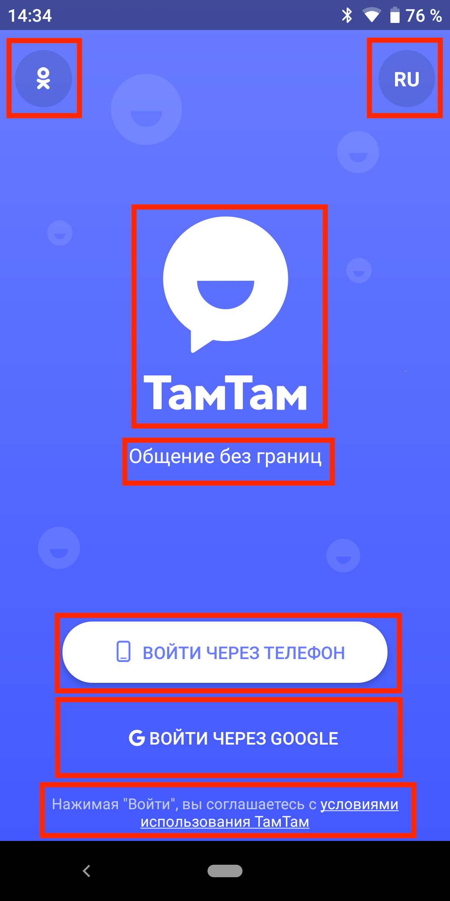
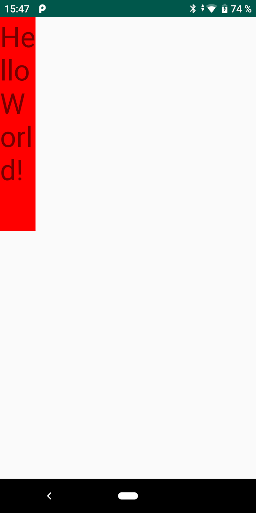
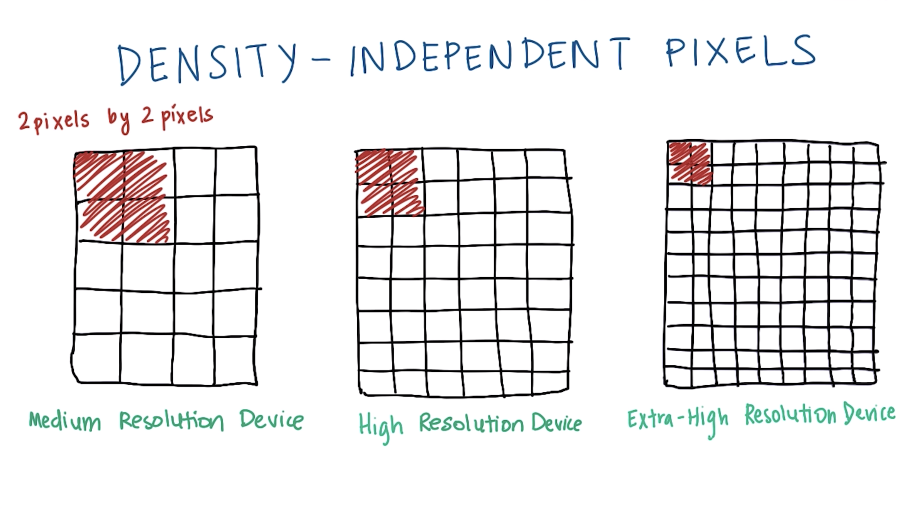
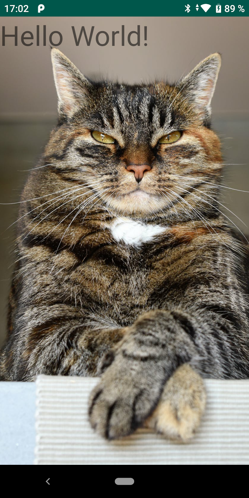
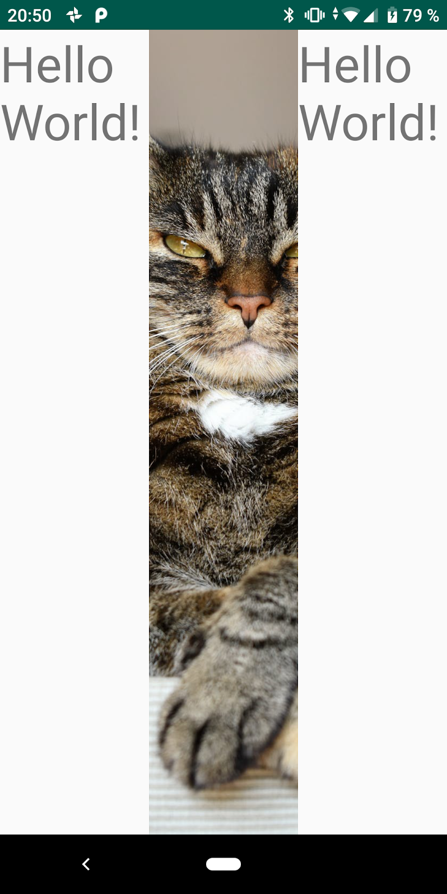
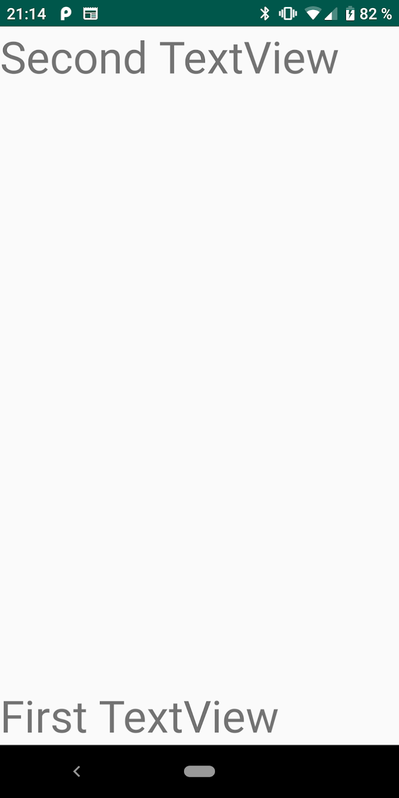
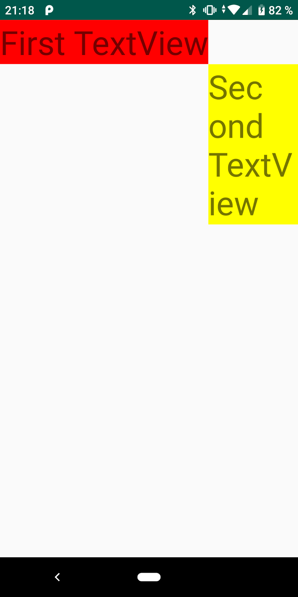
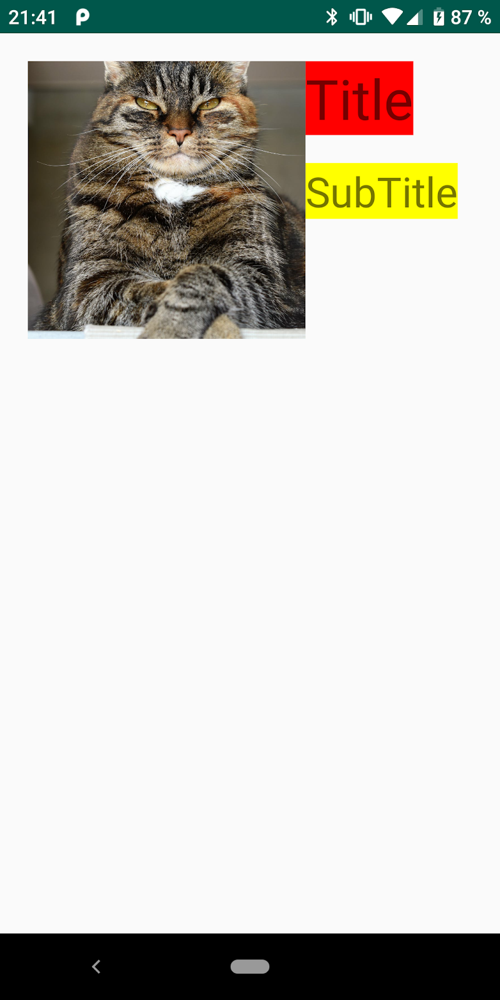
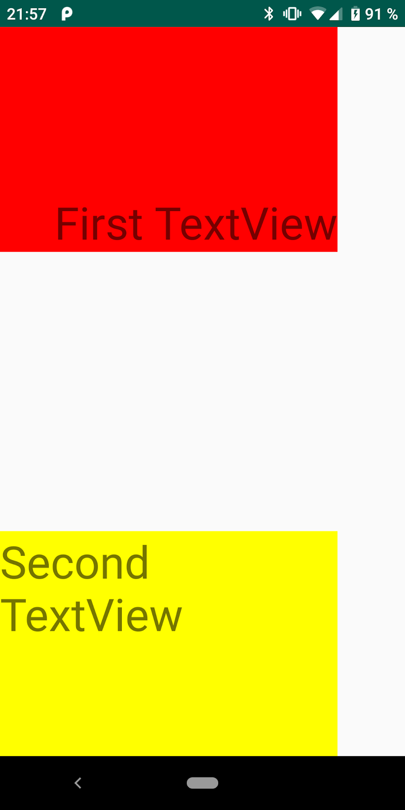

В этом уроке мы познакомимся с основными UI элементами Android. Научимся располагать элементы и сверстаем свой первый экран.

## View

`View` это класс, который представляет собой базовый элемент UI. `View` занимает прямоугольную область экрана и отвечает за отрисовку этой области и обработку событий. Все визуальные компоненты наследуются от `View`.

Как думаете, сколько различных `View` находится на этом экране?


На экране присутствуют 7 различных `View`:
1. кнопка "ОК";
2. кнопка "RU";
3. логотип ТамТам;
4. текст "Общение без границ";
5. кнопка "Войти через телефон";
6. кнопка "Войти через Google";
7. условия использования.



## Объявление UI

Существует два способа объявления UI в Android:
1. при помощи XML; 
2. при помощи кода.

При помощи XML можно быстро и просто создавать UI своего приложения. Для этого необходимо создать новый файл с расширением `.xml` в каталоге `res/layout/`. Например, такой:

```xml
<?xml version="1.0" encoding="utf-8"?>
<FrameLayout xmlns:android="http://schemas.android.com/apk/res/android"
    android:layout_width="match_parent"
    android:layout_height="match_parent">

    <TextView
        android:layout_width="wrap_content"
        android:layout_height="wrap_content"
        android:text="Hello World!" />

</FrameLayout>
```

Для использования этого ресурса, вам необходимо загрузить его в коде приложения. Для `Activity` это метод `onCreate()`. Например, если ваш файл называется `example.xml`, загрузить его можно следующим способом:

```kotlin
override fun onCreate(savedInstanceState: Bundle?) {
    super.onCreate(savedInstanceState)
    setContentView(R.string.example)
}
```

Этот же макет можно было создать при помощи кода следующим образом:

```kotlin
override fun onCreate(savedInstanceState: Bundle?) {
    super.onCreate(savedInstanceState)
    val frameLayout = FrameLayout(this)
    val textView = TextView(this)
    textView.layoutParams =
        FrameLayout.LayoutParams(
            FrameLayout.LayoutParams.WRAP_CONTENT,
            FrameLayout.LayoutParams.WRAP_CONTENT
        )
    textView.text = "Hello World"
    frameLayout.addView(textView)
    setContentView(frameLayout)
}
```

## Атрибуты xml

Каждый объект `View` поддерживает атрибуты XML. Некоторые атрибуты характерны только для конкретного типа `View` (например, объект `TextView` поддерживает атрибут `textSize`), однако эти атрибуты также наследуются любыми объектами `View`, которые могут наследовать этот класс. Некоторые атрибуты являются общими для всех объектов `View,` поскольку они наследуются от корневого класса `View` (такие, как атрибут `id`)

**Атрибут id**

У любого объекта `View` может быть связанный с ним целочисленный идентификатор, который служит для обозначения уникальности объекта `View` в иерархии. Во время компиляции приложения этот идентификатор используется как целое число, однако идентификатор обычно назначается в файле XML макета в виде строки в атрибуте `id`.

```xml
android:id="@+id/my_button"
```

Символ `@` в начале строки указывает на то, что обработчику XML следует выполнить синтаксический анализ остальной части идентификатора и определить ее в качестве ресурса идентификатора. Символ плюса (+) обозначает, что это имя нового ресурса, который необходимо создать и добавить к нашим ресурсам (в файле `R.java`). 

**Атрибуты layout_width, layout_height**

Все `View` имеют атрибуты ширины и высоты `layout_width` и `layout_height`, они могут принимать следующие значения:

1. `wrap_content`. Размер представления задается по размерам его содержимого.

```xml
<?xml version="1.0" encoding="utf-8"?>
<FrameLayout xmlns:android="http://schemas.android.com/apk/res/android"
    android:layout_width="match_parent"
    android:layout_height="match_parent">

    <TextView
        android:layout_width="wrap_content"
        android:layout_height="wrap_content"
        android:background="#FF0000"
        android:text="Hello World!"
        android:textSize="40sp" />

</FrameLayout>
```


2. `match_parent`. Размер представления определяется размером его родителя.

```xml
<?xml version="1.0" encoding="utf-8"?>
<FrameLayout xmlns:android="http://schemas.android.com/apk/res/android"
    android:layout_width="match_parent"
    android:layout_height="match_parent">

    <TextView
        android:layout_width="match_parent"
        android:layout_height="match_parent"
        android:background="#FF0000"
        android:text="Hello World!"
        android:textSize="40sp" />

</FrameLayout>
```


3. Абсолютное значение. Размер строго фиксирован. Как правило, не рекомендуется задавать абсолютные значения. 

```xml
<?xml version="1.0" encoding="utf-8"?>
<FrameLayout xmlns:android="http://schemas.android.com/apk/res/android"
    android:layout_width="match_parent"
    android:layout_height="match_parent">

    <TextView
        android:layout_width="50dp"
        android:layout_height="300dp"
        android:background="#FF0000"
        android:text="Hello World!"
        android:textSize="40sp" />

</FrameLayout>
```



В примерах выше мы использовали атрибуты `background` и `textSize` для определения цвета фона и размера текста.

Для определения фиксированного значения мы использовали единицы измерения `dp`. Density-independent Pixels - это единица измерения учитывающая размер экрана. Различные экраны имеют различное количество пикселей на экране.



`dp` можно определить, как масштабируемый `px`. За степень масштабируемости отвечает `Screen Density`. Это коэффициент, который использует система для вычисления значения `dp`:
- low (ldpi) = 0.75;
- medium (mdpi) = 1;
- tv (tvdpi) = 1.33;
- high (hdpi) = 1.5;
- extra high (xhdpi) = 2.


Т.е. когда экран имеет режим `mdpi`, `1dp = 1px`. View шириной `100dp` будет выглядеть так же как и View шириной `100px`.

Если, например, у нас экран с низким разрешением, то используется режим `ldpi`. В этом случае `1dp = 0.75px`. View шириной `100dp` будет выглядеть так же как View шириной `75px`.

Для шрифтов используется `sp` - Scale-independent Pixels. Работает аналогично `dp`, но для шрифтов.

## ImageView

`ImageView` - это компонент, который предназначен для отображения изображений. Для того, что бы установить изображение, необходимо задать значение аргументу `src`.

```xml
<?xml version="1.0" encoding="utf-8"?>
<FrameLayout xmlns:android="http://schemas.android.com/apk/res/android"
    android:layout_width="match_parent"
    android:layout_height="match_parent">

    <ImageView
        android:layout_width="match_parent"
        android:layout_height="match_parent"
        android:src="@drawable/cat" />

</FrameLayout>
```


Для того, что бы управлять масштабированием изображения внутри ImageView, существует атрибут `scaleType`, меняя его значения можно добиться следующих результатов:

- centerCrop

```xml
<?xml version="1.0" encoding="utf-8"?>
<FrameLayout xmlns:android="http://schemas.android.com/apk/res/android"
    android:layout_width="match_parent"
    android:layout_height="match_parent">

    <ImageView
        android:layout_width="match_parent"
        android:layout_height="match_parent"
        android:scaleType="centerCrop"
        android:src="@drawable/cat" />

</FrameLayout>
```


- center

```xml
<?xml version="1.0" encoding="utf-8"?>
<FrameLayout xmlns:android="http://schemas.android.com/apk/res/android"
    android:layout_width="match_parent"
    android:layout_height="match_parent">

    <ImageView
        android:layout_width="match_parent"
        android:layout_height="match_parent"
        android:scaleType="center"
        android:src="@drawable/cat" />

</FrameLayout>
```


## ViewGroup

С отображением компонентов по отдельности мы разобрались, давайте теперь разберемся с тем, как отобразить несколько `View` на экране.

`ViewGroup` это наследник класса `View`, который может хранить в себе другие компоненты. 
Базовый `ViewGroup` называется (root). Для компонентов, которые он хранит в себе он называется родителем (parent) а компоненты по отношению к нему - потомки (child).

```xml
<?xml version="1.0" encoding="utf-8"?>
<FrameLayout xmlns:android="http://schemas.android.com/apk/res/android"
    android:layout_width="match_parent"
    android:layout_height="match_parent">

    <ImageView
        android:layout_width="match_parent"
        android:layout_height="match_parent"
        android:scaleType="centerCrop"
        android:src="@drawable/cat" />

    <TextView
        android:layout_width="wrap_content"
        android:layout_height="wrap_content"
        android:text="Hello World!"
        android:textSize="40sp" />

</FrameLayout>
```



В данном примере `FrameLayout` является базовым элементом, для него `TextView` и `ImageView` являются потомками, а он для них является родителем.

Мы использовали `FrameLayout` для того, что бы отобразить две `View` на одном экране. `FrameLayout` это самый простой способ разметки, в нем объекты накладываются друг на друга. Положением объектов можно управлять только при помощи атрибута `gravity`.

## LinearLayout

`LinearLayout` это более сложный `ViewGroup`, который выстраивает элементы друг за другом.
Он может быть вертикальным и горизонтальным. За направление отображения отвечает атрибут `orientation`.

1. Вертикальный `LinearLayout`

```xml
<?xml version="1.0" encoding="utf-8"?>
<LinearLayout xmlns:android="http://schemas.android.com/apk/res/android"
    android:layout_width="match_parent"
    android:layout_height="match_parent"
    android:orientation="vertical">
    
    <TextView
        android:layout_width="wrap_content"
        android:layout_height="wrap_content"
        android:text="Hello World!"
        android:textSize="40sp" />

    <ImageView
        android:layout_width="wrap_content"
        android:layout_height="wrap_content"
        android:scaleType="centerCrop"
        android:src="@drawable/cat" />

</LinearLayout>
```


2. Горизонтальный `LinearLayout`

```xml
<?xml version="1.0" encoding="utf-8"?>
<LinearLayout xmlns:android="http://schemas.android.com/apk/res/android"
    android:layout_width="match_parent"
    android:layout_height="match_parent"
    android:orientation="horizontal">

    <TextView
        android:layout_width="wrap_content"
        android:layout_height="wrap_content"
        android:text="Hello World!"
        android:textSize="40sp" />

    <ImageView
        android:layout_width="wrap_content"
        android:layout_height="wrap_content"
        android:scaleType="centerCrop"
        android:src="@drawable/cat" />

</LinearLayout>
```


Для управления местом, занимаемым каждым элементом, используется атрибут `layout_weight`. Этот атрибут указывает "значимость" элемента. Чем больше значение, тем более высокий приоритет будет отдан элементу, при расчетах размера `View`.

Равный вес для всех элементов:

```xml
<?xml version="1.0" encoding="utf-8"?>
<LinearLayout xmlns:android="http://schemas.android.com/apk/res/android"
    android:layout_width="match_parent"
    android:layout_height="match_parent"
    android:orientation="horizontal">

    <TextView
        android:layout_width="match_parent"
        android:layout_height="wrap_content"
        android:layout_weight="1.0"
        android:text="Hello World!"
        android:textSize="40sp" />

    <ImageView
        android:layout_width="match_parent"
        android:layout_height="wrap_content"
        android:layout_weight="1.0"
        android:scaleType="centerCrop"
        android:src="@drawable/cat" />

    <TextView
        android:layout_width="match_parent"
        android:layout_height="wrap_content"
        android:layout_weight="1.0"
        android:text="Hello World!"
        android:textSize="40sp" />

</LinearLayout>
```


Почему изображение все равно занимает больше места? Из-за того что у нас стоит `layout_width="wrap_content"` `TextView` может ужиматься. Для того что бы не допустить этого, нужно установить ширину равную `0dp`. Такое значение указывает, что элементу стоит занимать все свободное место, что ему доступно.

```xml
<?xml version="1.0" encoding="utf-8"?>
<LinearLayout xmlns:android="http://schemas.android.com/apk/res/android"
    android:layout_width="match_parent"
    android:layout_height="match_parent"
    android:orientation="horizontal">

    <TextView
        android:layout_width="0dp"
        android:layout_height="wrap_content"
        android:layout_weight="1.0"
        android:text="Hello World!"
        android:textSize="40sp" />

    <ImageView
        android:layout_width="0dp"
        android:layout_height="wrap_content"
        android:layout_weight="1.0"
        android:scaleType="centerCrop"
        android:src="@drawable/cat" />

    <TextView
        android:layout_width="0dp"
        android:layout_height="wrap_content"
        android:layout_weight="1.0"
        android:text="Hello World!"
        android:textSize="40sp" />

</LinearLayout>
```



Установим изображению приоритет в 5 раз меньше чем для текстовых полей:

```xml
<?xml version="1.0" encoding="utf-8"?>
<LinearLayout xmlns:android="http://schemas.android.com/apk/res/android"
    android:layout_width="match_parent"
    android:layout_height="match_parent"
    android:orientation="horizontal">

    <TextView
        android:layout_width="0dp"
        android:layout_height="wrap_content"
        android:layout_weight="10.0"
        android:text="Hello World!"
        android:textSize="40sp" />

    <ImageView
        android:layout_width="0dp"
        android:layout_height="wrap_content"
        android:layout_weight="2.0"
        android:scaleType="centerCrop"
        android:src="@drawable/cat" />

    <TextView
        android:layout_width="0dp"
        android:layout_height="wrap_content"
        android:layout_weight="10.0"
        android:text="Hello World!"
        android:textSize="40sp" />

</LinearLayout>
```


Для более удобного управления можно использовать атрибут `weightSum`. Если установить его равным 100, то можно присваивать веса в процентном соотношении.

```xml
<?xml version="1.0" encoding="utf-8"?>
<LinearLayout xmlns:android="http://schemas.android.com/apk/res/android"
    android:layout_width="match_parent"
    android:layout_height="match_parent"
    android:orientation="horizontal"
    android:weightSum="100">

    <TextView
        android:layout_width="0dp"
        android:layout_height="wrap_content"
        android:layout_weight="25"
        android:text="Hello World!"
        android:textSize="40sp" />

    <ImageView
        android:layout_width="0dp"
        android:layout_height="wrap_content"
        android:layout_weight="50"
        android:scaleType="centerCrop"
        android:src="@drawable/cat" />

    <TextView
        android:layout_width="0dp"
        android:layout_height="wrap_content"
        android:layout_weight="25"
        android:text="Hello World!"
        android:textSize="40sp" />

</LinearLayout>
```


## RelativeLayout

Что если нам необходимо расположить элементы и по вертикали и по горизонтали? Для этого можно использовать несколько `LinerLayout` с разной ориентаций, но это не всегда удобно и не очень оптимально. Для более сложных интерфейсов используется `RelativeLayout`
`RelativeLayout` позволяет расставить элементы относительно друг друга.

Для того, чтобы разместить компонент относительно родителя используются следующие атрибуты:

- `layout_alignParentBottom` - выравнивание относительно нижнего края родителя;
- `layout_alignParentLeft` - выравнивание относительно левого края родителя;
- `layout_alignParentRight` - выравнивание относительно правого края родителя;
- `layout_alignParentTop` - выравнивание относительно верхнего края родителя;
- `layout_centerInParent` - выравнивание по центру родителя по вертикали и горизонтали;
- `layout_centerHorizontal` - выравнивание по центру родителя по горизонтали;
- `layout_centerVertical` - выравнивание по центру родителя по вертикали.

Для того, чтобы разместить компонент относительно другого компонента используются следующие атрибуты:

- `layout_above` - размещается над указанным компонентом;
- `layout_below` - размещается под указанным компонентом;
- `layout_alignLeft` - выравнивается по левому краю указанного компонента;
- `layout_alignRight` - выравнивается по правому краю указанного компонента;
- `layout_alignTop` - выравнивается по верхнему краю указанного компонента;
- `layout_alignBottom` - выравнивается по нижнему краю указанного компонента;
- `layout_toLeftOf` - правый край компонента размещается слева от указанного компонента;
- `layout_toRightOf` - левый край компонент размещается справа от указанного компонента.

Разместим два `TextView` вверху родителя и внизу родителя:

```xml
<?xml version="1.0" encoding="utf-8"?>
<RelativeLayout xmlns:android="http://schemas.android.com/apk/res/android"
    android:layout_width="match_parent"
    android:layout_height="match_parent">

    <TextView
        android:layout_width="wrap_content"
        android:layout_height="wrap_content"
        android:layout_alignParentBottom="true"
        android:text="First TextView"
        android:textSize="40sp" />

    <TextView
        android:layout_width="wrap_content"
        android:layout_height="wrap_content"
        android:layout_alignParentTop="true"
        android:text="Second TextView"
        android:textSize="40sp" />

</RelativeLayout>
```



Атрибуты можно комбинировать. Разместим второй `TextView` относительно правого нижнего угла первого `TextView`:

```xml
<?xml version="1.0" encoding="utf-8"?>
<RelativeLayout xmlns:android="http://schemas.android.com/apk/res/android"
    android:layout_width="match_parent"
    android:layout_height="match_parent">

    <TextView
        android:id="@+id/first_view"
        android:layout_width="wrap_content"
        android:layout_height="wrap_content"
        android:layout_alignParentTop="true"
        android:text="First TextView"
        android:textSize="40sp" />

    <TextView
        android:layout_width="wrap_content"
        android:layout_height="wrap_content"
        android:layout_below="@+id/first_view"
        android:layout_toRightOf="@+id/first_view"
        android:text="Second TextView"
        android:textSize="40sp" />

</RelativeLayout>
```



В примере выше мы добавили `id` для верхнего `TextView`, для того, чтобы можно было указать отношение.

## Padding vs Margin

Мы научились располагать элементы относительно друг друга, но как сделать так, чтобы они не "слипались. 
Для этого существую два атрибута: `padding` и `layout_margin`.

`padding` указывает отступ внутри элемента.

```xml
<?xml version="1.0" encoding="utf-8"?>
<RelativeLayout xmlns:android="http://schemas.android.com/apk/res/android"
    android:layout_width="match_parent"
    android:layout_height="match_parent">

    <TextView
        android:id="@+id/first_view"
        android:layout_width="wrap_content"
        android:layout_height="wrap_content"
        android:layout_centerInParent="true"
        android:background="#FF0000"
        android:text="First TextView"
        android:textSize="40sp"
        android:padding="100dp"/>

</RelativeLayout>
```


`layout_margin` указывает отступ вокруг элемента.

```xml
<?xml version="1.0" encoding="utf-8"?>
<RelativeLayout xmlns:android="http://schemas.android.com/apk/res/android"
    android:layout_width="match_parent"
    android:layout_height="match_parent">

    <TextView
        android:id="@+id/first_view"
        android:layout_width="wrap_content"
        android:layout_height="wrap_content"
        android:layout_centerInParent="true"
        android:background="#FF0000"
        android:text="First TextView"
        android:textSize="40sp"
        android:layout_margin="100dp"/>

</RelativeLayout>
```


Отступы можно указывать по отдельности для каждой из сторон. Разместим ImageView и рядом два TextView друг под другом:

```xml
<?xml version="1.0" encoding="utf-8"?>
<RelativeLayout xmlns:android="http://schemas.android.com/apk/res/android"
    android:layout_width="match_parent"
    android:layout_height="match_parent">

    <ImageView
        android:id="@+id/image_view"
        android:layout_width="200dp"
        android:layout_height="200dp"
        android:layout_alignParentLeft="true"
        android:layout_alignParentTop="true"
        android:layout_marginLeft="20dp"
        android:layout_marginTop="20dp"
        android:scaleType="centerCrop"
        android:src="@drawable/cat" />

    <TextView
        android:id="@+id/title_view"
        android:layout_width="wrap_content"
        android:layout_height="wrap_content"
        android:layout_alignTop="@+id/image_view"
        android:layout_marginBottom="20dp"
        android:layout_toRightOf="@+id/image_view"
        android:background="#FF0000"
        android:text="Title"
        android:textSize="40sp" />

    <TextView
        android:id="@+id/subtitle_view"
        android:layout_width="wrap_content"
        android:layout_height="wrap_content"
        android:layout_below="@+id/title_view"
        android:layout_toRightOf="@+id/image_view"
        android:background="#FFFF00"
        android:text="SubTitle"
        android:textSize="30sp" />

</RelativeLayout>
```



## Gravity vs layout_gravity

При помощи атрибута `gravity` можно управлять положением контента внутри элемента. Например, разместить текст в нижней части `TextView`.

Атрибут `layout_gravity` позволяет указать положение самого View внутри родителя.

```xml
<?xml version="1.0" encoding="utf-8"?>
<FrameLayout xmlns:android="http://schemas.android.com/apk/res/android"
    android:layout_width="match_parent"
    android:layout_height="match_parent"
    android:gravity="bottom">

    <TextView
        android:layout_width="300dp"
        android:layout_height="200dp"
        android:background="#FF0000"
        android:gravity="bottom|right"
        android:text="First TextView"
        android:textSize="40sp" />

    <TextView
        android:layout_width="300dp"
        android:layout_height="200dp"
        android:layout_gravity="bottom"
        android:background="#FFFF00"
        android:gravity="top"
        android:text="Second TextView"
        android:textSize="40sp" />

</FrameLayout>
```



Для того, что бы разместить текст в нижнем правом углу первого `TextView` мы скомбинировали значение `bottom` и `right`.


## Что почитать

- [https://developer.android.com/guide/topics/ui/declaring-layout](https://developer.android.com/guide/topics/ui/declaring-layout)
- [https://proandroiddev.com/android-developer-beginner-faq-1-margin-vs-padding-f5403c81d7e6](https://proandroiddev.com/android-developer-beginner-faq-1-margin-vs-padding-f5403c81d7e6)
