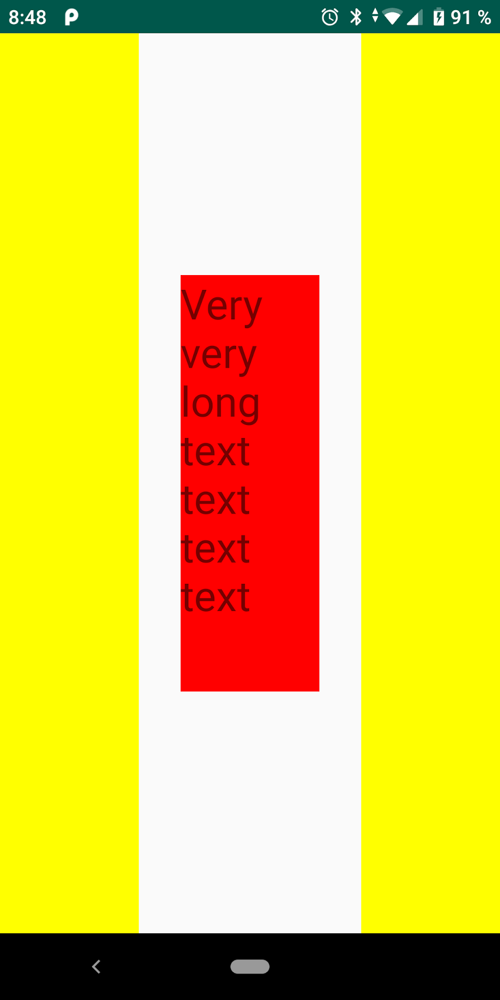
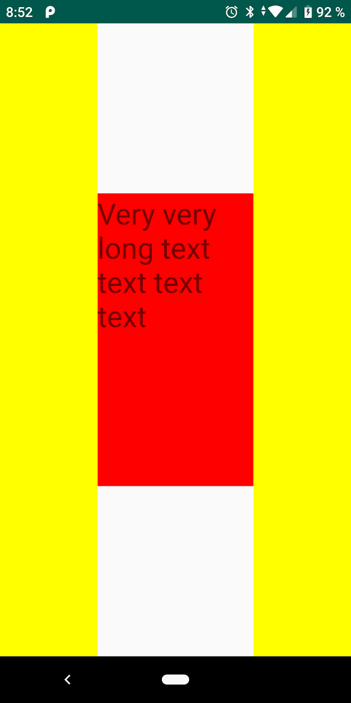
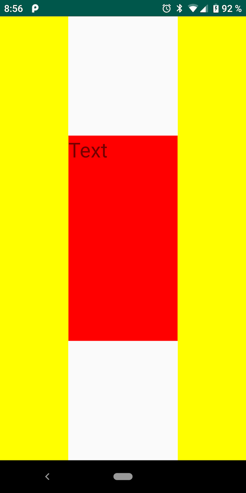
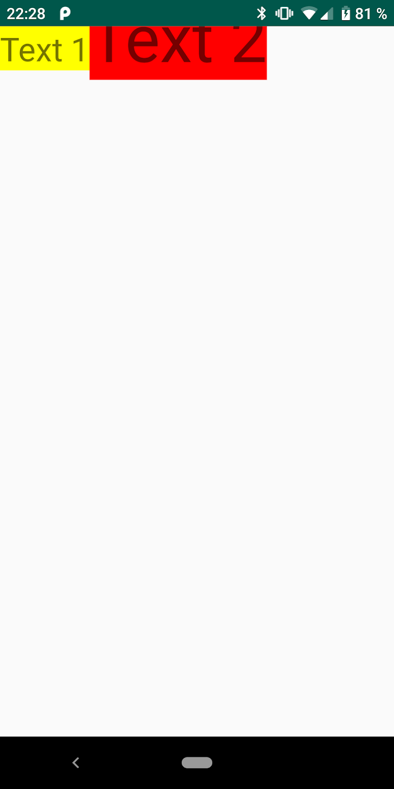
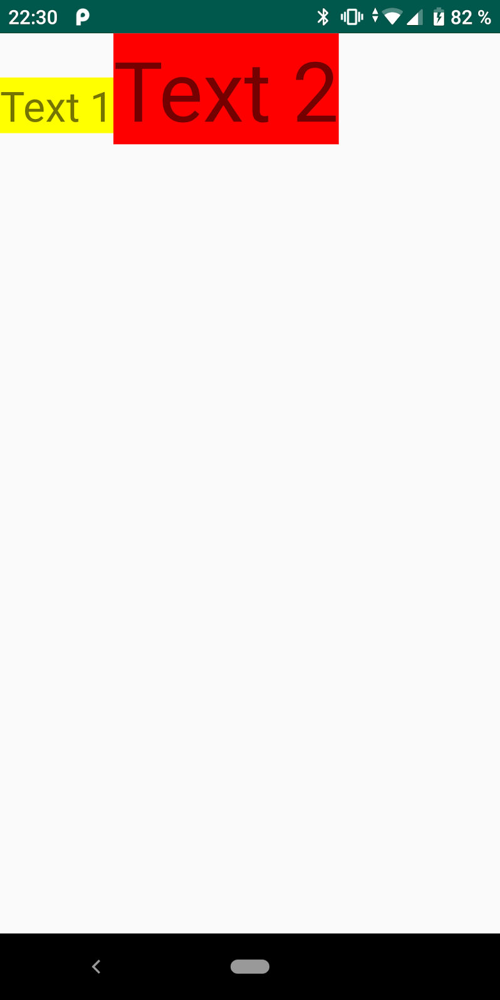
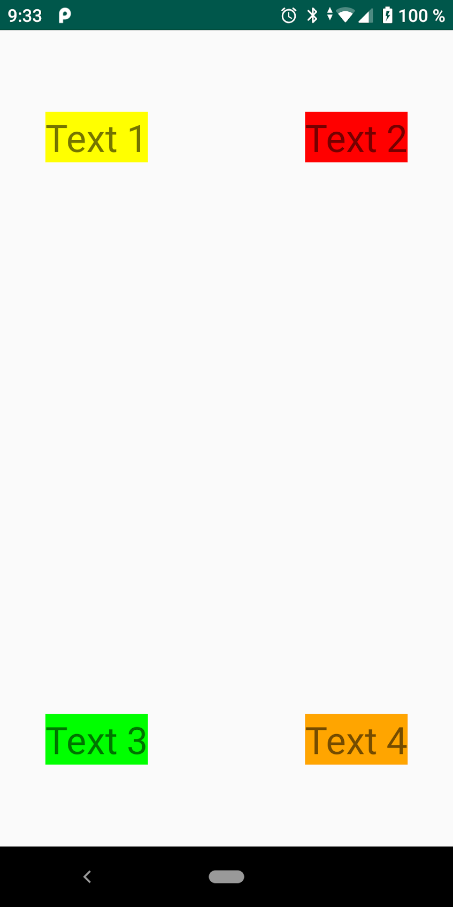
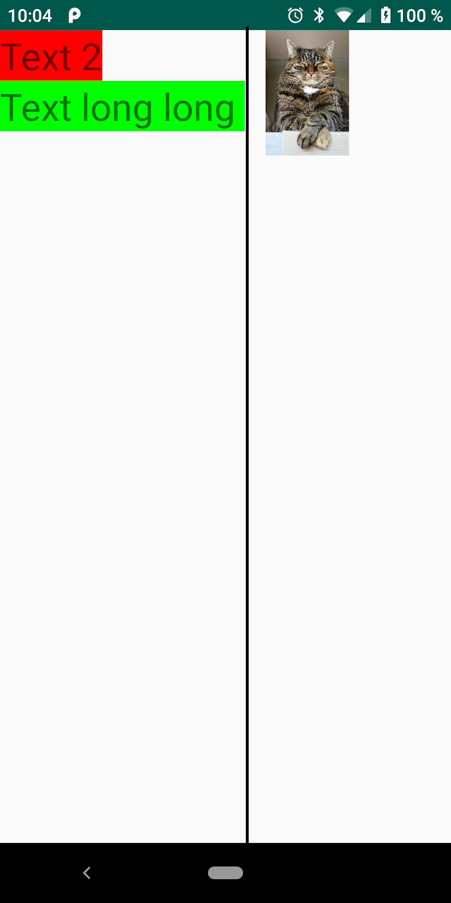
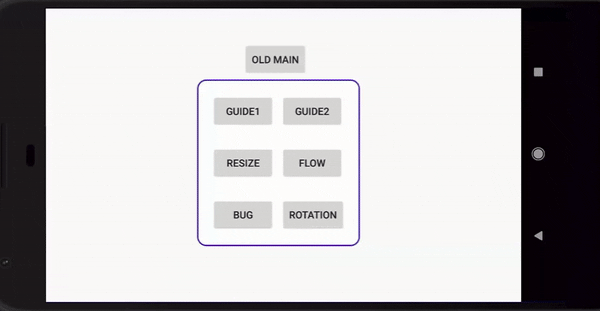

В этом уроке мы научимся работать с самым мощным лейаутом - `ConstraintLayout`.

## Обзор

`Constraints` — это линии разметки, на основе которых располагаются `View` внутри `ConstraintLayout`. `Constraints` могут быть привязаны к сторонам родителя или к сторонам других `View`. `ConstraintLayout` это `RelativeLayout` на "стероидах". `Constraints` можно разделить на вертикальные и горизонтальные.

Горизонтальные `Constraints`:

- правая сторона (right);
- левая сторона (left);
- начало элемента (start);
- конец элемента (end).

Вертикальные `Constraints`:

- верхняя сторона (top);
- нижняя сторона (bottom);
- базовая линия (baseline).

`Baseline` — это линия выравнивания контента. Например, для `TextView` - это линия строки, на которой пишется текст. Если у `View` выставлен `Baseline Constraint`, то базовая линия этого `View` будет находиться на уровне базовой линии `View`, к которой привязан `Сonstraint`.

Общий формат привязки `Constraint` выглядит следующим образом:

```xml
  app:layout_constraint{X}_to{Y}Of="{Z}"
```

где:

- `X` — `Constraint` привязываемой `View`;
- `Y` — сторона `View`, к которой привязываются;
- `Z` — `id` `View`, к которой привязываются, или `parent`.

 Для того, что бы начать использовать `ConstraintLayout`, необходимо добавить зависимость в `build.gradle` файл:

```groovy
dependencies {
//...
    compile 'androidx.constraintlayout:constraintlayout:2.0.4'
//...
}
```

## Привязка границ, настройка ширины и высоты

**Основные правила привязки сторон**:

- привязывать между собой можно только `Start` и `End`, `Left` и `Right`, `Top` и `Bottom`. **Нельзя** привязать `Left` к `Start` или `Baseline` к `Top`!
- **не** привязывайте view с внешней стороны родителя, например, `layout_constraintRight_toLeftOf="parent"`!
- при привязке `Start` или `End` игнорируются привязки `Left`и `Right`;
- `Baseline` можно привязать только к `Baseline`;
- при привязке `Baseline` игнорируются привязки `Top` и `Bottom`.

**Размеры View**

Чтобы задать размеры `View`, используются обязательные атрибуты `layout_width` и `layout_height`, и необязательные атрибуты `layout_constraintWidth_default` и `layout_constraintHeight_default`. Значение атрибутов `layout_constraintWidth_default` и `layout_constraintHeight_default` по умолчанию равно `spread`.

Рассмотрим на примере ширины, каким образом нам задавать значения:

1. Фиксированный размер `View`. `layout_width="100dp"`.

```xml
<?xml version="1.0" encoding="utf-8"?>
<android.support.constraint.ConstraintLayout xmlns:android="http://schemas.android.com/apk/res/android"
    xmlns:app="http://schemas.android.com/apk/res-auto"
    android:layout_width="match_parent"
    android:layout_height="match_parent"
    android:gravity="bottom">

    <View
        android:id="@+id/left"
        android:layout_width="100dp"
        android:layout_height="0dp"
        android:background="#FFFF00"
        app:layout_constraintStart_toStartOf="parent"
        app:layout_constraintTop_toBottomOf="parent"
        app:layout_constraintTop_toTopOf="parent" />

    <TextView
        android:layout_width="100dp"
        android:layout_height="300dp"
        android:background="#FF0000"
        android:text="Very very long text text text text"
        android:textSize="30sp"
        app:layout_constraintBottom_toBottomOf="parent"
        app:layout_constraintEnd_toStartOf="@id/right"
        app:layout_constraintStart_toEndOf="@id/left"
        app:layout_constraintTop_toTopOf="parent" />

    <View
        android:id="@+id/right"
        android:layout_width="100dp"
        android:layout_height="0dp"
        android:background="#FFFF00"
        app:layout_constraintEnd_toEndOf="parent"
        app:layout_constraintTop_toBottomOf="parent"
        app:layout_constraintTop_toTopOf="parent" />

</android.support.constraint.ConstraintLayout>
```



2. Разрешаем `View` самой рассчитать свой размер. `layout_width="wrap_content"`.

```xml
<?xml version="1.0" encoding="utf-8"?>
<android.support.constraint.ConstraintLayout xmlns:android="http://schemas.android.com/apk/res/android"
    xmlns:app="http://schemas.android.com/apk/res-auto"
    android:layout_width="match_parent"
    android:layout_height="match_parent"
    android:gravity="bottom">

    <View
        android:id="@+id/left"
        android:layout_width="100dp"
        android:layout_height="0dp"
        android:background="#FFFF00"
        app:layout_constraintStart_toStartOf="parent"
        app:layout_constraintTop_toBottomOf="parent"
        app:layout_constraintTop_toTopOf="parent" />

    <TextView
        android:layout_width="wrap_content"
        android:layout_height="300dp"
        android:background="#FF0000"
        android:text="Very very long text text text text"
        android:textSize="30sp"
        app:layout_constraintBottom_toBottomOf="parent"
        app:layout_constraintEnd_toStartOf="@id/right"
        app:layout_constraintStart_toEndOf="@id/left"
        app:layout_constraintTop_toTopOf="parent" />

    <View
        android:id="@+id/right"
        android:layout_width="100dp"
        android:layout_height="0dp"
        android:background="#FFFF00"
        app:layout_constraintEnd_toEndOf="parent"
        app:layout_constraintTop_toBottomOf="parent"
        app:layout_constraintTop_toTopOf="parent" />

</android.support.constraint.ConstraintLayout>
```


3. Разрешаем View заполнить всю доступную ширину. `layout_width="0dp",  layout_constraintWidth_default="spread"`. По-умолчанию `layout_constraintWidth_default` уже имеет значение `spread`, его можно не писать.

```xml
<?xml version="1.0" encoding="utf-8"?>
<android.support.constraint.ConstraintLayout xmlns:android="http://schemas.android.com/apk/res/android"
    xmlns:app="http://schemas.android.com/apk/res-auto"
    android:layout_width="match_parent"
    android:layout_height="match_parent"
    android:gravity="bottom">

    <View
        android:id="@+id/left"
        android:layout_width="100dp"
        android:layout_height="0dp"
        android:background="#FFFF00"
        app:layout_constraintStart_toStartOf="parent"
        app:layout_constraintTop_toBottomOf="parent"
        app:layout_constraintTop_toTopOf="parent" />

    <TextView
        android:layout_width="0dp"
        android:layout_height="300dp"
        android:background="#FF0000"
        android:text="Very very long text text text text"
        android:textSize="30sp"
        app:layout_constraintBottom_toBottomOf="parent"
        app:layout_constraintEnd_toStartOf="@id/right"
        app:layout_constraintStart_toEndOf="@id/left"
        app:layout_constraintTop_toTopOf="parent"
        app:layout_constraintWidth_default="spread" />

    <View
        android:id="@+id/right"
        android:layout_width="100dp"
        android:layout_height="0dp"
        android:background="#FFFF00"
        app:layout_constraintEnd_toEndOf="parent"
        app:layout_constraintTop_toBottomOf="parent"
        app:layout_constraintTop_toTopOf="parent" />

</android.support.constraint.ConstraintLayout>
```



4. Разрешаем View самой рассчитать свой размер, но не больше чем доступная ширина. `layout_width="0dp", layout_constraintWidth_default="wrap"`.

```xml
<?xml version="1.0" encoding="utf-8"?>
<android.support.constraint.ConstraintLayout xmlns:android="http://schemas.android.com/apk/res/android"
    xmlns:app="http://schemas.android.com/apk/res-auto"
    android:layout_width="match_parent"
    android:layout_height="match_parent"
    android:gravity="bottom">

    <View
        android:id="@+id/left"
        android:layout_width="100dp"
        android:layout_height="0dp"
        android:background="#FFFF00"
        app:layout_constraintStart_toStartOf="parent"
        app:layout_constraintTop_toBottomOf="parent"
        app:layout_constraintTop_toTopOf="parent" />

    <TextView
        android:layout_width="0dp"
        android:layout_height="300dp"
        android:background="#FF0000"
        android:text="Very very long text text text text"
        android:textSize="30sp"
        app:layout_constraintBottom_toBottomOf="parent"
        app:layout_constraintEnd_toStartOf="@id/right"
        app:layout_constraintStart_toEndOf="@id/left"
        app:layout_constraintTop_toTopOf="parent"
        app:layout_constraintWidth_default="wrap" />

    <View
        android:id="@+id/right"
        android:layout_width="100dp"
        android:layout_height="0dp"
        android:background="#FFFF00"
        app:layout_constraintEnd_toEndOf="parent"
        app:layout_constraintTop_toBottomOf="parent"
        app:layout_constraintTop_toTopOf="parent" />

</android.support.constraint.ConstraintLayout>
```


Результат получился таким же, как и в предыдущем случае, это связано с тем, что у нас достаточно большой текст. Давайте попробуем уменьшить длинную текста и посмотрим что получится:

`layout_width="0dp",  layout_constraintWidth_default="spread"` для короткого текста:

```xml
<?xml version="1.0" encoding="utf-8"?>
<android.support.constraint.ConstraintLayout xmlns:android="http://schemas.android.com/apk/res/android"
    xmlns:app="http://schemas.android.com/apk/res-auto"
    android:layout_width="match_parent"
    android:layout_height="match_parent"
    android:gravity="bottom">

    <View
        android:id="@+id/left"
        android:layout_width="100dp"
        android:layout_height="0dp"
        android:background="#FFFF00"
        app:layout_constraintStart_toStartOf="parent"
        app:layout_constraintTop_toBottomOf="parent"
        app:layout_constraintTop_toTopOf="parent" />

    <TextView
        android:layout_width="0dp"
        android:layout_height="300dp"
        android:background="#FF0000"
        android:text="Text"
        android:textSize="30sp"
        app:layout_constraintBottom_toBottomOf="parent"
        app:layout_constraintEnd_toStartOf="@id/right"
        app:layout_constraintStart_toEndOf="@id/left"
        app:layout_constraintTop_toTopOf="parent"
        app:layout_constraintWidth_default="spread" />

    <View
        android:id="@+id/right"
        android:layout_width="100dp"
        android:layout_height="0dp"
        android:background="#FFFF00"
        app:layout_constraintEnd_toEndOf="parent"
        app:layout_constraintTop_toBottomOf="parent"
        app:layout_constraintTop_toTopOf="parent" />

</android.support.constraint.ConstraintLayout>
```



`layout_width="0dp",  layout_constraintWidth_default="wrap"` для короткого текста:

```xml
<?xml version="1.0" encoding="utf-8"?>
<android.support.constraint.ConstraintLayout xmlns:android="http://schemas.android.com/apk/res/android"
    xmlns:app="http://schemas.android.com/apk/res-auto"
    android:layout_width="match_parent"
    android:layout_height="match_parent"
    android:gravity="bottom">

    <View
        android:id="@+id/left"
        android:layout_width="100dp"
        android:layout_height="0dp"
        android:background="#FFFF00"
        app:layout_constraintStart_toStartOf="parent"
        app:layout_constraintTop_toBottomOf="parent"
        app:layout_constraintTop_toTopOf="parent" />

    <TextView
        android:layout_width="0dp"
        android:layout_height="300dp"
        android:background="#FF0000"
        android:text="Text"
        android:textSize="30sp"
        app:layout_constraintBottom_toBottomOf="parent"
        app:layout_constraintEnd_toStartOf="@id/right"
        app:layout_constraintStart_toEndOf="@id/left"
        app:layout_constraintTop_toTopOf="parent"
        app:layout_constraintWidth_default="wrap" />

    <View
        android:id="@+id/right"
        android:layout_width="100dp"
        android:layout_height="0dp"
        android:background="#FFFF00"
        app:layout_constraintEnd_toEndOf="parent"
        app:layout_constraintTop_toBottomOf="parent"
        app:layout_constraintTop_toTopOf="parent" />

</android.support.constraint.ConstraintLayout>
```


Аналогичная работают атрибуты высоты `View`. При использовании значения `wrap_content` будьте внимательны и не забывайте, что иногда ваша `View` может выйти за границы `Constraints`

**Нельзя** использовать значения `match_parent` или `fill_parent`!

## Bias и Baseline

**Bias**

Если у `View` привязать два вертикальных `Constraints`, то ей можно выставить вертикальное относительное расположение, аналогично и для горизонтальных `Constraints`.

За положение относительно привязанных сторон отвечают два атрибута:

- `layout_constraintHorizontal_bias` - горизонтальное положение;
- `layout_constraintVertical_bias` - вертикальное положение.

`Bias` принимают значения от 0 до 1.

Если нам нужно расположить `View` в крайнем левом положении, то `Bias` будет равен 0, справа - 1, по середине - 0.5.

```xml
<?xml version="1.0" encoding="utf-8"?>
<android.support.constraint.ConstraintLayout xmlns:android="http://schemas.android.com/apk/res/android"
    xmlns:app="http://schemas.android.com/apk/res-auto"
    android:layout_width="match_parent"
    android:layout_height="match_parent"
    android:gravity="bottom">

    <TextView
        android:id="@+id/text_1"
        android:layout_width="wrap_content"
        android:layout_height="wrap_content"
        android:text="Text 1"
        android:textSize="30sp"
        app:layout_constraintEnd_toEndOf="parent"
        app:layout_constraintHorizontal_bias="0"
        app:layout_constraintStart_toStartOf="parent"
        app:layout_constraintTop_toTopOf="parent" />

    <TextView
        android:id="@+id/text_2"
        android:layout_width="wrap_content"
        android:layout_height="wrap_content"
        android:text="Text 2"
        android:textSize="30sp"
        app:layout_constraintEnd_toEndOf="parent"
        app:layout_constraintHorizontal_bias="0.5"
        app:layout_constraintStart_toStartOf="parent"
        app:layout_constraintTop_toBottomOf="@+id/text_1" />

    <TextView
        android:id="@+id/text_3"
        android:layout_width="wrap_content"
        android:layout_height="wrap_content"
        android:text="Text 3"
        android:textSize="30sp"
        app:layout_constraintEnd_toEndOf="parent"
        app:layout_constraintHorizontal_bias="1"
        app:layout_constraintStart_toStartOf="parent"
        app:layout_constraintTop_toBottomOf="@+id/text_2" />

</android.support.constraint.ConstraintLayout>
```


**Baseline**

`View`, привязанная по Baseline, не может быть ограничена ни снизу, ни сверху. Значения `Top Constraints` и `Bottom Constraints` будут проигнорированы.

Стоит обратить внимание, что так как мы не отвечаем за привязку верха и низа, то наше `View` может выйти за пределы родителя.

```xml
<?xml version="1.0" encoding="utf-8"?>
<android.support.constraint.ConstraintLayout xmlns:android="http://schemas.android.com/apk/res/android"
    xmlns:app="http://schemas.android.com/apk/res-auto"
    android:layout_width="match_parent"
    android:layout_height="match_parent"
    android:gravity="bottom">

    <TextView
        android:id="@+id/text_1"
        android:layout_width="wrap_content"
        android:layout_height="wrap_content"
        android:background="#FFFF00"
        android:text="Text 1"
        android:textSize="30sp"
        app:layout_constraintStart_toStartOf="parent"
        app:layout_constraintTop_toTopOf="parent" />

    <TextView
        android:id="@+id/text_2"
        android:layout_width="wrap_content"
        android:layout_height="wrap_content"
        android:background="#FF0000"
        android:text="Text 2"
        android:textSize="60sp"
        app:layout_constraintBaseline_toBaselineOf="@+id/text_1"
        app:layout_constraintStart_toEndOf="@+id/text_1" />

</android.support.constraint.ConstraintLayout>
```


Правильно было бы привязать первое `TextView` ко второму:

```xml
<?xml version="1.0" encoding="utf-8"?>
<android.support.constraint.ConstraintLayout xmlns:android="http://schemas.android.com/apk/res/android"
    xmlns:app="http://schemas.android.com/apk/res-auto"
    android:layout_width="match_parent"
    android:layout_height="match_parent"
    android:gravity="bottom">

    <TextView
        android:id="@+id/text_1"
        android:layout_width="wrap_content"
        android:layout_height="wrap_content"
        android:background="#FFFF00"
        android:text="Text 1"
        android:textSize="30sp"
        app:layout_constraintBaseline_toBaselineOf="@+id/text_2"
        app:layout_constraintStart_toStartOf="parent" />

    <TextView
        android:id="@+id/text_2"
        android:layout_width="wrap_content"
        android:layout_height="wrap_content"
        android:background="#FF0000"
        android:text="Text 2"
        android:textSize="60sp"
        app:layout_constraintStart_toEndOf="@+id/text_1"
        app:layout_constraintTop_toTopOf="parent" />

</android.support.constraint.ConstraintLayout>
```



## Chain и Group

**Chain**

В случае, если вы привязали стороны элементов друг к другу последовательно - это элементы образуют цепь. К цепям применяются особые правила расположения.

Цепь элементов может существовать как сама по себе, так и может быть привязана к сторонам родителя.

Простейшая цепь элементов выглядит следующим образом:

```xml
<?xml version="1.0" encoding="utf-8"?>
<android.support.constraint.ConstraintLayout xmlns:android="http://schemas.android.com/apk/res/android"
    xmlns:app="http://schemas.android.com/apk/res-auto"
    android:layout_width="match_parent"
    android:layout_height="match_parent"
    android:gravity="bottom">

    <TextView
        android:id="@+id/text_1"
        android:layout_width="wrap_content"
        android:layout_height="wrap_content"
        android:background="#FFFF00"
        android:text="Text 1"
        android:textSize="30sp"
        app:layout_constraintBottom_toTopOf="@+id/text_2"
        app:layout_constraintEnd_toEndOf="parent"
        app:layout_constraintStart_toStartOf="parent"
        app:layout_constraintTop_toTopOf="parent" />

    <TextView
        android:id="@+id/text_2"
        android:layout_width="wrap_content"
        android:layout_height="wrap_content"
        android:background="#FF0000"
        android:text="Text 2"
        android:textSize="30sp"
        app:layout_constraintBottom_toTopOf="@+id/text_3"
        app:layout_constraintEnd_toEndOf="parent"
        app:layout_constraintStart_toStartOf="parent"
        app:layout_constraintTop_toBottomOf="@+id/text_1" />

    <TextView
        android:id="@+id/text_3"
        android:layout_width="wrap_content"
        android:layout_height="wrap_content"
        android:background="#00ff00"
        android:text="Text 3"
        android:textSize="30sp"
        app:layout_constraintBottom_toBottomOf="parent"
        app:layout_constraintEnd_toEndOf="parent"
        app:layout_constraintStart_toStartOf="parent"
        app:layout_constraintTop_toBottomOf="@+id/text_2" />

</android.support.constraint.ConstraintLayout>
```


Цепь элементов имеет тип `layout_constraintHorizontal_chainStyle` или `layout_constraintVertical_chainStyle`, по умолчанию тип равен `spread`, что означает равномерно распределение элементов.

Для того, что бы установить тип цепи, необходимо добавить атрибут первому из элементов цепи.

Кроме типа `spread`, существуют и другие типы:

- `spread_inside`.  Элементы цепи расположены равномерно, но отступ от границы цепи, до родительского элемента отсутствует.

```xml
<?xml version="1.0" encoding="utf-8"?>
<android.support.constraint.ConstraintLayout xmlns:android="http://schemas.android.com/apk/res/android"
    xmlns:app="http://schemas.android.com/apk/res-auto"
    android:layout_width="match_parent"
    android:layout_height="match_parent"
    android:gravity="bottom">

    <TextView
        android:id="@+id/text_1"
        android:layout_width="wrap_content"
        android:layout_height="wrap_content"
        android:background="#FFFF00"
        android:text="Text 1"
        android:textSize="30sp"
        app:layout_constraintBottom_toTopOf="@+id/text_2"
        app:layout_constraintEnd_toEndOf="parent"
        app:layout_constraintStart_toStartOf="parent"
        app:layout_constraintTop_toTopOf="parent"
        app:layout_constraintVertical_chainStyle="spread_inside" />

    <TextView
        android:id="@+id/text_2"
        android:layout_width="wrap_content"
        android:layout_height="wrap_content"
        android:background="#FF0000"
        android:text="Text 2"
        android:textSize="30sp"
        app:layout_constraintBottom_toTopOf="@+id/text_3"
        app:layout_constraintEnd_toEndOf="parent"
        app:layout_constraintStart_toStartOf="parent"
        app:layout_constraintTop_toBottomOf="@+id/text_1" />

    <TextView
        android:id="@+id/text_3"
        android:layout_width="wrap_content"
        android:layout_height="wrap_content"
        android:background="#00ff00"
        android:text="Text 3"
        android:textSize="30sp"
        app:layout_constraintBottom_toBottomOf="parent"
        app:layout_constraintEnd_toEndOf="parent"
        app:layout_constraintStart_toStartOf="parent"
        app:layout_constraintTop_toBottomOf="@+id/text_2" />

</android.support.constraint.ConstraintLayout>
```


- `packed`.  Элементы расположены в центре цепи друг за другом.

```xml
<?xml version="1.0" encoding="utf-8"?>
<android.support.constraint.ConstraintLayout xmlns:android="http://schemas.android.com/apk/res/android"
    xmlns:app="http://schemas.android.com/apk/res-auto"
    android:layout_width="match_parent"
    android:layout_height="match_parent"
    android:gravity="bottom">

    <TextView
        android:id="@+id/text_1"
        android:layout_width="wrap_content"
        android:layout_height="wrap_content"
        android:background="#FFFF00"
        android:text="Text 1"
        android:textSize="30sp"
        app:layout_constraintBottom_toTopOf="@+id/text_2"
        app:layout_constraintEnd_toEndOf="parent"
        app:layout_constraintStart_toStartOf="parent"
        app:layout_constraintTop_toTopOf="parent"
        app:layout_constraintVertical_chainStyle="packed" />

    <TextView
        android:id="@+id/text_2"
        android:layout_width="wrap_content"
        android:layout_height="wrap_content"
        android:background="#FF0000"
        android:text="Text 2"
        android:textSize="30sp"
        app:layout_constraintBottom_toTopOf="@+id/text_3"
        app:layout_constraintEnd_toEndOf="parent"
        app:layout_constraintStart_toStartOf="parent"
        app:layout_constraintTop_toBottomOf="@+id/text_1" />

    <TextView
        android:id="@+id/text_3"
        android:layout_width="wrap_content"
        android:layout_height="wrap_content"
        android:background="#00ff00"
        android:text="Text 3"
        android:textSize="30sp"
        app:layout_constraintBottom_toBottomOf="parent"
        app:layout_constraintEnd_toEndOf="parent"
        app:layout_constraintStart_toStartOf="parent"
        app:layout_constraintTop_toBottomOf="@+id/text_2" />

</android.support.constraint.ConstraintLayout>
```


**Group**

`Constraint Group` это группа элементов с одинаковой видимостью. Не стоит путать `Constraint Group` и `View Group`.

При помощи `Group` можно удобно скрывать или показывать элементы одновременно, не перебирая все из них по очереди. Хоть `Group` и находится внутри файла разметки, визуально они никак не отображается на экране. 

Для разметки выше группа будет выглядеть следующим образом:

```xml
<?xml version="1.0" encoding="utf-8"?>
<android.support.constraint.ConstraintLayout xmlns:android="http://schemas.android.com/apk/res/android"
    xmlns:app="http://schemas.android.com/apk/res-auto"
    android:layout_width="match_parent"
    android:layout_height="match_parent"
    android:gravity="bottom">

    <TextView
        android:id="@+id/text_1"
        android:layout_width="wrap_content"
        android:layout_height="wrap_content"
        android:background="#FFFF00"
        android:text="Text 1"
        android:textSize="30sp"
        app:layout_constraintBottom_toTopOf="@+id/text_2"
        app:layout_constraintEnd_toEndOf="parent"
        app:layout_constraintStart_toStartOf="parent"
        app:layout_constraintTop_toTopOf="parent"
        app:layout_constraintVertical_chainStyle="packed" />

    <TextView
        android:id="@+id/text_2"
        android:layout_width="wrap_content"
        android:layout_height="wrap_content"
        android:background="#FF0000"
        android:text="Text 2"
        android:textSize="30sp"
        app:layout_constraintBottom_toTopOf="@+id/text_3"
        app:layout_constraintEnd_toEndOf="parent"
        app:layout_constraintStart_toStartOf="parent"
        app:layout_constraintTop_toBottomOf="@+id/text_1" />

    <TextView
        android:id="@+id/text_3"
        android:layout_width="wrap_content"
        android:layout_height="wrap_content"
        android:background="#00ff00"
        android:text="Text 3"
        android:textSize="30sp"
        app:layout_constraintBottom_toBottomOf="parent"
        app:layout_constraintEnd_toEndOf="parent"
        app:layout_constraintStart_toStartOf="parent"
        app:layout_constraintTop_toBottomOf="@+id/text_2" />

    <android.support.constraint.Group
        constraint_referenced_ids="text_1,text_2,text_3"
        android:layout_width="wrap_content"
        android:layout_height="wrap_content" />

</android.support.constraint.ConstraintLayout>
```

## Guideline и Barrier

**Guideline**

`Guideline` это вспомогательная линия разметки. Она не имеет ширины и высоты, но относительно нее можно выравнивать другие элементы. `Guideline` всегда привязана только к сторонам родителя и может быть вертикальным или горизонтальным.

Расположение `Guideline` контролируется следующими атрибутами:

- `layout_constraintGuide_begin`. Для вертикальных `Guideline`- отступ от левой стороны родителя. Для горизонтальных - от верхней стороны;
- `layout_constraintGuide_end`. Для вертикальных `Guideline`- отступ от правой стороны родителя. Для горизонтальных - от нижней стороны;
- `layout_constraintGuide_percent`. Относительный отступ `Guideline` в процентах. Для вертикальных `Guideline` - от левой стороны. Для горизонтальных - от верхней стороны. Указывается числом от 0 до 1.

Предположим, что нам нужно разместить элементы следующим образом:



Попробуем добавиться такого результата при помощи `Guideline`:

```xml
<?xml version="1.0" encoding="utf-8"?>
<android.support.constraint.ConstraintLayout xmlns:android="http://schemas.android.com/apk/res/android"
    xmlns:app="http://schemas.android.com/apk/res-auto"
    android:layout_width="match_parent"
    android:layout_height="match_parent"
    android:gravity="bottom">

    <android.support.constraint.Guideline
        android:id="@+id/line_1"
        android:layout_width="wrap_content"
        android:layout_height="wrap_content"
        android:orientation="vertical"
        app:layout_constraintGuide_percent="0.1" />

    <android.support.constraint.Guideline
        android:id="@+id/line_2"
        android:layout_width="wrap_content"
        android:layout_height="wrap_content"
        android:orientation="vertical"
        app:layout_constraintGuide_percent="0.9" />

    <android.support.constraint.Guideline
        android:id="@+id/line_3"
        android:layout_width="wrap_content"
        android:layout_height="wrap_content"
        android:orientation="horizontal"
        app:layout_constraintGuide_percent="0.1" />

    <android.support.constraint.Guideline
        android:id="@+id/line_4"
        android:layout_width="wrap_content"
        android:layout_height="wrap_content"
        android:orientation="horizontal"
        app:layout_constraintGuide_percent="0.9" />

    <TextView
        android:id="@+id/text_1"
        android:layout_width="wrap_content"
        android:layout_height="wrap_content"
        android:background="#FFFF00"
        android:text="Text 1"
        android:textSize="30sp"
        app:layout_constraintStart_toStartOf="@+id/line_1"
        app:layout_constraintTop_toTopOf="@+id/line_3" />

    <TextView
        android:id="@+id/text_2"
        android:layout_width="wrap_content"
        android:layout_height="wrap_content"
        android:background="#FF0000"
        android:text="Text 2"
        android:textSize="30sp"
        app:layout_constraintEnd_toStartOf="@+id/line_2"
        app:layout_constraintTop_toTopOf="@+id/line_3" />

    <TextView
        android:id="@+id/text_3"
        android:layout_width="wrap_content"
        android:layout_height="wrap_content"
        android:background="#00ff00"
        android:text="Text 3"
        android:textSize="30sp"
        app:layout_constraintBottom_toTopOf="@+id/line_4"
        app:layout_constraintStart_toStartOf="@+id/line_1" />

    <TextView
        android:id="@+id/text_4"
        android:layout_width="wrap_content"
        android:layout_height="wrap_content"
        android:background="#ffa500"
        android:text="Text 4"
        android:textSize="30sp"
        app:layout_constraintBottom_toTopOf="@+id/line_4"
        app:layout_constraintEnd_toStartOf="@+id/line_2" />

</android.support.constraint.ConstraintLayout>
```

Мы получили искомый результат. Если бы линии разметки были видимы, то экран бы выглядел следующим образом:


**Barrier**

`Barrier` – это невидимый `View` который применяется для нескольких объектов изначально неизвестного размера – если один из них увеличивается, то `Barrier` подстроит размер остальных под наибольшую высоту или ширину. Барьеры могут быть вертикальными и горизонтальными.

Предположим что у нас есть два `TextView` неизвестного размера, но мы хотим, что бы некий `ImageView` всегда был справа от них. Этого можно добиться следующим образом:

```xml
<?xml version="1.0" encoding="utf-8"?>
<android.support.constraint.ConstraintLayout xmlns:android="http://schemas.android.com/apk/res/android"
    xmlns:app="http://schemas.android.com/apk/res-auto"
    android:layout_width="match_parent"
    android:layout_height="match_parent">

    <TextView
        android:id="@+id/text_1"
        android:layout_width="wrap_content"
        android:layout_height="wrap_content"
        android:background="#FF0000"
        android:text="Text 2"
        android:textSize="30sp"
        app:layout_constraintStart_toStartOf="parent"
        app:layout_constraintTop_toTopOf="parent" />

    <TextView
        android:id="@+id/text_2"
        android:layout_width="wrap_content"
        android:layout_height="wrap_content"
        android:background="#00ff00"
        android:text="Text long long "
        android:textSize="30sp"
        app:layout_constraintStart_toStartOf="parent"
        app:layout_constraintTop_toBottomOf="@+id/text_1" />

    <android.support.constraint.Barrier
        android:id="@+id/barrier"
        android:layout_width="0dp"
        android:layout_height="0dp"
        app:barrierDirection="right"
        app:constraint_referenced_ids="text_1,text_2" />

    <ImageView
        android:layout_width="100dp"
        android:layout_height="100dp"
        android:src="@drawable/cat"
        app:layout_constraintStart_toEndOf="@+id/barrier" />

</android.support.constraint.ConstraintLayout>
```


Невидимая линия разметки проходит ровно справа самого длинного `TextView`:




## Другие возможности ConstraintLayout

Библиотека `ConstraintLayout` периодически обновляется и добавляются все новые и новые возможности.



Анимации, слои и прочие нововведения. За обновления удобнее всего следить на официальной [странице](https://androidstudio.googleblog.com/).

## Что почитать

- https://developer.android.com/reference/android/support/constraint/ConstraintLayout
- https://habr.com/ru/company/touchinstinct/blog/326814/
- https://android.jlelse.eu/whats-new-in-constraint-layout-1-1-0-acfe30cfc7be
