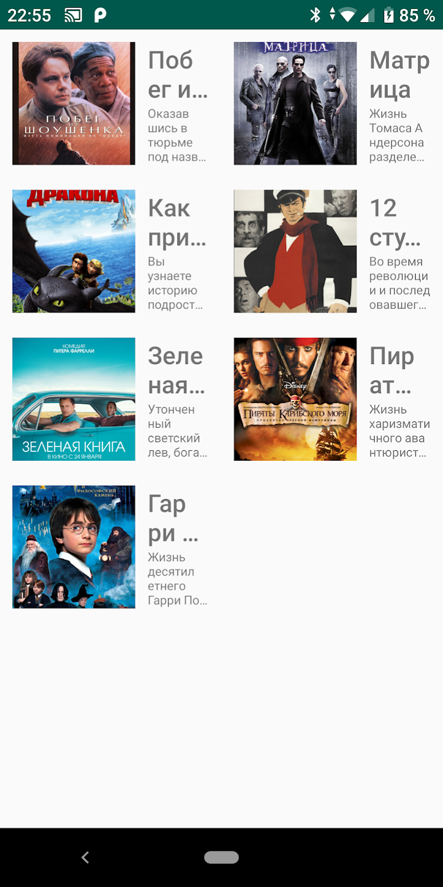

В этом уроке мы научимся создавать и отображать списки элементов при помощи `RecyclerView`.

## Обзор

`RecyclerView` - это `View` которое может отображать множество элементов в виде списка. Может прокручиваться для просмотра элементов не вошедших на один экран. Ячейки списка ушедшие за пределы экрана переиспользуются для отображения следующих элементов.


## Использование RecyclerView

Для того, что бы начать использовать `RecyclerView`, необходимо добавить зависимость в `build.gradle` файл:

```groovy
dependencies {
...
    compile 'androidx.constraintlayout:constraintlayout:2.0.4'
...
}
```

Добавим компонент `RecyclerView` в наш макет:

```xml
<?xml version="1.0" encoding="utf-8"?>
<androidx.constraintlayout.widget.ConstraintLayout xmlns:android="http://schemas.android.com/apk/res/android"
    xmlns:app="http://schemas.android.com/apk/res-auto"
    xmlns:tools="http://schemas.android.com/tools"
    android:layout_width="match_parent"
    android:layout_height="match_parent"
    tools:context=".MainActivity">

    <androidx.recyclerview.widget.RecyclerView
        android:id="@+id/activity_main__rv_movies"
        android:layout_width="match_parent"
        android:layout_height="match_parent"
        app:layout_constraintBottom_toBottomOf="parent"
        app:layout_constraintEnd_toEndOf="parent"
        app:layout_constraintStart_toStartOf="parent"
        app:layout_constraintTop_toTopOf="parent" />

</androidx.constraintlayout.widget.ConstraintLayout>
```

Запустив проект с такой версткой мы увидим пустой белый экран.
Попробуем отобразить какие-то данные в нашем списке. 

Предположим, что мы хотим сделать приложение-список фильмов. Для начала создадим класс `Movie`, который будет содержать краткую информацию о конкретном фильме.

```kotlin
data class Movie(val name: String, val description: String, val poster: Int)
```

Сущность фильма имеет: имя, описание, изображение. Поле `poster` имеет тип `int` потому что картинка будет взята из ресурсов приложения.

Как будет выглядеть ячейка с нашим фильмом? Давайте сверстаем новый макет: нам необходимо расположить два `TextView` и один `ImageView`.

```xml
<?xml version="1.0" encoding="utf-8"?>
<androidx.constraintlayout.widget.ConstraintLayout xmlns:android="http://schemas.android.com/apk/res/android"
    xmlns:app="http://schemas.android.com/apk/res-auto"
    xmlns:tools="http://schemas.android.com/tools"
    android:layout_width="match_parent"
    android:layout_height="wrap_content">

    <androidx.appcompat.widget.AppCompatImageView
        android:id="@+id/movie_item__iv_poster"
        android:layout_width="100dp"
        android:layout_height="100dp"
        android:layout_margin="10dp"
        android:scaleType="centerCrop"
        app:layout_constraintBottom_toBottomOf="parent"
        app:layout_constraintStart_toStartOf="parent"
        app:layout_constraintTop_toTopOf="parent"
        tools:src="@drawable/movie_1" />

    <androidx.appcompat.widget.AppCompatTextView
        android:id="@+id/movie_item__tv_name"
        android:layout_width="0dp"
        android:layout_height="wrap_content"
        android:ellipsize="end"
        android:fontFamily="sans-serif-medium"
        android:maxLines="2"
        android:paddingStart="10dp"
        android:paddingLeft="10dp"
        android:paddingEnd="10dp"
        android:paddingRight="10dp"
        android:textSize="20sp"
        app:layout_constraintBottom_toTopOf="@+id/movie_item__tv_description"
        app:layout_constraintEnd_toEndOf="parent"
        app:layout_constraintStart_toEndOf="@+id/movie_item__iv_poster"
        app:layout_constraintTop_toTopOf="parent"
        app:layout_constraintVertical_chainStyle="packed"
        tools:text="Movie name" />

    <androidx.appcompat.widget.AppCompatTextView
        android:id="@+id/movie_item__tv_description"
        android:layout_width="0dp"
        android:layout_height="wrap_content"
        android:ellipsize="end"
        android:maxLines="4"
        android:paddingStart="10dp"
        android:paddingLeft="10dp"
        android:paddingEnd="10dp"
        android:paddingRight="10dp"
        android:textSize="12sp"
        app:layout_constraintBottom_toBottomOf="parent"
        app:layout_constraintEnd_toEndOf="parent"
        app:layout_constraintStart_toEndOf="@+id/movie_item__iv_poster"
        app:layout_constraintTop_toBottomOf="@+id/movie_item__tv_name"
        tools:text="Movie description" />

</androidx.constraintlayout.widget.ConstraintLayout>
```

Для того что бы сообщить RecyclerView какие данные следует отображать, используется Adapter. Адаптер соединяет данные с представлением. Адаптер, который используется в RecyclerView, должен наследоваться от абстрактного класса RecyclerView.Adapter. Этот класс определяет три метода:

- `onCreateViewHolder`: возвращает объект `ViewHolder`, который будет хранить данные по одному объекту Movie;
- `onBindViewHolder`: выполняет привязку объекта `ViewHolder` к объекту Phone по определенной позиции;
- `getItemCount`: возвращает количество объектов в списке.

Выше мы упомянули `ViewHolder`. `ViewHolder` - это класс, объекты которого, хранят необходимую информацию для отрисовки ячеек списка.

Попробуем написать адаптер для списка фильмов:

```kotlin
class MoviesAdapter(private val movies: List<Movie>) : RecyclerView.Adapter<MovieViewHolder>() {

    override fun onCreateViewHolder(viewGroup: ViewGroup, i: Int): MovieViewHolder {
        val view = LayoutInflater.from(viewGroup.context).inflate(R.layout.movie_item, viewGroup, false)
        return MovieViewHolder(view)
    }

    override fun onBindViewHolder(viewHolder: MovieViewHolder, i: Int) {
        val movie = movies[i]
        viewHolder.bind(movie)
        viewHolder.itemView.tag = movie
    }

    override fun getItemCount(): Int {
        return movies.size
    }

    class MovieViewHolder(itemView: View) : RecyclerView.ViewHolder(itemView) {

        private val nameTextView: TextView = itemView.findViewById(R.id.movie_item__tv_name)
        private val descriptionTextView: TextView = itemView.findViewById(R.id.movie_item__tv_description)
        private val posterImageView: ImageView = itemView.findViewById(R.id.movie_item__iv_poster)

        fun bind(movie: Movie) {
            nameTextView.text = movie.name
            descriptionTextView.text = movie.description
            posterImageView.setImageResource(movie.poster)
        }

    }
}
```

Теперь свяжем адаптер со списком:
```kotlin
private val moviesAdapter = MoviesAdapter(movies)

override fun onCreate(savedInstanceState: Bundle?) {
    super.onCreate(savedInstanceState)
    setContentView(R.layout.activity_main)
    val recyclerView = findViewById<RecyclerView>(R.id.activity_main__rv_movies)
    recyclerView.adapter = moviesAdapter
}
```

Запустив приложение, мы снова увидим белый экран. Почему? Нужно подсказать `RecyclerView` как располагать элементы. Для этого вызовем метод `setLayoutManager` и выставим `LinearLayoutManager`.

```kotlin
recyclerView.layoutManager = LinearLayoutManager(this)
```


`LinearLayoutManager` это самой простой способ организации ячеек внутри списка. Вы можете менять менеджер по своему усмотрения, в зависимости от желаемого конечно вида вашего списка. Например, поменяв менеджер на `GridLayoutManager` можно добиться следующего отображения:



Теперь давайте разберемся как добавлять элементы в список. Для этого создадим `FabButton`. Floating action button это круглая кнопка предназначенная для выполнения самого главного действия на этом экране.

```xml
<com.google.android.material.floatingactionbutton.FloatingActionButton
    android:id="@+id/activity_main__fb_add"
    android:layout_width="wrap_content"
    android:layout_height="wrap_content"
    android:layout_margin="20dp"
    android:tint="@android:color/white"
    app:layout_constraintBottom_toBottomOf="parent"
    app:layout_constraintEnd_toEndOf="parent"
    app:srcCompat="@android:drawable/ic_input_add" />
```

## Действия с RecyclerView

Что бы сделать какое-то действие по нажатию на кнопку, нужно добавить `OnClickListener`. Это интерфейс, который имеет единственный метод `onClick`, этот метод будет вызван если пользователь нажимает на кнопку. Сделаем так, что бы по клику в наш список добавлялся новый фильм:

```kotlin
//...
val floatingActionButton = findViewById<FloatingActionButton>(R.id.activity_main__fb_add)
floatingActionButton.setOnClickListener { onAddClick() }
//...
private fun onAddClick() {
    movies.add(generateNewMovie())
    moviesAdapter.notifyDataSetChanged()
}
```


А теперь давайте сделаем так, что бы наши ячейки были тоже кликабельными. Для этого добавим лисенер для строк списка. Пускай по клику на строку появится короткое сообщение с названием выбранного фильма:

```kotlin
class MoviesAdapter(
        private val movies: List<Movie>,
        private val onMovieClickListener: Listener,
) : RecyclerView.Adapter<MovieViewHolder>() {

    override fun onCreateViewHolder(viewGroup: ViewGroup, i: Int): MovieViewHolder {
        val view = LayoutInflater.from(viewGroup.context).inflate(R.layout.movie_item, viewGroup, false)
        view.setOnClickListener { v: View -> onMovieClickListener.onMovieClick(v.tag as Movie) }
        return MovieViewHolder(view)
    }

    override fun onBindViewHolder(viewHolder: MovieViewHolder, i: Int) {
        val movie = movies[i]
        viewHolder.bind(movie)
        viewHolder.itemView.tag = movie
    }

    override fun getItemCount(): Int {
        return movies.size
    }

    class MovieViewHolder(itemView: View) : RecyclerView.ViewHolder(itemView) {

        private val nameTextView: TextView = itemView.findViewById(R.id.movie_item__tv_name)
        private val descriptionTextView: TextView = itemView.findViewById(R.id.movie_item__tv_description)
        private val posterImageView: ImageView = itemView.findViewById(R.id.movie_item__iv_poster)

        fun bind(movie: Movie) {
            nameTextView.text = movie.name
            descriptionTextView.text = movie.description
            posterImageView.setImageResource(movie.poster)
        }

    }

    interface Listener {
        fun onMovieClick(movie: Movie)
    }
}
```

```kotlin
//...
private val moviesAdapter = MoviesAdapter(movies, this)
//...
override fun onMovieClick(movie: Movie) {
    Toast.makeText(this, movie.name, Toast.LENGTH_SHORT).show()
}
```


Полный исходный код можно посмотреть [тут](https://github.com/polis-mail-ru/2021-android-recyclerview-sample)

## Что почитать

- [https://developer.android.com/guide/topics/ui/layout/recyclerview](https://developer.android.com/guide/topics/ui/layout/recyclerview)