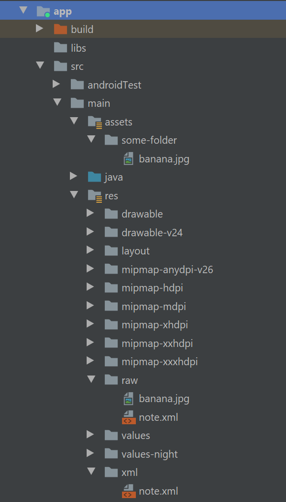
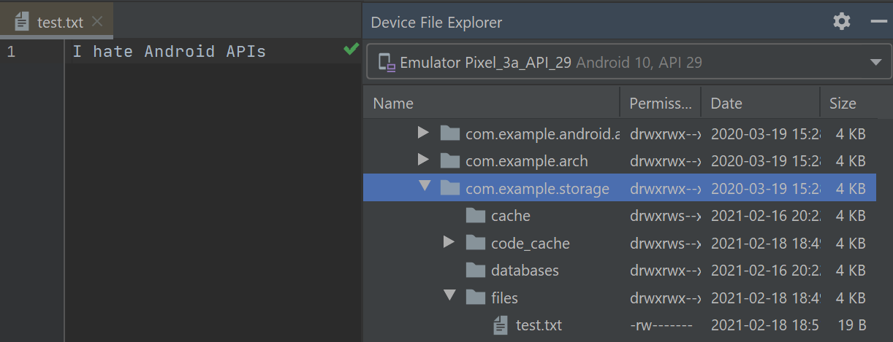
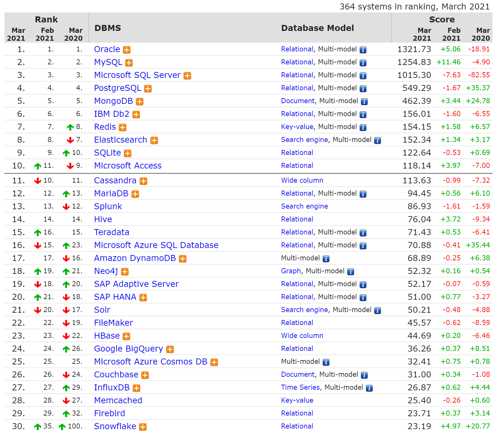

class: center, middle

# Data and file storage in Android

Dmitry Melnikov

---

## Problems

### Store data in files (read/write)

logs, cache, images, serialized objects, etc…

### Store simple data in key-value storages

user data, preferences

### Store structured data in databases

app data

---

## Questions to Android

What are the sources to read from?

What are the destinations to write to?

What Android SDK suggests as typical ways to store data?

What about data exchange between apps? 

---

## Android Storage

#### App-specific

Store files that are meant for your app's use only, either in dedicated directories within an internal storage volume or different dedicated directories within external storage. Use the directories within internal storage to save sensitive information that other apps shouldn't access.

#### Shared

Store files that your app intends to share with other apps, including media, documents, and other files.

#### Preferences

Store private, primitive data in key-value pairs.

#### Databases

Store structured data in a private database using the Room persistence library.

---

## Storages by Location

Embedded (in apk)

Internal

External

## Storages by Type

Files

Key-value storages

Databases (SQLite)

---

## Embedded Storage

.left-half[

### App Resources

Resources are the additional files and static content that your code uses, such as bitmaps, layout definitions, user interface strings, animation instructions, and more.

]

.right-half[ 



]

???

You should always externalize app resources such as images and strings from your code, so that you can maintain them independently. You should also provide alternative resources for specific device configurations, by grouping them in specially-named resource directories. At runtime, Android uses the appropriate resource based on the current configuration. For example, you might want to provide a different UI layout depending on the screen size or different strings depending on the language setting.

Once you externalize your app resources, you can access them using resource IDs that are generated in your project's R class. This document shows you how to group your resources in your Android project and provide alternative resources for specific device configurations, and then access them from your app code or other XML files.

---

## App Resources

### `raw/`

Arbitrary files to save in their raw form. To open these resources with a raw `InputStream`, call `Resources.openRawResource()` with the resource ID, which is `R.raw.filename`.

However, if you need access to original file names and file hierarchy, you might consider saving some resources in the `assets/` directory (instead of `res/raw/`). Files in `assets/` aren't given a resource ID, so you can read them only using `AssetManager`.

```kotlin
private fun readRawResource() {
    val inputStream = resources.openRawResource(R.raw.note)
    tvHello.text = inputStream
            .bufferedReader()
            .use { bufferedReader -> bufferedReader.readText() }

}
```

_read only_

---

## App Resources

### `xml/`


Arbitrary XML files that can be read at runtime by calling `Resources.getXML()`. Various XML configuration files must be saved here, such as a searchable configuration.

```kotlin
private fun readXmlResource() {
    val stringBuilder = StringBuilder()
    val parser = resources.getXml(R.xml.note)
    parser.next()
    var eventType = parser.eventType
    while (eventType != XmlResourceParser.END_DOCUMENT) {
        if (eventType == XmlResourceParser.TEXT) {
            stringBuilder.append(parser.text).append("\n")
        }
        eventType = parser.next()
    }
    tvHello.text = stringBuilder.toString()
}
```

_read only_

---

## App Resources

### `xml/`

`resources.getXml(R.xml.note)` will return an XmlResourceParser, which implements the XmlPullParser interface

Like SAX, the `XmlPullParser` is an event-driven interface, compared to the DOM that builds up a complete data structure and hands you that result. Unlike SAX, which relies on a listener and callback methods, the XmlPullParser has you pull events off a queue, ignoring those you do not need and dispatching the rest as you see fit to the rest of your code.

The primary reason the `XmlPullParser` was put into Android was for XML-encoded resources. While you write plain-text XML during development, what is packaged in your APK file is a so-called “binary XML” format, where angle brackets and quotation marks and such are replaced by bitfields. This helps compression a bit, but mostly this conversion is done to speed up parsing. Android’s XML resource parser can parse this “binary XML” approximately **ten times faster** than it can parse the equivalent plain-text XML. Hence, anything you put in an XML resource (res/ xml/) will be parsed similarly quickly.

---

## Assets

Keep folder structure

```kotlin
val inputStream = assets.open("web-folder/index.html")
```

One benefit of using assets over raw resources is the `file:///android_asset/` Uri prefix. You can use this to load an asset into a WebView. For example, for an asset located in assets/foo/index.html within your project, calling loadUrl("file:///android_asset/foo/index.html") will load that HTML into the WebView.

Assets are compressed when the APK is packaged.

_read only_

---

## File Storage

Android inherits API from java to access files

### java.io.*

### java.nio.*

Should be simple, isn't it?

???

On the whole, Android just uses normal Java file I/O for local files. You will use the same File and InputStream and OutputWriter and other classes that you have used time and again in your prior Java development work.

What is distinctive in Android is where you read and write. Akin to writing a Java Web app, you do not have read and write access to arbitrary locations. Instead, there are only a handful of directories to which you have any access, particularly when running on production hardware.

---

### Internal vs External

Internal storage refers to your application’s portion of the on-board, always-available flash storage.

External storage refers to storage space that can be mounted by the user as a drive in Windows (or, possibly with some difficulty, as a volume in macOS or Linux). Typically, this too is part of the on-board flash, but could be a card too.

### Standard vs Cache

On both internal and external storage, you have the option of saving files as a cache, or on a more permanent basis. Files located in a cache directory may be deleted by the OS or third-party apps to free up storage space for the user. Files located outside of cache will remain unless manually deleted.

### Yours vs Somebody Else’s

Internal storage is on a per-application basis. Files on external storage, though, are visible to all applications and the user.

???

Files you write to in your own internal storage cannot be read or written to by other applications… normally. Users who “root” their phones can run apps with superuser privileges and be able to access your internal storage. Most users do not root their phones, and so only your app will be able to access your internal storage files.

Anyone can read anything stored on an external storage, and any application that requests to can write or delete anything it wants.

---

## Working with Internal Storage

```kotlin
private fun writeFileToInternal() {
    Log.d(tag, filesDir.absolutePath)
    // outputs: /data/user/0/com.example.storage/files
    
    Log.d(tag, cacheDir.absolutePath)
    // outputs: /data/user/0/com.example.storage/cache
    
    Log.d(tag, dataDir.absolutePath) // API 24
    // outputs: /data/user/0/com.example.storage
    
    Log.d(tag, getDatabasePath("database.db").absolutePath)
    // outputs: /data/user/0/com.example.storage/databases/database.db
    
    File(filesDir, "test.txt").writeText("I hate Android APIs")
}
```



---

## Working with External Storage

Like internal storage, external storage can be used with ordinary Java file I/O. What differs is where you can read or write. And, compared to
internal storage, what differs is whether you are allowed to read or write.

```kotlin
Log.d(tag, getExternalFilesDir(null)?.absolutePath ?: error(""))
// outputs: /storage/emulated/0/Android/data/com.example.storage/files
```

This will give you a File object pointing to an automatically-created
directory on external storage, unique for your application. While not secure against other applications, it does have one big advantage: when your application is uninstalled, these files are automatically deleted, just like the ones in the application-local file area.

### Also Useful

- `externalCacheDir` - for temporarily files
- `Environment.getExternalStoragePublicDirectory(Environment.DIRECTORY_DOWNLOADS)`
- `Environment.getExternalStorageState()`
- `Environment.isExternalStorageRemovable()`
- `Environment.isExternalStorageEmulated()`
- `MediaScannerConnection.scanFile(this, paths, null, null)`

---

## Permissions

### Prior to Android 4.4 (API 19) 

If you want to write to external storage, you need to hold the WRITE_EXTERNAL_STORAGE permission

### Android 4.4 (API 19) and up

- To read or write in the directory trees rooted at `getExternalFilesDir()` and `getExternalCacheDir()` you don't need a permission
- To write to anywhere else on external storage, you need WRITE_EXTERNAL_STORAGE
- To read from anywhere else on external storage, you need either WRITE_EXTERNAL_STORAGE (if you already have that) or READ_EXTERNAL_STORAGE (if not)

```xml
<?xml version="1.0" encoding="utf-8"?>
<manifest xmlns:android="http://schemas.android.com/apk/res/android"
          package="com.example.storage">
    <uses-permission android:name="android.permission.WRITE_EXTERNAL_STORAGE" />
    <uses-permission android:name="android.permission.READ_EXTERNAL_STORAGE" />
    …
</manifest>
```

---

## Permissions

### Android 6.o (API 23) and up

`WRITE_EXTERNAL_STORAGE` is one of those dangerous permissions that we have to request at runtime. 

`WRITE_EXTERNAL_STORAGE` for `getExternalFilesDir()` on API Level 19+ devices

### Android 10 (API 29) and up

Scoped storage and Storage Access Framework. Storage is split into Private storage (app only) and Shared storage (media, files). 

- unrestricted access to your own app storage
- unrestricted media and downloads contributions
- runtime permission only gives read access to media
- user confirmation required for modifying media
- location metadata gated by new permission

`android:requestLegacyExternalStorage="true"` (until API 30)

---

### Android 10 (API 29) and up

System tracks what files were created by the app and could be removed after app uninstall.

Pros: access media and files without permission.

Cons: lots of edge cases (like delete or change files other apps created) and extra file copies. See references for the details.

---

### Android 11 (API 30) an up

- enabled File Path APIs
- bulk media modification APIs
- all files access
- private app storage

`WRITE_EXTERNAL_STORAGE` permission doesn't have any effect on your app's access to storage. Android rely more on a file's purpose than its location for determining an app's ability to access, and write to, a given file.

Android 11 introduces the `MANAGE_EXTERNAL_STORAGE` permission, which provides write access to files outside the app-specific directory and MediaStore (use cases – anti-virus apps, file managers, backup/restore apps).

`createWriteRequest` and `createDeleteRequest` for several files at once (not owned files).

`createTrashRequest` (recycle bin, 30 day expiration) and `createFavoriteRequest`.

No access to other apps external storage files.

---

## Permissions

Found the person responsible for Android permissions API


---

## Letting the User See Your Files

Your file that you place on external storage will not be indexed automatically simply by creating it and writing to it. Eventually, it will be indexed, though it may be quite some time for an automatic indexing pass to take place.

To force Android to index your file, you can use `scanFile()` on `MediaScannerConnection`:

```kotlin
val paths = arrayOf<String>(pathToYourNewFileOnExternalStorage)
MediaScannerConnection.scanFile(this, paths, null, null)
```

The third parameter to scanFile() is an array of MIME types, to line up with the array of paths in the second parameter. If your file is some form of media, and you know the MIME type, supplying that will ensure that your media will be visible as appropriate to the right apps (e.g., images in the Gallery app). Otherwise, Android will try to infer a MIME type from the file extension.

Android 11 and Media Store APIs does has this feature natively.

---

## Limits on External Storage Open Files

Many Android devices will have a per-process limit of 1024 open files, on any sort of storage. This is usually not a problem for developers.

On some devices — including probably all that are running Android 4.2 and higher — there is a global limit of 1024 open files on external storage. In other words, all running apps combined can only open 1024 files simultaneously on external storage.

This means that it is important for you to minimize how many open files on external storage you have at a time. Having a few open files is perfectly reasonable; having a few hundred open files is not.

---

## Multiple User Accounts

On Android 4.1 and earlier, each Android device was assumed to be used by just one person.

On Android 4.2+ tablets — and Android 5.0+ phones — it is possible for a device’s owner to set up multiple user accounts. Each user gets their own section of internal and external storage for files, databases, SharedPreferences, and so forth. From your standpoint, it is as if the users are really on different devices, even though in reality it is all the same hardware. 

However, this means that paths to internal and external storage now may vary by user. Hence, it is very important for you to use the appropriate methods, outlined in this chapter, for finding locations on internal storage (e.g., `getFilesDir()`) and external storage (e.g., `getExternalFilesDir()`).

---

## Linux Filesystems: You Sync, You Win

Android is built atop a Linux kernel and uses Linux filesystems for holding its files. Classically, Android used YAFFS (Yet Another Flash File System), optimized for use on low-power devices for storing data to flash memory.

YAFFS has one big problem: only one process can write to the filesystem at a time.

Android 3.0 switched to ext4, another Linux filesystem aimed more at desktops/ notebooks. Your applications will not directly perceive the difference. However, ext4 does a fair bit of buffering, and it can cause problems for applications that do not take this buffering into account. Linux application developers ran headlong into this in 2008-2009, when ext4 started to become popular. Android developers will need to think about it now… for your own file storage.

For SQLite, SharedPreferences or java.io.RandomAccessFile in a sync mode it is handled by system. In other cases `fileOutputStream.fd.sync()`

---

## Linux Filesystems: You Sync, You Win

```kotlin
try {
    fileToEdit.parentFile?.mkdirs()
    val fileOutputStream = FileOutputStream(fileToEdit)
    val bufferedWriter = BufferedWriter(OutputStreamWriter(fileOutputStream))
    try {
        bufferedWriter.write(text)
        bufferedWriter.flush()
        fileOutputStream.fd.sync()
    }
    finally {
        bufferedWriter.close()
    }
} catch (e: IOException) {
    Log.e(tag, "Exception writing file", e)
}
```
---

## StrictMode: Avoiding Janky Code

Users are more likely to like your application if, to them, it feels responsive. Here, by “responsive”, I mean that it reacts swiftly and accurately to user operations, like taps and swipes.

Conversely, users are less likely to be happy with you if they perceive that your UI is “janky” — sluggish to respond to their requests. For example, maybe your lists do not scroll as smoothly as they would like, or tapping a button does not yield the immediate results they seek.

There are a few standard sorts of things that developers do, sometimes quite by accident, on the main application thread that will tend to cause sluggishness:
1. Flash I/O, both for internal and external storage
2. Network I/O

```kotlin
StrictMode.enableDefaults()
```

Can be set up to process death penalty for some operations.

---

## Push and Pull for External Storage

You can get at external storage of devices and emulators via the command-line adb tool. This program is in platform-tools/ of your Android SDK installation, and it is a good idea to add that directory to your operating system’s PATH environment variable, so you can run adb from anywhere.

`adb push` and `adb pull` allow you to upload and download files, respectively. Both take the local path and the remote (device/emulator) path as command-line
arguments, although in varying order:

- adb push localpath remotepath will upload the file represented by localpath to the location represented by remotepath
- adb pull remotepath localpath will download the file represented by remotepath to the location represented by localpath

```shell
adb push index.html /sdcard/Download
adb pull /sdcard/Download/intex.html
```

### Run-As

```shell
adb shell run-as your.package.name \ 
  cp /sdcard/Download/index.html /data/data/your.package.name/files
```

---

## Using Files with Implicit Intents

There are ways to open files with default system apps. However, at best, this only works for files on external storage. 

In Android 7.0, the file scheme on a Uri is banned. So use FileProvider

```kotlin
val intent = Intent(Intent.ACTION_VIEW)
val uriForFile = FileProvider.getUriForFile(
        this, 
        "$packageName.provider", 
        File("/sdcard/Download/test.txt")
)
intent.setDataAndType(uriForFile, null)
startActivity(intent)
```

---

## Key-value storages: Shared Preferences

Easy to use

```kotlin
val sharedPref = activity?.getSharedPreferences(
        "prefsFileName", Context.MODE_PRIVATE)
```

```kotlin
// write (apply or commit)
val sharedPref = activity?.getPreferences(
        "prefsFileName", Context.MODE_PRIVATE) ?: return
with (sharedPref.edit()) {
    putInt("someKey", newHighScore)
    apply()
}
```

```kotlin
// read
val sharedPref = activity?.getPreferences(
        "prefsFileName", Context.MODE_PRIVATE) ?: return
val defaultValue = resources.getInteger(R.integer.saved_high_score_default_key)
val highScore = sharedPref.getInt("someKey", defaultValue)
```

---

## Key-value storages: Shared Preferences

.left-half[


]

---

## Key-value API

```kotlin
fun write(key: String, stuff: Any)
fun read(key: String): Any
```

--

Serialization is difficult. Besides, how to handle class changes on app upgrades?

--

Let's simplify it

```kotlin
fun write(key: String, stuff: ByteArray)
fun read(key: String): ByteArray
```

--

What if something happens with flash? You have to add exceptions, but you have to handle them manually in Kotlin.

```kotlin
/**
 * @throws Exception
 */
```

--

Shared preferences are here ↓

```kotlin
fun write(key: String, stuff: ByteArray): Boolean
fun read(key: String): ByteArray
```

---

## Key-value API

If I store preferences relatively often, I don't want to read/write the whole file every time.

```kotlin
fun initializeAndReadAll()
fun writeAsync(key: String, stuff: ByteArray)
fun read(key: String): ByteArray
```

It's what also SharedPreferences does.

--

What if flash is completely full? Or cheap flash fails?

--

In-memory cache masks the failure. 

--

```kotlin
initializeAndReadAll()
writeAsync("someKey", byteArray)
// cheap flash fails
writeAsync("otherKey", otherByteArray)
// In-memory cache saves the day and both write
val res = read("someKey")
```

---

## SharedPreferences cons

Writes to mobile flash will fail. And most of the time no one notices. 

--

Some old `SharedPreferencesImpl` versions just log fails in LogCat.

--

If you use commit, check the return value.

--

Performance issues

--

Code smell: 

- initialization [creates](http://androidxref.com/9.0.0_r3/xref/frameworks/base/core/java/android/app/SharedPreferencesImpl.java#120) a new thread
- when exception occurs empty map is [created](http://androidxref.com/9.0.0_r3/xref/frameworks/base/core/java/android/app/SharedPreferencesImpl.java#181) on fail
- apply with [await](http://androidxref.com/9.0.0_r3/xref/frameworks/base/core/java/android/app/SharedPreferencesImpl.java#453) (activity.onStop() calls finisher and if lots in a queue – ANR)
- …

---

## SharedPreferences resolution

Use SharedPreferences for storing non-critical pieces of data… such as preferences. 

Or 

- use DataStore
- use SQLite (Room/SqlDelight)
- Square's [Tape](https://square.github.io/tape/) is good for offline storage of transaction data
- just use java.io.File for authentication tokens and such
- [Okio](https://square.github.io/okio/) is nice for bigger files, streaming and/or partial reads
- the major image libraries all have great caching layers
- I tried [Binary Preferences](https://github.com/yandextaxitech/binaryprefs) from Yandex

If you like being sad, take a look at the source code for AtomicFile, same issues. 

---

## Key-value storages: DataStore

DataStore is a new and improved data storage solution aimed at replacing SharedPreferences. 

Built on Kotlin coroutines and Flow, DataStore provides two different implementations: Proto DataStore, that lets you store typed objects (backed by [protocol buffers](https://developers.google.com/protocol-buffers)) and Preferences DataStore, that stores key-value pairs. 

Data is stored asynchronously, consistently, and transactionally, overcoming most of the drawbacks of SharedPreferences.

Last update: February 24, 2021 `1.0.0-alpha07`

```kotlin
// create
val dataStore: DataStore<Preferences> = context.createDataStore(
  name = "settings"
)
```

---

## Key-value storages: DataStore


---

## Key-value storages: DataStore

```kotlin
// write
suspend fun dataStoreWrite() {
    val myKey = intPreferencesKey("my_key")
    dataStore.edit { settings ->
        val currentCounterValue = settings[myKey] ?: 0
        settings[myKey] = currentCounterValue + 1
    }
}
```

```kotlin
// read
suspend fun dataStoreRead() {
    val myKey = intPreferencesKey("my_key")
    val prefFlow: Flow<Int> = dataStore.data
            .map { preferences -> preferences[myKey] ?: 0 }
    prefFlow.collect { value: Int -> Log.d(TAG, "storeResult: $value") }
}
```

Sometimes you need a synchronous call:

```kotlin
val exampleData = runBlocking { dataStore.data.first() }
```

Don't forget to handle IOException in coroutines.

SharedPreferences migrations. The same possible for Proto. 

---

## Relational model

Introduced by Edgar F. Codd in 1970

Structured data with relations (rows and columns) + operations with the data

Transactions and [ACID](https://www.ibm.com/support/knowledgecenter/en/SSGMCP_5.3.0/com.ibm.cics.ts.productoverview.doc/concepts/acid.html) properties (Atomicity, Consistency, Isolation, Durability)

Constraints (domain constraints, key integrity, referential integrity)

[Indexes](https://stackoverflow.com/questions/1108/how-does-database-indexing-work) (B-trees)

[Normalization](https://en.wikipedia.org/wiki/Database_normalization)

SQL

Stored procedures and triggers

---

## SQL

create table

insert

update

delete

select

---

## SQLite

Created by D. Richard Hipp in 2000

SQLite is a self-contained, file-based, and fully open-source RDBMS known for its portability, reliability, and strong performance even in low-memory environments. Its transactions are ACID-compliant, even in cases where the system crashes or undergoes a power outage.

Pros: small footprint, user-friendly, portable, in-memory db

When to use: embedded applications, disk access replacement, testing

When not to use: big databases (> 1TB), high write volumes, network access is required

SQLite has 10x more test code than source code: ≈1200 tests vs ≈120 source files, 80 Mb test code vs 8 Mb source code

---

## DB-Engines Ranking



---

## DB-Engines Ranking

.left-half[


]

---

## SQLite vs SharedPreferences

- Fast
- Fully async
- Configurable (WAL)
- Manually written queries
- Migrations
- Overhead to open
- Plumbing to Rx/Flow

---

## SQLite in Android

"Baked into" the Android runtime. Not JDBC, but own API to learn.

### SQLiteOpenHelper

1. Create a database
2. Upgrade a database (change schema)

---

## SQLite usage example

Usage example:

```kotlin
object FeedReaderContract {
    // Table contents are grouped together in an anonymous object.
    object FeedEntry : BaseColumns {
        const val TABLE_NAME = "entry"
        const val COLUMN_NAME_TITLE = "title"
        const val COLUMN_NAME_SUBTITLE = "subtitle"
    }
}
```

```kotlin
private const val SQL_CREATE_ENTRIES =
        "CREATE TABLE ${FeedEntry.TABLE_NAME} (" +
                "${BaseColumns._ID} INTEGER PRIMARY KEY," +
                "${FeedEntry.COLUMN_NAME_TITLE} TEXT," +
                "${FeedEntry.COLUMN_NAME_SUBTITLE} TEXT)"

private const val SQL_DELETE_ENTRIES = 
        "DROP TABLE IF EXISTS ${FeedEntry.TABLE_NAME}"
```

---

### SQLiteOpenHelper

```kotlin
class FeedReaderDbHelper(context: Context): SQLiteOpenHelper(
        context, DATABASE_NAME, null, DATABASE_VERSION
) {
    override fun onCreate(db: SQLiteDatabase) {
        db.execSQL(SQL_CREATE_ENTRIES)
    }
    override fun onUpgrade(
            db: SQLiteDatabase, 
            oldVersion: Int, 
            newVersion: Int
    ) {
        // This database is only a cache for online data, 
        // so its upgrade policy is to simply to discard the data and start over
        db.execSQL(SQL_DELETE_ENTRIES)
        onCreate(db)
    }
    override fun onDowngrade(
            db: SQLiteDatabase, 
            oldVersion: Int, 
            newVersion: Int
    ) {
        onUpgrade(db, oldVersion, newVersion)
    }
    companion object {
        // If you change the database schema, 
        // you must increment the database version.
        const val DATABASE_VERSION = 1
        const val DATABASE_NAME = "FeedReader.db"
    }
}
```

---

## Put info into a database 

```kotlin
// Gets the data repository in write mode
val db = dbHelper.writableDatabase

// Create a new map of values, where column names are the keys
val values = ContentValues().apply {
    put(FeedEntry.COLUMN_NAME_TITLE, title)
    put(FeedEntry.COLUMN_NAME_SUBTITLE, subtitle)
}

// Insert the new row, returning the primary key value of the new row
val newRowId = db?.insert(FeedEntry.TABLE_NAME, null, values)
```

```kotlin
try {
    db?.beginTransaction();
    // several SQL statements in here
    db?.setTransactionSuccessful();
} finally {
    db?.endTransaction();
}

```

---

## Read info from a database 

```kotlin
val db = dbHelper.readableDatabase

// Define a projection that specifies which columns from the database
// you will actually use after this query.
val projection = arrayOf(
        BaseColumns._ID, 
        FeedEntry.COLUMN_NAME_TITLE, 
        FeedEntry.COLUMN_NAME_SUBTITLE
)

// Filter results WHERE "title" = 'My Title'
val selection = "${FeedEntry.COLUMN_NAME_TITLE} = ?"
val selectionArgs = arrayOf("My Title")

// How you want the results sorted in the resulting Cursor
val sortOrder = "${FeedEntry.COLUMN_NAME_SUBTITLE} DESC"

val cursor = db.query(
        FeedEntry.TABLE_NAME,   // The table to query
        projection,             // The array of columns to return 
                                // (pass null to get all)
        selection,              // The columns for the WHERE clause
        selectionArgs,          // The values for the WHERE clause
        null,                   // don't group the rows
        null,                   // don't filter by row groups
        sortOrder               // The sort order
)
```

---

## Other actions with a database

### Iterate a query

```kotlin
val itemIds = mutableListOf<Long>()
with(cursor) {
    while (moveToNext()) {
        val itemId = getLong(getColumnIndexOrThrow(BaseColumns._ID))
        itemIds.add(itemId)
    }
}
```

Don't forget to close cursor

### Delete info

```kotlin
// Define 'where' part of query.
val selection = "${FeedEntry.COLUMN_NAME_TITLE} LIKE ?"
// Specify arguments in placeholder order.
val selectionArgs = arrayOf("MyTitle")
// Issue SQL statement.
val deletedRows = db.delete(FeedEntry.TABLE_NAME, selection, selectionArgs)
```

---

## Android recommendation

Although these APIs are powerful, they are fairly low-level and require a great deal of time and effort to use:

- There is no compile-time verification of raw SQL queries. As your data graph changes, you need to update the affected SQL queries manually. This process can be time consuming and error prone.
- You need to use lots of boilerplate code to convert between SQL queries and data objects.

For these reasons, we highly recommended using the Room Persistence Library as an abstraction layer for accessing information in your app's SQLite databases.

---

## ORMs

- greenDAO
- DBFlow
- ORMLite
- Sugar ORM

With ORMs you usually do not mess with SQL at all. 

**Room** is like ORM, but it's built around SQL and it's from Google, it's official and recommended.

Roughly speaking, your use of Room is divided into three sets of classes:
1. Entities, which are POJOs that model the data you are transferring into and
   out of the database
2. The data access object (DAO), that provides the description of the API
   that you want for working with certain entities
3. The database, which ties together all of the entities and DAOs for a single
   SQLite database
   
---

## Room

```kotlin
@Entity(tableName = "users")
public class User {

    @PrimaryKey
    @ColumnInfo(name = "userid")
    private String mId;

    @ColumnInfo(name = "username")
    private String mUserName;

    @ColumnInfo(name = "last_update")
    private Date mDate;

    @Ignore
    public User(String userName) {
        mId = UUID.randomUUID().toString();
        mUserName = userName;
        mDate = new Date(System.currentTimeMillis());
    }

    public User(String id, String userName, Date date) {
        this.mId = id;
        this.mUserName = userName;
        this.mDate = date;
    }
...
}
```

---

## Room

Entity 

```kotlin
@Query(“SELECT * FROM Users”)
List<User> getUsers();
```

Dao 

```kotlin
@Database(entities = {User.class}, version = 2)
@TypeConverters(DateConverter.class)
public abstract class UsersDatabase extends RoomDatabase {

    private static UsersDatabase INSTANCE;

    public abstract UserDao userDao();
```

---

## Room

Migration

```kotlin
static final Migration MIGRATION_1_2 = new Migration(1, 2) {
    @Override
    public void migrate(SupportSQLiteDatabase database) {
// Since we didn't alter the table, there's nothing else to do here.
    }
};
```

Database

```kotlin
database = Room.databaseBuilder(context.getApplicationContext(),
        UsersDatabase.class, "Sample.db")
        .addMigrations(MIGRATION_1_2)
        .build();
```

---

## Room

You can manipulate your data in different ways

```kotlin
@Dao
interface UserDao {
    @Insert
    fun insertAll(vararg users: User)

    @Delete
    fun delete(user: User)

    @Query("SELECT * FROM user")
    fun getAll(): List<User>

    @Insert(onConflict = OnConflictStrategy.REPLACE)
    fun insertUsers(vararg users: User)

    @Insert
    fun insertBothUsers(user1: User, user2: User)

    @Insert
    fun insertUsersAndFriends(user: User, friends: List<User>)
}
```

---

## Room

Return a subset of a table's columns

```kotlin
data class NameTuple(
    @ColumnInfo(name = "first_name") val firstName: String?,
    @ColumnInfo(name = "last_name") val lastName: String?
)

…

@Query("SELECT first_name, last_name FROM user")
fun loadFullName(): List<NameTuple>
```

Pass simple parameters to a query

```kotlin
@Query("SELECT * FROM user WHERE age > :minAge")
fun loadAllUsersOlderThan(minAge: Int): Array<User>

@Query("SELECT * FROM user WHERE age BETWEEN :minAge AND :maxAge")
fun loadAllUsersBetweenAges(minAge: Int, maxAge: Int): Array<User>

@Query("SELECT * FROM user WHERE first_name LIKE :search " +
        "OR last_name LIKE :search")
fun findUserWithName(search: String): List<User>
```

---

## Room

Pass a collection of parameters to a query

```kotlin
@Query("SELECT * FROM user WHERE region IN (:regions)")
fun loadUsersFromRegions(regions: List<String>): List<User>
```

Query multiple tables (joins)

Direct cursor access

Define relationships between objects

Write asynchronous DAO queries (Coroutines, RxJava, Guava)

Create views into a database

Prepopulate from an app asset

Referencing complex data with type converters

---

## SQLDelight

Not Java -> SQL, but SQL -> Java

*.sq files with SQL and named queries

Features: 
- RxJava/Flow
- Immutability
- Type safety
- Compiler errors
- SQLite features
- Multiplatform
- Supports different databases

---

## Room vs SQLDelight 

SQLDelight feels simpler

Can be used both on iOS & Android with Kotlin/Native (Kotlin Multiplatform Mobile). And even on a backend with JVM for different RDBMS (MySQL, PostgreSQL, HSQL, SQLite)

SQLDelight does slightly less. But less is more. 

SQLDelight feels less polished so far (for non Android, non SQLite cases).

## SQLDelight

It generates typesafe kotlin APIs from your SQL statements. It verifies your schema, statements, and migrations at compile-time and provides IDE features like autocomplete and refactoring which make writing and maintaining SQL simple.

---

## SQLDelight

SQL statements in a `.sq` file under `src/main/sqldelight`. Typically the first statement in the SQL file creates a table.

```sql
-- src/main/sqldelight/com/example/sqldelight/hockey/data/Player.sq

CREATE TABLE hockeyPlayer (
  player_number INTEGER NOT NULL,
  full_name TEXT NOT NULL
);

CREATE INDEX hockeyPlayer_full_name ON hockeyPlayer(full_name);

INSERT INTO hockeyPlayer (player_number, full_name)
VALUES (15, 'Ryan Getzlaf');
```

From this SQLDelight (gradle plugin) will generate a `Database` Kotlin class with an associated `Schema` object that can be used to create your database and run your statements on it. Doing this also requires a driver, which SQLDelight provides implementations of `"com.squareup.sqldelight:android-driver:1.4.4"`

```kotlin
val driver: SqlDriver = AndroidSqliteDriver(Database.Schema, context, "test.db")
```

---

## SQLDelight

SQL statements inside a `.sq` file can be labeled to have a typesafe function generated for them available at runtime.

```sql
selectAll:
SELECT *
FROM hockeyPlayer;

insertPlayer:
INSERT INTO hockeyPlayer(player_number, full_name)
VALUES (?, ?);

insertFullPlayerObject:
INSERT INTO hockeyPlayer(player_number, full_name)
VALUES ?;
```
Files with labeled statements in them will have a queries file generated from them that matches the `.sq` file name - putting the above sql into `Player.sq` generates `PlayerQueries.kt`. To get a reference to PlayerQueries you need to wrap the driver we made above:

---

## SQLDelight

```kotlin
// In reality the database and driver above should be created a single time
// and passed around using your favourite dependency injection/service
// locator/singleton pattern.
val database = Database(driver)

val playerQueries: PlayerQueries = database.playerQueries

println(playerQueries.selectAll().executeAsList())
// Prints [HockeyPlayer(15, "Ryan Getzlaf")]

playerQueries.insert(player_number = 10, full_name = "Corey Perry")
println(playerQueries.selectAll().executeAsList())
// Prints [HockeyPlayer(15, "Ryan Getzlaf"), HockeyPlayer(10, "Corey Perry")]

val player = HockeyPlayer(10, "Ronald McDonald")
playerQueries.insertFullPlayerObject(player)
```

---

## SQLDelight

Projections (mapper)

Arguments

- Bind Args
- Type Inference (SQLDelight will infer the correct type and nullability of runtime parameters, including custom column types)
- Named Arguments
- Variable Arguments (IN ?)
- Insert full obj
```sql
insertPlayer:
INSERT INTO hockeyPlayer VALUES ?;
```

Types

- SQLite Types
- Custom Column Types (split coma separated value to list of strings)
- Enums

Transactions (API, Rollback, Callbacks)

RxJava/Coroutines extensions

---

## Cloud databases

### Firebase Realtime Database

It's a cloud-hosted database. Data is stored as JSON and synchronized in realtime to every connected client. All clients share one Realtime Database instance and automatically receive updates with the newest data.

- reasonably simple
- quick start
- realtime
- offline

### Firestore

- more sophisticated (document DB, like MongoDB)
- transactions
- powerful sorting and filtering
- scalable

---

## Firebase Realtime Database

### Setup

```kotlin
private DatabaseReference database;
// ...
database = FirebaseDatabase.getInstance().getReference();
```

```kotlin
private DatabaseReference database;
// ...
database = FirebaseDatabase.getInstance().getReference();
```

```kotlin
@IgnoreExtraProperties
data class User(val username: String? = null, val email: String? = null) {
    // Null default values create a no-argument default constructor, 
    // which is needed for deserialization from a DataSnapshot.
}
```

---

## Firebase Realtime Database

### Write data

```kotlin
fun writeNewUser(userId: String, name: String, email: String) {
    val user = User(name, email)
    database.child("users").child(userId).setValue(user)
}
```

```kotlin
database.child("users").child(userId).child("username").setValue(name)
```

---

## Firebase Realtime Database

### Read data

```kotlin
val postListener = object : ValueEventListener {
    override fun onDataChange(dataSnapshot: DataSnapshot) {
        // Get Post object and use the values to update the UI
        val post = dataSnapshot.getValue<Post>()
        // ...
    }

    override fun onCancelled(databaseError: DatabaseError) {
        // Getting Post failed, log a message
        Log.w(TAG, "loadPost:onCancelled", databaseError.toException())
    }
}
postReference.addValueEventListener(postListener)
```

Read once using `get()`

```kotlin
mDatabase.child("users").child(userId).get().addOnSuccessListener {
    Log.i("firebase", "Got value ${it.value}")
}.addOnFailureListener{
    Log.e("firebase", "Error getting data", it)
}
```

---

# References 1

App data and files [https://developer.android.com/guide/topics/data](https://developer.android.com/guide/topics/data)

Data and file storage overview [https://developer.android.com/training/data-storage](https://developer.android.com/training/data-storage)

App resources overview [https://developer.android.com/guide/topics/resources/providing-resources](https://developer.android.com/guide/topics/resources/providing-resources)

The Busy Coder’s Guide to Android Development, Mark Murphy [https://commonsware.com/Android/](https://commonsware.com/Android/)

https://www.baeldung.com/kotlin/category/kotlin-io

https://developer.android.com/training/data-storage/manage-all-files

The Death of External Storage [https://commonsware.com/blog/2019/06/07/death-external-storage-end-saga.html](https://commonsware.com/blog/2019/06/07/death-external-storage-end-saga.html)

Scoped Storage Stories: SAF Basics [https://commonsware.com/blog/2019/10/19/scoped-storage-stories-saf-basics.html](https://commonsware.com/blog/2019/10/19/scoped-storage-stories-saf-basics.html)

---

# References 2

Scoped Storage in Android in a Nutshell [https://www.youtube.com/watch?v=TkOzcyzH1hU](https://www.youtube.com/watch?v=TkOzcyzH1hU)

Preparing for scoped storage (Android Dev Summit '19) [https://www.youtube.com/watch?v=UnJ3amzJM94](https://www.youtube.com/watch?v=UnJ3amzJM94)

Storage updates in Android 11 [https://developer.android.com/about/versions/11/privacy/storage](https://developer.android.com/about/versions/11/privacy/storage)

Storage access with Android 11 [https://www.youtube.com/watch?v=RjyYCUW-9tY](https://www.youtube.com/watch?v=RjyYCUW-9tY)

Scoped Storage Tutorial for Android 11: Deep Dive [https://www.raywenderlich.com/10768834-scoped-storage-tutorial-for-android-11-deep-dive](https://www.raywenderlich.com/10768834-scoped-storage-tutorial-for-android-11-deep-dive)

Android Scoped Storage Demystified [https://medium.com/better-programming/android-scoped-storage-demystified-3024a062ba24](https://medium.com/better-programming/android-scoped-storage-demystified-3024a062ba24)

Save key-value data [https://developer.android.com/training/data-storage/shared-preferences](https://developer.android.com/training/data-storage/shared-preferences)

---

# References 3

The Dangers of SharedPreferences: An API allegory [https://www.youtube.com/watch?v=dyIqM-6CyXY](https://www.youtube.com/watch?v=dyIqM-6CyXY)

Prefer Storing Data with Jetpack DataStore [https://android-developers.googleblog.com/2020/09/prefer-storing-data-with-jetpack.html](https://android-developers.googleblog.com/2020/09/prefer-storing-data-with-jetpack.html)

DataStore guide [https://developer.android.com/topic/libraries/architecture/datastore](https://developer.android.com/topic/libraries/architecture/datastore)

DataStore Tutorial For Android: Getting Started [https://www.raywenderlich.com/18348259-datastore-tutorial-for-android-getting-started](https://www.raywenderlich.com/18348259-datastore-tutorial-for-android-getting-started)

DB-Engines Ranking [https://db-engines.com/en/ranking](https://db-engines.com/en/ranking)

Understanding SQL and NoSQL Databases and Different Database Models [https://www.digitalocean.com/community/tutorials/understanding-sql-and-nosql-databases-and-different-database-models](https://www.digitalocean.com/community/tutorials/understanding-sql-and-nosql-databases-and-different-database-models)

ACID properties of transactions [https://www.ibm.com/support/knowledgecenter/en/SSGMCP_5.3.0/com.ibm.cics.ts.productoverview.doc/concepts/acid.html](https://www.ibm.com/support/knowledgecenter/en/SSGMCP_5.3.0/com.ibm.cics.ts.productoverview.doc/concepts/acid.html)

---

# References 4

How does database indexing work? [https://stackoverflow.com/questions/1108/how-does-database-indexing-work](https://stackoverflow.com/questions/1108/how-does-database-indexing-work)

SQLite vs MySQL vs PostgreSQL: A Comparison Of Relational Database Management Systems [https://www.digitalocean.com/community/tutorials/sqlite-vs-mysql-vs-postgresql-a-comparison-of-relational-database-management-systems](https://www.digitalocean.com/community/tutorials/sqlite-vs-mysql-vs-postgresql-a-comparison-of-relational-database-management-systems)

Database normalization [https://en.wikipedia.org/wiki/Database_normalization](https://en.wikipedia.org/wiki/Database_normalization)

Save data using SQLite [https://developer.android.com/training/data-storage/sqlite](https://developer.android.com/training/data-storage/sqlite)

KotlinConf 2018 - A Multiplatform Delight by Jake Wharton and Alec Strong [https://www.youtube.com/watch?v=WkIry790PHI](https://www.youtube.com/watch?v=WkIry790PHI)

Save data in a local database using Room [https://developer.android.com/training/data-storage/room](https://developer.android.com/training/data-storage/room)

7 Steps To Room by Florina Muntenescu [https://medium.com/androiddevelopers/7-steps-to-room-27a5fe5f99b2](https://medium.com/androiddevelopers/7-steps-to-room-27a5fe5f99b2)

SQLDelight [https://cashapp.github.io/sqldelight/](https://cashapp.github.io/sqldelight/)

---

# References 5

Realtime database [https://firebase.google.com/docs/database](https://firebase.google.com/docs/database)

Cloud Firestore [https://firebase.google.com/docs/firestore](https://firebase.google.com/docs/firestore)
