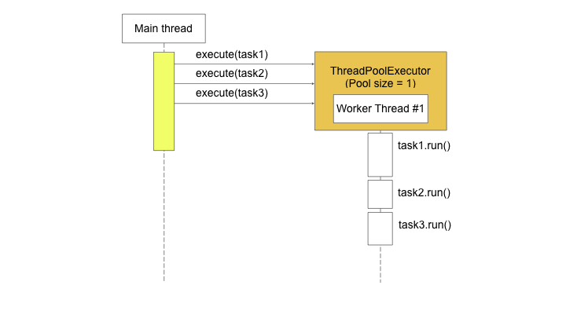
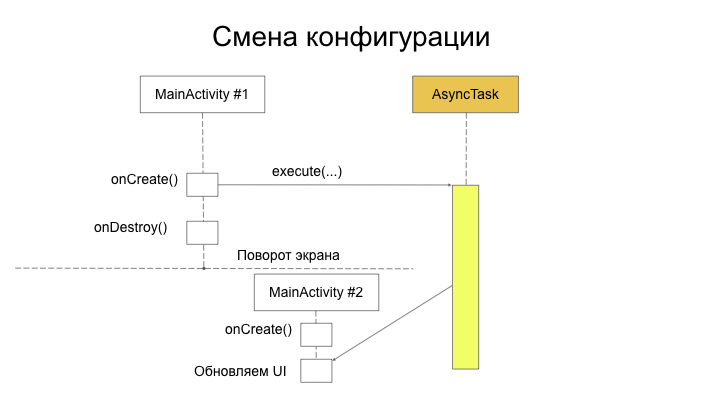

В этом уроке мы узнаем, что такое Executor, AsyncTask и AsyncTaskLoader.

## Executor

`Android SDK` включает в себя пакет [java.util.concurrent](https://developer.android.com/reference/java/util/concurrent/package-summary).
Это один из базовых пакетов, содержащий `примитивы`, необходимые для эффективного программирования в конкурентной среде - многопоточном `окружении`.

В частности, этот пакет содержит `интерфейс` [Executor](https://developer.android.com/reference/java/util/concurrent/Executor.html), на котором базируются классы, поддерживающие выполнение фоновых задач.

Класс [ThreadPoolExecutor](https://developer.android.com/reference/java/util/concurrent/ThreadPoolExecutor.html) выполняет задачи, используя (как это видно из названия) пул фоновых потоков. Размер пула может быть разным и, в общем случае, он не ограничен `сверху`. Вырожденным случаем является пул, состоящий из одного потока.

```java
    ...

    // Создаём ThreadPoolExecutor с пулом из 3 потоков
    final Executor executor = Executors.newFixedThreadPool(3);

    // А вот так делать не надо
    final Executor nosenseExecutor = Executors.newFixedThreadPool(0);

    ...    
```

Загружаем картинку из сети:

```java
public class MainActivity extends AppCompatActivity {
    ...

    final Executor executor;

    @Override
    protected void onCreate(Bundle savedInstanceState) {
        super.onCreate(savedInstanceState);
        setContentView(R.layout.activity_main);

        final ImageView imageView = findViewById(R.id.image_view);

        executor = Executors.newFixedThreadPool(3);
        executor.execute(() -> {
            // Загружаем картинку из сети
            final Bitmap bitmap = ...

            // Публикуем картинку на главном (UI) потоке, используя для этого
            // специальный метод, определённый в классе Activity
            MainActivity.this.runOnUiThread(() -> {
                imageView.setImageBitmap(bitmap);
            });
        });
    }
    
    ...
}
```

Диаграмма последовательности (`sequence diagram`) для `ThreadPoolExecutor` с пулом, состоящим из одного потока, будет выглядеть следующим образом:



А вот диаграмма последовательности (`sequence diagram`) для `ThreadPoolExecutor` с пулом, состоящим из трёх потоков:


Понятны основные достоинство класса ThreadPoolExecutor:

- переиспользование уже 'готовых' потоков для выполнения задач, вместо создания новых, поскольку создание потока - это достаточно дорогостоящая операция
- 'одновременное' выполнение задач, количество которых совпадает с размером пула

В общем случае, ThreadPoolExecutor не гарантирует порядок выполнения задач.

## AsyncTask

На предыдущих уроках ([MessageQueue, Looper, Handler](../043-handler-queue-looper) и [HandlerThread](../044-handler-thread)) мы познакомились с `базовыми механизмами`, которые предлагет `Android SDK` для эффективного взаимодействия между потоками. С прикладной точки зрения эти механизмы не очень удобны в использовании, поскольку требуют от разработчика дополнительных усилиий помимо, собственно, решения поставленной задачи.

Для упрощения жизни программиста `Android SDK` предлагает использовать высокоуровневый `'интерфейс'` взаимодействия между главным (`UI`) потоком и фоновым(и) (`worker`) потокам(и) - класс [AsyncTask](https://developer.android.com/reference/android/os/AsyncTask). 

Класс `AsyncTask` инкапсулирует (скрывает) весь механизм взаимодействия между главным (`UI`) и фоновым потоками.

От разработчика только требуется `аккупатно наполнить смыслом` некоторые методы:

```java
public abstract class AsyncTask<Params, Progress, Result> {
    ...

    /**
     * Runs on the UI thread before {@link #doInBackground}.
     */
    @MainThread
    protected void onPreExecute() {
    }

    /**
     * Override this method to perform a computation on a background thread. The
     * specified parameters are the parameters passed to {@link #execute}
     * by the caller of this task.
     */
    @WorkerThread
    protected abstract Result doInBackground(Params... params);

    /**
     * <p>Runs on the UI thread after {@link #doInBackground}. The
     * specified result is the value returned by {@link #doInBackground}.</p>
     * 
     * <p>This method won't be invoked if the task was cancelled.</p>
     *
     * @param result The result of the operation computed by {@link #doInBackground}.
     */
    @SuppressWarnings({"UnusedDeclaration"})
    @MainThread
    protected void onPostExecute(Result result) {
    }

    ...
}
```
Видно, что для выполнения задачи в фоновом потоке нужно переопределить метод [doInBackground(...)](https://developer.android.com/reference/android/os/AsyncTask.html#doInBackground(Params...)). Методы [onPreExecute()](https://developer.android.com/reference/android/os/AsyncTask.html#onPreExecute()) и [onPostExecute(...)](https://developer.android.com/reference/android/os/AsyncTask.html#onPostExecute(Result)) вызываеются в главном потоке, соответственно, перед и после вызова `doInBackground(...)`.

Необходимо подчеркнуть, что AsyncTask рекомендуется использовать для не продолжительных задач в фоне (порядка нескольких секунд).

Давайте более подробно рассмотрим `AsyncTask` на примерах.

Исходный код примеров демонистрирует использование AsyncTask для выполнения длительных операций в фоновом потоке и доставки результата в главгый (`UI`) поток. В качестве примера длительной опреации выполняется скачивание большого файла при помощи [HttpURLConnection](https://developer.android.com/reference/java/net/HttpURLConnection).

Обратите особое внимание на то, как сохраняется и восстанавливается объект `DownloadFileTask` при смене конфигурации в `InitSplashActivity` - при повороте экрана ранее запущенный таск продолжает выполнение, а результат показывается в новой активности.

### Пример 1

Приложение называется `Example 1` (`AsyncTaskSampleExample1.zip`).

В этом примере скачивание файла происходит в главном (`UI`) потоке: в методе `SplashInitActivity.onCreate()`.

```java
public class InitSplashActivity extends Activity {
    ...

    @Override
    protected void onCreate(Bundle savedInstanceState) {
        Log.d(TAG, "onCreate");
        super.onCreate(savedInstanceState);
        setContentView(R.layout.activity_init_splash);

        titleTextView = (TextView) findViewById(R.id.title_text);
        progressBarView = (ProgressBar) findViewById(R.id.progress_bar);

        titleTextView.setText(R.string.downloading);
        progressBarView.setVisibility(View.VISIBLE);

        try {
            // ВНИМАНИЕ: это очень плохая идея -- выполнять сетевые запросы в основном потоке.
            // Обычно Android просто не дает это сделать -- бросает NetworkOnMainThreadException.
            // Чтобы продемонстировать, как тормозит UI, мы можем выключить проверку потока, которую
            // делает система при выполнении сетевых запросов.
            //
            // Если закоментировать эту строчку, то можно будет увидеть в логах
            // NetworkOnMainThreadException.
            StrictMode.setThreadPolicy(new StrictMode.ThreadPolicy.Builder().permitAll().build());

            downloadFile();
            titleTextView.setText(R.string.done);

        } catch (Exception e) {
            Log.e(TAG, "Error downloading file: " + e, e);
            titleTextView.setText(R.string.error);
        }

        progressBarView.setVisibility(View.INVISIBLE);
    }

    ...
}
```

Это очень плохо!

Даже потребовалось включить специальный режим [StrictMode](https://developer.android.com/reference/android/os/StrictMode) для того, чтобы система в принципе позволила выполнить сетевой запрос (см. комментарий в `SplashInitActivity.onCreate()`). Если запустить, то можно увидеть белый экран - приложение `'висит'`. Если закомментировать `StrictMode`, то приложение завершиться с ошибкой [NetworkOnMainThreadException](https://developer.android.com/reference/android/os/NetworkOnMainThreadException.html).

### Пример 2

Приложение называется `Example 2` (`AsyncTaskSampleExample2.zip`).

В этом примере сделан класс `DownloadFileTask`, в котором происходит скачивание файла в фоновом потоке в методе `doInBackground`. 

```java
    /**
     * Таск, выполняющий скачивание файла в фоновом потоке.
     */
    class DownloadFileTask extends AsyncTask<Void, Void, Integer> {

        /**
         * Скачивание файла в фоновом потоке. Возвращает результат:
         *      0 -- если файл успешно скачался
         *      1 -- если произошла ошибка
         */
        @Override
        protected Integer doInBackground(Void... ignore) {
            try {
                downloadFile();
                return 0;

            } catch (Exception e) {
                Log.e(TAG, "Error downloading file: " + e, e);
                return 1;
            }
        }

        ...
    }
```

Во время скачивания показывается индикатор типа Indeterminate (крутилка) при помощи ProgressBarView. Таск всегда просто запускается в методе onCreate, поэтому при каждом повороте экрана скачивание запускается снова (осторожно, трафик!).

```java
public class InitSplashActivity extends Activity {
    ...

    @Override
    protected void onCreate(Bundle savedInstanceState) {
        Log.d(TAG, "onCreate");
        super.onCreate(savedInstanceState);
        setContentView(R.layout.activity_init_splash);

        titleTextView = (TextView) findViewById(R.id.title_text);
        progressBarView = (ProgressBar) findViewById(R.id.progress_bar);

        titleTextView.setText(R.string.downloading);
        progressBarView.setVisibility(View.VISIBLE);

        new DownloadFileTask().execute();
    }

    ...
}
```

### Пример 3

Приложение называется `Example 3` (`AsyncTaskSampleExample3.zip`).

Индикатор типа `Indeterminate` заменен на индикатор прогресса - этот тот же `ProgressBarView`, но с другим стилем. Используются методы [AsyncTask.publishProgress](https://developer.android.com/reference/android/os/AsyncTask.html#publishProgress(Progress...)) и [AsyncTask.onProgressUpdate](https://developer.android.com/reference/android/os/AsyncTask.html#onProgressUpdate(Progress...)) для отображения прогресса загрузки.

По-прежнему запускается новый таск при каждой смене конфигурации (повороте экрана) -- в логах можно увидеть, как после поворота экрана продолжается выполнение старого таска загрузки, и только после завершения старой загрузки стартует новая загрузка. В интерфейсе это заметно по тому, как останавливаетя прогресс после поворота экрана (в это время выполняется старый таск, но он не связан с новым экраном и не обновляет прогресс), а спустя некоторое время он сбрасывается в начало (это начинает работать новый таск, связанный с текущим экраном).

```java
public class InitSplashActivity extends Activity {
    ...

    @Override
    protected void onCreate(Bundle savedInstanceState) {
        Log.d(TAG, "onCreate");
        super.onCreate(savedInstanceState);
        setContentView(R.layout.activity_init_splash);

        titleTextView = (TextView) findViewById(R.id.title_text);
        progressBarView = (ProgressBar) findViewById(R.id.progress_bar);

        titleTextView.setText(R.string.downloading);

        progressBarView.setProgress(0);
        progressBarView.setMax(100);
        progressBarView.setVisibility(View.VISIBLE);

        new DownloadFileTask().execute();
    }
    
    ...
}
```

### Пример 4

Приложение называется `Example 4` (`AsyncTaskSampleExample4.zip` и `AsyncTaskSampleMaster.zip`).

Это финальный пример. Устранены описанные выше недостатки.

```java
public class InitSplashActivity extends Activity {
    ...

    @Override
    @SuppressWarnings("deprecation")
    protected void onCreate(Bundle savedInstanceState) {
        Log.d(TAG, "onCreate");
        super.onCreate(savedInstanceState);
        setContentView(R.layout.activity_init_splash);

        titleTextView = (TextView) findViewById(R.id.title_text);
        progressBarView = (ProgressBar) findViewById(R.id.progress_bar);

        progressBarView.setMax(100);

        if (savedInstanceState != null) {
            // Пытаемся получить ранее запущенный таск
            downloadTask = (DownloadFileTask) getLastNonConfigurationInstance();
        }
        if (downloadTask == null) {
            // Создаем новый таск, только если не было ранее запущенного таска
            downloadTask = new DownloadFileTask(this);
            downloadTask.execute();
        } else {
            // Передаем в ранее запущенный таск текущий объект Activity
            downloadTask.attachActivity(this);
        }
    }

    ...
}
```

### Замечания

- в упрощённом виде диаграмма последовательности (`sequence diagram`) для `AsyncTask` выгдядит следующим образом:


- в общем случае корректная диаграмма последовательности (`sequence diagram`) для `AsyncTask` выгдядит следующим образом:



- имеет место быть проблема жизненного цикла для класса AsyncTask при не корректной реализации (см. предыдущую диаграмму)

- по умолчанию, `AsyncTask`, использует один фоновый поток для выполнения задач.

### Домашнее задание

[Написать приложение City Cam, которое предлагает пользователю выбрать город из списка и показывает статичное изображение с веб-камеры в выбранном городе](https://github.com/grialnick/homework)

## AsyncTaskLoader (Loader)

Класс [AsyncTaskLoader](https://developer.android.com/reference/android/content/AsyncTaskLoader) решает проблему загрузки данных в фоновом потоке и публикацию результатов в главном (`UI`) потоке процесса.

По сути, `AsyncTaskLoader` предназначен для решения тех же задач, что и рассмотренный нами выше `AsyncTask`.

Необходимо выделить:

- в классе AsyncTaskLoader решена проблема жизненного цикла (см. выше)
- проще в использовании, чем `AsyncTask`
- по умолчанию, `AsyncTaskLoader`, выполняет задачи `на пуле потоков`, т.е. может выполняться несколько задач параллельно
- отсутствие хорошей документации
- также рекомендуется использовать для не продолжительных задач в фоне

## Что почитать

- [Concurrency](https://docs.oracle.com/javase/tutorial/essential/concurrency/index.html)
- [Классика: Java Concurrency In Practice](https://www.ozon.ru/context/detail/id/3174887)
