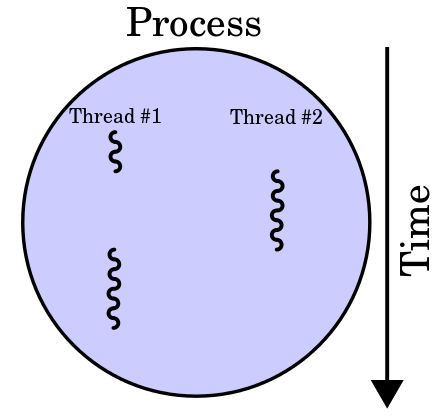
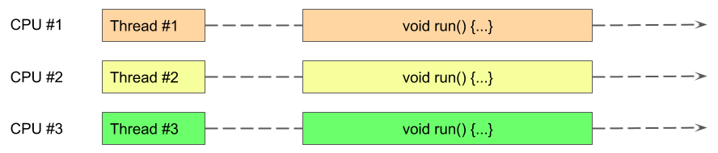
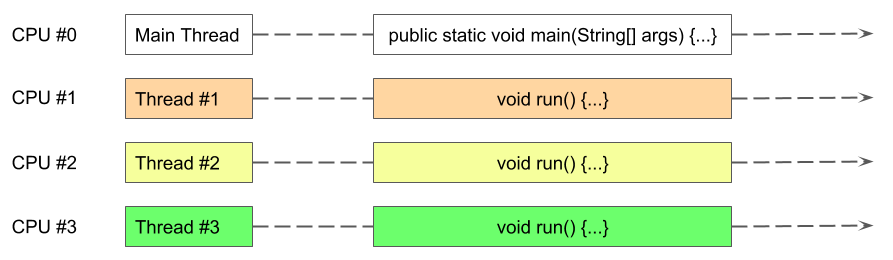

В этом уроке мы узнаем о потоках в `Android`.

##  Потоки

### Обзор

Поток является набором команд исполняемого кода [приложения] (../031_android_processes/index.md), выполняемых последовательно. Каждому потоку, помимо всего прочего, при его создании выделяется память из адресного пространства [процесса] (../031_android_processes/index.md) приложения, которая называется стеком вызовов. Размер стека, как правило, равен ~1Мб.

Каждый поток существует в `рамках` процесса приложения, который его создал.

Память процесса приложения является общей для всех потоков процесса.

Количество потоков в процессе не ограничено (в пределах доступной памяти).

Потоки могут выполняться параллельно (одновременно) на разных процессорах (`CPU`) или ядрах.



Потоку в языке программирования `Java` соответствует экземпляр (instance) класса [Thread] (https://developer.android.com/reference/java/lang/Thread.html).



Для определения текущего потока, в классе [Thread] (https://developer.android.com/reference/java/lang/Thread.html) определён статический метод [currentThread()] (https://developer.android.com/reference/java/lang/Thread.html#currentThread()).

Поток начнёт выполняться `только` после вызова метода [start()] (https://developer.android.com/reference/java/lang/Thread.html#start()) у экземпляра (instance) класса [Thread] (https://developer.android.com/reference/java/lang/Thread.html).

Для того, что бы указать какой код должен исполняться потоком, его необходимо явно передать экземпляру класса `Thread`, например через анонимную имплементацию интерфейса [Runnable] (https://developer.android.com/reference/java/lang/Runnable.html):

```java
    ...

    new Thread(
        new Runnable() {
            @Override
            public void run() {
                // do something
            }
        }).start();

    ...
}
```

или через явную имплементацию интерфейса [Runnable] (https://developer.android.com/reference/java/lang/Runnable.html):

```java
    ...

    public final class ThreadTask implements Runnable {
        // Этот метод будет выполнен в отдельном потоке
        @Override
        public void run() {
            // do something
        }
    }

    final ThreadTask task = new ThreadTask();
    new Thread(task).start();

    ...
}
```

или, иcпользуя новые возможности языка ([Java 8, Android 7.0] (https://docs.oracle.com/javase/8/docs/api/java/util/function/package-summary.html)):

```java
    ...
    
    public final class ThreadTask {
        // Этот метод будет выполнен в отдельном потоке
        public static void doSomething() {
            // ...
        }
    }

    new Thread(() -> {
        // do something
    }).start();

    new Thread(ThreadTask::doSomething).start();

    ...    
}
```

### Главный (основной) поток

При создании [процесса] (../031_android_processes/index.md), `Android` автоматически создаёт `главный` поток (`Main Thread`) процесса и передаёт ему управление.



Основные задачи, возлагаемые на главный поток (`Thread`) процесса:

- отображение графического интерфейса приложения - `UI`, т.е. отрисовка
- обработка пользовательского ввода, т.е. события, приходящие от таких устройств как клавиатура, экран и т.д.

В силу сказанного выше, главный поток процесса иногда называют потоком пользовательского интерфейса или `UI потоком`.

Ещё одной важной задачей, возлагаемой на главный поток, является задача обеспечения жизненного цикла компонентов Android приложения ([Activity] (https://developer.android.com/reference/android/app/Activity.html), [Service] (https://developer.android.com/reference/android/app/Service.html) и т.д.). Всякий раз, когда необходимо создать экземпляр компонента Android приложения ([Activity.onCreate] (https://developer.android.com/reference/android/app/Activity.html#onCreate(android.os.Bundle)), [Service.onCreate] (https://developer.android.com/reference/android/app/Service.html#onCreate()), ...) или передать (диспетчировать) ему какое-либо событие для обработки, используется главный поток.

Пользовательский интерфейс Android приложения (`UI`), главным образом, базируется на классах, которые определены в [android.widget] (https://developer.android.com/reference/android/widget/package-summary.html) и [android.view] (https://developer.android.com/reference/android/view/package-summary.html) - `UI toolkit`.

`UI toolkit` не является потокобезопасным. Другими словами, одновременный доступ из разных потоков к классам из `UI toolkit` не предусмотрен.

Поскольку UI приложения функционирует `в рамках` главного потока, то и все обращения (вызовы) к нему должны `перенаправляться` в этот поток.

Более того, обработка событий в конексте главного потока не должна занимать много времени дабы избежать видимых артефактов: медленное `обновление` графического интерфейса, задержки при обработке пользовательского ввода и т.д.

Android считает главный поток `заблокированным`, если обработка события занимает несколько секунд (как правило 5). В таком случае возникает [ANR] (http://developer.android.com/guide/practices/responsiveness.html).

Вообще, все методы в контексте главного потока должны выполняться в пределах ~16 миллисекунд (для обеспечения частоты обновления графического интерфеса в пределах 60-и кадров в секунду).

### Что нельзя `делать` в главном (основном) потоке

В главном потоке нельзя:

- выполнять операции с файлами
- выполнять сетевые запросы
- выполнять операции с базами данных (основа - файлы)
- выполнять любые длительные операции, например: сложные математические расчёты, декодирование графических изображений и т.д.
- `явно` выполнять вызовы ожидания, например: [Thread.sleep] (https://developer.android.com/reference/java/lang/Thread.html#sleep(long,%20int)) и т.д.

## Что почитать

- [Keeping your app responsive] (https://developer.android.com/training/articles/perf-anr)
