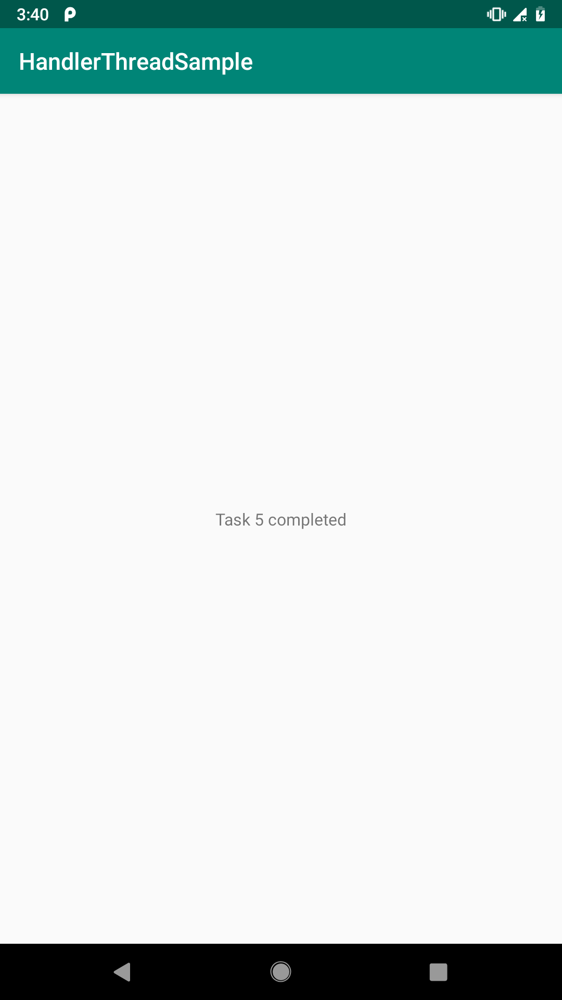

В этом уроке мы узнаем, что такое HandlerThread.

## Фоновый (worker) поток

Напишем небольшое приложение, которое будет выполнять (условно) задачи в потоке, не являющимся главным, или, как говорят - в фоновом (`worker`) потоке.

При этом будем инициировать выполнение задачи в главном (`UI`) потоке нашего приложения и в нём же будем отображать результат.

Для взаимодействия между потоками будем использовать [Handler] (https://developer.android.com/reference/android/os/Handler.html).

Приложение называется `HandlerThreadSample` (`HandlerThreadSample.zip`).

Создадим `Activity` и в его методе `onCreate()` (вызывается в главном или `UI` потоке) инициируем выполнение задач в фоновом потоке:

```java
public class MainActivity extends AppCompatActivity {

    private final Handler handler = new Handler(Looper.getMainLooper()) {
        // Вызывается в главном потоке
        @Override
        public void handleMessage(Message msg) {
            super.handleMessage(msg);
            // Отображает результат
            text.setText((String) msg.obj);
        }
    };

    private TextView text;
    // Наш фоновый поток для выполнения задач
    private SimpleWorker worker;

    @Override
    protected void onCreate(Bundle savedInstanceState) {
        super.onCreate(savedInstanceState);
        setContentView(R.layout.activity_main);

        // Инциализируем текстовое поле для вывода результата
        text = findViewById(R.id.text);

        // Создаём фоновый поток
        worker = new SimpleWorker();

        // Инициируем выполнение задач в фоновом потоке
        worker.execute(
            new Runnable() {
                // Вызывается в фоновом потоке
                @Override
                public void run() {
                    try {
                        Thread.sleep(5000);
                    } catch (InterruptedException e) {
                        e.printStackTrace();
                    }
                    // Передаём результат в главный (UI) поток через handler
                    Message message = Message.obtain();
                    message.obj = "Task 1 completed";
                    handler.sendMessage(message);
                }
        }).execute(
            new Runnable() {
                // Вызывается в фоновом потоке
                @Override
                public void run() {
                    try {
                        Thread.sleep(1000);
                    } catch (InterruptedException e) {
                        e.printStackTrace();
                    }
                    // Передаём результат в главный (UI) поток через handler
                    Message message = Message.obtain();
                    message.obj = "Task 2 completed";
                    handler.sendMessage(message);
                }
        }).execute(
            new Runnable() {
                // Вызывается в фоновом потоке
                @Override
                public void run() {
                    try {
                        Thread.sleep(1000);
                    } catch (InterruptedException e) {
                        e.printStackTrace();
                    }
                    // Передаём результат в главный (UI) поток через handler
                    Message message = Message.obtain();
                    message.obj = "Task 3 completed";
                    handler.sendMessage(message);
                }
        }).execute(
            new Runnable() {
                // Вызывается в фоновом потоке
                @Override
                public void run() {
                    try {
                        Thread.sleep(1000);
                    } catch (InterruptedException e) {
                        e.printStackTrace();
                    }
                    // Передаём результат в главный (UI) поток через handler
                    Message message = Message.obtain();
                    message.obj = "Task 4 completed";
                    handler.sendMessage(message);
                }
        }).execute(
            new Runnable() {
                // Вызывается в фоновом потоке
                @Override
                public void run() {
                    try {
                        Thread.sleep(1000);
                    } catch (InterruptedException e) {
                        e.printStackTrace();
                    }
                    // Передаём результат в главный (UI) поток через handler
                    Message message = Message.obtain();
                    message.obj = "Task 5 completed";
                    handler.sendMessage(message);
                }
        });
    }
}
```

Теперь реализуем наш фоновый поток:

```java
public class SimpleWorker extends Thread {
    private static final String TAG = "SimpleWorker";

    // Флаг завершения потока
    private final AtomicBoolean isAlive = new AtomicBoolean(true);

    // Очередь из задач
    // Используется потокобезопасная реализация очереди,
    // поскольку доступ к ней осуществляется из разных потоков
    private final ConcurrentLinkedQueue<Runnable> queue = new ConcurrentLinkedQueue<>();

    public SimpleWorker() {
        super(TAG);
        // Сразу же стартуем поток
        start();
    }

    @Override
    public void run() {
        // Выполняем бесконечный цикл выборки сообщений до тех пор,
        // пока не будет вызван метод quit()
        while (isAlive.get()) {
            Runnable task = queue.poll();
            if (task != null) {
                // Выполняем задачу (диспетчируем сообщение)
                task.run();
            }
        }
        // Был вызван метод quit() - завершаем выполнение потока
        Log.d(TAG, "Simple Worker Terminated");
    }

    // Инициируем выполнение задачи (постановкой в очередь)
    public SimpleWorker execute(Runnable task) {
        queue.add(task);
        return this;
    }

    // Просим завершить работу
    public void quit() {
        isAlive.set(false);
    }
}
```

Запустив приложение можно убедиться, что все задачи выполняются последовательно в порядке их добавления в очередь фонового потока:



В методе `onDestroy()` нашей `Activity` завершаем фоновый поток:

```java
    @Override
    protected void onDestroy() {
        super.onDestroy();

        worker.quit();
    }
```

## HandlerThread

Реализацию нашего фонового потока можно сильно упростить, если в качестве базового класса использовать [HandlerThread](https://developer.android.com/reference/android/os/HandlerThread).

```java
public class Worker extends HandlerThread {

    private static final String TAG = "Worker";

    private final Handler handler;

    public Worker() {
        super(TAG);
        start();
        // Создаём Handler для отправки сообщений/задач в фоновый поток
        handler = new Handler(getLooper());
    }

    // Отправляем задачу для выполнения в фоновом потоке
    public Worker execute(Runnable task) {
        handler.post(task);
        return this;
    }
}
```

Собственно, можно совсем отказаться от класса `Worker` и использовать в `Activity` только класс `HandlerThread`:

```java
public class MainActivity extends AppCompatActivity {

    private final Handler handler = new Handler(Looper.getMainLooper()) {
        // Вызывается в главном потоке
        @Override
        public void handleMessage(Message msg) {
            super.handleMessage(msg);
            // Отображает результат
            text.setText((String) msg.obj);
        }
    };

    private TextView text;
    // Наш фоновый поток для выполнения задач
    private HandlerThread worker

    @Override
    protected void onCreate(Bundle savedInstanceState) {
        super.onCreate(savedInstanceState);
        setContentView(R.layout.activity_main);

        // Инциализируем текстовое поле для вывода результата
        text = findViewById(R.id.text);

        // Создаём фоновый поток
        worker = new HandlerThread("Worker");
        worker.start();
        final Handler workerHandler = new Handler(worker.getLooper());

        // Инициируем выполнение задач в фоновом потоке
        workerHandler.post(
            new Runnable() {
                // Вызывается в фоновом потоке
                @Override
                public void run() {
                    try {
                        Thread.sleep(5000);
                    } catch (InterruptedException e) {
                        e.printStackTrace();
                    }
                    // Передаём результат в главный (UI) поток через handler
                    Message message = Message.obtain();
                    message.obj = "Task 1 completed";
                    handler.sendMessage(message);
                }
        });
        workerHandler.post(
            new Runnable() {
                // Вызывается в фоновом потоке
                @Override
                public void run() {
                    try {
                        Thread.sleep(1000);
                    } catch (InterruptedException e) {
                        e.printStackTrace();
                    }
                    // Передаём результат в главный (UI) поток через handler
                    Message message = Message.obtain();
                    message.obj = "Task 2 completed";
                    handler.sendMessage(message);
                }
        });
        workerHandler.post(
            new Runnable() {
                // Вызывается в фоновом потоке
                @Override
                public void run() {
                    try {
                        Thread.sleep(1000);
                    } catch (InterruptedException e) {
                        e.printStackTrace();
                    }
                    // Передаём результат в главный (UI) поток через handler
                    Message message = Message.obtain();
                    message.obj = "Task 3 completed";
                    handler.sendMessage(message);
                }
        });
        workerHandler.post(
            new Runnable() {
                // Вызывается в фоновом потоке
                @Override
                public void run() {
                    try {
                        Thread.sleep(1000);
                    } catch (InterruptedException e) {
                        e.printStackTrace();
                    }
                    // Передаём результат в главный (UI) поток через handler
                    Message message = Message.obtain();
                    message.obj = "Task 4 completed";
                    handler.sendMessage(message);
                }
        });
        workerHandler.post(
            new Runnable() {
                // Вызывается в фоновом потоке
                @Override
                public void run() {
                    try {
                        Thread.sleep(1000);
                    } catch (InterruptedException e) {
                        e.printStackTrace();
                    }
                    // Передаём результат в главный (UI) поток через handler
                    Message message = Message.obtain();
                    message.obj = "Task 5 completed";
                    handler.sendMessage(message);
                }
        });
    }
}
```

Таким образом: для фоновых задач, которые необходимо выполнять последовательно Android предлагает использовать `HandlerThread`, который внутри своей реализации использует хорошо нам знакомые классы [MessageQueue] (https://developer.android.com/reference/android/os/MessageQueue.html), [Looper] (https://developer.android.com/reference/android/os/Looper.html) и [Handler] (https://developer.android.com/reference/android/os/Handler.html).

## Что почитать

- [Sending operations to multiple threads] (https://developer.android.com/training/multiple-threads)
