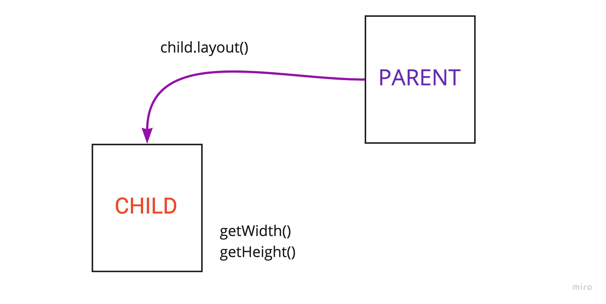
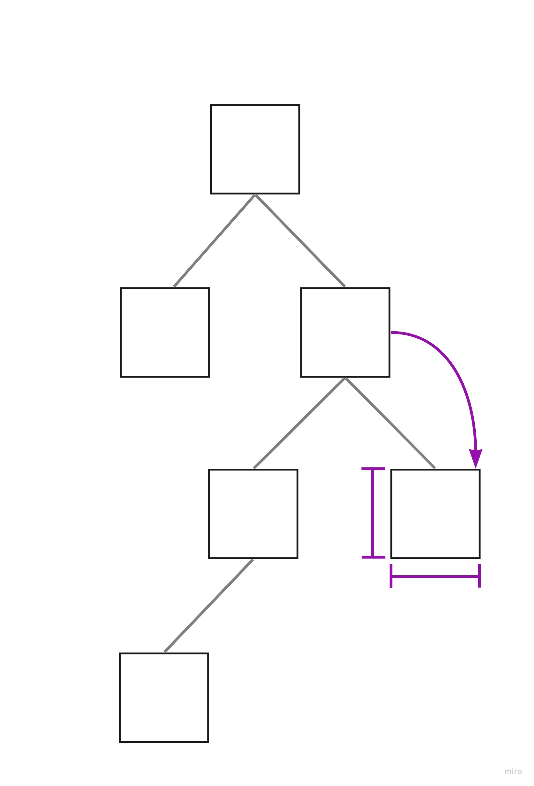

В этом уроке мы научимся создавать собственные `View`.

## Custom View

Обычно термин `Custom View` обозначает `View`, которого нет в sdk Android. Или другими словами - это `View` которое мы сделали сами.

Когда может понадобиться реализация собственного `View`:

- специфичная отрисовка;
- специфичная обработка жестов;
- оптимизация существующих элементов;
- правка багов в существующем элементе.

Как правило, создание custom view можно избежать используя темы, различные параметры `View`, а иногда и лисенеры. Но, если все таки вам действительно нужно сделать что-то особенное, давайте разберемся как же это сделать.


Для начала, давайте вспомним о том, как выглядит иерархия базовых компонентов:


Все ui компоненты наследуются от `View`, а лейауты от `ViewGroup`. В свою очередь ViewGroup наследуется от `View`.

Прежде чем наследоваться от базового класса `View` посмотрите, может быть вам ближе функциональность уже какого-то существующего элемента. Например `Button`, это не написанный с нуля компонент, а наследник `TextView`.

## Жизненный цикл View

Первостепенно давайте разберемся с жизненным циклом `View`.


#### Constructor

Каждый элемент начинает свое существование с конструктора. У `View` их целых четыре штуки:

Создание View из кода:
```java
public CustomView(Context context)
```

Создание View из XML:
```java
public CustomView(Context context, @Nullable AttributeSet attrs);
```

Создание View из XML со стилем из темы:
```java
public CustomView(Context context, @Nullable AttributeSet attrs, int defStyleAttr);
```

Создание View из XML со стилем из темы и/или с ресурсом стиля:
```java
public CustomView(Context context, @Nullable AttributeSet attrs, int defStyleAttr, int defStyleRes)
```

Последний конструктор добавлен в sdk версии 21. Каждый из конструкторов каскадно вызывает следующий. 

Для создания View из котлина, следует использовать следующий конструктор:
```kotlin
class CustomView @JvmOverloads constructor(
    context: Context,
    attrs: AttributeSet? = null,
    defStyleAttr: Int = 0,
) : View(context, attrs, defStyleAttr)
```

#### onAttachedToWindow

После того как родитель `View` вызовет метод `addView(View)`, наш `View` будет прикреплён к окну. На этой стадии наш View-компонент попадает в иерархию родителя.

#### onMeasure

Этот метод означает, что наш `View` находится на стадии определения собственного размера. Для того что бы понять как распределить элементы на экране и сколько они занимают место нужно получить от каждого `View` его размер. В методе `measure` как раз и происходят расчеты.

Давайте посмотрим на сам метод:

```java
protected void onMeasure(int widthMeasureSpec, int heightMeasureSpec)
```

Метод `onMeasure()` принимает 2 аргумента: `widthMeasureSpec` и `heightMeasureSpec`. Это значения, которые содержат в себе информацию о том, каким размером хочет видеть ваше `View` родительский элемент.

Каждое из значений на самом деле содержит 2 параметра: 

```java
int spec = mode | size
```

- `mode`. Указывает на то, какие правила применяются ко второму параметру size;
- `size`. Непосредственно размер `View`.

Получить эти параметры можно при помощи методов класса `MeasureSpec`:

```java
MeasureSpec.getMode(widthMeasureSpec)
MeasureSpec.getSize(widthMeasureSpec)
```

mode может принимать следующие значения:

- `MeasureSpec.EXACTLY`. Означает, что размер задан жёстко. Независимо от размера вашего `View`, вы должны установить определённую ширину и высоту;
- `MeasureSpec.AT_MOST`. Означает что `View` может быть любого размера, которого пожелает, но, не больше чем размер родителя. Это значение `match_parent`;
- `MeasureSpec.UNSPECIFIED`. Означение что `View` может само решить какой размер ему нужен не взирая ни на какие ограничения. Это значение `wrap_content`.

В коде это можно описать следующим образом:

```java
int width;
if (widthMode == MeasureSpec.EXACTLY) {
    width = widthSize;
} else if (widthMode == MeasureSpec.AT_MOST) {
    width = Math.min(wrapWidth, widthSize);
} else {
    width = wrapWidth;
}
```
где `wrapWidth`, это наша желаемая ширина. Аналогичный подход применяется и к высоте `View`.

Конечно же не нужно каждый раз писать эту конструкцию из условий. Для упрощения работы у View есть метод

```java
 public static int resolveSize(int size, int measureSpec)
 ```

 который уже включает в себя все необходимые условия.

После того как мы выполнили все расчеты, необходимо установить рассчитанные размеры при помощи метода:

```java
protected final void setMeasuredDimension(int measuredWidth, int measuredHeight)
```

Расчет размера можно разделить на 4 стадии:

1. Родитель узнает "пожелания", каким размером `View` хочет быть, определение `LayoutParams` наследника. Это может быть сделано как через xml, так и кодом:

```xml
android:layout_width="match_parent"
android:layout_height="wrap_content"
```
```java
LinearLayout.LayoutParams
```


2. Родитель начинает измерять свои дочерние `View` и просит рассчитать их размеры.


3. Дочерняя View рассчитывает свои размеры и устанавливает значение. 


4. Родитель сообщает о том, что расчет закончен и можно получить финальные значения.



#### onLayout

Этот метод позволяет присваивать позицию и размер дочерним элементам `ViewGroup`. В случае, если мы наследовались от `View`, нам не нужно переопределять этот метод.

#### onDraw

Это основной метод при разработки собственной `View`. В `onDraw` вы можете рисовать все что вам нужно. Метод имеет следующую сигнатуру:

```java
protected void onDraw(Canvas canvas)
```

На полученном `Canvas` вам требуется непосредственно изобразить саму `View`. Рисование на `Canvas` происходит при мощи объекта `Paint`. `Paint` отвечает за то, как именно будет отрисован контент вашего `View` и имеет множество параметров. 

Стоит обратить внимание, что `onDraw` вызывается не один раз и может занимать много времени. Поэтому стоит максимально аккуратно работать с отрисовкой, не аллоцировать никаких объектов и не делать лишних операций.

#### Обновление View

Из диаграммы жизненного цикла видно, что существуют два метода, которые заставляют `View` перерисовываться:

- `invalidate()`. Используется когда нужно только перерисовать ваш элемент. Когда изменился цвет или текст или нужно сделать какие-то еще визуальные изменения;

- `requestLayout()`. Используется когда нужно изменить размеры вашего `View`. Вызов `requestLayout` не только заставит `View` заново измериться, но и перерисует элемент.

#### Иерархия

Вызовы всех методов `View` проходят от базового `View` к потомкам, сверху вниз.


Во время расчета размера `View` потомок принимает "пожелания" от родителя, рассчитывает свои размеры, а также размеры своих потомков. (Measure pass)


После того как размеры известны, родитель проставляет размеры и расположение своим потомкам. (Layout pass)



Последним этапом является отрисовка. Она также происходит от родителя к потомку


#### Шпаргалка


- Если есть возможность обойтись без кастомных `View`, воспользуйтесь ей;
- Внимательно отнеситесь к расчету размера `View`, это поможет избежать множества проблем;
- Во время отрисовки не создавайте лишних объектов и не делайте лишней работы;
- Вызывайте метод `invalidate` только когда это действительно нужно;
- Отрисовка происходит в px, но оперировать нужно в терминах `dp` и `sp`;
- Используйте методы, которые могут упростить ваши расчеты, такие как `resolveSize`;

## Что почитать

- [https://developer.android.com/guide/topics/ui/how-android-draws.html](https://developer.android.com/guide/topics/ui/how-android-draws.html)
- [https://developer.android.com/reference/android/view/View.html](https://developer.android.com/reference/android/view/View.html)
- [https://www.raywenderlich.com/142-android-custom-view-tutorial](https://www.raywenderlich.com/142-android-custom-view-tutorial)
