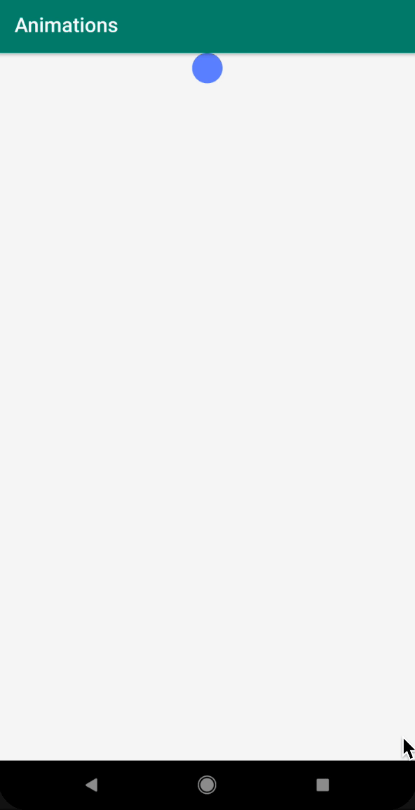
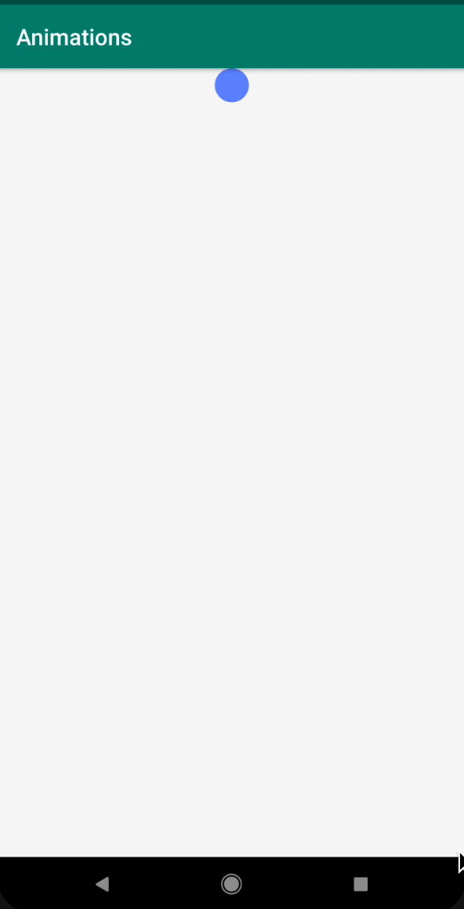
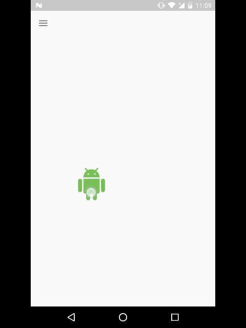

В этом уроке мы познакомимся с анимациями в Android.

## Анимации

В прошлом уроке мы разобрались как устроен жизненный цикл `View`. В Случае, если мы хотим анимировать элемент, то перед `measure` будет произведен расчет нового состояния `View` для того что бы отобразить следующий шаг анимации. 


В уроке мы рассмотрим следующие способы анимации:

- View animation;
- Drawable animation;
- ValueAnimator;
- ObjectAnimator;
- ViewPropertyAnimator;
- Layout transition;
- Transition Framework;
- Dynamic Animation.


#### View animation

`View animation` - это основной способ анимации `View`, который был до Android 2.3. У `View animation` есть небольшой набор изменений, которые мы можем сделать с помощью анимации: `alpha`, `rotate`, `scale`, `translate`. Главный минус данного подхода состоит в том, что во время анимации не меняется состояние самого `View` а меняется лишь отображение представления. Представим, что мы сейчас выполняем какую-то анимацию, например, сдвигаем кнопку. И если в процессе анимации нажать на изначальное местоположение кнопки, то это будет расцениваться как клик по кнопке, хотя, визуально ее там нет. Данный подход устарел, не будем рассматривать его детально. 

#### Drawable animation

`Drawable animation` - это способ покадровой анимации, где каждый кадр, это `Drawable`. Описание как правило делается в `xml` файле. Такая анимация довольно сложна, т.к. требует загрузки `Drawable` на каждый из этапов анимации. Такую анимацию используют в редких случаях, например, когда очень сложно описать происходящее на экране другими способами. 

```xml
<animation-list xmlns:android="http://schemas.android.com/apk/res/android"
    android:oneshot="true">
    <item android:drawable="@drawable/rocket_thrust1" android:duration="200" />
    <item android:drawable="@drawable/rocket_thrust2" android:duration="200" />
    <item android:drawable="@drawable/rocket_thrust3" android:duration="200" />
</animation-list>
```

#### ValueAnimator

`ValueAnimator` появился в Android 3.0, это базовый движок для анимации. С помощью него можно делать практические любые преобразования. Отличительной особенностью является то, что он никак не привязан к `View`. Для работы с `ValueAnimator` необходимо указать: начальное значение, конечное значение и `Listener` который будет менять какой-либо параметр `View`.

Рассмотрим анимацию на примере появляющегося `View`, который движется сверху вниз экрана:

- `View` должно поменять свою прозрачность от 0 до 1:

```kotlin
ValueAnimator.ofFloat(0f, 1f)
```

- `View` должно сдвинуться из крайней верхней точки в крайную нижную точку:

```kotlin
ValueAnimator.ofFloat(0f, (root.height - circle.height).toFloat())
```

Аниматоры можно комбинировать и управлять ими одновременно:

```kotlin
val alphaAnimator = ValueAnimator.ofFloat(0f, 1f)
alphaAnimator.addUpdateListener { animation -> circle.alpha = animation.animatedValue as Float }
val yAnimator = ValueAnimator.ofFloat(0f, (root.height - circle.height).toFloat())
yAnimator.addUpdateListener { circle.y = yAnimator.animatedValue as Float }
val set = AnimatorSet()
set.playTogether(alphaAnimator, yAnimator)
set.duration = ANIMATION_DURATION
set.start()
```


Давайте рассмотрим как работает движок аниматора. Пускай, мы хотим анимировать целое число от 0 до 255.

```kotlin
ValueAnimator.ofInt(0, 255)
```

Время в `Animator` представляется как значение от 0 до 1. Время обновления экрана в Android это 16ms. Допустим, анимация длится 167 мс, тогда, для отрисовки нам понадобится 10 фреймов. Для примера рассмотрим что происходит во время отрисовки 5го фрейма:

Cначала значение 0.5 попадает в `TimeInterpolator`, это функция которая показывает как должна изменяться скорость анимации. Можно, например, сделать что бы анимация разгонялась со временем или наоборот тормозила. Воспользуемся `AccelerateInterpolator`:

```
f(x) = x^2
0.5^2 = 0.25
```

Рассчитанное значение подается на вход `TypeEvaluator`. `TypeEvaluator` определяет как должен меняться объект в процессе анимации относительно времени. В простых случаях это разница конечного и начального значения умноженная на время:

```
(x2 - x1) * t
(255-0) * 0.25 = 63.75
```

Получившееся значение записывается в `Animator` и передается в `Listener`.

Интерполяторов существует множество, рассмотрим самые базовые:

- `AccelerateInterpolator`. Определяет функцию с увеличивающейся скоростью. Он, как правило, должен использоваться для элементов, которые собираются пропасть с экрана. Элемент должен большую часть времени элемент провести на экране, чтобы пользователь его точно заметил.

- `DecelerateInterpolator`. Определяет функцию с уменьшающейся скоростью. Как правило, используется для элементов, которые следует показать на экране.

- `AccelerateDecelerateInterpolator`. Определяет функцию, скорость которой сначала увеличивается, а потом снижается. Следует использовать для анимации `View`, которое будет находится в приделах экрана.


В Android 5 появились новые интерполяторы, аналогичные перечисленным выше. Считается, что они работают более плавно и естественно: `FastOutLinearInInterpolator`, `LinearOutSlowInInterpolator`, `FastOutSlowInInterpolator`.

Вернемся к `TypeEvaluator`. Как правило не приходится задавать свой `TypeEvaluator`, потому-что обычно это мы изменяем достаточно простой величины. Но, если требуется выполнить какие-то не простые манипуляции, то следует определить свой `TypeEvaluator`. Например, если мы хотим сделать переливание цветов. Цвет задается в формате ARGB, где на каждый канал отведено по 2 байта. Если мы просто будет анимировать цвет как обычный int, то цвета будут меняться неочевидным образом.

#### ObjectAnimator

`ObjectAnimator` является расширением `ValueAnimator`. Все свойства `ValueAnimator` также применимы и к `ObjectAnimator`. Главным отличием является то, что нам нет необходимости задавать `Listener`, вместо этого в `ObjectAnimator` представлено понятие `Property`, которое отвечает за изменяемый параметр.

```kotlin
val yAnimator = ObjectAnimator.ofFloat(circle, Y, circle.y, root.height - circle.height)
```

Давайте рассмотрим, что такое `Property`:

```java
public static final Property<View, Float> Y = new FloatProperty<View>("y") {
    @Override
    public void setValue(View object, float value) {
        object.setY(value);
    }

    @Override
    public Float get(View object) {
        return object.getY();
    }
};
```

Видно, что `Property` по сути делает ту же работу, которую мы обычно делали вручную при использовании `ValueAnimator`.

`Property` можно задавать двумя способами:

- с помощью наследника `Property`:

```kotlin
ObjectAnimator.ofFloat(circle, View.Y, circle.y, root.height - circle.height)
```

- с помощью строки:

```kotlin
ObjectAnimator.ofFloat(circle, "y", circle.y, root.height - circle.height)
```
    
В случае, если мы используем строку, то доступ к анимируемым полям будет получаться при помощи reflection, что может несколько замедлить работу. А так же, обязательным условием является наличие методов `setX` и `getX`.

View уже содержат в себе базовый набор `Property`:

- ALPHA;
- TRANSLATION_X;
- TRANSLATION_Y;
- TRANSLATION_Z;
- X;
- Y;
- Z;
- ROTATION;
- ROTATION_X;
- ROTATION_Y;
- SCALE_X;
- SCALE_Y.


#### ViewPropertyAnimator

`ViewPorpertyAnimator` также работает на основе `ValueAnimator`. Главный плюс `ViewPorpertyAnimator` состоит в том, что он предоставляет удобный API для анимации `View`. В случае анимирования нескольких значений, он может быть незначительно быстрее `ObjectAnimator`. Минусом является то, что нам нельзя анимировать какие-то свои параметры, можно использовать только те, которые есть в стандартном наборе.

```kotlin
val yAnimator = circle.animate().x((root.height - circle.height).toFloat()).setDuration(ANIMATION_DURATION).setInterpolator(interpolator)
 ```

 #### Какой аниматор выбрать?

 Мы рассмотрели несколько способов, с помощью которых можно анимировать `View`, давайте определимся с тем, когда следует использовать каждый из предложенных вариантов:

- `ViewAnimation`. Устаревший. Лучше не использовать;
- `DrawableAnimation`. Использовать только в очень сложных случаях;
- `ValueAnimator`. Стоит использовать только в тех случаях, когда нам не удается написать `Property`;
- `ObjectAnimator`. Стоит использовать по возможности всегда;
- `ViewPropertyAnimator`. Стоит использовать для простых случаев.

 #### Завершение анимации

 Для того, что завершить анимацию, раньше чем ее завершит аниматор следует использовать следующие способы:

 - `view.clearAnimation()`. Для `View animation`;
 - `animator.cancel()`. Для `ValueAnimator` и `ObjectAnimator`;
 - `view.animate().cancel()`. Для `ViewPropertyAnimator`.

 В случае вызова неверного метода, анимация не будет остановлена.Лучше всегда сохранять ссылку на аниматор, для того, что бы можно было остановить анимацию в любой момент. Также, следует останавливать анимации в методах: 
 
- `Activity.onStop()`;
- `Fragment.onStop()`;
- `View.onDetachFromWidow()`.

Это следует делать во избежание утечек памяти.

#### LayoutTransition

`LayoutTransition`(флаг `animateLayoutChanges`) работает на основе `ValueAnimator`. Позволяет при изменениях внутри дочерних `View` анимировать родительский `View`.

Подходит для простых случаев:

- Появление;
- Исчезновение;
- Изменение размеров.

```kotlin
 root.layoutTransition = LayoutTransition()
 ```

 

Анимация запускается только для последнего действия. Например, если в одной иерархии мы захотим и добавить и удалить `View`, то анимация запустится только для последнего действия, то есть для удаления `View`.

#### Transition Framework

`Transition Framework` вводит такие понятия, как `Transition`, который включает в себя целый класс анимаций. `Transition Framework` анимирует всю иерархию внутри контейнера, не только ближайшие вложенные элементы, а все, которые находятся в заданном родителе. Данный фрейморк работает только для Android 4.4 и выше. 

Для того, что бы задать анимацию, достаточно описать какие эффекты мы хотим применять к изменениям лейаута, а дальше выполнить метод `beginDelayedTransition`. Далее, все изменения родителя будут анимрованы указанным способом.

Добиться анимации как в предыдущем случае можно при помощи следующего кода:

```kotlin
val transitionSet = TransitionSet().addTransition(Fade())
TransitionManager.beginDelayedTransition(root, transitionSet)
circle2.visibility = VISIBLE
```

Кроме базовых анимаций есть несколько необычных, например Slide. Этот способ анимации заставляет `View` "прилететь" в заданную позицию: 

```kotlin
val transitionSet = TransitionSet().addTransition(Fade()).addTransition(new Slide()
TransitionManager.beginDelayedTransition(root, transitionSet)
circle2.visibility = VISIBLE
```



Кроме заданного набора анимация, можно реализовать свои анимации. На, следует помнить, что на `Transition Framework` накладывает ограничения ограничение на минимальную версию Android.

Что лучше использовать `LayoutTransition` или `Transition Framework`? `LayoutTransition` стоит использовать для простых иерархий, где анимируется не большое количество элементов и/или для старых версий Android. `Transition Framework` следует использовать для более сложных случаях и/или для новых версий Android.

#### Dynamic Animation

Мы живем в реальном мире, который подчиняется физическим законам и взаимодействую с интерфейсом, человеку хочется что бы интерфейс реагировал также привычным образом. Для это в Android добавлена библиотека `Dynamic animation`, или также известна как `Physic-based animation`. 

Сравните как выглядят анимации. Слева обычная анимация, справа `Physic-based animation`:


На текущий момент библиотека включает в себя два вида анимаций, `FlingAnimation` и `SpringAnimation`. 

- `FlingAnimation`. Предназначена для тех случаев, когда пользователь своими жестами инициирует какую-то анимацию, например свайп: когда пользователь поднимает палец, элемент должен сдвинуться примерно с той же самой скоростью, с которой пользователь двигал палец. 


- `SpringAnimation`. Анимация отмены действия или возврата к начальному состоянию. Чем-то похожа на пружину.



Пример использования Dynamic Animation можно посмотреть [тут](https://github.com/otopba/polis-mail-ru-rv-swipe-sample)

#### Прочие анимации

Кроме анимаций, которые могут применяться к любым View, есть анимации, которые предназначены для каких-то определенных ситуаций. Например:

- `ItemAnimator`. Этот аниматор работает только в `RecyclerView`
- `AnimatedVectorDrawable`. Аниматор для работы с векторными изображениями;
- `Activity Transition`. Способ анимации между `Activity`;
- `Fragment Transition`. Способ анимации между фрагментами.

Android постоянно обновляется и вместе с тем добавляются новые способы анимации объектов. С умом подойдите в выбору способа анимации и следите за обновлениями. 


## Что почитать

- [https://developer.android.com/guide/topics/graphics/view-animation](https://developer.android.com/guide/topics/graphics/view-animation)
- [https://habr.com/ru/company/yandex/blog/344296/](https://habr.com/ru/company/yandex/blog/344296/)
- [https://android.jlelse.eu/android-physics-based-animation-cf0cc125830f](https://android.jlelse.eu/android-physics-based-animation-cf0cc125830f)
