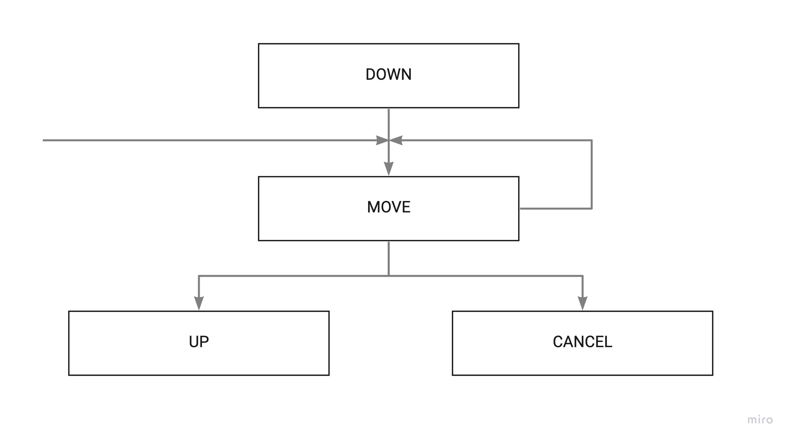
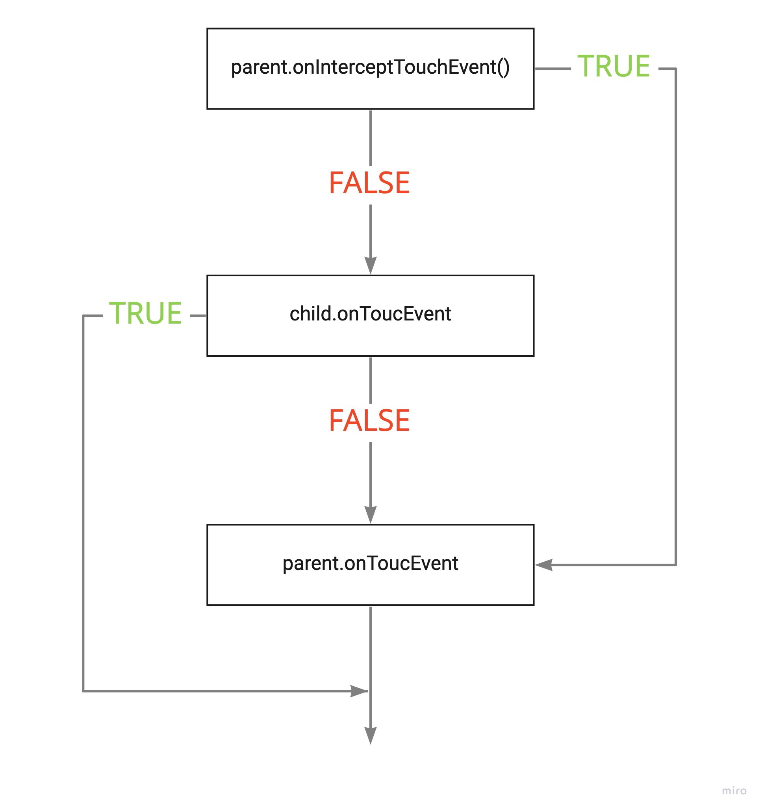
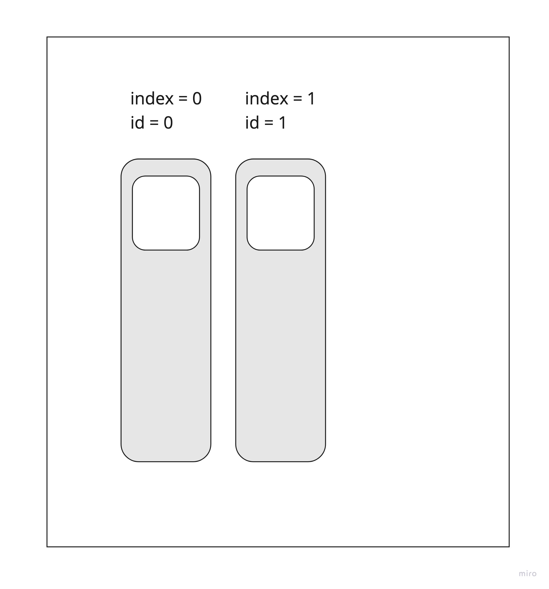
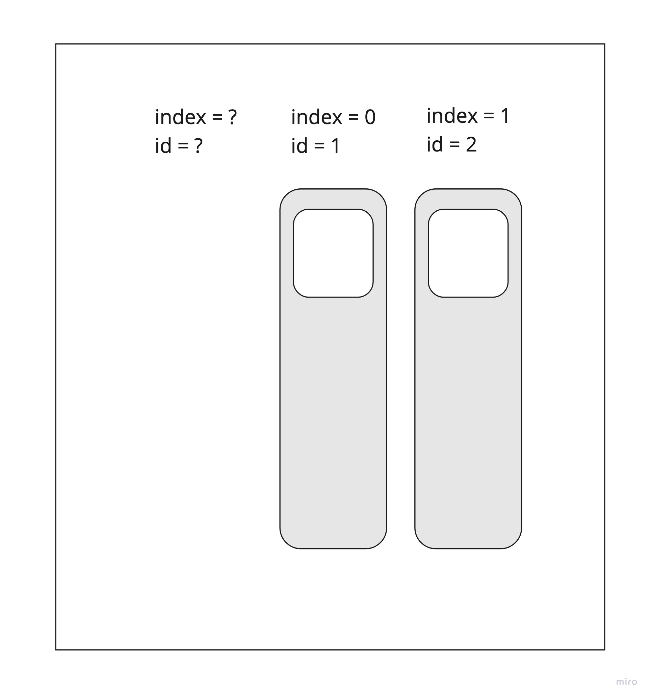
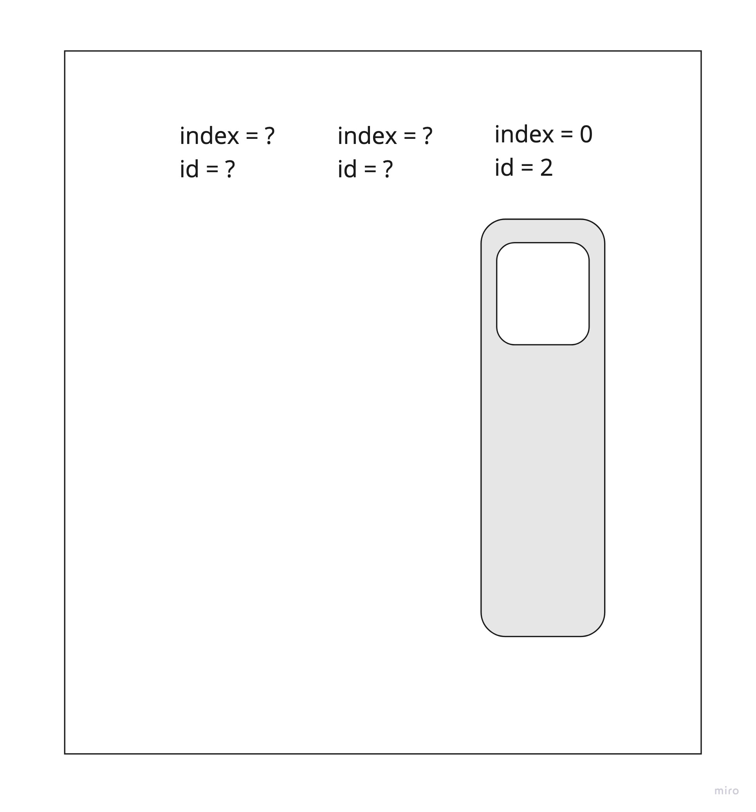

В этом уроке мы разберемся с тем как обрабатывать тачи в Android.

## MotionEvent

`MotionEvent` - это событие касания экрана. `MotionEvent` работает с любыми способами ввода: 

- палец;
- стилус;
- мышь.

В рамках этого урока мы будет рассматривать только касания пальцем.

`MotionEvent` содержит данные только об одном событии, это: касание экрана, нажатие кнопки, перемещение пальца и т.п. Рассмотрим типичный жизненный цикл касаний:



Практически всегда обработка касания начинается с события `DOWN`, когда пользователь коснулся экрана. Далее, при движении пальца приходит событие `MOVE`. Завершается жест событием `UP` - в случае если жест завершен правильно, или событием `CANCEL`, если жест был отменен. Событий на самом деле больше, но чаще всего придется работать с четырьмя событиями: `DOWN`, `MOVE`, `UP`, `CANCEL`.

## Обработка событий

Самая частая ошибка при обработке событий это хранение ссылки на `MotionEvent`. Никогда не храните ссылки на `MotionEvent`! Предположим, мы храним предыдущий MotionEvent и сравниваем его с новым. Во время работы приложения мы столкнемся с тем, что у нас все события равны. Почему так получается? Все дело в том, что Android оптимизирует работу с `MotionEvent` и для того, что бы не создавать и не уничтожать кучу объектов с событиями тачей, события переиспользуются. 


Существует `MotionEvent Pool` который содержит некоторое количество событий ввода. Когда происходит новое событие тача, пул выдает его при помощи метода `obtain()`. Когда работа с тачем завершена, `MotionEvent` возвращается обратно в пул при помощи метода `recycle()`.

Как же хранить информацию о тачах? 

- вызвать вручную `obtain` (главное не забыть вызвать `recycle`);
- хранить только необходимую информацию из `MotionEvent`.

## Диспетчеризация нажатий

Как `View` понимает что именно ей нужно обработать нажатие? Для этого существует система перехвата тачей: 

1) Когда система понимает что произошло событие касания экрана и у нас есть `ViewGroup`, которое попадает под область касания, она вызывает метод `onInterceptTouchEvent`.

2) `ViewGroup` должен ответить будет ли он перехватывать этот тач или нет. В случае, если возвращается `true`, будет вызван `onTouchEvent`, в противном случае `MotionEvent` прокидывается к дочернему `View` и там вызывается метод `onTouchEvent`

3) Если `View` обработал событие, то возвращается `true` и событие покидает текущую иерархию, в противном случае `MotionEvent` будет передан обратно родителю и будет вызыван метод `onTouchEvent` родителя.



## Multi touch

Multi touch это события множественного касания. Когда человек использует несколько пальцев одновременно. Для Multi тачей вводятся два новых события

- `POINTER_DOWN`. Прикосновение пальцем;
- `POINTER_UP`. Поднятие пальца.

Кадому пальцу назначаются два параметра:

- индекс. Порядковый номер пальца. Не привязан к пальцу, один палец может иметь разные индексы в течение одного касания.

- `id`. Идентификатор пальца. Привязан к конкретному пальцу от начала и до конца касания

Пример:

Коснулись экран одним пальцем. Его параметры: index = 0, id = 0.


Коснулись экран вторым пальцем. Его параметры: index = 1, id = 1.



Коснулись экран третьим пальцем. Его параметры: index = 2, id = 2.


Уберем крайний левый палец. При таком действии индексы пальцев сдвигаются на один, но id остаются прежними.



Уберем еще один палец слева. Оставшийся палец будет иметь параметры: index = 0, id = 2.



Для того, что бы понять какой жест сейчас производил пользователь приходится обрабатывать очень много данных, хранить все касания, запоминать положение пальцев и т.п. в Android уже есть классы, упрощающие нам работу. Об этих классах пойдет речь в следующих разделах.

## Отслеживание скорости

Для того, что бы отслеживать скорость перемещения пальцев в Android существует класс `VelocityTracker`. Работа с ним чем-то похожа на работу с `MotionEvent` - объекты тоже находятся в пуле и для получения `VelocityTracker` необходимо вызвать метод `obtain`:

```kotlin
vt = VelocityTracker.obtain()
```

Что бы `VelocityTracker` понимал как пользователь передвигает пальцы, необходимо все `MotionEvent` передавать в метод `addMovement`:

```kotlin
vt.addMovement(event)
```

Когда мы захотим получить текущую скорость перемещения, нужно вызвать метод:

```kotlin
vt.computeCurrentVelocity(VELOCITY_UNITS)
```

Что такое `VELOCITY_UNITS`? Это то количество пикселей, относительно которых будет считаться скорость. Например, если `VELOCITY_UNITS = 1000`, то скорость будет измеряться в том, сколько тысяч пикселей в секунду проходит палец на экране.

После работы, нужно не забывать утилизировать объект вызовом:

```kotlin
vt.recycle()
```

## GestureDetector

Класс, который позволяет понять какой именно жест сейчас сделал пользователь. Аналогично с классом `VelocityTracker` необходимо передавать все тачи в `GestureDetector` и в случае, если произошел какой-то из известных жестов, будет вызван соответствующий метод:

- OnDown
- OnFling
- OnLongPress
- OnScroll
- onShowPress
- onSingleTapUp
- ...

Но не все жесты распознает `GestureDetector`, например, для распознавания жеста приближения, есть специальный класс `ScaleGestureDetector`.

Код примера можно посмотреть [тут](https://github.com/polis-mail-ru/2021-android-rv-swipe-sample)

## Что почитать

- [https://developer.android.com/training/gestures](https://developer.android.com/training/gestures)
- [https://android.jlelse.eu/the-android-touch-system-from-a-slightly-different-perspective-71f29c86369a](https://android.jlelse.eu/the-android-touch-system-from-a-slightly-different-perspective-71f29c86369a)
- [https://developer.android.com/reference/android/view/VelocityTracker](https://developer.android.com/reference/android/view/VelocityTracker)