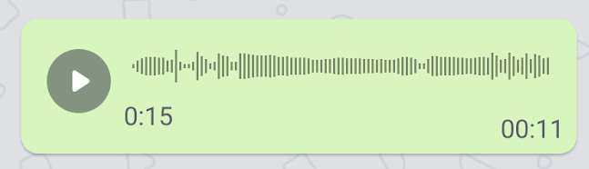
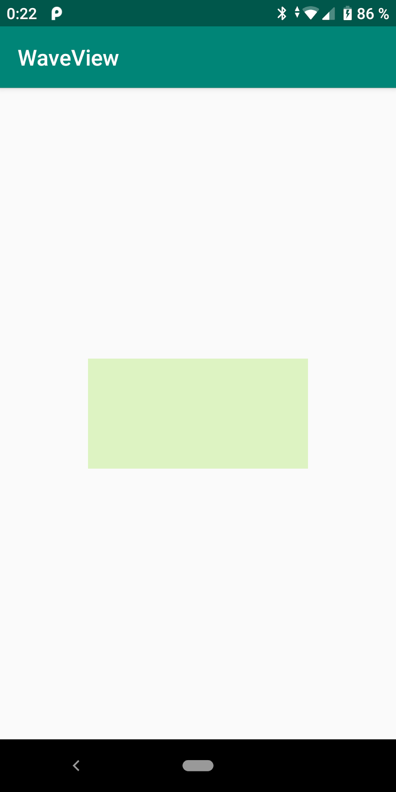
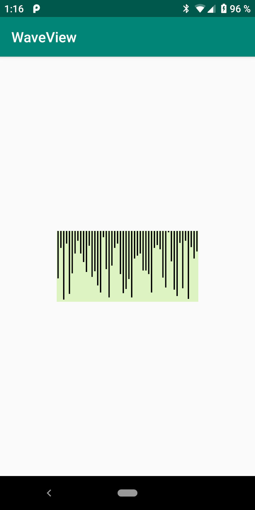

В этом уроке мы рассмотрим как создать свой `View` на примере аудиосообщения.

## Wave View

Предположим, что во время разработки приложения нам понадобилось отобразить аудиосообщение. Как же отобразить кнопки и прочие элементы мы уже знаем, но как отрисовать столбики громкости?



Для этого нам понадобиться создать собственное `View`. Для этого унаследуемся от базового класса `View` и определим конструктор:

```kotlin
class WaveView @JvmOverloads constructor(
        context: Context,
        attrs: AttributeSet? = null,
        defStyleAttr: Int = 0,
) : View(context, attrs, defStyleAttr) {
```    

и добавим полученный `WaveView` в разметку активити:

```xml
<<?xml version="1.0" encoding="utf-8"?>
<android.support.constraint.ConstraintLayout xmlns:android="http://schemas.android.com/apk/res/android"
    xmlns:app="http://schemas.android.com/apk/res-auto"
    xmlns:tools="http://schemas.android.com/tools"
    android:layout_width="match_parent"
    android:layout_height="match_parent"
    tools:context=".MainActivity">

    <ru.ok.technopolis.customview.WaveView
        android:layout_width="200dp"
        android:layout_height="100dp"
        android:background="#ddf3c2"
        app:layout_constraintBottom_toBottomOf="parent"
        app:layout_constraintEnd_toEndOf="parent"
        app:layout_constraintStart_toStartOf="parent"
        app:layout_constraintTop_toTopOf="parent" />

</android.support.constraint.ConstraintLayout>
```

Запустив проект мы ничего не увидим кроме зеленого прямоугольника (мы задали зеленый фон для `View`). Размеры прямоугольника равны значениям выставленным в `layout_width` и `layout_height`.



Для начала подготовим входные данные. Пускай у нас есть некий источник массива с данными о громкости аудиосообщения `WaveRepository`. Метод `getWaveData` возвращает массив, где каждый элемент описывает громкость аудисоообщения в заданный промежуток времени.

```kotlin
object WaveRepository {

    const val MAX_VOLUME = 100
    private const val WAVE_LENGTH = 200

    @JvmStatic
    val waveData: IntArray
        get() {
            val data = IntArray(WAVE_LENGTH)
            val r = Random()
            for (i in data.indices) {
                val value = r.nextInt(MAX_VOLUME + 1)
                data[i] = value
            }
            return data
        }
}
```

## onMeasure

Для того, что бы Android смог отрисовать наш `WaveView`, его нужно измерить. Определим толщину линии каждого столбика громкости, для этого в файл `dimens.xml` внесем соответствующее значение. Важно помнить, что задаем размеры в`dp` а не в `px`!

```xml
<?xml version="1.0" encoding="utf-8"?>
<resources>
    <dimen name="wave_view_item_width">2dp</dimen>
</resources>
```

и считаем это значение в конструкторе `View`:

```kotlin
resources.getDimension(R.dimen.wave_view_item_width)
```

 Приступаем непосредственно к расчету размеров `View`, переопределяем метод

```kotlin
override fun onMeasure(widthMeasureSpec: Int, heightMeasureSpec: Int)
```

Первым шагом узнаем какие требования предъявляет родитель к нашему `View`:

```kotlin
val measuredWidth = MeasureSpec.getSize(widthMeasureSpec)
val widthMode = MeasureSpec.getMode(widthMeasureSpec)

val measuredHeight = MeasureSpec.getSize(heightMeasureSpec)
val heightMode = MeasureSpec.getMode(heightMeasureSpec)
```

Далее нам необходимо посчитать сколько столбцов влезет в размер `WaveView`. Будем рисовать каждый столбик размером с `itemWidth` и между столбиками сделаем интервал в `itemWidth`:

```kotlin
val itemCount = (width - paddingStart - paddingEnd + itemWidth) / (itemWidth * 2)
measuredData = interpolateArray(originalData, itemCount)
```

Нам необходимо интерполировать входные данные с громкостью. Для интерполяции будем использовать класс с простейшей  интерполяцией [LinearInterpolation](https://github.com/ajbanks/arff-builder/blob/3fc8f6860a37d33cd93081a9c8c0025fd70872f5/src/stretching/LinearInterpolation.java).

И в конце не забываем установить рассчитанные размеры

```kotlin
setMeasuredDimension(width, height)
```

Запустив написанный код, мы по прежнему увидим зеленый прямоугольник по центру экрана. 

## onDraw

В методе onDraw нужно выполнить отрисовку нашего элемента. То, на чем мы рисуем - это `Canvas`, а то, чем рисуем - это `Paint`. `Canvas` является аргументом метода `onDraw`, а `Paint` необходимо создать и настроить. Помним о том, что лучше не создавать никаких объектов во время отрисовки, и создаем `Paint` в конструкторе:

```kotlin
val linePaint = Paint()
linePaint.style = Paint.Style.STROKE
linePaint.color = itemColorFromAttr
linePaint.strokeWidth = itemWidthFromAttr.toFloat()
```

Рисовать будем используя класс `Path`, который позволяет задавать произвольную форму графического объекта. `Path` также нужно создать в конструкторе:

```kotlin
val wavePath = Path()
```

И напишем сам код отрисовки:

```kotlin
override fun onDraw(canvas: Canvas) {
    val measuredData = measuredData ?: return
    
    wavePath.reset()
    var currentX = itemWidth
    for (data in measuredData) {
        val height = data.toFloat() / WaveRepository.MAX_VOLUME * measuredHeight
        wavePath.moveTo(currentX.toFloat(), 0f)
        wavePath.lineTo(currentX.toFloat(), height)
        currentX += itemWidth * 2
    }
    canvas.drawPath(wavePath, linePaint)
}
```

Запустив приложение мы увидим что-то похожее на желаемые столбики громкости.



Столбцы идут сверху вниз. Это связано с тем, что в интерфейсе Android точкой отчета является верхний левый угол. Сдвинем полоски на центр:

```kotlin
override fun onDraw(canvas: Canvas) {
    val measuredData = measuredData ?: return

    wavePath.reset()
    val measuredHeight = measuredHeight
    var currentX = itemWidth
    for (data in measuredData) {
        val height = data.toFloat() / WaveRepository.MAX_VOLUME * measuredHeight
        val startY = measuredHeight.toFloat() / 2f - height / 2f
        val endY = startY + height
        wavePath.moveTo(currentX.toFloat(), startY)
        wavePath.lineTo(currentX.toFloat(), endY)
        currentX += itemWidth * 2
    }
    canvas.drawPath(wavePath, linePaint)
}
```


Посмотрим как будет выглядеть `WaveView` при разных значения ширины и высоты:

```xml
<?xml version="1.0" encoding="utf-8"?>
<android.support.constraint.ConstraintLayout xmlns:android="http://schemas.android.com/apk/res/android"
    xmlns:app="http://schemas.android.com/apk/res-auto"
    xmlns:tools="http://schemas.android.com/tools"
    android:layout_width="match_parent"
    android:layout_height="match_parent"
    tools:context=".MainActivity">

    <ru.ok.technopolis.customview.WaveView
        android:id="@+id/activity_main__wv_1"
        android:layout_width="match_parent"
        android:layout_height="100dp"
        android:background="#ddf3c2"
        app:layout_constraintBottom_toTopOf="@+id/activity_main__wv_2"
        app:layout_constraintEnd_toEndOf="parent"
        app:layout_constraintStart_toStartOf="parent"
        app:layout_constraintTop_toTopOf="parent" />

    <ru.ok.technopolis.customview.WaveView
        android:id="@+id/activity_main__wv_2"
        android:layout_width="300dp"
        android:layout_height="100dp"
        android:background="#ddf3c2"
        app:layout_constraintBottom_toTopOf="@+id/activity_main__wv_3"
        app:layout_constraintEnd_toEndOf="parent"
        app:layout_constraintStart_toStartOf="parent"
        app:layout_constraintTop_toBottomOf="@+id/activity_main__wv_1" />

    <ru.ok.technopolis.customview.WaveView
        android:id="@+id/activity_main__wv_3"
        android:layout_width="200dp"
        android:layout_height="50dp"
        android:background="#ddf3c2"
        app:layout_constraintBottom_toBottomOf="parent"
        app:layout_constraintEnd_toEndOf="parent"
        app:layout_constraintStart_toStartOf="parent"
        app:layout_constraintTop_toBottomOf="@+id/activity_main__wv_2" />

</android.support.constraint.ConstraintLayout>
```


## Доработки

Для того что бы можно было удобно пользоваться созданной `View` нужно доработать следующие моменты:

1) наличие падингов;
2) возможность изменения толщины линии;
3) возможность изменения цвета линии.


Код примера можно посмотреть [тут](https://github.com/polis-mail-ru/2021-android-customview-sample)

## Что почитать

[Предыдущий урок](../061_custom_view/)
