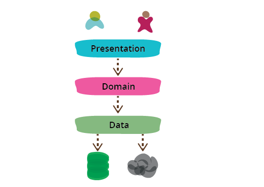
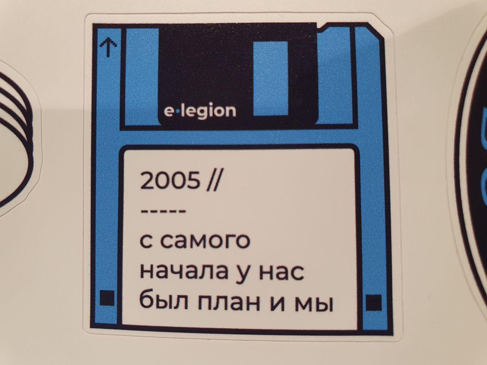
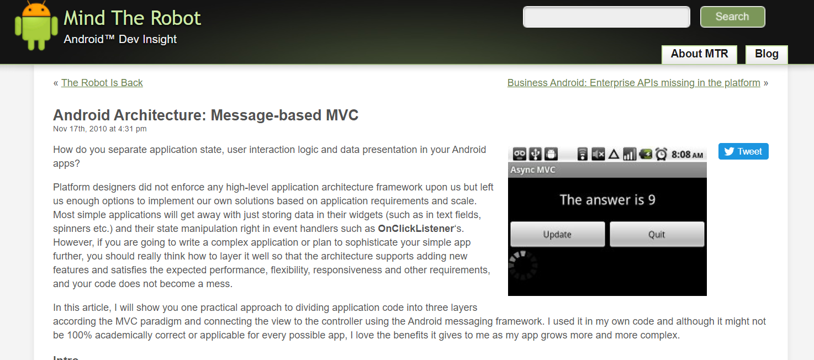
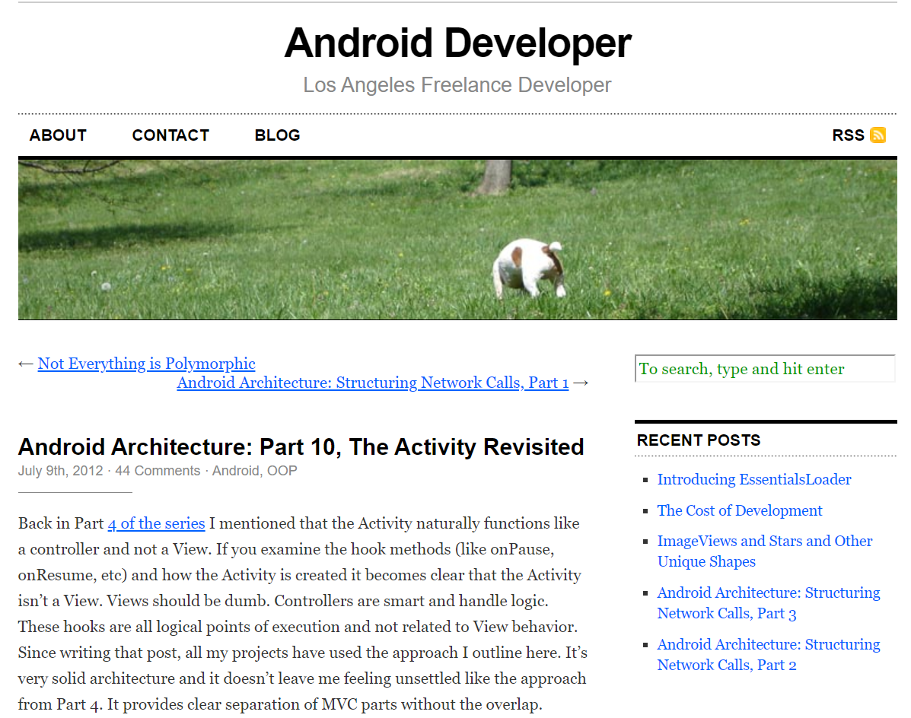
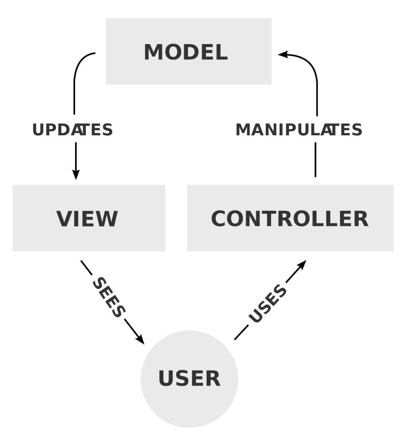
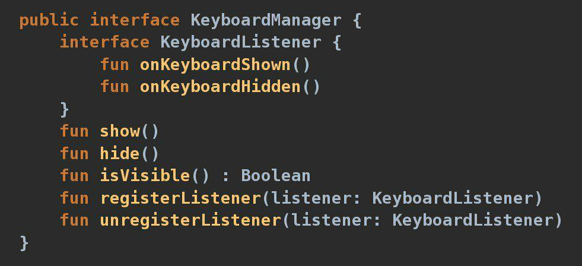
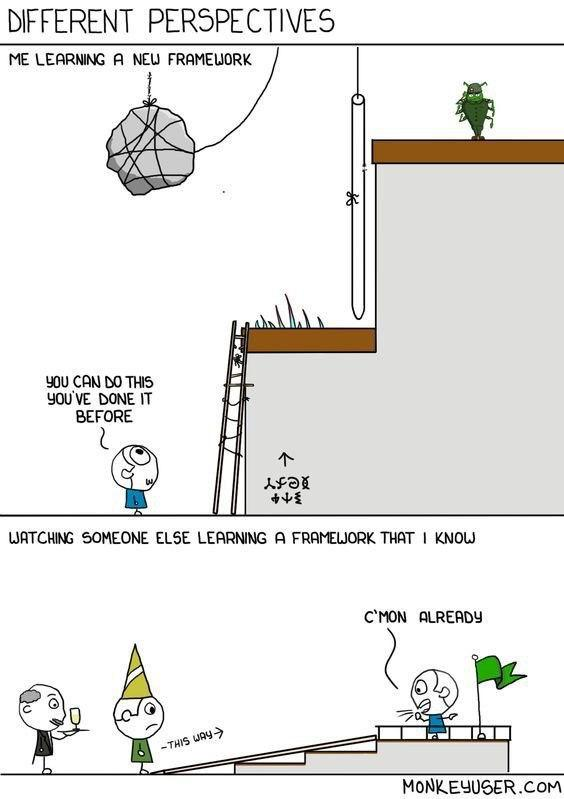

class: center, middle

# Android UI Architecture Patterns

Dmitry Melnikov

---

## Presentation Domain Data Layering



https://martinfowler.com/bliki/PresentationDomainDataLayering.html

---

## Logical layers

UI
* render
* ui interactions (no handling)

Application
* control flow
* handles ui interactions

Domain
* business logic

Infrastructure
* rest from domain layer (network, storage)

---

## MVC/MVP/MVVM/MVI…

Model: state and/or business logic and/or data structures

View: user interface

X: Business logic and/or flow control logic and/or state and/or data structures

---

## Android Architecture Blueprints


MVP [official sample](https://github.com/android/architecture-samples) code review

```sh
git clone git@github.com:android/architecture-samples.git
git checkout todo-mvp
```

---

## Android Architecture Blueprints

ಠ_ಠ

Too verbose View interface

View is a fragment

View calls Presenter! (from [README.md](https://en.wikipedia.org/wiki/Model-view-presenter) view should be passive)

Presenter `void result(int requestCode, int resultCode);`

View is difficult to replace with alternative implementation

View is not reusable

View and Presenter tightly coupled

View has non-UI logic

=> MVP Architecture Blueprint is not MVP

---

## History



---

## History


---

## History

[https://mindtherobot.com/blog/675/android-architecture-message-based-mvc](https://mindtherobot.com/blog/675/android-architecture-message-based-mvc)



---

## History

[https://www.therealjoshua.com/2012/07/android-architecture-part-10-the-activity-revisited](https://www.therealjoshua.com/2012/07/android-architecture-part-10-the-activity-revisited)



---

## Thought 💡

Activity not a View but more a Presenter/Controller

---

## MVC/MVP/MVVM/MVI… benefits

--

Testability... ?

--

No need for it if you don't unit test?

Better testability is just a byproduct.

--

The main benefit of MVx is a decoupled UI logic.

All MVx implementations have one common thing: UI logic in views.

---

## UI logic

### Responsibilities

- render system output
- capture user interactions with the UI and route them into the system.

### Characteristics

- detailed and accurate requirements (UI mockups)
- much higher rate of change in most cases
- unreadable (verbose, messy, hacky, etc)
- easiest to test manually
- hardest to test automatically

---

## MVC/MVP/MVVM/MVI… benefits

Decoupled UI logic is the main benefit

---

## Activity/Fragment & UI logic

Example: outsourcing

UI specs + decoupled logic
=> Outsourcing company
=> MyActivity implements MyView

What about
- life-cycle
- screen navigation
- runtime permissions
- loaders
- fragments
- dialogs
- di
- more...

Activity is a God Object with lots of responsibilities.

---

## Activity/Fragment & UI logic

It's difficult to integrate outsourced activity to an app.
Activity is a God Object with many responsibilities.

It's almost impossible to decouple UI logic inside Activity.

Fragments are the same.

Extract UI logic to standalone class.

MyViewMvpImpl implements MyViewMvp. Obviously Activity is P.

Composition of several MyViewImpl.

---

## Activity/Fragment & UI logic

```
+---------------+                           
| Interface     |                           
|    MyViewMvp  | <----------------         
+-------|-------+                  |        
        |                          |        
+---------------+          +---------------+
|               |          | MyViewMvpImpl |
|               |          | +-----------+ |
|  Activity     |          | |           | |
|               | -------> | | UI logic  | |
|               |          | |           | |
|               |          | +-----------+ |
+---------------+          +---------------+
```

---

## MVx approach

.left-half[

Letters don't matter

MVC [wiki](https://en.wikipedia.org/wiki/Model-view-controller)

]

.right-half[



]

---

## MVx approach

.left-half[

[Spring Web MVC](https://docs.spring.io/spring/docs/current/spring-framework-reference/web.html)

MVP [wiki](https://en.wikipedia.org/wiki/Model-View-Presenter)

]

.right-half[


]

---

## MVx approach

.left-half[

MVVM [wiki](https://en.wikipedia.org/wiki/Model-view-viewmodel)

]

.right-half[


]

---

## My approach

2010 -> 2012 -> 2014 -> 2018

My approach is a variation of MVP

[Droidcon NYC 2018 - Netflix's componentization architecture with RxJava + Kotlin](https://www.youtube.com/watch?v=dS9gho9Rxn4)

---

## MVP Sample

```sh
git clone git@github.com:melnikovdv/android-arch-2.git
```

App shows blog posts fetched from local cache or from remote server if not cached yet.

Better way is to implement everything the "bad way" and extract UI-logic in a real-time manner, but we have no time for it.

- blog item screen
- blog items screen

---

## MVP Sample ideas

Single Activity

UI logic and business logic are separated

Separated MvpView helps to understand what view does

ListView + performance workaround with ViewHolder => RecyclerView

----

Application layer:  Fragment

Decoupling layer:   MvpView & Listener interfaces

UI Layer:           MvpViewImpl

All the interactions in activity and fragments are high level and don't depend on implementation details.

It's a good abstraction when you can refactor without affecting dependent classes.

---

## Why not Android View as MvpView

Why not use Android View class as MvpView?

Android views are not the best candidates for MvpView implementation.

Imagine inheritance level:

`BlogItemMvpView -> MvpViewObservable -> MvpView -> FrameLayout -> ViewGroup -> View`

Cons:
- inheritance of thousands of loc
- inheritance of 100+ methods
- standalone hierarchy for each ViewGroup

Effective Java, item 16: "Favour composition over inheritance".

---

## MVP Sample summary

MVP views implement the MvpView interface with single `rootView`.

UI-actions calls corresponding presenters via listeners (observable).

MVP views can be nested.

Activities and fragments are not views, but presenters/controllers.

Android views aren't the best choice for MvpView.

---

## MVVM

MVVM [official sample](https://github.com/android/architecture-samples) code review

```sh
git clone git@github.com:android/architecture-samples.git
```

Fragments have a mix of ui logic and non-ui logic (e.g., navigation)

[Sunflower app](https://github.com/android/sunflower)

---

## MVVM sample

```sh
git clone git@github.com:melnikovdv/android-arch-2.git
git checkout 101d2e7
```

### With Data Binding

```sh
git clone git@github.com:melnikovdv/android-arch-2.git
git checkout 433670f
```

---

## MVVM summary

Pros

- less code, especially with data bindings
- quick start (no need in custom code)

Cons

- heavily dependant on the framework (MPP)
- emphasizes usage of viewModels/liveData/fragments
- usually Activity/Fragment as a View
- views are difficult to reuse
- nested views are difficult

---

## MVVM summary

They: tell me your wildest sexual fantasy!

Android Dev: 👇



---

## MVI

MVVM + immutable state

MVP/MVVM FSM vs MVI state

---

## MVC/MVP/MVVM/MVI… summary

Decoupled UI logic

Reuse of UI and application layer logic

Testability

No additional dependencies

Easy integration with dependency injection

Standardization of the code

---

## MVC/MVP/MVVM/MVI… summary

.left-half[

### Cons

Initial learning curve

Unfamiliar

A bit more code

]

.right-half[



]

---

## MVC/MVP/MVVM/MVI… further reading

Android vision [guide](https://developer.android.com/jetpack/guide)

Sunflower [app](https://github.com/android/sunflower)

Vasily Zukanov [blog](https://www.techyourchance.com/)

Hannes Dorfmann's [blog](http://hannesdorfmann.com/)

Martin Fowler [website](https://martinfowler.com/)

Robert Martin [blog](http://blog.cleancoder.com/) + «Clean Code»

---

class: center, middle

# The end

Dmitry Melnikov

[melnikovdv@gmail.com](melnikovdv@gmail.com)

[t.me/melnikovdv](t.me/melnikovdv)
