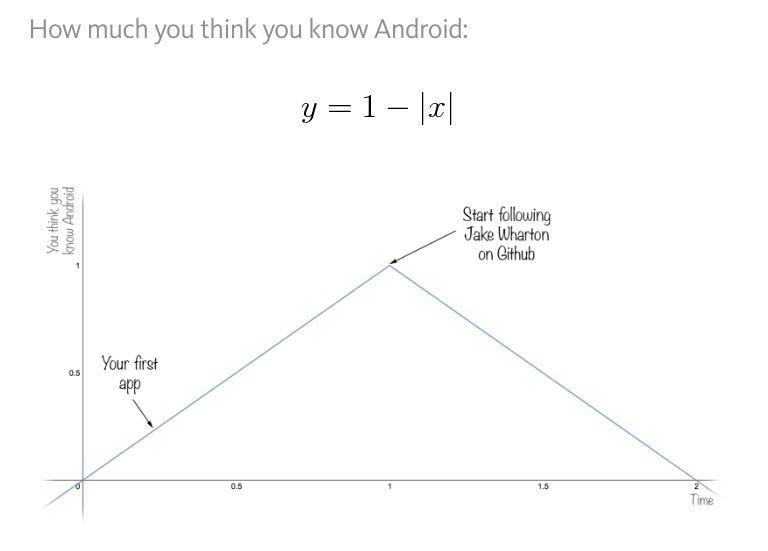
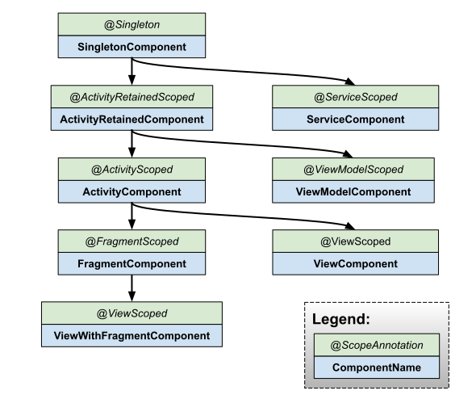

class: center, middle

# Dependency Injection

Dmitry Melnikov

---

## Dependency Injection

### What is a dependency?

```
Class A => *uses* => Class B
```

```
Client => *uses* => Service
```

### Class B is both a client and a service:

```
Class A => *uses* => Class B => *uses* => Class C
```

---

## How do clients get references to services?

- instantiation
- static method call (factory)
- static global variable
- gets references "outside"
- *reflection*

First three are active dependencies resolution, the fourth one is a dependency injection (DI).

DI is a providing services to clients from "outside".

---


## Dependency Injection

Usually DI has at least two meanings:

The act of providing (injecting) the required dependencies using one of the fundamental techniques: constructor, method or field injection (DI technique).

Dependency injection architecture pattern (DIAP).


---

## Dependency Injection techniques

```kotlin
class Client(private val service1: Service1) {

    private var service2: Service2? = null

    fun setService2(service2: Service2) {
        this.service2 = service2
    }

    lateinit var service3: Service3

    fun doSmth() {
        service1.doSmth1()
        service2.doSmth2()
        service3.doSmth3()
    }
}
```

---

## Dependency Injection techniques

### Constructor injection

Pros:
- simple
- constructor signature reflects deps
- injected fields can be [finalized](https://shipilev.net/blog/2014/safe-public-construction/) (val)
- easy to mock services in unit tests

Cons:
- none

---

## Dependency Injection techniques

### Method injection

Pros:
- method signature reflects deps
- can happen after construction

Cons:
- not as explicit as a constructor injection
- can lead to implicit ordering requirements (temporal coupling)

---

## Dependency Injection techniques

### Field injection (property in Kotlin)

Pros:
- can happen after construction

Cons:
- all cons of the method injection
- not evident deps

---

## Dependency Injection techniques

Constructor dependency injection technique looks best by far.

Prefer it to other techniques unless:
- no service instance at the moment of client instantiation (service locator)
- instantiation is out of your scope (e.g. Activity)
- limitations on constructor (e.g. Fragment)

---

## Dependency Injection

### What is it?

Most popular [answer](https://stackoverflow.com/questions/130794/what-is-dependency-injection) at the StackOverflow:

> Dependency Injection is passing dependency to other objects or framework

It's incomplete. It's just a technique.

--

### Some more questions

Should such fields be injected? 

```kotlin
val list: List<A> = ArrayList()
```

--

Is it enough to pass a `ServiceLocator` to a constructor?

--

Why DI frameworks exist if DI is just a passing deps into constructors?

--

If all clients get services from outside, where all of them are instantiated?

---

## Dependency Injection architecture pattern

Segregates application logic into two sets of classes:

- **Functional set**

Contains classes that encapsulate core application functionality

- **Construction set**

Contains classes that resolve dependencies and instantiate objects from a functional set.

Each class in the app should be a part only of one of these sets.


```                                                                  
                Application                  
+----------------+        +-----------------+
|Construction set|        | Functional Set  |
|                |        |                 |
| Class1..       | <----> |  Class1..       |
|   ClassN       |        |    ClassN       |
+----------------+        +-----------------+
```

Segregation into these sets is a **Separation of concerns**.

Concerns of core app's functionality separated from concerns of creating and wiring.

---

## Dependency Injection architecture pattern

DI — separation of concerns at the highest level of abstraction.

It's not about frameworks, annotations, or any other implementation details.

---

## DI techniques vs DIAP

Different levels of abstraction (class vs application)

--

DI techniques - class level Single Responsibility Principle

--

DIAP - application level Separation of Concerns

--

DIAP implementations use DI techniques under the hood

--

It's not enough to employ DI techniques to build DIAP

---

## Dependency Injection sample

Myths:

- small applications don't need DI
- it doesn't worth investments
- DIAP is about frameworks

Pure Dependency Injection 
    aka Manual Dependency Injection
    aka Vanilla Dependency Injection
    aka Poor Man's Dependency Injection

Service Locator ≠ DIAP

---

## Dependency Injection sample

```sh
git clone git@github.com:melnikovdv/android-arch-2.git
git checkout 2d28dd5
```

---

## Pure DI

```
                             Application                  
+-----------------------------+        +-----------------+
| Construction set            |        | Functional Set  |
|                             |        |                 |
| CompostitionRoot            | <----> |  Class1         |
| ActivityCompositionRoot     |        |  ...            |
| PresentationCompositionRoot |        |  ClassN         |
| MvpViewFactory              |        |                 |
| Injector                    |        |                 |
| ...                         |        |                 |
+-----------------------------+        +-----------------+
```

Single entry point class for all dependencies

Dependency graph

Responsible for creating services and wiring them together

---

## Law of Demeter

Principle of the least knowledge

Minimize class dependencies

Use of [Law of Demeter](https://en.wikipedia.org/wiki/Law_of_Demeter) makes fewer dependencies and more readable and maintainable code.

---

## Objects vs Data Structures

Objects expose behavior.

Data structures expose data.

It's ok to create data structures in-place, but not ok to create objects. 

Data structures are Kotlin data classes and Java records. 

---

## Dependency Injection benefits

Non-repetitive definition and exposure of the entire object graph.

You can keep your classes small and focused, but still easily compose them into arbitrary long chains to achieve complex functionality.

It enables Single Responsibility Principle and Reusability.

Testability: easier to write unit tests (test doubles, mocks). 

Context isolation (for Android, activity leaks)

---

## Additional Dependency Injection benefits

`BlogItemMvpFragment` dependency on `BlogItemMvpViewImpl` was eliminated in favor to `BlogItemMvpView` contract.

Sample profit: A/B testing with different ViewImpls. We can change View without changing Activity code.

It's OCP: an ability to modify functionality of a unit without changing its code.

---

## Injector

Create Injector class with CompositionRoot to inject fields, not `this.somethin` manually

--

### Annotations and reflection sample to inject automatically

```sh
git clone git@github.com:melnikovdv/android-arch-2.git
git checkout 33e7216
```

#### Cons

Hardcoded in Injector which is bad

Performance could be bad either (every time inspecting hundreds of fields inherited from the `Fragment` is quite expensive)

---

## Pure Dependency Injection cons

Pure DI is error-prone and forces you to write lots of code

Can be fixed with a DI framework

---

## Dependency Injection Framework

External library

Provides a specific template for Construction Set implementation

Provides set of pre-defined conventions

---

## Dagger 2

Dagger 2 is the most mature DI framework for now

### History

Dagger 1 by Square, deprecated (reflection based)

Dagger 2 by Google

dagger.android package, deprecated

Dagger Hilt

### Cons

Dagger is considered the most complex DI framework in Android world

---

## Dependency Injection with Dagger 2

.left-half[

Uses Code generation


### Cons

Poor docs

Lack of best practices

Too many features


### Pros

No boilerplate code

Easier to refactor

]

.right-half[


]

---

## Dependency Injection with Dagger 2 sample

```sh
git clone git@github.com:melnikovdv/android-arch-2.git
git checkout dagger2
```

---

## Dependency Injection with Dagger 2

### Components and modules (commit 43f27f4) 

Components are interfaces annotated with @Component

Modules are classes annotated with @Module

Methods in modules with @Provides provide services  

Provided services can be used as method arguments in other provider methods

Scopes are annotations annoteted with @Scope

Components that provide scoped services must be scoped

All clients get the same instance of a scoped service from the same instancce of a Component

Void methods with single argument defined on components generate injectors for the type of the argument

Client's non-private non-final properties (fields) annotated with @Inject designate injection targets

---

## Dependency Injection with Dagger 2

### Components dependencies (commit 43b8947)

Component inter-dependencies are specified as part of @Component annotation

Component B that depens on Component A has implicit access to all services exposed by Component A
    Services from A can be injected by B
    Serivces from A can be consumed inside modules of B

---

## Dependency Injection with Dagger 2

### Subcomponents (commit eaac8a7)

Subcomponents specified by @Subcomponent annotation

Parent componennt exposes factory method which returns Subcomponent

The argument of the factory method are Subcomponent's modules

Subcomponents get access to all services provided by parent (provided, not just exposed)

---

## Dependency Injection with Dagger 2

### Multi modules (commit 86dc54f)

Components can use more than one module

Modules of a single Component share the same object graph

Dagger automatically instantiates modules with no-arguments constructors

---

## Dependency Injection with Dagger 2

### Automatic injects (commit aca2e5b)

Dagger can automatically discover services having a public constructor annotated with @Inject annotation

Automatically discovered services can be scoped

@Binds annotation helps to resolve dependency types between interfaces and its implementations

---

## Dependency Injection with Dagger 2

### Static providers (commit a957b6d)

Dagger generates more performant code for static providers in Modules (use companion object or top-level object in Kotlin)

@Component.Builder (or @Subcomponent.Builder) designates inner builder interface for Component

@BindsInstance allows for injection of "bootstrapping dependencies" directly into Component builders

---

## Dependency Injection with Dagger 2

### Qualifiers (commit dc8351e)

Qualifiers are annotations classes annotated with @Qualifier

Qualifiers are part of the type (@Q1 Service and @Q2 Service are different types)

You can use the standard @Named(String) qualifier

---

## Dependency Injection with Dagger 2

### Providers (commit bb494cf)

Provider<Type> wrappers are "windows" into Dagger's object graph and allow you to retrieve a single type of services

Providers are basically "extensions" of composition roots

You use Providers when you need to perform "late injection" (factories)

---

## Dependency Injection with Dagger 2

### Assisted inject

```kotlin
class MyDataService @AssistedInject constructor(
    dataFetcher: DataFetcher,
    @Assisted config: Config
) {}
```

```kotlin
@AssistedFactory
interface MyDataServiceFactory {
  fun create(config: Config): MyDataService
}
```

```kotlin
class MyApp {
  @Inject lateinit var serviceFactory: MyDataServiceFactory;

  fun setupService(config: Config): MyDataService {
    val service = serviceFactory.create(config)
    ...
    return service
  }
}
```
---

## When you integrated Dagger 2


---

## Who is that guy?



---

## WWJD


---

## Hilt

[https://developer.android.com/training/dependency-injection/hilt-android](https://developer.android.com/training/dependency-injection/hilt-android)

```sh
git clone git@github.com:melnikovdv/android-arch-2.git
git checkout dagger2
```

- Application (by using @HiltAndroidApp)
- ViewModel (by using @HiltViewModel)
- Activity
- Fragment
- View
- Service
- BroadcastReceiver

---

## Hilt



---

## Hilt

```sh
Android component          Default bindings
-----------------------------------------------------------------
SingletonComponent         Application
ActivityRetainedComponent  Application
ViewModelComponent         SavedStateHandle
ActivityComponent          Application, Activity
FragmentComponent          Application, Activity, Fragment
ViewComponent              Application, Activity, View
ViewWithFragmentComponent  Application, Activity, Fragment, View
ServiceComponent           Application, Service
```
