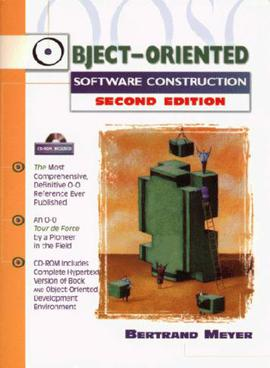
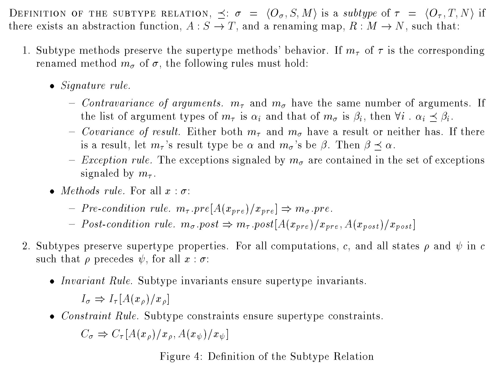
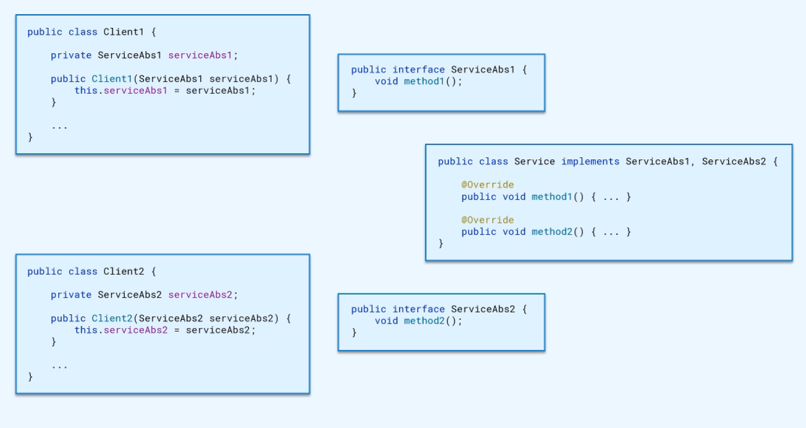
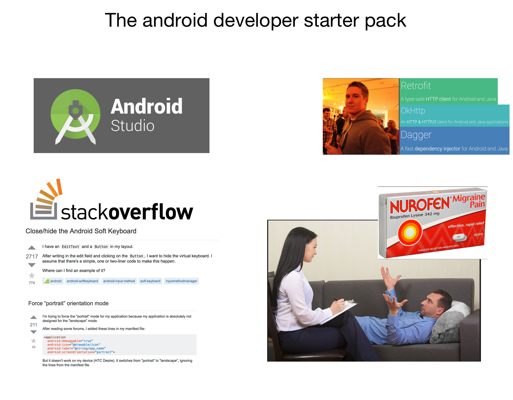

# SOLID principles

Dmitry Melnikov

---

## SOLID principles

**S**ingle Responsibility Principle

**O**pen Closed Principle

**L**iskov Substitution Principle

**I**nterface Sergregation Principle

**D**ependency Inversion Principle

---

## History

First mentioned in Robert "Uncle Bob" Martin's book.

.width-50[


]

???

Wrote several popular books

Popularized the adjective "clean"

One of the authors of the Manifesto for Agile Software Development

Started Software Craftsmanship Movement

---

## History

In 2004 or thereabouts, Michael Feathers sent me an email saying that if I
rearranged the principles, their first words would spell the word SOLID — and
thus the SOLID principles were born.

It's decades of academic research and industry experience.

.width-50[


]

---

## Single Responsibility Principle

### SRP Definition 1

Each class should have only one *responsibility*.

--

But what is responsibility?

No precise definition

Impossible to reason about

It's not a practical definition

---

## Single Responsibility Principle

### SRP Definition 2

Code is satisfied to SRP if you are able to describe what each class does without saying "and".

```java
public class AuthManager {
    public void login(String username, String password) {
        // …
    }

    public void logout() {
        // …
    }
}
```

⛔ Logs users into the system **and** logs users out of the system.

But

✔ Handles users's authentification.

---

## Single Responsibility Principle

### SRP Definition 3

Each class should have only one reason to change.

---

## Single Responsibility Principle

### Example

Uncle Bob's [blog post](https://blog.cleancoder.com/uncle-bob/2014/05/08/SingleReponsibilityPrinciple.html)

```java
public class Employee {

  public Money calculatePay();
  
  public void save();
  
  public String reportHours();
}
```

---

## Single Responsibility Principle

### Reusability

```
+-------------------------------+
|        class Feature1         |
| +------------+ +------------+ |
| |    doA()   | |   doB()    | |
| +------------+ +------------+ |
+-------------------------------+

```

---

## Single Responsibility Principle

### Reusability

```
+-------------------------------+
|        class Feature1         |
| +------------+ +------------+ |
| |    doA()   | |   doB()    | |
| +------------+ +------------+ |
+-------------------------------+

```

```
+-------------------------------+
|        class Feature2         |
| +------------+ +------------+ |
| |    doA()   | |   doC()    | |
| +------------+ +------------+ |
+-------------------------------+
```

```
+-------------------------------+
|        class Feature3         |
| +------------+ +------------+ |
| |    doB()   | |   doC()    | |
| +------------+ +------------+ |
+-------------------------------+
```

---

## Single Responsibility Principle

### Summary

Practical definition: each class should have only one reason to change.

How to follow SRP:

- list all the requirements
- analyze them for reasons to change
- extract to standalone classes

Pros:

- small and easy to understand components
- most probable to changes functions are encapsulated in standalone classes
- better implementation decisions
- easier to reuse
- more flexibility of the codebase as a whole

High cohesion and low coupling

---

## Abstraction

Abstraction is an alternative representation of a concept that hides irrelevant details and exposes only the properties you are interested in.

> "If you can't explain it to a six year old, you don't understand it yourself." ― Albert Einstein

---

## Abstraction

### Example

Coffee machine hides all the details how to boil cappucino.

.width-50[


]

---

## Abstraction

### Software abstraction example

```
CPU -> Firmware -> OS -> Application
```

Application abstraction example

```
Statement 
    -> Method (expose operations) 
        -> Object (expose functional behavior) 
            -> Module (expose domain concept) 
                -> Application
```

---

## Abstraction

### Summary

Interface and Implementation

Essential abstractions:
- external dependencies (services, libraries, frameworks, system)
- IO (file, network)
- database


---

## Open Closed Principle

Software entities (classes, modules, functions) should be open for extension, but closed for modification.

---

## Open Closed Principle

### History

> Open Closed Principl: Modules should be open and closed — Bertrand Meyer, 1988



---

## Open Closed Principle

### History

> A module is said to be open if it is still **available for extention**. For example, it should be possible to expand its set of operations or add fields to its data structures

> A module is said to be closed if it is **available for use by other modules**. This assumes that the module has been given a **well-defined, stable description** (its interface in the sense of information hiding). At the implementation level, closure for a module also implies that **you may compile it**, perhaps **store it in a library**, and make it available for others (its clients) to use.


---

## Open Closed Principle

### History

No changes after modules released to clients

It's possible to extend all modules

> Design and document for inheritance or else prohibit it. — Joshua Bloch, Effective Java

---

## Open Closed Principle

### History

Robert "Uncle Bob" Martin, Agile Software Developments: Principles, Patterns, and Practices.

> How is it possible that the behaviors of a module can be modified without changing its source code? Without changing the module, how can we change what a module does?


> **The answer is abstraction**. In C# or any other object-oriented programming language (OOPL), it is possible to create abstractions that are fixed and yet represent an unbounded group of possible behaviors. The abstractions are abstract base classes, and the unbounded group of possible behaviors are represented by all the possible derivative classes.

> It is possible for a module to manipulate an abstraction. Such a module can be closed for modification, since it depends on an abstraction that is fixed. Yet the behavior of that **module can be extended by creating new derivatives of the abstraction**.

---

## Open Closed Principle

### Definition

Software entities (classes, modules, functions) should be open for extension, but closed for modification.

≈

Depend on stable abstractions and change system's behaviour by providing different implementations.

OCP is polymorphism principle.

Further reading: [Protected Variation: The importance of being Closed](https://www.martinfowler.com/ieeeSoftware/protectedVariation.pdf)

---

## Open Closed Principle

### Example

#### Brewing coffee before

```java
public class CoffeeMachine {

    public void brew(Order order) {
        if (order.getType() == Type.ESPRESSO) {
            // brew espresso
        } else if (order.getType() == Type.CAPPUCCINO) {
            // brew cappuccino
        } else {
            // brew other
        }
        // …
    }
}
```

---

## Open Closed Principle

### Example

#### Brewing coffee after

```java
public class CoffeeMachineOCP {

    private final BrewerFactory brewerFactory;

    public CoffeeMachineOCP(BrewerFactory brewerFactory) {
        this.brewerFactory = brewerFactory;
    }

    public void brew(Order order) {
        Brewer brewer = brewerFactory.getBrewer(order.getType());
        brewer.brew();
    }
}
```

---

## Open Closed Principle

### Summary

OCP minifies challenges in predictable changes

Limitations
- not applicable to all classes in the app
- can't monify challenges from all possible changes

You need some experience to extract right abstractions

If done right it's easy to provide additional business value

---

## Liskov Substitution Principle

If S is a subtype of T, then objects of type T may be replaced with objects of type S (i.e. an object of type T may be substituted with any object of a subtype S) without altering any of the desirable properties of the program (correctness, task performed, etc.)

Simple example:

`class Rectnagle` and `class Square`

If square is a subtype of Rectangle, everywhere I use `Reactangle` I can substitute it with `Square` without any failures.

What is subtype? How can I determine LSP violations ahead of time?

---

## Liskov Substitution Principle

### History

Barbara Liskov, [Turing Award laureate](https://amturing.acm.org/award_winners/liskov_1108679.cfm) 2008.

> For contributions to practical and theoretical foundations of programming language and system design, especially related to data abstraction, fault tolerance, and distributed computing.

[Data Abstraction and Hierarchy](https://pdfs.semanticscholar.org/36be/babeb72287ad9490e1ebab84e7225ad6a9e5.pdf), 1987.


> Abstractions can be used to encapsulate potential modifications. For example, suppose we want a program to run on different machines. We can accomplish this by inventing abstractions that hide the differences between machines so that to move the program to a different machine only those abstractions need be reimplemented. A good design principle is to think about expected modifications and organize the design by using abstractions that encapsulate the changes.

≈ OCP

[Behavioral Subtyping Using Invariants and Constraints](http://reports-archive.adm.cs.cmu.edu/anon/1999/CMU-CS-99-156.pdf), 1999.

---

## Liskov Substitution Principle

### Rules

```java
class ServiceSubclass extends Service {}
```

`ServiceSubclass` could be not a subtype of `Service`

---

## Liskov Substitution Principle



---

## Liskov Substitution Principle

### Contravariance of arguments

If subclass implements a method from its superclass, then the number of arguments should be the same.

The type of each argument in subclass method should be the supertype of the type of the respective arguments in superclass method.

```java
class Service {
    doSmth(Argument arg) { /*…*/ }
}

class ServiceSubclass extends Service {
    doSmth(SubclassArgument arg) { /*…*/ }
}
```

Don't make subclass method arguments more specific.

---

## Liskov Substitution Principle

### Covariance of result

Either both superclass and sublass methods return result, or neigher does.

If there is a result, then the type of the result in the subclass is a subtype of the type of the result in the superclass.

```java
class Service {
    Result doSmth() { /*…*/ }
}

class ServiceSublass extends Service {
   ResultSubclass doSmth() { /*…*/ }
}
```

Overridden method returns a result if and only if the parent method does too.

Don't make subclass methods return more general types.

---

## Liskov Substitution Principle

### Exception rule

Exceptions thrown by a method in the subclass should be contained in the set of exceptions thrown by the respective method in the superclass.

Checked exceptions checked by compiler, but unchecked not.

`class HttpClientException extends IOException`

`class HttpsClientException extends IOException`

Don't throw new types of exceptions from subclasses.

---

## Liskov Substitution Principle

### Pre-condition rule

Pre-condition is an assertion about the state of the system before the method is called.

Pre-conditions required by methods of a subclass mustn't be stronger than pre-conditions required by methods of a superclass.

```java
class Service {
    doSmth(Argument arg) { /*…*/ } // non null or null
}

class ServiceSubclass extends Service {
    doSmth(SubclassArgument arg) { /*…*/ } // non null
}
```

`ServiceSubclass` isn't a proper subtype because of stronger pre-conditions.

A subclass should be able to operate with all states that a superclass can operate in.

---

## Liskov Substitution Principle

### Post-condition rule

Post-condition is an assertion about the state of the system after method execution completes.

Post-conditions guaranteed by methods of a subclass mustn't be weaker than post-conditions guaranteed by methods of a superclass.

```java
class Service {
    Result doSmth() { /*…*/ } // non null
}

class ServiceSublass extends Service {
   ResultSubclass doSmth() { /*…*/ } // nullable
}
```

`ServiceSubclass` isn't a proper subtype bacause it guarantees weaker post-conditions.

Clients shouldn't be surprised by the results of invocation of methods of a subclass.

---

## Liskov Substitution Principle

### Invariant rule

Invariant is an assertion about a specific class property which is always true.

Invariants guaranteed by a subclass must include all invariants guaranteed by a superclass.

Ex: Number of elements in the queue <= capacity

---

## Liskov Substitution Principle

### Constraint rule

Constraint is an assertion about how class property evolves over time.

Invariants can't express dynamic properties, so constraints were added.

```java
class MessageErrorDetector {
    void processMessage(Message message) { /*…*/ }
    boolean isErrorDetected() { /*…*/ }
}
```

Constraints enforced by a subclass must include all constraints enforced by a superclass.

```java
class MessageErrorDetectorSubclass {
    void processMessage(Message message) { /*…*/ }
    boolean isErrorDetected() { /*…*/ }
    void resetError() { /*…*/ }
}
```

---

## Liskov Substitution Principle

### Example

```java
class Rectangle {
    void setWidth(int width) { /*…*/ }
    void setHeight(int height) { /*…*/ }    
}

class Square extends Rectangle {
    void setWidth(int width) { /*…*/ }
    void setHeight(int height) { /*…*/ }    
}
```

1. Contravariance of arguments
2. Covariance of result
3. Exception rule
4. Pre-condition rule
5. Post-condition rule
6. Invariant rule ⚠ Square invariant: width = height
7. Constraint rule ⚠ Rectangle constraint: setWidth() doesn't change the height

---

## Liskov Substitution Principle

### Summary

Subtype is a subclass or an implementation which can be substituted for the type it extends or implements.

> Design and document for inheritance or else prohibit it. — Joshua Bloch, Effective Java

Android example:

`Application`, `Activity` and `Service` all extends `Context` and violite LSP.

https://stackoverflow.com/questions/3572463/what-is-context-on-android

---

## Interface Segregation Principle

Clients shouldn't be forced to depend on methods they don't use.



RxJava: Observable, Subject are separated according to ISP.

AppVisibility / ScreenOn.

---

## Interface Segregation Principle

### Summary

Segregated interfaces allow to segregate functionality if/when needed.

---

## Dependency Inversion Principle

High-level modules should not depend on low-level modules. Both should depend on abstractions.

Abstractions should not depend on details. Details should depend on abstractions.


.left-half[

```
   +-----------------------+  
   |     TopLevelClass     |  
   +-----------------------+  
               |              
   +-----------|-----------+  
   |     MidLevelClass     |  
   +----------/-\----------+  
           /--   --\          
        /--         --\       
+----------+      +----------+
|    F1    |------|    F2    |
+----------+      +----------+
```

]

.right-half[

```
   +-----------------------+  
   |     TopLevelClass     |  
   +-----------------------+  
               |              
   +-----------|-----------+  
   |  MidLevelAbstraction  |  
   +-----------|-----------+  
               |              
   +-----------|-----------+  
   |     MidLevelClass     |  
   +----------/-\----------+  
           /--   --\          
        /--         --\       
+----------+      +----------+
|    F1    |------|    F2    |
+----------+      +----------+
```

]

Inverted flow of control - IOC.

Service and Service Callback.

Works even for modules and different teams.


---

## Dependency Inversion Principle

### Summary

Protection from future changes in requirements

Reusability

Break dependency on external modules

Easier integration between modules

Better visibility and accountability

Cons:

More efforts to implement

More efforts to change

Increased code complexity

---

## SOLID Principles summary

Follow the principles 😳

SRP: small classes with narrow functionality

OCP: make abstractions to minify impact of changes

LSP: proper subtyping

ISP: depend only on functionality classes actually use

DIP: inversion of flow control


---

## Software architecture and design patterns summary

> Managing complexity is the most important technical topic in software development. In my view, it's so important that Software's Primary Technical Imperative has to be managing complexity. Complexity is not a new feature of software development. — Steve McConnel, Code Complete.


### Code complexity

```
+----------------------------------------------+
| +---------------------+                      |
| |                     |                      |
| |                     |                      |
| | +--------+ 5000 LOC |                      |
| | |500 LOC |          |                      |
| | +--------+          |                      |
| +---------------------+                      |
|                              50000 LOC       |
|                                              |
|                                              |
|                                              |
+----------------------------------------------+
```

---

## Software architecture and design patterns summary

Managing complexity = deal with small parts of the app while safely ignoring other parts

No difference between 40K LOC and 50K LOC

Separation of Concerns

The code is read much more often than it's written, especially interfaces

Code simplicity (container ships)

---

## Software architecture and design patterns summary


---

## Software architecture and design patterns summary



---

class: center, middle

# The end

Dmitry Melnikov

[melnikovdv@gmail.com](melnikovdv@gmail.com)

[t.me/melnikovdv](t.me/melnikovdv)
