# Battery Consumption Details

## Tips & Tricks

Dmitry Melnikov

???

# Annotation

Всем привет. Я буду рассказывать про battery consumption в Android:

* посмотрим какие части смартфона сколько потребляют 
* чуть подробней остановимся на экране
* посмотрим как влияют различные пользовательские сценарии (браузер, фото, видео, GPS, игры) 
* разберем как менялся Android, чтобы оптимизировать энергопотребление
* обсудим что можно сделать, чтобы уменьшить расход в вашем приложении
* узнаем как Android собирает статистику энергопотребления и как посчитать ее для своего приложения

Приходите, будет интересно.

# Slides 

[https://battery-consumption.netlify.app/](https://battery-consumption.netlify.app/)

---

# Hierarchy of Needs

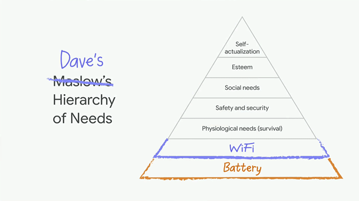

---

name: plan

# Plan

What hardware impacts power usage
 
LCD vs OLED displays; does dark mode save power?

Review smartphones power usage scientific research

Android API history that affects power usage

Review my own measures
 
Passive and active optimizations to reduce app power usage
 
How android measures battery impact

How to measure and monitor your app's battery impact

---

name: drain-sources

# What drains a smartphone battery?
    
Display  

CPU

GPS
  
GSM

Wi-Fi

Bluetooth
  
System  

---

# Display

## Galaxy S9

HD+ 1480x720
  
FHD+ 2220x1080
  
QHD+ 2960x1440

---

# Display 

## Does dark mode save power?

LCD/IPS – no

AMOLED – yes

black #000000, really?

## XDA user measurements

5% per hour / 18% per day

Does it worth it?

---

# Display 

## LCD 

Liquid-crystal display

Works by modulating properties of liquid crystals

Requires backlight behind to illuminate crystals

## OLED

Organic light-emitting diodes

Each pixel is made up of LEDs, which emit light

True black

No need for backlight

Displays can have different subpixel arrangements

???

Majority of devices are moving to OLED

---

# Display

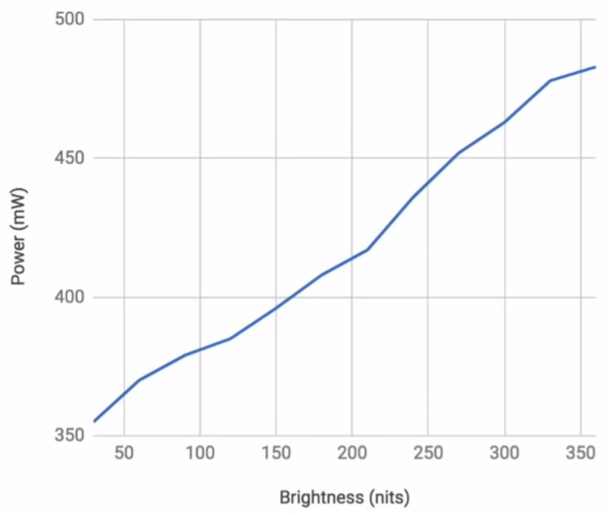

???

More brightness = more power

Brightness affects power usage in a (mostly) linear fashion

---

# Display

Compared Pixel (AMOLED) and iPhone 7 (LCD) displaying screenshot of Google Maps in normal and night mode

## iPhone 7

Max brightness normal mode: 230 mA

Max brightness night mode: 230 mA

## Pixel

Max brightness normal mode: 250 mA

Max brightness night mode: 92 mA

## 63% ↘

---

# Display 

At full brightness Pixel color value affects power usage

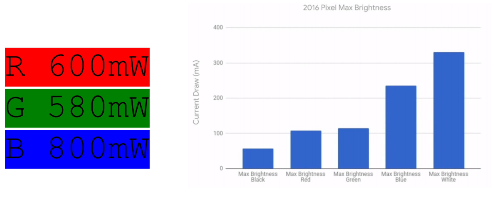

???

Since 2015 and Material design main color was changed from dark to light in Google guidelines.  

---

# Display

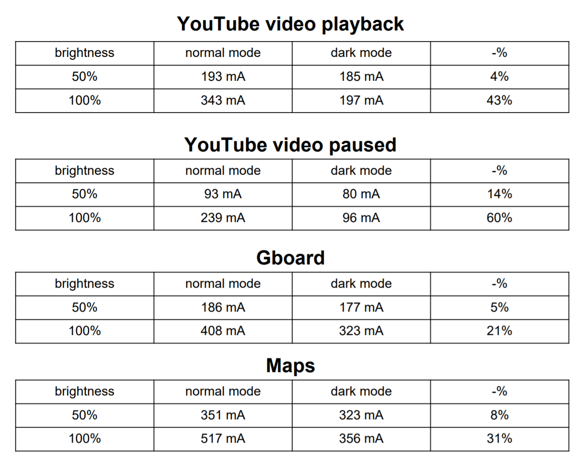

---

# Display 

## Dark mode

Theme.AppCompat.DayNight

-night qualifier colors.xml since API 8 😮

Runtime redraw

No api to check display type (gsmarena.com request)

Api to check phone dark/light mode since Android Q (API 29)

---

# Display

## Dark Mode vs Light: which is better?

[https://www.nngroup.com/articles/dark-mode/](https://www.nngroup.com/articles/dark-mode/)

---

# Display

### 90 / 60 / 120… Hz

LTPO (low-temperature polycrystalline silicon) is a changeable refresh rate. 5% - 20% ↘ 

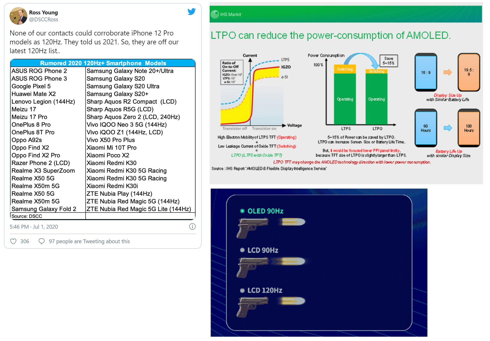

???

Tradeoff with 90Hz and above displays is substantially reduced battery life. 

During our test on the OnePlus 7 Pro, we noted 200 fewer minutes of browsing time when using the 90Hz mode versus the more standard 60Hz. In some cases, that battery tradeoff is simply not worth it — for instance, with the Google Pixel 4 already suffering from questionable battery life, we recommend disabling the 90Hz mode to ensure a good day’s worth of use.

---

template: drain-sources

---

# Bluetooth

.left-half[

### Bluetooth 4 LE 

≈ 2 Mbps ≈ 250 kB/s

### Bluetooth 5 LE

≈ 5 Mbps ≈ 625 kB/s

]

.right-half[

Google Nearby Messages API


Bluetooth, Bluetooth LE, Wi-Fi
and near-ultrasonic audio 

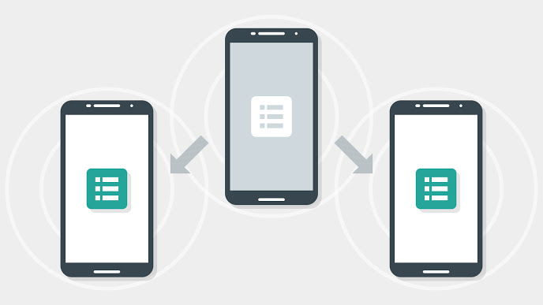

]

---

# GPS

## Fused Location Provider API 

Simple, battery-efficient location API for Android

> …signals provided by multiple sensors in the device to determine device location.

> …is a location API in Google Play services that intelligently combines different signals to provide the location information that your app needs.

> …manages the underlying location technologies, such as GPS and Wi-Fi, and provides a simple API that you can use to specify the required quality of service.

[https://developers.google.com/location-context/fused-location-provider](https://developers.google.com/location-context/fused-location-provider)

---

template: drain-sources

---

# Scientific research

--

**Gernot Heiser**

UNSW professor, Sydney, Australia

Secure Elements co-founder, Munich, Germany

> SEOS is an OS that is totally unique in that it is provably secure.
It is based on the seL4 microkernel, the world’s first and still only
general-purpose OS kernel **with a mathematical proof of
bug-free implementation** extending all the way to machine
code, and mathematical proofs of enforcement of securityrelevant isolation. Being based on this rock-solid foundation,
SEOS inherits seL4’s provable security and, unlike any other
OS, can guarantee system security

**Aaron Carroll**, his student and PhD

---

# Scientific research

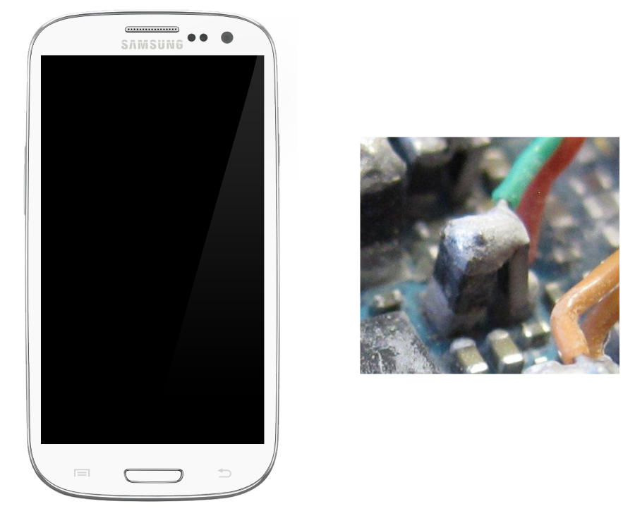

---

# Suspended

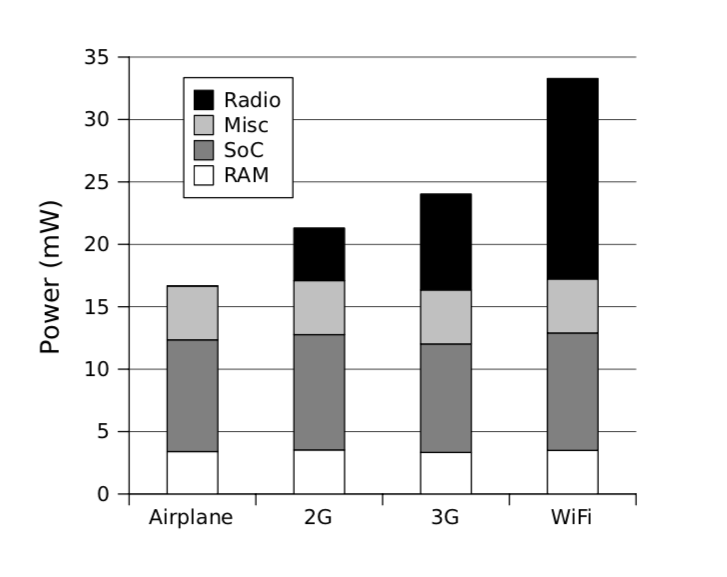

---

# Idle

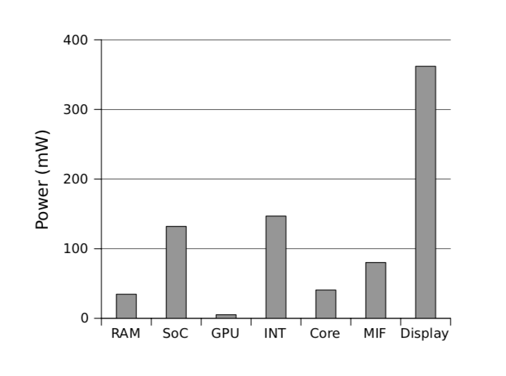

amps = watts / volts | 0.805 / 3.8 = 0.2118 amps | 2100 / 211.8 = 10 h

???

By applying this methodology to the S3, we can directly measure: the CPU cores, RAM, 3D GPU and several general system-on-chip (SoC) supplies. 

For the SoC, we distinguish three supplies: MIF (memory interface), INT (internal), and remaining miscellany SoC. 

Measuring power supplies to the radios is less straightforward: they are very sensitive to noise in the power supply, and therefore, some of their power is supplied from linear regulators, which are typically less energy efficient but show superior noise performance.

---

# Games

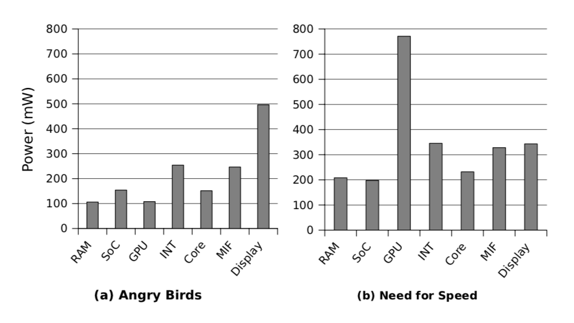

Angry Birds: 1516 mW, Need For speed: 2425 mW

---

# Video

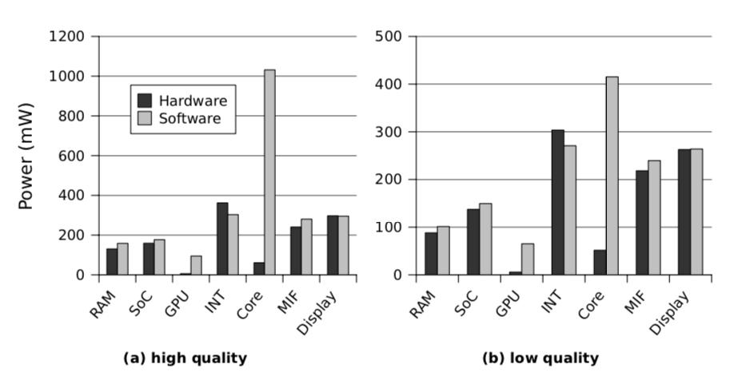 

**HQ** hw: 1270 mW, sw: 2329 mW
 
**LQ** hw: 1084 mW, sw: 1571 mW

---

# MP3

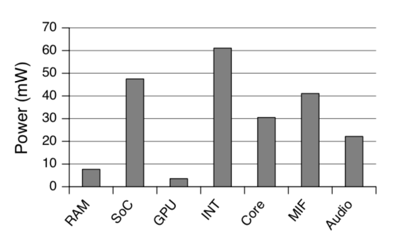

mp3 226 mW

---

# Call

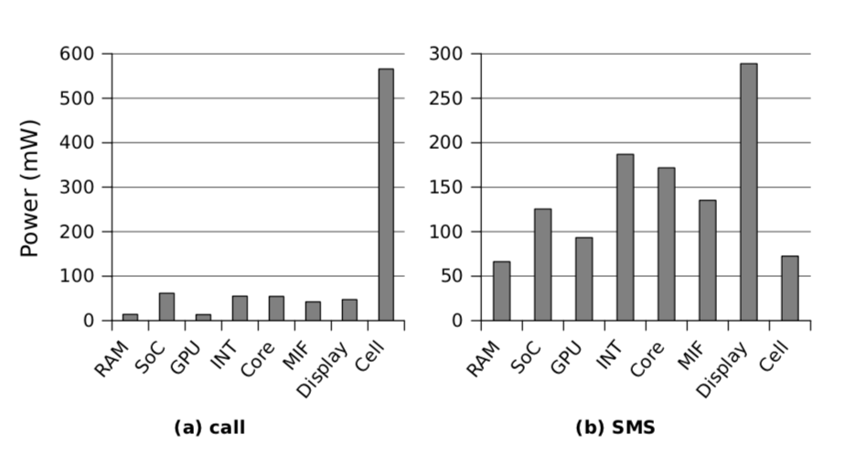

call 865 mW, sms 1140 mW

---

# Web browsing

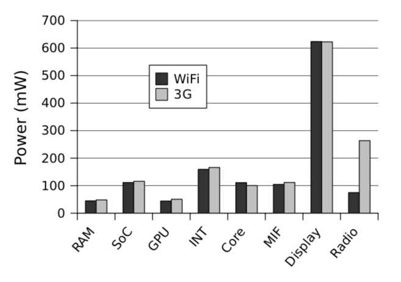

Wi-Fi 1275 mW / 3G 1479 mW

---

# Email

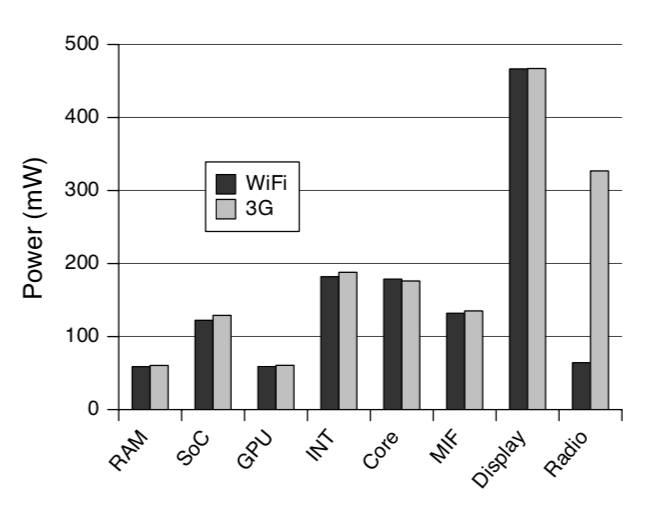

Wi-Fi 1264 mW / 3G 1543 mW

---

# Camera

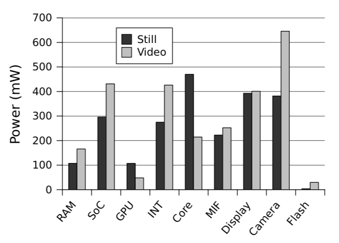

still 2256 mW / video 2614 mW

---

# Network

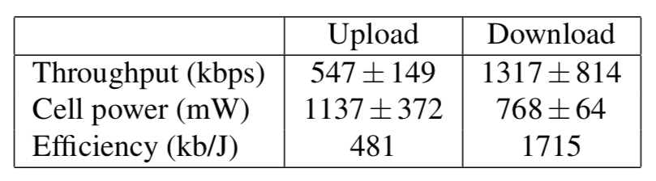

---

# Sensors

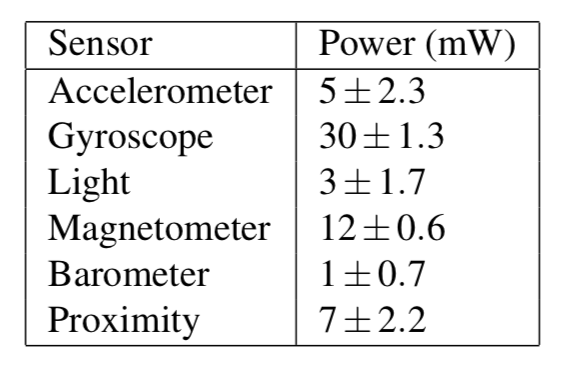

---

# GPS

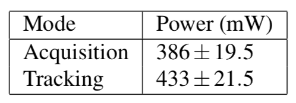

---

# Max power

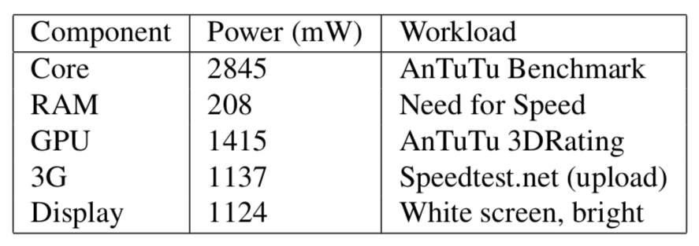

---

# Mobile networks

## 3G vs 4G

--

## LTE

--

## 5G

≈ twice faster, up to 1 Gbit/s

theoretical peak ≈ 20 Gbit/s

---

# Android history

Lazy first

## Reduce

## Defer

## Coalesce

???

Making your app Lazy First means looking for ways to reduce and optimize operations that are particularly battery-intensive. The core questions underpinning Lazy First design are:

**Reduce**: Are there redundant operations your app can cut out? For example, can it cache downloaded data instead of repeatedly waking up the radio to re-download the data?

**Defer**: Does an app need to perform an action right away? For example, can it wait until the device is charging before it backs data up to the cloud?

**Coalesce**: Can work be batched, instead of putting the device into an active state many times? For example, is it really necessary for several dozen apps to each turn on the radio at separate times to send their messages? Can the messages instead be transmitted during a single awakening of the radio?

You should ask these questions when it comes to using the CPU, the radio, and the screen. Lazy First design is often a good way to tame these battery killers.

---

# My measures

battery drain app [git.io/fAFq2](https://git.io/fAFq2)

Nexus 5, Pixel, 1400 requests

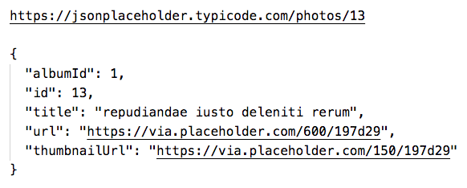

---

# My measures results


---

name: android-history 

# Android history

### L JobScheduler

### M Doze / App Standby / push

### N Doze on-the-go

### O Background limits

### P …

### 10 Dark Mode / Background location perm / Wi-Fi BT scans

### 11 One-time location perm

---

# Android P

fast file system work  
small core / big core  
CPU boosts

## App count problem

battery drain ∝ app count  
errors / aggressive apps / use cases

## adaptive battery + ML

## battery saver 

location off when screen off   
no network for bg apps

???

https://developer.android.com/about/versions/pie/power

https://developer.android.com/topic/performance/power/power-details

---

# Android P

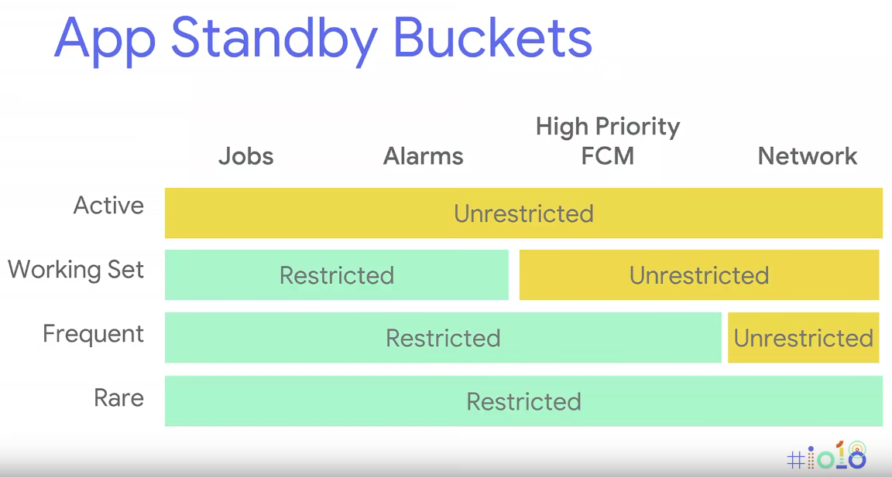

---

# Android P

© Evolution of Standby Mode

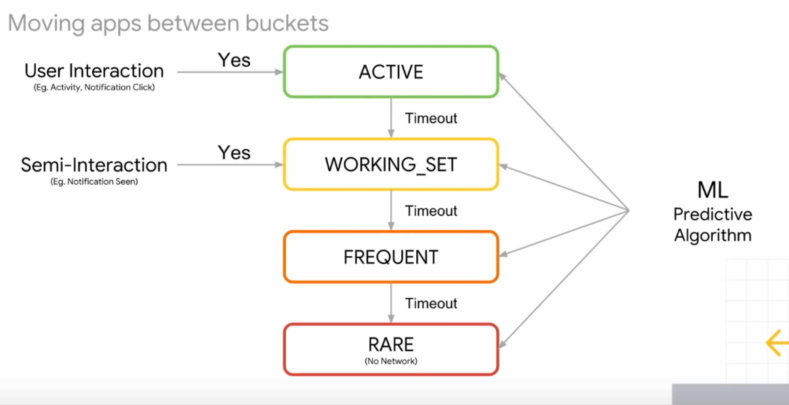

---

# Android P

.left-half[

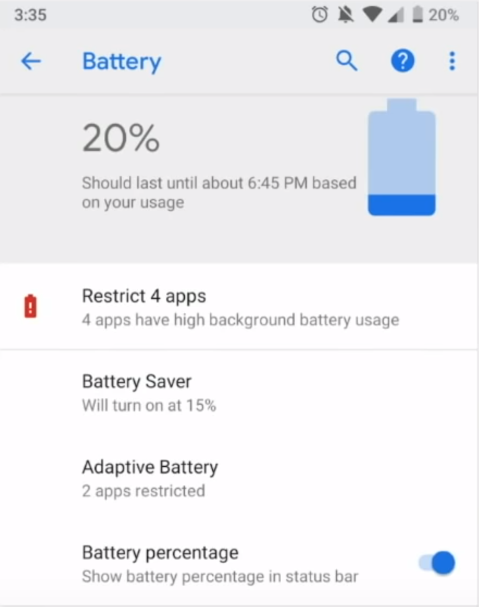
    
😲 also when charging!

OEMs will add own criterias  
foreground services  
FCM messages since Jan 2019  

]

.right-half[

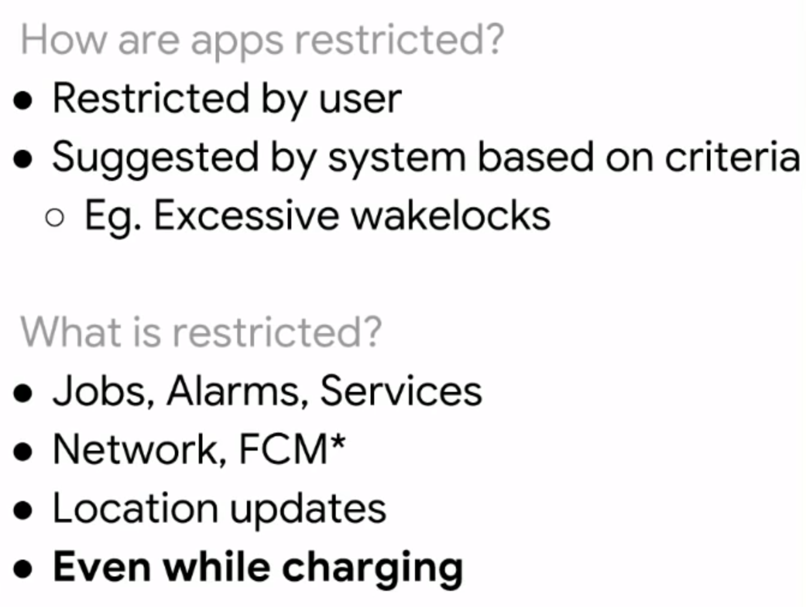

### Battery saver

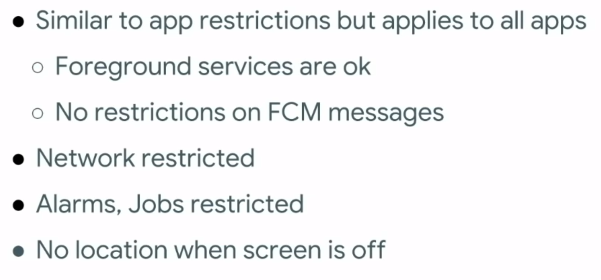

]

---

# Android P

## AOSP battery saver mode 

Android 9 makes a number of improvements to
battery saver mode. AOSP builds restrictions:

* aggressive app standby mode
* background limits regardless of their target API level
* location services disabled when the screen is off
* background apps do not have network access
* device-specific power optimizations

## Android vitals

[https://developer.android.com/topic/performance/power/power-details](https://developer.android.com/topic/performance/power/power-details)

---

template: android-history

---

# App vs System

## Battery optimizations whitelist

`REQUEST_IGNORE_BATTERY_OPTIMIZATIONS`


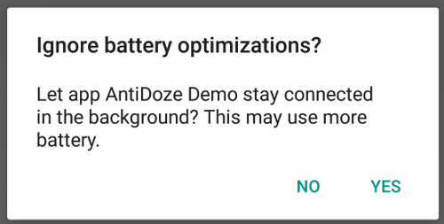

---

# App vs System

## Different OEMs intents 

[https://git.io/fAFZY](https://git.io/fAFZY)

### Xiaomi Auto Start and Battery usage monitoring and Power settings

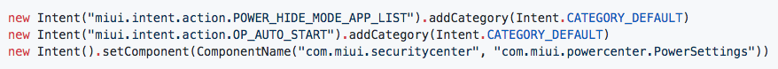

---

# Optimizations

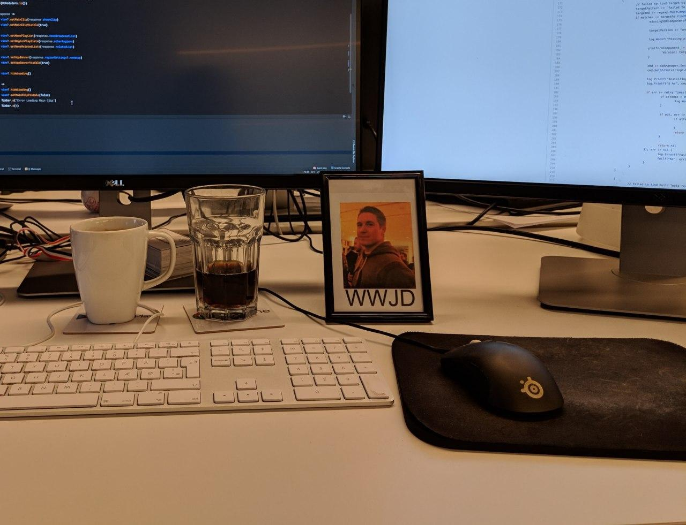

Passive and active optimizations

---

# Passive optimizations

## protocol

## compression

## serialization

## media formats

## tls connection

---

# Protocol 

## HTTP overhead

## Socket / WebSocket

## Bi-directional

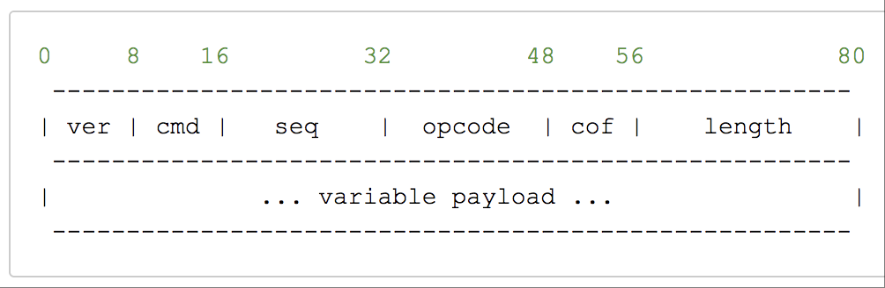

gRPC

---

# Compression & serialisation


---

# Compression & serialisation

.left-half[

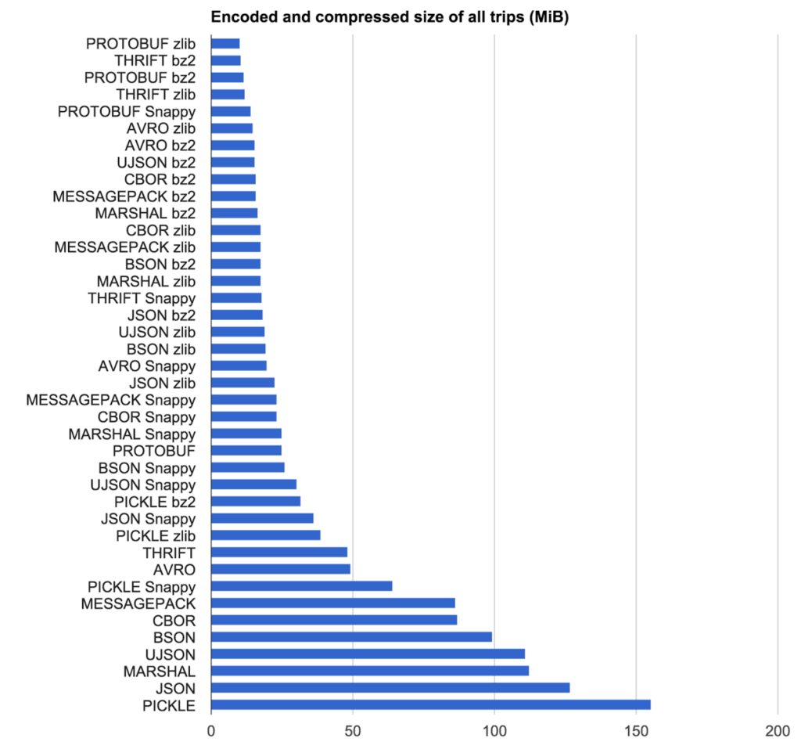

]

.right-half[

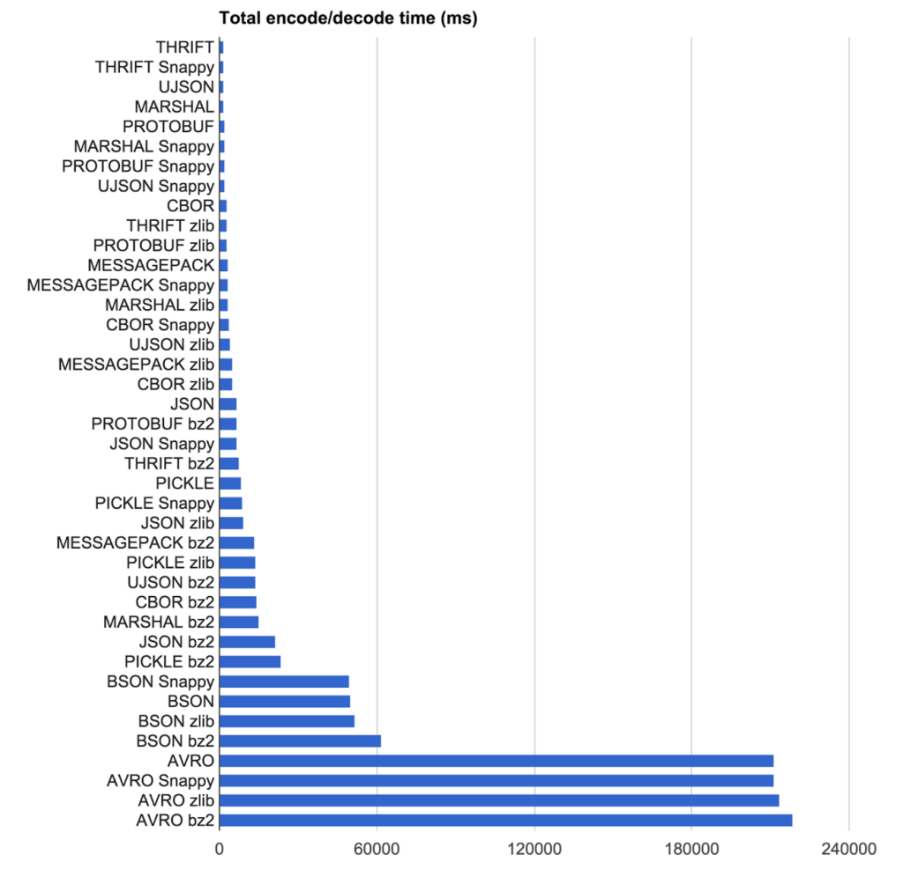

]

[https://eng.uber.com/trip-data-squeeze/](https://eng.uber.com/trip-data-squeeze/)

CBOR/Protobuf

Zlib/LZ4

[https://indico.cern.ch/event/631498/contributions/2553033/](https://indico.cern.ch/event/631498/contributions/2553033/attachments/1443750/2223643/zlibvslz4presentation.pdf) ↵
[attachments/1443750/2223643/zlibvslz4presentation.pdf](https://indico.cern.ch/event/631498/contributions/2553033/attachments/1443750/2223643/zlibvslz4presentation.pdf)

---

# Data formats

.left-half[


WebP lossless images are 26% smaller in size compared to PNGs

WebP lossy images are 25-34% smaller than comparable JPEG images at equivalent SSIM quality index

Supports transparency (alpha channel) at a cost of just 22% additional bytes

]

.right-half[


]

---

# TLS connection

## Connection reuse

## Session ids / session tickets

[https://blog.cloudflare.com/tls-session-resumption-full-speed-and-secure/](https://blog.cloudflare.com/tls-session-resumption-full-speed-and-secure/)

---

# Active optimizations

.left-half[

## Caching

## Batching

## Thumbnails & tiles

## Notifications

## Deferred tasks

]

.right-half[

## Roaming

## Bg data restrictions

## Power changes

## Connections

## Wakelocks

]

---

# Cache

– What's the name of your friend?

– It's Cache

.left-half[

]

???

HTTP: If-Modified-Since and

ETag headers

---

# Batching

## Disk

Disk I/O impact on power consumption

1 GB with 1KB buffer 2x more expensive as
with 10Mb buffer

1 GB with 100 B budder 5x more expensive
as with 1KB buffer

batching db I/O in transactions, cache writing
(log), larger buffers

## Network

Network on/off ?

Standby mode

Low power

Full power

---

# Thumbnails

Don’t download until requested (prefetching)

Ask about quality

Cache and hash

DownloadManager for long-running http

---

# Push notifications

## High-priority FCM pushes

## Disabled notifications (since API 24)

## Data in push notifications

---

# Deferred tasks

---

# Roaming

.left-half[


]

---

# Background data restrictions

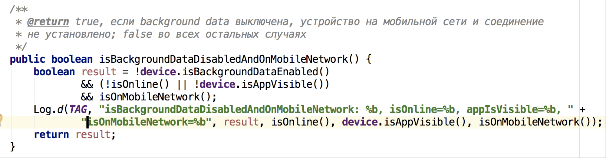

---

# Power changes

`PowerManager.isPowerSaverMode()`

`ACTION_POWER_SAVE_MODE_CHANGED`

`BATTERY_LOW`

`ACTION_POWER_CONNECTED`

---

# Connections

## Reuse

## Force disconnect

## Should connect ?

---

# Wakelocks

## Release them

keepScreenOn

---

# How smartphones measure

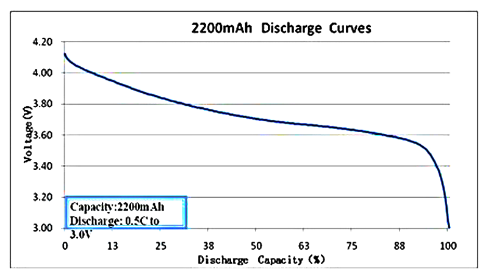

---

# How Android measures

.left-half[

## OEM's power profile

[source.android.com/devices/](https://source.android.com/devices/tech/power/values.html) ↵
[tech/power/values.html](https://source.android.com/devices/tech/power/values.html)


]

.right-half[

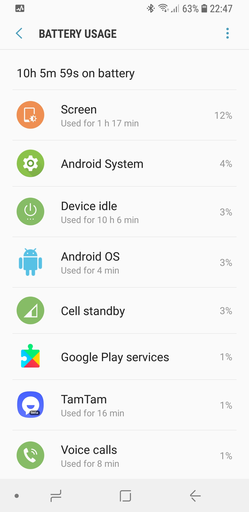

]

---

# How Android measures

## OEM's power profile

.left-half[

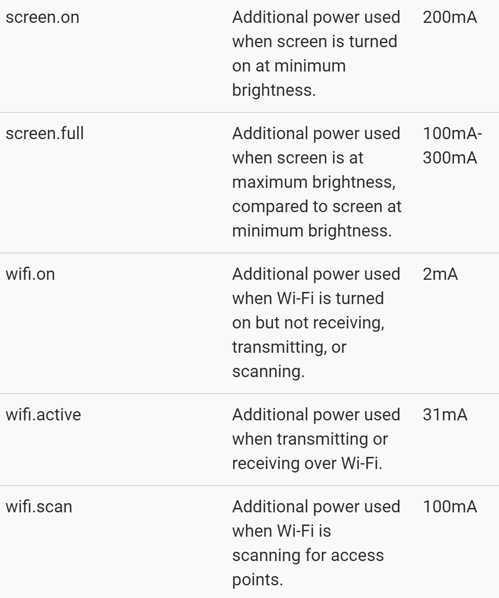

]

.right-half[

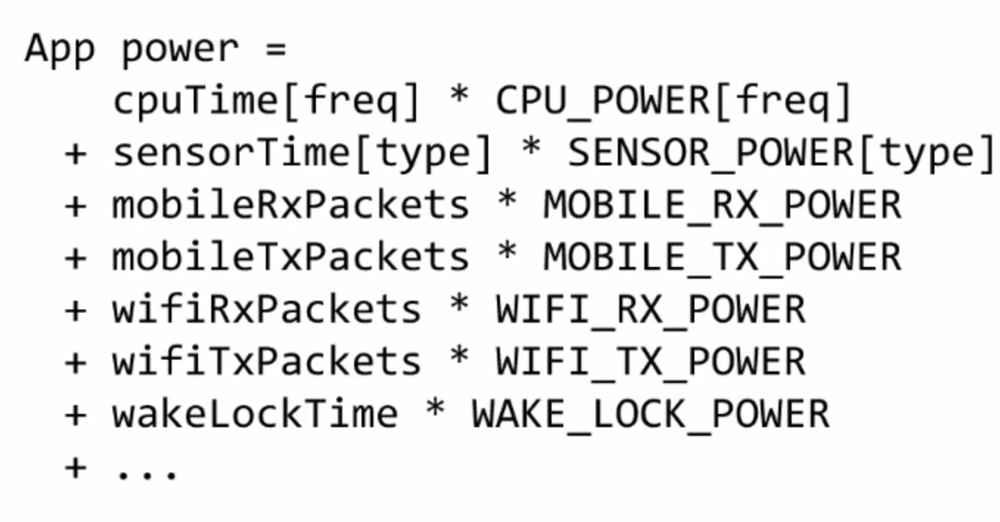

]

---

# How Android measures

### BatteryStats.java 8 KLOC

### BatteryStatsImpl.java 15 KLOC

[https://github.com/aosp-mirror/platform_frameworks_base/blob/master/](https://github.com/aosp-mirror/platform_frameworks_base/blob/master/core/java/android/os/BatteryStats.java) ↵
[core/java/android/os/BatteryStats.java](https://github.com/aosp-mirror/platform_frameworks_base/blob/master/core/java/android/os/BatteryStats.java)

[https://github.com/aosp-mirror/platform_frameworks_base/blob/master/](https://github.com/aosp-mirror/platform_frameworks_base/blob/master/core/java/com/android/internal/os/BatteryStatsImpl.java) ↵
[core/java/com/android/internal/os/BatteryStatsImpl.java](https://github.com/aosp-mirror/platform_frameworks_base/blob/master/core/java/com/android/internal/os/BatteryStatsImpl.java)

### Batterystats tool

```sh
adb shell dumpsys unplug
adb shell dumpsys batterystats --reset
…
adb shell dumpsys batterystats > [path/]batterystats.txt
adb bugreport > [path/]bugreport.zip
docker --run -p port_number:9999 gcr.io/android-battery-historian:2.1 --port 9999
```

---

# How to measure

## Statistics


```java
TrafficStats.getUidTxBytes(uid)
TrafficStats.getUidRxBytes(uid)
```

UsageStatsManager sample [git.io/v5tVf](git.io/v5tVf)

---

# How to measure

## Logs

.left-half[

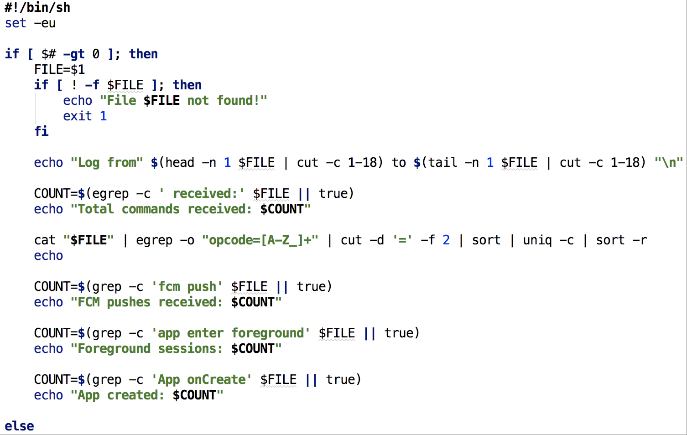

]

.right-half[

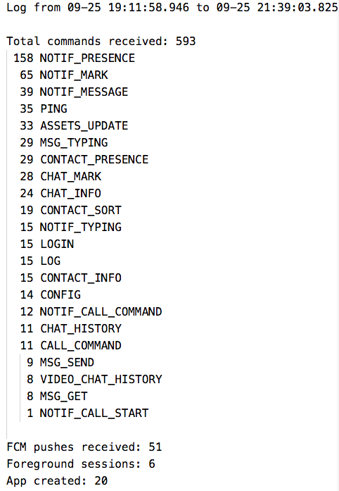

]

---

# How to measure

## Battery historian


---

# How to measure

## Battery historian bugreport comparison

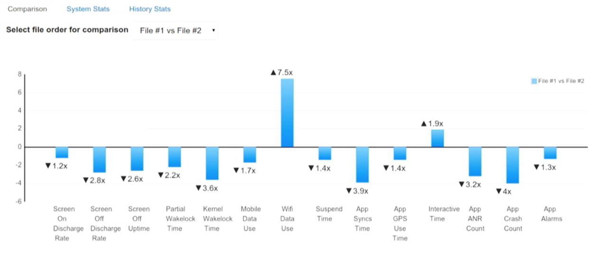

---

template: plan

---

# References 1

The Busy Coder’s Guide to Android Development, Mark Murphy [https://commonsware.com/Android/](https://commonsware.com/Android/)

Ёмкость аккумуляторов в mAh и Wh, Алексей Надежин [https://ammo1.livejournal.com/585236.html](https://ammo1.livejournal.com/585236.html)

The Systems Hacker’s Guide to the Galaxy Energy Usage in a Modern Smartphone, A. Carroll and G. Heiser [http://ssrg.nicta.com/publications/nicta_full_text/7044.pdf](http://ssrg.nicta.com/publications/nicta_full_text/7044.pdf)

An Analysis of Power Consumption in a Smartphone, A. Carroll and G. Heiser [https://www.usenix.org/legacy/events/usenix10/tech/full_papers/Carroll.pdf](https://www.usenix.org/legacy/events/usenix10/tech/full_papers/Carroll.pdf) 

How is Energy Consumed in Smartphone Display Applications, X. Chen, Y. Chen, Z. Ma, Felix Fernandes [http://www.hotmobile.org/2013/papers/full/17.pdf](http://www.hotmobile.org/2013/papers/full/17.pdf) 

Does 4G Use More Battery Power Than 3G? Nicholas Jones [https://www.weboost.com/blog/does-4g-use-more-battery-power-than-3g](https://www.weboost.com/blog/does-4g-use-more-battery-power-than-3g) 

Measuring Device Power, Android docs [https://source.android.com/devices/tech/power/device](https://source.android.com/devices/tech/power/device)

---

# References 2

How Uber Engineering Evaluated JSON Encoding and Compression Algorithms to Put the Squeeze on Trip Data, Kåre Kjelstrøm [https://eng.uber.com/trip-data-squeeze/](https://eng.uber.com/trip-data-squeeze/)

What you need to know about dark themes and battery savings, Ara Wagoner [https://www.androidcentral.com/heres-thing-about-dark-themes-and-battery-savings](https://www.androidcentral.com/heres-thing-about-dark-themes-and-battery-savings)

AMOLED: Black wallpaper = Battery saving (experiment result), gogol [https://forum.xda-developers.com/showthread.php?t=660853](https://forum.xda-developers.com/showthread.php?t=660853)

Fused Location Provider API [https://developers.google.com/location-context/fused-location-provider/](https://developers.google.com/location-context/fused-location-provider/)

Request batching measurements, Dmitry Melnikov [https://github.com/melnikovdv/battery-drain](https://github.com/melnikovdv/battery-drain)

Google's (Anti)Trust Issues, Mark Murphy [https://commonsware.com/blog/2015/11/11/google-anti-trust-issues.html](https://commonsware.com/blog/2015/11/11/google-anti-trust-issues.html)

Collection of stock apps and mechanisms, which might affect background tasks and scheduled alarms [https://github.com/dirkam/backgroundable-android](https://github.com/dirkam/backgroundable-android)

---

# References 3

TLS Session Resumption: Full-speed and Secure, Zi Lin [https://blog.cloudflare.com/tls-session-resumption-full-speed-and-secure/](https://blog.cloudflare.com/tls-session-resumption-full-speed-and-secure/)

An overview of the SSL/TLS handshake, IBM MQ docs [ibm.com/support/knowledgecenter/en/SSFKSJ_9.0.0/com.ibm.mq.sec.doc/q009930_.htm](https://www.ibm.com/support/knowledgecenter/en/SSFKSJ_9.0.0/com.ibm.mq.sec.doc/q009930_.htm)

Don't let your app drain your users' battery, Google I/O 2018 [https://www.youtube.com/watch?v=kGWT99eMgyM](https://www.youtube.com/watch?v=kGWT99eMgyM)

Android battery and memory optimizations, Google I/O 2016 [https://www.youtube.com/watch?v=VC2Hlb22mZM](https://www.youtube.com/watch?v=VC2Hlb22mZM)

Android P, Power management docs [https://developer.android.com/about/versions/pie/power](https://developer.android.com/about/versions/pie/power)

Power management restrictions, Android guide [https://developer.android.com/topic/performance/power/power-details](https://developer.android.com/topic/performance/power/power-details)

Optimize for battery life, Android guide [https://developer.android.com/topic/performance/power](https://developer.android.com/topic/performance/power)

---

# References 4

LZ4 Compression Library, Zhe Zhang [https://indico.cern.ch/event/631498/contributions/2553033/](https://indico.cern.ch/event/631498/contributions/2553033/attachments/1443750/2223643/zlibvslz4presentation.pdf) ↵
[attachments/1443750/2223643/zlibvslz4presentation.pdf](https://indico.cern.ch/event/631498/contributions/2553033/attachments/1443750/2223643/zlibvslz4presentation.pdf)

Improving Battery Life with Restrictions, Android Dev Summit '18 [https://www.youtube.com/watch?v=-7eZL3XRqas](https://www.youtube.com/watch?v=-7eZL3XRqas)

Android AppUsageStatistics Sample [https://github.com/googlesamples/android-AppUsageStatistics](https://github.com/googlesamples/android-AppUsageStatistics)

Location & Battery Drain, Android Performance Patterns Season 3 episode 7 [https://www.youtube.com/watch?v=81W61JA6YHw](https://www.youtube.com/watch?v=81W61JA6YHw)

Dark Mode vs. Light Mode: Which Is Better?, Nielsen Norman Group [https://www.nngroup.com/articles/dark-mode/](https://www.nngroup.com/articles/dark-mode/)

Android Battery Testing at Microsoft YourPhone, Aaron Oertel [https://medium.com/android-microsoft/android-battery-testing-at-microsoft-yourphone-a1d6068bf09e](https://medium.com/android-microsoft/android-battery-testing-at-microsoft-yourphone-a1d6068bf09e)

Profile battery usage with Batterystats and Battery Historian, Android guide [https://developer.android.com/topic/performance/power/setup-battery-historian](https://developer.android.com/topic/performance/power/setup-battery-historian)

---

# References 5

Что там с зарядом аккумулятора? Александр Носков [http://android.mobile-review.com/articles/65260/](http://android.mobile-review.com/articles/65260/)

Refresh rate explained: What does 60Hz, 90Hz, or 120Hz mean? Robert Triggs [https://www.androidauthority.com/phone-refresh-rate-90hz-120hz-1086643/](https://www.androidauthority.com/phone-refresh-rate-90hz-120hz-1086643/)

Refresh rate demo [https://www.testufo.com/framerates#count=6&background=stars&pps=120](https://www.testufo.com/framerates#count=6&background=stars&pps=120)

Samsung says its 90Hz OLED is as good as 120Hz LCD, Gizmochina by Jeet [https://www.gizmochina.com/2020/06/29/samsung-claims-90hz-oled-as-good-as-120hz-lcd/](https://www.gizmochina.com/2020/06/29/samsung-claims-90hz-oled-as-good-as-120hz-lcd/)

LTPO display tech for Galaxy Note 20+ to be called ‘HOP’, Dominik B. [https://www.sammobile.com/news/new-details-on-galaxy-note-20-ltpo-display-tech-revealed/](https://www.sammobile.com/news/new-details-on-galaxy-note-20-ltpo-display-tech-revealed/)

What is an LTPO display? Fergus Halliday (PC World) [https://www.pcworld.idg.com.au/article/666267/what-an-ltpo-display/](https://www.pcworld.idg.com.au/article/666267/what-an-ltpo-display/)

---

# The end

.left-half[

## Dmitry Melnikov 

[melnikovdv@gmail.com](mailto:melnikovdv@gmail.com)

[t.me/melnikovdv](https://t.me/melnikovdv)

]

.right-half[


]
